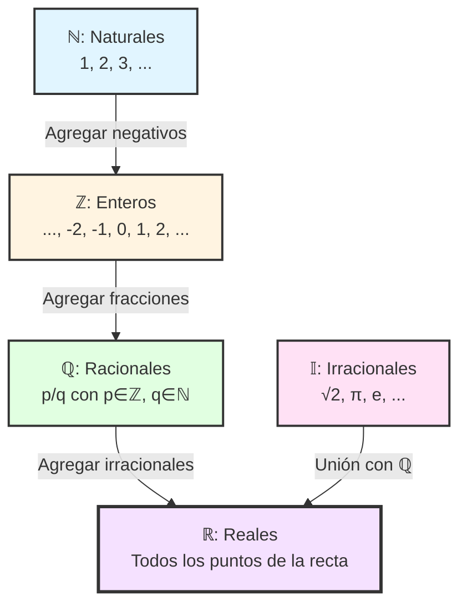

# Los Números: Fundamentos y Construcción

## 1. Teoría de conjuntos: Lenguaje fundamental de las matemáticas

### 1.1 Concepto intuitivo de conjunto

**Idea intuitiva:** Un **conjunto** es una colección de objetos bien definidos, llamados **elementos**. Esta noción, propuesta por Georg Cantor en 1874, es la base de toda la matemática moderna.
Ejemplo: Sea $A$ el conjunto de los colores primarios, entonces:
$$A = \{\text{rojo}, \text{azul},\text{amarillo}\}$$
Los conjunto se denotan llaves $\{\}$
Los elementos de un conjunto no se repiten por lo tanto $\{2, 2, 3\} = \{2, 3\}$

**Notación básica:**
- Si $x$ es elemento del conjunto $A$, escribimos $x \in A$ (se lee "x pertenece a A")
- Si $x$ no es elemento de $A$, escribimos $x \notin A$

**Ejemplo 1.1:**
- $A = \{1, 2, 3, 4, 5\}$ es el conjunto de los primeros cinco números naturales
- $3 \in A$ pero $7 \notin A$
- $B = \{a, e, i, o, u\}$ es el conjunto de las vocales

### 1.2 Formas de especificar un conjunto

Existen dos formas estándar de definir un conjunto:

**a) Notación por extensión (o enumeración):**
Listar explícitamente todos los elementos entre llaves.
$$A = \{2, 4, 6, 8\}$$

**b) Notación por comprensión (o construcción):**
Especificar una propiedad que caracteriza a los elementos.
$$A = \{x \in \mathbb{N} : x \text{ es par y } x \leq 8\}$$
Se lee: "A es el conjunto de todos los x en los naturales tales que x es par y x es menor o igual a 8"

**Observación:** La notación por comprensión tiene la forma general:
$$\{x \in U : P(x)\}$$
donde $U$ es un "universo" de referencia y $P(x)$ (se lee P de x) es una propiedad o predicado que cumple $x$.

### 1.3 Operaciones entre conjuntos

Sean $A$ y $B$ dos conjuntos. Definimos:

**Definición 1.1 (Unión):**
$$A \cup B = \{x : x \in A \text{ o } x \in B\}$$
*Se lee A unión B*
La unión contiene todos los elementos que están en $A$ **o** en $B$ (o en ambos).

**Definición 1.2 (Intersección):**
$$A \cap B = \{x : x \in A \text{ y } x \in B\}$$
*Se lee A intersección B*
La intersección contiene solo los elementos que están simultáneamente en $A$ **y** en $B$.

**Definición 1.3 (Diferencia o resta):**
$$A \setminus B = \{x : x \in A \text{ y } x \notin B\}$$
La diferencia contiene los elementos de $A$ que **no** están en $B$.

**Ejemplo 1.2:**
Si $A = \{1, 2, 3, 4\}$ y $B = \{3, 4, 5, 6\}$, entonces:
- $A \cup B = \{1, 2, 3, 4, 5, 6\}$
- $A \cap B = \{3, 4\}$
- $A \setminus B = \{1, 2\}$
- $B \setminus A = \{5, 6\}$

### 1.4 La paradoja de Russell y los límites de la intuición

**Advertencia importante:** La noción intuitiva de conjunto tiene limitaciones profundas. Bertrand Russell descubrió en 1901 una paradoja que muestra que no podemos definir conjuntos de manera completamente libre.

**La paradoja de Russell:**
Consideremos el conjunto $R$ definido como:
$$R = \{x : x \text{ es un conjunto y } x \notin x\}$$
Es decir, $R$ es el conjunto de todos los conjuntos que **no se contienen a sí mismos**.

Ahora preguntamos: ¿Es $R \in R$?
- Si $R \in R$, entonces por definición de $R$, debe cumplir $R \notin R$. **Contradicción**.
- Si $R \notin R$, entonces cumple la condición para estar en $R$, luego $R \in R$. **Contradicción**.

**Conclusión:** La noción "ingenua" de conjunto conduce a contradicciones lógicas. Por ello, en el siglo XX se desarrolló la **Teoría Axiomática de Conjuntos** (Zermelo-Fraenkel, ZFC), que establece reglas precisas sobre qué colecciones son conjuntos válidos.

**Para este curso:** Trabajaremos con conjuntos "naturales" (números, funciones, puntos geométricos) que no presentan estas paradojas. Las sutilezas formales se estudiarán en cursos avanzados de Lógica Matemática o Teoría de Conjuntos.

### 1.5 El conjunto vacío

**Definición 1.4 (Conjunto vacío):**
El **conjunto vacío**, denotado por $\emptyset$ o $\{\}$, es el conjunto que **no contiene ningún elemento**.

**Formalmente:**
$$\emptyset = \{\} \quad \text{tal que} \quad \forall x, \, x \notin \emptyset$$

$\forall x$ *se lee ¨"Para todo x"*

**Propiedades fundamentales:**

1. **Unicidad:** Existe exactamente un conjunto vacío. Si $A$ y $B$ son dos conjuntos sin elementos, entonces $A = B = \emptyset$.

2. **Subconjunto universal:** El conjunto vacío es subconjunto de cualquier conjunto:
   $$\forall A, \quad \emptyset \subseteq A$$
   
   $\emptyset \subseteq A$ *Se lee El conjunto vacío es subconjunto de A*
   
   **Justificación:** La implicación "$x \in \emptyset \Rightarrow x \in A$" es **vacuamente verdadera** (verdadera por vacuidad), ya que no existe ningún $x \in \emptyset$ que pueda contradecirla.

3. **Unión e intersección:**
   - $A \cup \emptyset = A$ (el vacío es neutro para la unión)
   - $A \cap \emptyset = \emptyset$ (la intersección con el vacío es siempre vacía)
   - $A \setminus \emptyset = A$
   - $\emptyset \setminus A = \emptyset$

**Observación filosófica:**
El conjunto vacío puede parecer abstracto o incluso paradójico ("¿cómo puede existir un conjunto de nada?"), pero es absolutamente fundamental en matemáticas. Es el "ladrillo" más básico desde el cual se construyen todos los números (ver Sección 4). Así como el cero es esencial en aritmética, el conjunto vacío es esencial en teoría de conjuntos.

**Analogía:** Piensa en el conjunto vacío como una caja vacía: la caja existe aunque no contenga nada. El conjunto vacío es "algo" (un conjunto válido), pero ese algo no contiene elementos.

**Notación importante:** No confundir:
- $\emptyset$ (el conjunto vacío, que no tiene elementos)
- $\{\emptyset\}$ (el conjunto que contiene al conjunto vacío como único elemento, por lo tanto tiene 1 elemento)
- $\{\{\emptyset\}\}$ (el conjunto que contiene al conjunto $\{\emptyset\}$, tiene 1 elemento)

Estas distinciones serán cruciales en la construcción de von Neumann de los números naturales.

### 1.6 Cardinalidad

**Definición 1.5 (Cardinalidad):**
La **cardinalidad** de un conjunto finito $A$, denotada $|A|$ o $\#A$ o $\text{card}(A)$, es el **número de elementos** que contiene.

**Ejemplos:**
- $|\{2, 4, 6\}| = 3$
- $|\{a, b, c, d, e\}| = 5$
- $|\emptyset| = 0$ (el conjunto vacío no tiene elementos)

**Observación:** Para conjuntos infinitos, la noción de cardinalidad es más sutil y se basa en la idea de **biyecciones** entre conjuntos (ver Sección 8).

### 1.7 Conjunto potencia

**Definición 1.6 (Conjunto potencia):**
Dado un conjunto $A$, el **conjunto potencia** de $A$, denotado $\mathcal{P}(A)$ o $2^A$, es el conjunto de **todos los subconjuntos** de $A$:
$$\mathcal{P}(A) = \{B : B \subseteq A\}$$

**Ejemplo 1.3:** 
Si $A = \{1, 2\}$, entonces:
$$\mathcal{P}(A) = \{\emptyset, \{1\}, \{2\}, \{1,2\}\}$$

Observa que $\mathcal{P}(A)$ contiene **4 elementos**: el conjunto vacío, los dos conjuntos unitarios, y el conjunto completo $A$.

**Ejemplo 1.4:**
Si $A = \{a, b, c\}$, entonces:
$$\mathcal{P}(A) = \{\emptyset, \{a\}, \{b\}, \{c\}, \{a,b\}, \{a,c\}, \{b,c\}, \{a,b,c\}\}$$

En este caso, $|\mathcal{P}(A)| = 8$.

**Caso especial - El conjunto vacío:**
$$\mathcal{P}(\emptyset) = \{\emptyset\}$$

Nota que el conjunto potencia del vacío **no es vacío**: contiene un elemento (el conjunto vacío mismo).

**Teorema 1.1 (Cardinalidad del conjunto potencia):**
Si $A$ es un conjunto finito con $|A| = n$, entonces:
$$|\mathcal{P}(A)| = 2^n$$

**Demostración (idea intuitiva):**
Para construir un subconjunto de $A$, debemos decidir, para cada elemento de $A$, si lo incluimos o no. Son 2 opciones por cada uno de los $n$ elementos, lo que da $2 \times 2 \times ... \times 2 = 2^n$ posibilidades. $\square$

**Justificación de la notación $2^A$:** La notación $2^A$ para el conjunto potencia proviene precisamente de que $|2^A| = 2^{|A|}$ cuando $A$ es finito.

**Propiedades importantes:**

1. **Pertenencia vs inclusión:**
   - $\emptyset \in \mathcal{P}(A)$ (el vacío es elemento del conjunto potencia)
   - $\emptyset \subseteq A$ (el vacío es subconjunto de $A$)
   - $A \in \mathcal{P}(A)$ (todo conjunto es subconjunto de sí mismo, luego es elemento de su potencia)

2. **Jerarquía de cardinalidades:**
   $$|A| < |\mathcal{P}(A)|$$
   
   Para conjuntos finitos: $n < 2^n$ para todo $n \geq 0$.

**Ejemplo 1.5 (Crecimiento exponencial):**
- $|\emptyset| = 0$, $|\mathcal{P}(\emptyset)| = 2^0 = 1$
- $|\{a\}| = 1$, $|\mathcal{P}(\{a\})| = 2^1 = 2$
- $|\{a,b\}| = 2$, $|\mathcal{P}(\{a,b\})| = 2^2 = 4$
- $|\{a,b,c\}| = 3$, $|\mathcal{P}(\{a,b,c\})| = 2^3 = 8$
- $|\{a,b,c,d\}| = 4$, $|\mathcal{P}(\{a,b,c,d\})| = 2^4 = 16$

**Teorema de Cantor (1891):**
Para **cualquier** conjunto $A$ (finito o infinito), no existe ninguna función sobreyectiva de $A$ a $\mathcal{P}(A)$. En particular:
$$|A| < |\mathcal{P}(A)|$$

Este resultado implica que existe una **jerarquía infinita de infinitos**:
$$|\mathbb{N}| < |\mathcal{P}(\mathbb{N})| < |\mathcal{P}(\mathcal{P}(\mathbb{N}))| < |\mathcal{P}(\mathcal{P}(\mathcal{P}(\mathbb{N})))| < ...$$

**Observación profunda:** El teorema de Cantor muestra que **no existe un "infinito más grande"**: dado cualquier conjunto infinito, siempre podemos construir uno más grande (su conjunto potencia). Esta es una de las ideas más profundas y hermosas de las matemáticas modernas.

---

## 2. Símbolos lógicos y lenguaje matemático

Para expresar ideas matemáticas con precisión, usamos símbolos lógicos estándar:

### 2.1 Símbolos lógicos y de conjuntos

|      Símbolo      | Significado                   | Ejemplo                              | Lectura                                                       |
| :---------------: | :---------------------------- | :----------------------------------- | :------------------------------------------------------------ |
|     $\forall$     | Para todo, para cada          | $\forall x \in \mathbb{N}, x \geq 1$ | "Para todo x natural, x es mayor o igual a 1"                 |
|     $\exists$     | Existe (al menos uno)         | $\exists x \in \mathbb{R}: x^2 = 2$  | "Existe un real x tal que x² = 2"                             |
|   $\exists!$      | Existe único                  | $\exists! x \in \mathbb{R}: x^2 = 4 \land x > 0$ | "Existe un único real positivo x tal que x² = 4" |
|    $\nexists$     | No existe                     | $\nexists x \in \mathbb{Q}: x^2 = 2$ | "No existe un racional x tal que x² = 2"                      |
|   $\therefore$    | Por lo tanto, entonces        | $x=2 \therefore x^2=4$               | "x igual 2, por lo tanto x² igual 4"                          |
|      $\land$      | Y (conjunción lógica)         | $x > 0 \land x < 5$                  | "x mayor que 0 y x menor que 5"                               |
|      $\lor$       | O (disyunción lógica)         | $x < 0 \lor x > 10$                  | "x menor que 0 o x mayor que 10"                              |
|      $\neg$       | Negación (no)                 | $\neg(x > 0)$                        | "no (x mayor que 0)" o "x no es mayor que 0"                  |
|   $\Rightarrow$   | Implica                       | $x = 2 \Rightarrow x^2 = 4$          | "x igual 2 implica x² igual 4"                                |
| $\Leftrightarrow$ | Si y solo si (sii)            | $x^2 = 4 \Leftrightarrow x = \pm 2$  | "x² igual 4 si y solo si x es ±2"                             |
|       $\in$       | Pertenece a                   | $3 \in \mathbb{N}$                   | "3 pertenece a los naturales"                                 |
|     $\notin$      | No pertenece a                | $-1 \notin \mathbb{N}$               | "-1 no pertenece a los naturales"                             |
|     $\subset$     | Subconjunto propio            | $\mathbb{N} \subset \mathbb{Z}$      | "Los naturales están contenidos (propiamente) en los enteros" |
|    $\subseteq$    | Subconjunto (puede ser igual) | $A \subseteq B$                      | "A está contenido en B (posiblemente A = B)"                  |
|    $\supset$      | Superconjunto propio          | $\mathbb{Z} \supset \mathbb{N}$      | "Los enteros contienen propiamente a los naturales"           |
|    $\supseteq$    | Superconjunto (puede ser igual) | $B \supseteq A$                    | "B contiene a A (posiblemente B = A)"                         |

### 2.2 Símbolos de orden y comparación

|  Símbolo   | Significado                      | Ejemplo                  | Lectura                               |
| :--------: | :------------------------------- | :----------------------- | :------------------------------------ |
|    $=$     | Igual a                          | $2 + 2 = 4$              | "2 más 2 igual a 4"                   |
|   $\neq$   | Distinto de, diferente de        | $3 \neq 5$               | "3 distinto de 5"                     |
|    $<$     | Menor que (estrictamente)        | $2 < 5$                  | "2 menor que 5"                       |
|    $>$     | Mayor que (estrictamente)        | $7 > 3$                  | "7 mayor que 3"                       |
|   $\leq$   | Menor o igual que                | $x \leq 10$              | "x menor o igual que 10"              |
|   $\geq$   | Mayor o igual que                | $y \geq 0$               | "y mayor o igual que 0"               |
|   $\ll$    | Mucho menor que                  | $0.001 \ll 1000$         | "0.001 mucho menor que 1000"          |
|   $\gg$    | Mucho mayor que                  | $10^6 \gg 10$            | "un millón mucho mayor que 10"        |
|  $\approx$ | Aproximadamente igual            | $\pi \approx 3.14$       | "pi aproximadamente 3.14"             |
|  $\equiv$  | Idénticamente igual, congruente  | $x^2 - 1 \equiv (x-1)(x+1)$ | "x² - 1 idénticamente igual a (x-1)(x+1)" |

**Observación sobre $\Rightarrow$ vs $\geq$:**
- $\Rightarrow$ (flecha simple) denota **implicación lógica** entre proposiciones
- $\geq$ denota **relación de orden** entre números
- No confundir: "$x > 0 \Rightarrow x^2 > 0$" (implicación) vs "$x \geq 0$" (comparación)

### 2.3 Terminología matemática fundamental

En matemáticas, clasificamos afirmaciones según su papel y nivel de importancia:

**Definición 2.1 (Axioma):**
Un **axioma** (o **postulado**) es una proposición que se acepta como **verdadera sin demostración**. Son los fundamentos sobre los cuales se construye una teoría matemática.

**Ejemplos:**
- "Dos puntos determinan una única recta" (axioma de geometría euclidiana)
- Los axiomas de Peano para los números naturales
- Los axiomas de cuerpo para $\mathbb{R}$ (ver Sección 9)

**Definición 2.2 (Teorema):**
Un **teorema** es una proposición matemática **importante** que ha sido **demostrada** a partir de axiomas y teoremas previos. Representa un resultado fundamental o de gran utilidad.

**Características:**
- Requiere demostración rigurosa
- Tiene importancia teórica o práctica significativa
- Suele nombrarse según su autor o tema (Teorema de Pitágoras, Teorema de Cantor)

**Ejemplos en este documento:**
- Teorema 5.2: Caracterización decimal de racionales
- Teorema 7.1: $|\mathbb{Z}| = |\mathbb{N}|$
- Teorema 8.1: Los reales no son numerables (Teorema de Cantor)

**Definición 2.3 (Lema):**
Un **lema** es una proposición **auxiliar** que se demuestra principalmente para facilitar la demostración de un teorema más importante. Es un "resultado intermedio".

**Características:**
- Tiene demostración propia
- Su importancia radica en ser un paso hacia un resultado mayor
- Algunos lemas resultan ser tan útiles que adquieren importancia propia

**Ejemplo famoso:**
- Lema de Zorn (teoría de conjuntos)
- Lema de Fatou (análisis matemático)

**Definición 2.4 (Corolario):**
Un **corolario** es una proposición que se deduce de manera **directa y casi inmediata** de un teorema o proposición anterior. Es una "consecuencia fácil".

**Características:**
- Su demostración es breve, a menudo trivial
- Deriva naturalmente de un resultado previo
- Puede ser muy útil en aplicaciones

**Ejemplo en este documento:**
- Corolario del Teorema 5.2: Los números con expansión decimal infinita no periódica son irracionales

**Definición 2.5 (Proposición):**
Una **proposición** es un resultado matemático demostrado, pero de menor importancia o generalidad que un teorema. Se usa cuando el resultado es útil pero no suficientemente fundamental para llamarse teorema.

**Ejemplos en este documento:**
- Proposición 3.1: Propiedades de la suma en $\mathbb{N}$
- Proposición 10.1: $1 + 0 = 1$

**Jerarquía conceptual:**
```
Axioma (sin demostración, fundamento)
   ↓
Lema (auxiliar) → Teorema (resultado principal) → Corolario (consecuencia)
   ↓                      ↓
Proposición (resultado menor)
```

**Observación:** En la práctica, la distinción entre teorema, proposición y lema no siempre es estricta. Lo que un autor llama "proposición" otro podría llamar "teorema" si lo considera suficientemente importante. Sin embargo, los axiomas y corolarios tienen roles más claramente definidos.

### 2.6 El alfabeto griego: aliado esencial de las matemáticas

**¿Por qué las letras griegas en matemáticas?**

El **alfabeto griego** es una herramienta indispensable en matemáticas, ciencias e ingeniería. Su uso extendido se debe a varias razones históricas y prácticas:

1. **Expansión del vocabulario simbólico:** El alfabeto latino tiene solo 26 letras, insuficientes para representar la vasta cantidad de variables, constantes, parámetros y funciones que requieren las matemáticas modernas. El alfabeto griego proporciona 24 símbolos adicionales (48 si contamos mayúsculas y minúsculas distintas).

2. **Distinción conceptual:** Las letras griegas permiten diferenciar tipos de objetos matemáticos:
   - Letras latinas ($x, y, z$): típicamente variables o coordenadas
   - Letras griegas ($\alpha, \beta, \theta$): ángulos, parámetros, funciones especiales
   - Esto ayuda a la legibilidad y comprensión inmediata del tipo de objeto

3. **Convenciones universales:** Ciertas letras griegas tienen significados casi universales en matemáticas:
   - $\pi$ (pi): razón circunferencia/diámetro ≈ 3.14159...
   - $\Sigma$ (sigma mayúscula): suma de una serie
   - $\Delta$ (delta mayúscula): diferencia o cambio
   - $\epsilon$ (épsilon): número infinitesimal, típicamente en límites
   - $\theta, \phi$ (theta, phi): ángulos en trigonometría
   - $\lambda$ (lambda): valores propios, longitud de onda
   - $\mu$ (mu): media de una distribución, coeficiente de fricción
   - $\sigma$ (sigma minúscula): desviación estándar

**Historia del uso de letras griegas en matemáticas:**

- **Antigüedad:** Los matemáticos griegos (Euclides, Pitágoras, Arquímedes) usaban su propio alfabeto naturalmente para notación geométrica y numérica.

- **Edad Media:** Durante siglos, las matemáticas se escribieron principalmente en latín. El álgebra árabe introdujo notaciones alfanuméricas, pero sin letras griegas.

- **Siglo XVI-XVII:** Con el Renacimiento y la recuperación de textos griegos clásicos, las letras griegas comenzaron a reaparecer en textos matemáticos europeos.

- **Siglo XVIII:** Leonhard Euler popularizó masivamente el uso de letras griegas en sus obras. Él estableció muchas de las convenciones que usamos hoy, incluyendo:
  - $\pi$ para la constante del círculo (1737)
  - $e$ para la base del logaritmo natural (letra latina, pero Euler la consagró)
  - $\Sigma$ para sumatorias
  - $i$ para la unidad imaginaria

- **Siglos XIX-XX:** La notación griega se estandarizó completamente con el desarrollo de:
  - Análisis matemático (límites, derivadas, integrales)
  - Física teórica (mecánica, termodinámica, relatividad, mecánica cuántica)
  - Estadística y probabilidad
  - Teoría de conjuntos (Cantor usó $\aleph$ - alef hebrea - para cardinales infinitos)

**El alfabeto griego completo:**

| Mayúscula  |        Minúscula        | Nombre  | Pronunciación | Uso común en matemáticas                        |
| :--------: | :---------------------: | :------ | :------------ | :---------------------------------------------- |
|  $\Alpha$  |        $\alpha$         | Alfa    | alfa          | Ángulos, coeficientes                           |
|  $\Beta$   |         $\beta$         | Beta    | beta          | Ángulos, coeficientes                           |
|  $\Gamma$  |        $\gamma$         | Gamma   | gama          | Función Gamma, ángulos                          |
|  $\Delta$  |        $\delta$         | Delta   | delta         | Diferencia, incremento, discriminante           |
| $\Epsilon$ | $\epsilon, \varepsilon$ | Épsilon | épsilon       | Número pequeño, límites                         |
|  $\Zeta$   |         $\zeta$         | Zeta    | dseta         | Función zeta de Riemann                         |
|   $\Eta$   |         $\eta$          | Eta     | eta           | Eficiencia, coordenadas                         |
|  $\Theta$  |   $\theta, \vartheta$   | Theta   | theta         | Ángulos, temperatura                            |
|  $\Iota$   |         $\iota$         | Iota    | iota          | Índices                                         |
|  $\Kappa$  |        $\kappa$         | Kappa   | kapa          | Curvatura, constante dieléctrica                |
| $\Lambda$  |        $\lambda$        | Lambda  | lambda        | Valores propios, longitud de onda               |
|   $\Mu$    |          $\mu$          | Mu      | mu            | Media, coeficiente de fricción, micro-          |
|   $\Nu$    |          $\nu$          | Nu      | nu            | Frecuencia, grados de libertad                  |
|   $\Xi$    |          $\xi$          | Xi      | ksi           | Variable aleatoria, coordenadas                 |
| $\Omicron$ |           $o$           | Ómicron | ómicron       | Raramente usado (se confunde con O latina)      |
|   $\Pi$    |      $\pi, \varpi$      | Pi      | pi            | Constante π ≈ 3.14159..., producto              |
|   $\Rho$   |     $\rho, \varrho$     | Rho     | ro            | Densidad, radio polar, correlación              |
|  $\Sigma$  |   $\sigma, \varsigma$   | Sigma   | sigma         | Suma ($\Sigma$), desviación estándar ($\sigma$) |
|   $\Tau$   |         $\tau$          | Tau     | tau           | Constante de tiempo, torque, τ = 2π             |
| $\Upsilon$ |       $\upsilon$        | Ípsilon | ípsilon       | Raramente usado                                 |
|   $\Phi$   |     $\phi, \varphi$     | Fi      | fi            | Función, ángulo, razón áurea                    |
|   $\Chi$   |         $\chi$          | Ji      | ji            | Distribución chi-cuadrado                       |
|   $\Psi$   |         $\psi$          | Psi     | psi           | Función de onda (mecánica cuántica)             |
|  $\Omega$  |        $\omega$         | Omega   | omega         | Frecuencia angular, resistencia eléctrica (Ω)   |

**Observaciones importantes:**

1. **Variantes tipográficas:** Algunas letras tienen variantes estilísticas:
   - Épsilon: $\epsilon$ (lunate) vs $\varepsilon$ (curvilínea)
   - Theta: $\theta$ (con línea) vs $\vartheta$ (script theta)
   - Pi: $\pi$ (normal) vs $\varpi$ (variante pomega)
   - Rho: $\rho$ (normal) vs $\varrho$ (con cola)
   - Phi: $\phi$ (cerrada) vs $\varphi$ (abierta)

2. **Letras griegas en mayúscula que se parecen a las latinas:**
   - $\Alpha$ (A), $\Beta$ (B), $\Epsilon$ (E), $\Zeta$ (Z), $\Eta$ (H), $\Iota$ (I), $\Kappa$ (K), $\Mu$ (M), $\Nu$ (N), $\Omicron$ (O), $\Rho$ (P), $\Tau$ (T), $\Chi$ (X)
   - Por esta similitud, raramente se usan las mayúsculas de estas letras en notación matemática

3. **Letras distintivas más usadas:**
   - Mayúsculas: $\Gamma, \Delta, \Theta, \Lambda, \Xi, \Pi, \Sigma, \Phi, \Psi, \Omega$
   - Minúsculas: $\alpha, \beta, \gamma, \delta, \epsilon, \zeta, \theta, \lambda, \mu, \pi, \rho, \sigma, \tau, \phi, \omega$

**Recomendación práctica:** Al estudiar matemáticas, familiarízate con la pronunciación y escritura de las letras griegas. Son tan fundamentales como los números arábigos. Saber leerlas y escribirlas correctamente es esencial para comunicación matemática efectiva.

---

## 3. Construcción de los números naturales

### 3.1 El conjunto vacío y la construcción de von Neumann

Los números pueden construirse rigurosamente usando **solo** teoría de conjuntos. La construcción más elegante es la de John von Neumann (1923).

**Punto de partida:** El conjunto vacío $\emptyset = \{\}$ (el conjunto sin elementos)

**Definición 3.1 (Números naturales según von Neumann):**

Definimos:
$$0 := \emptyset = \{\}$$
$$1 := \{0\} = \{\emptyset\} = \{\quad \{\} \quad \}$$
$$2 := \{0, 1\} = \{\emptyset, \{\emptyset\}\} = \{\quad \{\}, \{\{\}\} \quad \}$$
$$3 := \{0, 1, 2\} = \{ \quad \emptyset,\{\emptyset\},\{\emptyset,\{\emptyset\}\} \quad \} =\{ \quad \{\}, \{ \{\} \}, \{ \{\}, \{ \{\} \} \} \quad \}$$
$$4 := \{0,1,2,3\} = \{\emptyset,\{\emptyset\},\{\emptyset,\{\emptyset\}\},\{\emptyset,\{\emptyset\},\{\emptyset,\{\emptyset\}\}\}\}​ = \{\{\}, \{ \{\} \}, \{ \{\}, \{ \{\} \} \}, \{ \{\}, \{ \{\} \}, \{ \{\}, \{ \{\} \} \} \}\}$$
$$n := \{0, 1, 2, ..., n-1\}$$

**Observación clave:** En esta construcción, cada número natural $n$ es el conjunto de todos los números naturales **menores** que $n$. Además, $|n| = n$ (la cardinalidad del conjunto coincide con el número mismo).

**Función sucesor:**
$$S(n) = n \cup \{n\} = n + 1$$

Por ejemplo:
$$S(2) = 2 \cup \{2\} = \{0, 1\} \cup \{2\} = \{0, 1, 2\} = 3$$

**Definición 3.2 (Conjunto de los números naturales):**
$$\mathbb{N} = \{0, 1, 2, 3, 4, ...\}$$

**Convención para este curso:**
- $\mathbb{N}^{*} = \{1, 2, 3, 4, ...\}$ (naturales **sin** cero, también denotado $\mathbb{N}^{+}$)
- $\mathbb{N} = \{0, 1, 2, 3, ...\}$ (naturales **con** cero, también denotado $\mathbb{N}_0$ o $\mathbb{W}$)

**Nota:** Diferentes textos usan convenciones distintas. Algunos incluyen el 0 en $\mathbb{N}$, otros no. Lo importante es establecer claramente la convención al inicio siempre y cuando sea relevantes, si para una trabajo no es relevante si el 0 pertenece o no a los naturales simplemente no se menciona. El debate de si 0 pertenece o no a los naturales es un tema que no tiene una respuesta válida para todos los casos, depende del contexto.

### 3.2 La recta numérica de los naturales

Podemos visualizar $\mathbb{N}$ como puntos discretos en una línea:
![[recta_numeros_naturales.png]]
**Características:**
- Los números naturales tienen un **primer elemento** (el 0)
- No tienen un **último elemento** (son infinitos)
- Están **bien ordenados**: entre dos naturales consecutivos no hay otro natural
- Son **discretos**: no hay continuidad
- existe un orden en la recta, por ejemplo $5>3$, decimos que es un conjunto ordenado
### 3.3 Operaciones fundamentales en $\mathbb{N}$

Una vez construidos los números naturales, definimos las operaciones básicas de manera rigurosa.

#### 3.3.1 La suma en $\mathbb{N}$

**Definición 3.3 (Suma de números naturales):**
La suma de números naturales se define **recursivamente** usando la función sucesor $S(n)$:

Para cualesquiera $m, n \in \mathbb{N}$:
1. **Caso base:** $m + 0 = m$
2. **Caso recursivo:** $m + S(n) = S(m + n)$

**Interpretación:** Para sumar $m + n$, aplicamos la función sucesor $n$ veces al número $m$.

**Ejemplo 3.1 (Calculando $2 + 3$):**

Usando la definición recursiva:
$$2 + 3 = 2 + S(2)$$
$$= S(2 + 2)$$
$$= S(2 + S(1))$$
$$= S(S(2 + 1))$$
$$= S(S(2 + S(0)))$$
$$= S(S(S(2 + 0)))$$
$$= S(S(S(2)))$$
$$= S(S(3))$$
$$= S(4)$$
$$= 5$$

**Propiedades de la suma en $\mathbb{N}$:**

**Proposición 3.1:** La suma en $\mathbb{N}$ satisface las siguientes propiedades:

1. **Cerradura:** $\forall m, n \in \mathbb{N}, \quad m + n \in \mathbb{N}$
2. **Asociatividad:** $\forall m, n, p \in \mathbb{N}, \quad (m + n) + p = m + (n + p)$
3. **Conmutatividad:** $\forall m, n \in \mathbb{N}, \quad m + n = n + m$
4. **Elemento neutro:** $\forall m \in \mathbb{N}, \quad m + 0 = 0 + m = m$
5. **Ley de cancelación:** $\forall m, n, p \in \mathbb{N}, \quad m + p = n + p \Rightarrow m = n$

**Observación:** Estas propiedades se demuestran por **inducción matemática** sobre los números naturales, técnica que estudiaremos en detalle en el curso de Algebra I.
#### 3.3.2 La resta en $\mathbb{N}$: Operación parcial

**Definición 3.4 (Resta en $\mathbb{N}$):**
Dados $m, n \in \mathbb{N}$, decimos que $m - n$ **existe en $\mathbb{N}$** si y solo si existe $k \in \mathbb{N}$ tal que:
$$n + k = m$$
En ese caso, escribimos $k = m - n$.

**Observación crítica:** La resta en $\mathbb{N}$ es una **operación parcial**: no siempre está definida.

**Ejemplo 3.2:**
- $12 - 2 = 10$ está definida en $\mathbb{N}$, porque $2 + 10 = 12$
- $7 - 4 = 3$ está definida en $\mathbb{N}$, porque $4 + 3 = 7$
- $5 - 3 = 2$ está definida en $\mathbb{N}$, porque $3 + 2 = 5$
- $3 - 5$ **no está definida** en $\mathbb{N}$, porque no existe $k \in \mathbb{N}$ tal que $5 + k = 3$

**Condición necesaria y suficiente:**
$$m - n \in \mathbb{N} \quad \Leftrightarrow \quad m \geq n$$

**El problema de la resta:** Como la resta no siempre está definida en $\mathbb{N}$, necesitamos **ampliar** este sistema numérico. Esta limitación motiva la construcción de los números enteros $\mathbb{Z}$ (ver Sección 4).

**Notación para este curso:**
- Cuando escribimos $m - n$ en el contexto de $\mathbb{N}$, asumimos implícitamente que $m \geq n$
- Ecuaciones como "$5 + x = 3$" no tienen solución en $\mathbb{N}$, lo cual veremos resuelto en $\mathbb{Z}$
#### 3.3.3 La multiplicación en $\mathbb{N}$

Aunque no es el foco principal de esta sección, mencionamos brevemente la multiplicación para completitud.

**Definición 3.5 (Multiplicación en $\mathbb{N}$):**
La multiplicación se define recursivamente como **suma repetida**:
$$m \cdot n = \underbrace{m + m + m + \cdots + m}_{n \text{ veces}}$$
formalmente tendremos:

Para cualesquiera $m, n \in \mathbb{N}$:
1. **Caso base:** $m \cdot 0 = 0$
2. **Caso recursivo:** $m \cdot S(n) = m \cdot n + m$

**Interpretación:** $m \cdot n$ significa "sumar $m$ consigo mismo $n$ veces".

**Ejemplo 3.3 (Calculando $3 \times 4$):**

Usando la definición recursiva:
$$3 \cdot 4 = 3 \cdot S(3)$$
$$= 3 \cdot 3 + 3$$
$$= (3 \cdot S(2)) + 3$$
$$= (3 \cdot 2 + 3) + 3$$
$$= ((3 \cdot S(1)) + 3) + 3$$
$$= ((3 \cdot 1 + 3) + 3) + 3$$
$$= (((3 \cdot S(0)) + 3) + 3) + 3$$
$$= (((3 \cdot 0 + 3) + 3) + 3) + 3$$
$$= (((0 + 3) + 3) + 3) + 3$$
$$= ((3 + 3) + 3) + 3$$
$$= (6 + 3) + 3$$
$$= 9 + 3$$
$$= 12$$

**Propiedades de la multiplicación en $\mathbb{N}$:**

**Proposición 3.2:** La multiplicación en $\mathbb{N}$ satisface las siguientes propiedades:

1. **Cerradura:** $\forall m, n \in \mathbb{N}, \quad m \cdot n \in \mathbb{N}$
2. **Asociatividad:** $\forall m, n, p \in \mathbb{N}, \quad (m \cdot n) \cdot p = m \cdot (n \cdot p)$
3. **Conmutatividad:** $\forall m, n \in \mathbb{N}, \quad m \cdot n = n \cdot m$
4. **Elemento neutro:** $\forall m \in \mathbb{N}, \quad m \cdot 1 = 1 \cdot m = m$
5. **Distributividad (respecto a la suma):** $\forall m, n, p \in \mathbb{N}, \quad m \cdot (n + p) = m \cdot n + m \cdot p$
6. **Ley de cancelación:** $\forall m, n, p \in \mathbb{N}, \quad m \cdot p = n \cdot p \land p \neq 0 \Rightarrow m = n$
7. **Absorción del cero:** $\forall m \in \mathbb{N}, \quad m \cdot 0 = 0 \cdot m = 0$

**Observación:** Estas propiedades también se demuestran por inducción matemática. La propiedad distributiva es especialmente importante, ya que conecta las dos operaciones fundamentales (suma y multiplicación).

**Concepto de Múltiplo:**

**Definición 3.6 (Múltiplo):**
Dados dos números naturales $a, b \in \mathbb{N}$, decimos que $b$ es un **múltiplo** de $a$ si existe un número natural $k \in \mathbb{N}$ tal que:
$$b = a \cdot k$$

Esto también se suele expresar diciendo que "$a$ es un factor de $b$" o que "$b$ es divisible por $a$".

**Conjunto de múltiplos:**
El conjunto de todos los múltiplos de un número $a$ se denota frecuentemente como $M(a)$ o $a\mathbb{N}$:
$$M(a) = \{a \cdot k : k \in \mathbb{N}\} = \{0, a, 2a, 3a, \dots\}$$

**Ejemplos:**
- $M(2) = \{0, 2, 4, 6, 8, \dots\}$ (Números pares)
- $M(3) = \{0, 3, 6, 9, 12, \dots\}$
- $M(5) = \{0, 5, 10, 15, 20, \dots\}$
- $M(0) = \{0\}$ (El único múltiplo de 0 es $0$, pues $0 \cdot k = 0$)
- $M(1) = \mathbb{N}$ (Todos los números naturales son múltiplos de 1)

---

## 4. Los números enteros: $\mathbb{Z}$

### 4.1 Motivación: El problema de la resta

Consideremos la ecuación:
$$5 + x = 3$$

En $\mathbb{N}$, esta ecuación **no tiene solución**, porque $x = 3 - 5 = -2 \notin \mathbb{N}$.


**Problema general:** La operación de **resta** no está siempre definida en $\mathbb{N}$:
$$a - b \in \mathbb{N} \quad \text{solo si} \quad a \geq b$$

Para resolver este problema, **ampliamos** $\mathbb{N}$ a un conjunto más grande que incluya "números negativos".

### 4.2 Definición y operaciones

**Definición 4.1 (Números enteros):**
$$\mathbb{Z} = \{..., -3, -2, -1, 0, 1, 2, 3, ...\}$$

El símbolo $\mathbb{Z}$ proviene del alemán *Zahlen* (números).

**Subconjuntos importantes de $\mathbb{Z}$:**

Podemos definir varios subconjuntos útiles de los enteros:

- **Enteros positivos:** $\mathbb{Z}^+ = \{1, 2, 3, 4, ...\}$ (también denotado $\mathbb{Z}_{>0}$)
- **Enteros negativos:** $\mathbb{Z}^- = \{..., -4, -3, -2, -1\}$ (también denotado $\mathbb{Z}_{<0}$)
- **Enteros no negativos:** $\mathbb{Z}_{\geq 0} = \{0, 1, 2, 3, ...\} = \mathbb{N}$ (incluye el cero)
- **Enteros no positivos:** $\mathbb{Z}_{\leq 0} = \{..., -3, -2, -1, 0\}$ (incluye el cero)

**Observación:** Note que:
- $\mathbb{Z}^+ = \mathbb{N} \setminus \{0\}$ (los positivos son los naturales sin el cero)
- $\mathbb{Z} = \mathbb{Z}^- \cup \{0\} \cup \mathbb{Z}^+$ (unión disjunta)
- $\mathbb{Z}_{\geq 0} = \mathbb{N}$ bajo nuestra convención

**Definición formal:**

Primero recordemos el concepto general de **producto cartesiano**:
Dados dos conjuntos $A$ y $B$, el producto cartesiano $A \times B$ es el conjunto de todos los pares ordenados $(a, b)$ donde $a \in A$ y $b \in B$:
$$A \times B = \{(a, b) : a \in A \land b \in B\}$$

Para construir los enteros, utilizamos el producto cartesiano de los naturales consigo mismo:
$$\mathbb{N} \times \mathbb{N} = \{(a, b) : a \in \mathbb{N}, b \in \mathbb{N}\}$$

Luego, $\mathbb{Z}$ se define como el conjunto de **clases de equivalencia** sobre $\mathbb{N} \times \mathbb{N}$, bajo la relación:
$$(a, b) \sim (c, d) \quad \Leftrightarrow \quad a + d = b + c$$
El par $(a, b)$ representa intuitivamente "a - b". Por ejemplo:
- $(5, 2)$ representa $5 - 2 = 3$
- $(12,9)$ representa $12 - 9 = 3$
- $(2, 5)$ representa $2 - 5 = -3$

Aquí podemos ver las múltiples representaciones $(5,2) \sim (12,9) \to 5+9=2+12 \to 14=14 \checkmark$
Por esto los números en $\mathbb{Z}$ no tienen una representación **unívoca**
* $(4,6)=(7,9)=-2$

En el conjunto $\mathbb{Z}$ podemos definir el elemento inverso de la suma
* $a+e=e+a=0$ implica $e$ es el elemento inverso para la suma de $a$

**Operaciones en $\mathbb{Z}$:**

**Definición 4.2 (Suma en $\mathbb{Z}$):**
$$m + n := [(a+c, b+d)]$$
donde $m = [(a,b)]$ y $n = [(c,d)]$.

**Explicación:** Si interpretamos $(a,b)$ como $a-b$, esto equivale a decir:
$$(a-b) + (c-d) = (a+c) - (b+d)$$
Esta operación está **bien definida**: no depende de los representantes elegidos para las clases de equivalencia.

**Definición 4.3 (Resta en $\mathbb{Z}$):**
$$a - b := a + (-b)$$
donde $-b$ es el **inverso aditivo** de $b$ (el número que cumple $b + (-b) = 0$).

**Propiedad fundamental:** En $\mathbb{Z}$, la resta **siempre** está definida:
$$\forall a, b \in \mathbb{Z}, \quad \exists! \, c \in \mathbb{Z} : a - b = c$$
**Definición 4.4 (Multiplicación en $\mathbb{Z}$):**
La multiplicación de enteros se define recursivamente a partir de la suma. Para $a, b \in \mathbb{Z}$:

**Caso 1:** Si $b > 0$ (entero positivo):
$$a \cdot b = \underbrace{a + a + \dots + a}_{b \text{ veces}}$$
**Caso 2:** Si $b = 0$:
$$a \cdot 0 = 0$$
Esta definición es consistente con la propiedad de que multiplicar cualquier número por cero anula el resultado.

**Caso 3:** Si $b < 0$ (entero negativo):
$$a \cdot b = -(a \cdot |b|)$$
Es decir, multiplicamos $a$ por el valor absoluto de $b$ y luego cambiamos el signo del resultado.

**Interpretación geométrica:**
- **Caso positivo-positivo:** $3 \cdot 4 = 12$ significa "3 sumado 4 veces" o "4 sumado 3 veces"
- **Caso positivo-negativo:** $4 \cdot (-3) = -12$ significa "avanzar 4 unidades en dirección negativa, 3 veces"
- **Caso negativo-negativo:** $(-3) \cdot (-2) = 6$ se interpreta como "revertir el movimiento negativo"

**Ejemplos detallados:**

1. **Ambos positivos:**
   $$3 \cdot 4 = 3 + 3 + 3 + 3 = 12$$

2. **Primer factor negativo, segundo positivo:**
   $$(-2) \cdot 5 = (-2) + (-2) + (-2) + (-2) + (-2) = -10$$

3. **Primer factor positivo, segundo negativo:**
   $$4 \cdot (-3) = -(4 \cdot 3) = -(4 + 4 + 4) = -12$$

4. **Ambos negativos (regla de signos):**
   $$(-3) \cdot (-2) = -[(-3) \cdot 2] = -[(-3) + (-3)] = -(-6) = 6$$

**Justificación de "menos por menos igual a más":**
La regla "negativo por negativo da positivo" no es arbitraria, sino que se deriva de las propiedades algebraicas requeridas para que $\mathbb{Z}$ sea consistente.

**Demostración informal:**
Queremos que la propiedad distributiva se mantenga. Consideremos:
$$0 = 0 \cdot a = [b + (-b)] \cdot a = b \cdot a + (-b) \cdot a$$

Si $b > 0$ y $a > 0$, sabemos que $b \cdot a > 0$. Para que la suma sea cero:
$$(-b) \cdot a = -(b \cdot a) < 0$$
Ahora, consideremos:
$$0 = a \cdot 0 = a \cdot [b + (-b)] = a \cdot b + a \cdot (-b)$$
Si $a < 0$ y $b < 0$, entonces $a \cdot (-b) = -a \cdot b$ (por el caso anterior). Así:
$$a \cdot b + (- a \cdot b) = 0$$
Pero $-a > 0$ y $b < 0$, entonces $-a \cdot b < 0$, lo que implica que $a \cdot b > 0$.
Por lo tanto: $(-) \cdot (-) = (+)$.

**Proposición 4.1 (Propiedades de la Multiplicación en $\mathbb{Z}$):**
La multiplicación en $\mathbb{Z}$ satisface las siguientes propiedades para cualesquiera $a, b, c \in \mathbb{Z}$:

1. **Cerradura:** $a \cdot b \in \mathbb{Z}$
   (El producto de dos enteros es siempre un entero)

2. **Asociatividad:** $(a \cdot b) \cdot c = a \cdot (b \cdot c)$
   (El orden de agrupación no altera el resultado)

3. **Conmutatividad:** $a \cdot b = b \cdot a$
   (El orden de los factores no altera el producto)

4. **Elemento neutro (identidad multiplicativa):** $\exists \, 1 \in \mathbb{Z}$ tal que:
   $$a \cdot 1 = 1 \cdot a = a, \quad \forall a \in \mathbb{Z}$$

5. **Distributividad respecto a la suma:** 
   $$a \cdot (b + c) = a \cdot b + a \cdot c$$
   $$(a + b) \cdot c = a \cdot c + b \cdot c$$

6. **Propiedad del producto nulo:** 
   $$a \cdot b = 0 \Leftrightarrow a = 0 \text{ o } b = 0$$
   (Si el producto es cero, al menos uno de los factores debe ser cero)

**Observación importante:** A diferencia de $\mathbb{Q}$ o $\mathbb{R}$, en $\mathbb{Z}$ **no todo elemento tiene inverso multiplicativo**. Por ejemplo:
- No existe $x \in \mathbb{Z}$ tal que $2 \cdot x = 1$ (porque $x = \frac{1}{2} \notin \mathbb{Z}$)
- Solo $1$ y $-1$ tienen inversos multiplicativos en $\mathbb{Z}$

Esta limitación motiva la construcción del conjunto $\mathbb{Q}$ de los números racionales (Sección 5).

**Tabla de signos (regla de los signos):**

| $a$ | $b$ | $a \cdot b$ |
|:---:|:---:|:----------:|
| $+$ | $+$ | $+$ |
| $+$ | $-$ | $-$ |
| $-$ | $+$ | $-$ |
| $-$ | $-$ | $+$ |

**Ejemplos adicionales:**
- $7 \cdot 8 = 56$
- $(-5) \cdot 6 = -30$
- $9 \cdot (-4) = -36$
- $(-7) \cdot (-3) = 21$
- $0 \cdot 100 = 0$
- $(-1) \cdot 15 = -15$ (multiplicar por $-1$ invierte el signo)

### 4.3 División en $\mathbb{Z}$

**Definición 4.5 (Divisibilidad):**
Sean $a, b \in \mathbb{Z}$ con $b \neq 0$. Decimos que **$b$ divide a $a$**, y escribimos $b \mid a$, si existe $c \in \mathbb{Z}$ tal que:
$$b \mid a \to a = b \cdot c$$
En ese caso, decimos que:
- $b$ es un **divisor** de $a$
- $a$ es un **múltiplo** de $b$
- $a$ es **divisible** por $b$

**Ejemplos 4.1:**
- $3 \mid 12$ porque $12 = 3 \cdot 4$
- $5 \mid 20$ porque $20 = 5 \cdot 4$
- $7 \mid 49$ porque $49 = 7 \cdot 7$
- $2 \mid 0$ porque $0 = 2 \cdot 0$ (cualquier entero divide a cero)
- $6 \nmid 15$ (6 no divide a 15, porque no existe $c \in \mathbb{Z}$ tal que $15 = 6 \cdot c$)

**Propiedades básicas de la divisibilidad:**

1. **Reflexividad:** $\forall a \in \mathbb{Z} \setminus \{0\}, \quad a \mid a$
2. **Transitividad:** Si $a \mid b$ y $b \mid c$, entonces $a \mid c$
3. $1 \mid a$ para todo $a \in \mathbb{Z}$
4. $a \mid 0$ para todo $a \in \mathbb{Z} \setminus \{0\}$
5. Si $a \mid b$ y $a \mid c$, entonces $a \mid (b + c)$ y $a \mid (b - c)$

**Observación importante:** A diferencia de $\mathbb{N}$ o $\mathbb{Q}$, en $\mathbb{Z}$ la división **no siempre produce un resultado entero**. Por ejemplo:
- $7 \div 2 = 3.5 \notin \mathbb{Z}$
- $10 \div 3 = 3.333... \notin \mathbb{Z}$

Esto motiva la necesidad de los números racionales (Sección 5).

### 4.4 División con resto (División euclidiana)

**Teorema 4.1 (Algoritmo de la división o división euclidiana):**
Dados $a, b \in \mathbb{Z}$ con $b > 0$, existen **únicos** enteros $q$ (cociente) y $r$ (resto o residuo) tales que:
$$a = b \cdot q + r \quad \text{con} \quad 0 \leq r < b$$

**Ejemplos 4.2:**
- $17 = 5 \cdot 3 + 2$ (dividendo 17, divisor 5, cociente 3, resto 2)
- $23 = 7 \cdot 3 + 2$ (dividendo 23, divisor 7, cociente 3, resto 2)
- $50 = 8 \cdot 6 + 2$
- $14 = 4 \cdot 3 + 2$
- $15 = 3 \cdot 5 + 0$ (resto cero: 3 divide exactamente a 15)

**Interpretación:** Si dividimos $a$ entre $b$, obtenemos un cociente $q$ y un resto $r$ que es siempre menor que el divisor $b$.

**Subsección 4.4.1: La operación módulo**

**Definición 4.6 (Operación módulo):**
Dados $a, b \in \mathbb{Z}$ con $b > 0$, definimos **$a$ módulo $b$**, denotado $a \bmod b$ o $a \mod b$, como el **resto** $r$ de la división euclidiana de $a$ entre $b$:
$$a \bmod b = r \quad \text{donde} \quad a = b \cdot q + r \quad \text{con} \quad 0 \leq r < b$$
**Notación alternativa:** En algunos contextos se escribe $a \equiv r \pmod{b}$ (se lee "$a$ es congruente con $r$ módulo $b$").

**Ejemplos 4.2.1:**
- $17 \bmod 5 = 2$ (porque $17 = 5 \cdot 3 + 2$)
- $23 \bmod 7 = 2$ (porque $23 = 7 \cdot 3 + 2$)
- $50 \bmod 8 = 2$ (porque $50 = 8 \cdot 6 + 2$)
- $15 \bmod 3 = 0$ (porque $15 = 3 \cdot 5 + 0$)
- $7 \bmod 2 = 1$ (porque $7 = 2 \cdot 3 + 1$)
- $6 \bmod 4 = 2$ (porque $6 = 4 \cdot 1 + 2$)
- $20 \bmod 6 = 2$ (porque $20 = 6 \cdot 3 + 2$)

**Interpretación intuitiva:** $a \bmod b$ responde a la pregunta: "¿Cuál es el resto cuando divido $a$ entre $b$?"

**Propiedades básicas del módulo:**
1. $0 \leq a \bmod b < b$ para todo $a \in \mathbb{Z}$, $b > 0$
2. $a \bmod b = 0 \Leftrightarrow b \mid a$ (el resto es cero si y solo si $b$ divide a $a$)
3. $(a + b) \bmod b = a \bmod b$
4. $(a + c) \bmod b = [(a \bmod b) + (c \bmod b)] \bmod b$
5. $(a \cdot c) \bmod b = [(a \bmod b) \cdot (c \bmod b)] \bmod b$

**Aplicaciones de la aritmética modular:**

La operación módulo es fundamental en:
- **Criptografía**: sistemas RSA, cifrado de datos
- **Computación**: hash tables, algoritmos de distribución
- **Teoría de números**: congruencias, teorema de Fermat
- **Calendarios**: determinar el día de la semana
- **Relojes**: las 15:00 horas son las 3:00 PM (15 mod 12 = 3)

**Ejemplo 4.2.2 (Aplicación práctica):**
Si hoy es lunes (día 1) y queremos saber qué día será dentro de 100 días:
$$(1 + 100) \bmod 7 = 101 \bmod 7 = 3$$
Por lo tanto, será miércoles (día 3).

**Observación sobre notación:** En programación, el operador módulo se denota típicamente como `%` (por ejemplo, en Python, C, Java: `17 % 5` devuelve `2`).

### 4.4.2 Conjunto de divisores

**Definición (Conjunto de divisores):**
Dado un número entero $n$, el **conjunto de divisores** de $n$, denotado como $D(n)$, es el conjunto formado por todos los números enteros que dividen a $n$ exactamente (es decir, el resto de la división es cero).

En el contexto de aritmética elemental y cálculo del máximo común divisor (MCD), usualmente nos referimos a los **divisores positivos**:
$$D(n) = \{d \in \mathbb{N}^* : n \bmod d = 0\}$$

**Ejemplos:**
- $D(6) = \{1, 2, 3, 6\}$
- $D(12) = \{1, 2, 3, 4, 6, 12\}$
- $D(15) = \{1, 3, 5, 15\}$
- $D(7) = \{1, 7\}$ (Número primo)
- $D(1) = \{1\}$

**Definición:** Un número entero $p > 1$ es **primo** si y solo si su conjunto de divisores positivos tiene exactamente dos elementos: $D(p) = \{1, p\}$.

### 4.5 Máximo común divisor (MCD)

**Definición 4.7 (Máximo común divisor):**

**Formalmente:**
$$\gcd(a, b) = \max\{d \in \mathbb{N} : d \mid a \land d \mid b\}$$
**Definición alternativa (usando conjuntos):**
Si definimos $D(a)$ y $D(b)$ como los conjuntos de divisores positivos de $a$ y $b$ respectivamente, entonces el MCD es el mayor elemento de la intersección de estos conjuntos:
$$\gcd(a, b) = \max(D(a) \cap D(b))$$

**Ejemplos 4.3:**
- $\gcd(12, 18) = 6$ (los divisores comunes son 1, 2, 3, 6; el mayor es 6)
- $\gcd(15, 25) = 5$ (los divisores comunes son 1, 5; el mayor es 5)
- $\gcd(14, 21) = 7$
- $\gcd(8, 12) = 4$
- $\gcd(7, 11) = 1$ (7 y 11 son **coprimos** o **primos relativos**)
- $\gcd(0, 5) = 5$ (todo número divide a 0)

**Definición 4.8 (Números coprimos):**
Dos números $a$ y $b$ son **coprimos** (o **primos relativos**) si $\gcd(a, b) = 1$.

**Ejemplos de coprimos:**
- 8 y 15 son coprimos: $\gcd(8, 15) = 1$
- 9 y 16 son coprimos: $\gcd(9, 16) = 1$
- 21 y 25 son coprimos: $\gcd(21, 25) = 1$

**Algoritmo de Euclides para calcular el MCD:**

El **algoritmo de Euclides** es un método eficiente para calcular el MCD basado en divisiones sucesivas:

**Teorema 4.2 (Algoritmo de Euclides):**
Si $a = b \cdot q + r$ con $0 \leq r < b$, entonces:
$$\gcd(a, b) = \gcd(b, r)$$
**Procedimiento:**
1. Dividir $a$ entre $b$ obteniendo resto $r$
2. Reemplazar $a$ por $b$ y $b$ por $r$
3. Repetir hasta que el resto sea 0
4. El último divisor no nulo es el MCD

**Ejemplo 4.4 (Calculando $\gcd(48, 18)$ con el algoritmo de Euclides):**

$$48 = 18 \cdot 2 + 12$$
$$18 = 12 \cdot 1 + 6$$
$$12 = 6 \cdot 2 + 0$$

Por lo tanto, $\gcd(48, 18) = 6$.

**Propiedades del MCD:**

1. **Conmutatividad:** $\gcd(a, b) = \gcd(b, a)$
2. **Asociatividad:** $\gcd(\gcd(a, b), c) = \gcd(a, \gcd(b, c))$
3. $\gcd(a, 0) = |a|$ para $a \neq 0$
4. $\gcd(a, 1) = 1$ para todo $a$
5. Si $d = \gcd(a, b)$, entonces $\gcd\left(\frac{a}{d}, \frac{b}{d}\right) = 1$

### 4.6 Mínimo común múltiplo (MCM)

**Definición 4.9 (Mínimo común múltiplo):**
Dados $a, b \in \mathbb{Z}^+$ (enteros positivos), el **mínimo común múltiplo** de $a$ y $b$, denotado $\text{lcm}(a, b)$ (por el ingles *least common multiple*) o $\text{mcm}(a,b)$, es el menor entero positivo que es múltiplo tanto de $a$ como de $b$.

**Formalmente:**
$$\text{lcm}(a, b) = \min\{m \in \mathbb{N}^* : a \mid m \land b \mid m\}$$
**Definición alternativa (usando conjuntos):**
Si $M(a)$ y $M(b)$ son los conjuntos de múltiplos de $a$ y $b$ respectivamente, el MCM es el menor elemento de la intersección de estos conjuntos (excluyendo el cero):
$$\text{lcm}(a, b) = \min((M(a) \cap M(b)) \setminus \{0\})$$

**Ejemplos 4.5:**
- $\text{lcm}(4, 6) = 12$ (múltiplos de 4: 4, 8, 12, 16, ...; múltiplos de 6: 6, 12, 18, ...; el menor común es 12)
- $\text{lcm}(3, 5) = 15$
- $\text{lcm}(6, 8) = 24$
- $\text{lcm}(12, 18) = 36$
- $\text{lcm}(7, 11) = 77$ (cuando son coprimos, $\text{lcm}(a,b) = a \cdot b$)

**Relación entre MCD y MCM:**

**Teorema 4.3 (Relación fundamental entre MCD y MCM):**
Para cualesquiera $a, b \in \mathbb{Z}^+$:
$$\gcd(a, b) \cdot \text{lcm}(a, b) = a \cdot b$$

O equivalentemente:
$$\text{lcm}(a, b) = \frac{a \cdot b}{\gcd(a, b)}$$

**Demostración (idea):** Todo múltiplo común de $a$ y $b$ contiene todos los factores primos de ambos números. El MCM contiene cada factor primo con la mayor potencia que aparece en $a$ o $b$. El MCD contiene cada factor primo con la menor potencia. El producto de ambos da exactamente $a \cdot b$. $\square$

**Ejemplo 4.6 (Usando la fórmula):**
Calcular $\text{lcm}(48, 18)$:

Ya sabemos que $\gcd(48, 18) = 6$ (del Ejemplo 4.4), entonces:
$$\text{lcm}(48, 18) = \frac{48 \cdot 18}{6} = \frac{864}{6} = 144$$
Verificación: $144 = 48 \cdot 3 = 18 \cdot 8$ ✓

**Propiedades del MCM:**

1. **Conmutatividad:** $\text{lcm}(a, b) = \text{lcm}(b, a)$
2. **Asociatividad:** $\text{lcm}(\text{lcm}(a, b), c) = \text{lcm}(a, \text{lcm}(b, c))$
3. $\text{lcm}(a, 1) = a$ para todo $a$
4. Si $a \mid b$, entonces $\text{lcm}(a, b) = b$
5. Si $\gcd(a, b) = 1$, entonces $\text{lcm}(a, b) = a \cdot b$

**Aplicaciones prácticas:**

El MCD se usa para:
- Simplificar fracciones: $\frac{48}{18} = \frac{48/6}{18/6} = \frac{8}{3}$
- Resolver problemas de reparto equitativo

El MCM se usa para:
- Sumar fracciones con denominadores distintos
- Problemas de sincronización y periodicidad

### 4.7 Fracciones: Representación de números racionales

**Motivación:** Los números enteros son suficientes para contar objetos completos, pero no para expresar partes, divisiones o proporciones. Por ejemplo: "la mitad de una pizza", "dos tercios de una hora", "tres cuartos de litro". Las **fracciones** resuelven esta limitación.

#### 4.7.1 Definición y partes de una fracción

**Definición 4.10 (Fracción):**
Una **fracción** es una expresión de la forma $\frac{a}{b}$ donde:
- $a \in \mathbb{Z}$ es el **numerador** (indica cuántas partes se toman)
- $b \in \mathbb{Z} \setminus \{0\}$ es el **denominador** (indica en cuántas partes se divide el total)
- $b \neq 0$ (la división por cero no está definida)

**Notación:** $\frac{a}{b}$ se lee "$a$ sobre $b$" o "$a$ dividido por $b$"

**Partes de una fracción:**
![[fraccion.png]]
**Interpretación geométrica:**
$\frac{3}{4}$ significa: "dividir un todo en 4 partes iguales y tomar 3 de ellas"

```
  Entero dividido en 4 partes:
  ┌───┬───┬───┬───┐
  │///│///│///│   │  ← 3 partes sombreadas de 4
  └───┴───┴───┴───┘
     3/4 del total
```

**Tipos de fracciones:**

1. **Fracción propia:** $|a| < |b|$ (el numerador es menor que el denominador)
   - Ejemplo: $\frac{3}{4}$, $\frac{2}{5}$, $\frac{7}{10}$
   - Representa un valor **menor que 1**

2. **Fracción impropia:** $|a| \geq |b|$ (el numerador es mayor o igual que el denominador)
   - Ejemplo: $\frac{7}{4}$, $\frac{5}{3}$, $\frac{8}{8}$
   - Representa un valor **mayor o igual a 1**

3. **Fracción unitaria:** $a = b$ (numerador igual al denominador)
   - Ejemplo: $\frac{5}{5} = 1$, $\frac{8}{8} = 1$
   - Representa exactamente **1**

4. **Número mixto:** Combinación de entero y fracción propia
   - Ejemplo: $2\frac{1}{3}$ (dos enteros y un tercio)
   - Equivalente a fracción impropia: $2\frac{1}{3} = \frac{7}{3}$

**Conversión entre número mixto y fracción impropia:**

$$a\frac{b}{c} = \frac{a \cdot c + b}{c}$$

**Ejemplo:**
$$3\frac{2}{5} = \frac{3 \cdot 5 + 2}{5} = \frac{17}{5}$$

Inversamente:
$$\frac{17}{5} = \frac{15 + 2}{5} = \frac{15}{5} + \frac{2}{5} = 3 + \frac{2}{5} = 3\frac{2}{5}$$

#### 4.7.2 Fracciones equivalentes

**Definición 4.11 (Fracciones equivalentes):**
Dos fracciones $\frac{a}{b}$ y $\frac{c}{d}$ son **equivalentes** si representan el mismo valor:

$$\frac{a}{b} = \frac{c}{d} \quad \Leftrightarrow \quad a \cdot d = b \cdot c$$

**Proposición 4.2 (Propiedad fundamental de las fracciones):**
Multiplicar o dividir el numerador y el denominador por el mismo número no nulo **no cambia el valor** de la fracción:

$$\frac{a}{b} = \frac{a \cdot k}{b \cdot k} \quad \text{para todo } k \neq 0$$

**Ejemplo:**
$$\frac{2}{3} = \frac{2 \cdot 2}{3 \cdot 2} = \frac{4}{6} = \frac{2 \cdot 3}{3 \cdot 3} = \frac{6}{9} = \frac{2 \cdot 5}{3 \cdot 5} = \frac{10}{15}$$

Todas estas fracciones son equivalentes y representan "dos tercios".

**Simplificación de fracciones:**

Para **simplificar** una fracción, dividimos numerador y denominador por su $\gcd$:

$$\frac{a}{b} = \frac{a/\gcd(a,b)}{b/\gcd(a,b)}$$

**Definición 4.12 (Fracción irreducible):**
Una fracción $\frac{a}{b}$ está en su **forma irreducible** o **más simple** si $\gcd(a, b) = 1$ (numerador y denominador son coprimos).

**Ejemplo (Simplificación):**
Simplifique $\frac{48}{60}$:

$$\gcd(48, 60) = 12$$
$$\frac{48}{60} = \frac{48 \div 12}{60 \div 12} = \frac{4}{5}$$

La fracción $\frac{4}{5}$ es irreducible porque $\gcd(4, 5) = 1$.

#### 4.7.3 Operaciones con fracciones

**Suma y resta de fracciones:**

**Caso 1: Mismo denominador**

Si las fracciones tienen el **mismo denominador**, sumamos o restamos los numeradores:

$$\frac{a}{c} + \frac{b}{c} = \frac{a + b}{c}$$
$$\frac{a}{c} - \frac{b}{c} = \frac{a - b}{c}$$

**Ejemplo:**
$$\frac{3}{7} + \frac{2}{7} = \frac{3 + 2}{7} = \frac{5}{7}$$
$$\frac{5}{8} - \frac{3}{8} = \frac{5 - 3}{8} = \frac{2}{8} = \frac{1}{4}$$

**Caso 2: Denominadores diferentes**

Si los denominadores son **diferentes**, primero encontramos un **denominador común** (preferiblemente el MCM):

$$\frac{a}{b} + \frac{c}{d} = \frac{ad + bc}{bd}$$

O usando el MCM:
$$\frac{a}{b} + \frac{c}{d} = \frac{a \cdot (\text{lcm}/b) + c \cdot (\text{lcm}/d)}{\text{lcm}(b, d)}$$

**Ejemplo:**
Sumar $\frac{2}{3} + \frac{1}{4}$:

**Método 1** (producto de denominadores):
$$\frac{2}{3} + \frac{1}{4} = \frac{2 \cdot 4 + 1 \cdot 3}{3 \cdot 4} = \frac{8 + 3}{12} = \frac{11}{12}$$

**Método 2** (MCM):
$$\text{lcm}(3, 4) = 12$$
$$\frac{2}{3} = \frac{2 \cdot 4}{3 \cdot 4} = \frac{8}{12}, \quad \frac{1}{4} = \frac{1 \cdot 3}{4 \cdot 3} = \frac{3}{12}$$
$$\frac{2}{3} + \frac{1}{4} = \frac{8}{12} + \frac{3}{12} = \frac{11}{12}$$

**Ejemplo (Resta):**
$$\frac{5}{6} - \frac{1}{4} = \frac{5 \cdot 4 - 1 \cdot 6}{6 \cdot 4} = \frac{20 - 6}{24} = \frac{14}{24} = \frac{7}{12}$$

**Multiplicación de fracciones:**

Para multiplicar fracciones, multiplicamos **numeradores entre sí** y **denominadores entre sí**:

$$\frac{a}{b} \cdot \frac{c}{d} = \frac{a \cdot c}{b \cdot d}$$

**Ejemplo:**
$$\frac{2}{3} \cdot \frac{4}{5} = \frac{2 \cdot 4}{3 \cdot 5} = \frac{8}{15}$$

**Simplificación antes de multiplicar** (método más eficiente):

Podemos simplificar **cruzado** antes de multiplicar:

$$\frac{6}{8} \cdot \frac{4}{9} = \frac{6}{8} \cdot \frac{4}{9} = \frac{\cancel{6}^3}{\cancel{8}_4} \cdot \frac{\cancel{4}^1}{\cancel{9}_3} = \frac{3 \cdot 1}{4 \cdot 3} = \frac{3}{12} = \frac{1}{4}$$

O directamente:
$$\frac{6 \cdot 4}{8 \cdot 9} = \frac{24}{72} = \frac{1}{3}$$

**División de fracciones:**

Para dividir fracciones, multiplicamos por el **recíproco** (o inverso) del divisor:

$$\frac{a}{b} \div \frac{c}{d} = \frac{a}{b} \cdot \frac{d}{c} = \frac{a \cdot d}{b \cdot c}$$

**Regla mnemotécnica:** "Multiplicar por el recíproco" o "invertir y multiplicar"

**Ejemplo:**
$$\frac{2}{3} \div \frac{4}{5} = \frac{2}{3} \cdot \frac{5}{4} = \frac{2 \cdot 5}{3 \cdot 4} = \frac{10}{12} = \frac{5}{6}$$

**Ejemplo:**
$$\frac{7}{8} \div \frac{3}{2} = \frac{7}{8} \cdot \frac{2}{3} = \frac{7 \cdot 2}{8 \cdot 3} = \frac{14}{24} = \frac{7}{12}$$

#### 4.7.4 Propiedades de las operaciones con fracciones

**Proposición 4.3 (Propiedades algebraicas):**

Para cualesquiera fracciones $\frac{a}{b}, \frac{c}{d}, \frac{e}{f}$ (con denominadores no nulos):

**Suma:**
1. **Conmutativa:** $\frac{a}{b} + \frac{c}{d} = \frac{c}{d} + \frac{a}{b}$
2. **Asociativa:** $\left(\frac{a}{b} + \frac{c}{d}\right) + \frac{e}{f} = \frac{a}{b} + \left(\frac{c}{d} + \frac{e}{f}\right)$
3. **Elemento neutro:** $\frac{a}{b} + 0 = \frac{a}{b}$ (donde $0 = \frac{0}{1}$)
4. **Elemento inverso:** $\frac{a}{b} + \left(-\frac{a}{b}\right) = 0$

**Multiplicación:**
1. **Conmutativa:** $\frac{a}{b} \cdot \frac{c}{d} = \frac{c}{d} \cdot \frac{a}{b}$
2. **Asociativa:** $\left(\frac{a}{b} \cdot \frac{c}{d}\right) \cdot \frac{e}{f} = \frac{a}{b} \cdot \left(\frac{c}{d} \cdot \frac{e}{f}\right)$
3. **Elemento neutro:** $\frac{a}{b} \cdot 1 = \frac{a}{b}$ (donde $1 = \frac{b}{b}$)
4. **Elemento inverso (recíproco):** $\frac{a}{b} \cdot \frac{b}{a} = 1$ (si $a \neq 0$)

**Distributiva:**
$$\frac{a}{b} \cdot \left(\frac{c}{d} + \frac{e}{f}\right) = \frac{a}{b} \cdot \frac{c}{d} + \frac{a}{b} \cdot \frac{e}{f}$$

**Ejemplo de distributiva:**
$$\frac{2}{3} \cdot \left(\frac{1}{4} + \frac{1}{2}\right) = \frac{2}{3} \cdot \frac{3}{4} = \frac{6}{12} = \frac{1}{2}$$

Verificación:
$$\frac{2}{3} \cdot \frac{1}{4} + \frac{2}{3} \cdot \frac{1}{2} = \frac{2}{12} + \frac{2}{6} = \frac{1}{6} + \frac{1}{3} = \frac{1}{6} + \frac{2}{6} = \frac{3}{6} = \frac{1}{2}$$ ✓

#### 4.7.5 Comparación de fracciones

**Método 1: Denominador común**

Convertimos a fracciones con el mismo denominador y comparamos numeradores:

$$\frac{a}{b} < \frac{c}{d} \quad \Leftrightarrow \quad ad < bc \quad \text{(si } b, d > 0\text{)}$$

**Ejemplo:**
¿Cuál es mayor: $\frac{3}{4}$ o $\frac{5}{7}$?

Productos cruzados:
$$3 \cdot 7 = 21, \quad 4 \cdot 5 = 20$$
$$21 > 20 \quad \Rightarrow \quad \frac{3}{4} > \frac{5}{7}$$

**Método 2: Convertir a decimal**

$$\frac{3}{4} = 0.75, \quad \frac{5}{7} \approx 0.714$$
$$0.75 > 0.714 \quad \Rightarrow \quad \frac{3}{4} > \frac{5}{7}$$

**Ordenamiento de fracciones:**

**Ejemplo:**
Ordene de menor a mayor: $\frac{2}{3}, \frac{3}{5}, \frac{5}{8}$

MCM$(3, 5, 8) = 120$:

$$\frac{2}{3} = \frac{80}{120}, \quad \frac{3}{5} = \frac{72}{120}, \quad \frac{5}{8} = \frac{75}{120}$$

$$72 < 75 < 80 \quad \Rightarrow \quad \frac{3}{5} < \frac{5}{8} < \frac{2}{3}$$

**Observación importante:** Las fracciones forman un conjunto **denso** en la recta numérica: entre dos fracciones cualesquiera, siempre existe otra fracción.

**Ejemplo de densidad:**
Entre $\frac{1}{2}$ y $\frac{1}{3}$ está el promedio:
$$\frac{\frac{1}{2} + \frac{1}{3}}{2} = \frac{\frac{5}{6}}{2} = \frac{5}{12}$$

Verificación: $\frac{1}{3} < \frac{5}{12} < \frac{1}{2}$ (comprobado con denominador común 12: $\frac{4}{12} < \frac{5}{12} < \frac{6}{12}$) ✓

**Relación con los números racionales:**

Las fracciones son la representación concreta del conjunto de los **números racionales** $\mathbb{Q}$, que se estudiará formalmente en la sección 6. Todo número racional puede expresarse como fracción $\frac{a}{b}$ con $a, b \in \mathbb{Z}$ y $b \neq 0$.

### 4.8 Valor absoluto: Distancia al origen

**Definición 4.13 (Valor absoluto):**
El **valor absoluto** de un número entero $a \in \mathbb{Z}$, denotado $|a|$, es su **distancia al origen** (al cero) en la recta numérica.

**Definición formal:**
$$|a| = \begin{cases}
a & \text{si } a \geq 0 \\
-a & \text{si } a < 0
\end{cases}$$

**Interpretación geométrica:** $|a|$ mide **cuánto dista** el número $a$ del cero, sin importar la dirección (positiva o negativa).

**Ejemplos 4.7:**
- $|5| = 5$ (el 5 está a 5 unidades del origen)
- $|-5| = 5$ (el -5 está a 5 unidades del origen)
- $|0| = 0$ (el origen está a distancia 0 de sí mismo)
- $|-12| = 12$
- $|7| = 7$
- $|-100| = 100$

**Visualización en la recta:**
```
      5 unidades  ←  ●  →  5 unidades
  ← ───────────────  0  ───────────────  →
                   -5              5
```

Observe que $|-5|$ y $|5|$ son iguales porque ambos números están a la **misma distancia** del origen, aunque en direcciones opuestas.

**Propiedades fundamentales del valor absoluto:**

1. **No negatividad:** $|a| \geq 0$ para todo $a \in \mathbb{Z}$, y $|a| = 0 \Leftrightarrow a = 0$

2. **Simetría:** $|-a| = |a|$ para todo $a \in \mathbb{Z}$

3. **Multiplicatividad:** $|a \cdot b| = |a| \cdot |b|$ para todo $a, b \in \mathbb{Z}$

4. **Desigualdad triangular:** $|a + b| \leq |a| + |b|$ para todo $a, b \in \mathbb{Z}$

5. **Identidad:** $|a| = \max\{a, -a\}$

**Ejemplo 4.8 (Desigualdad triangular):**
- $|3 + 5| = |8| = 8$ y $|3| + |5| = 3 + 5 = 8$, entonces $|3 + 5| = |3| + |5|$ ✓
- $|3 + (-5)| = |-2| = 2$ y $|3| + |-5| = 3 + 5 = 8$, entonces $|3 + (-5)| < |3| + |-5|$ ✓
- $|(-4) + (-3)| = |-7| = 7$ y $|-4| + |-3| = 4 + 3 = 7$, entonces $|(-4) + (-3)| = |-4| + |-3|$ ✓

**Distancia entre dos puntos:**

El valor absoluto también nos permite definir la **distancia entre dos números** cualesquiera en la recta:

**Definición 4.14 (Distancia en $\mathbb{Z}$):**
La **distancia** entre dos números $a, b \in \mathbb{Z}$ es:
$$d(a, b) = |a - b| = |b - a|$$

**Ejemplos 4.9:**
- Distancia entre 3 y 7: $d(3, 7) = |3 - 7| = |-4| = 4$
- Distancia entre -2 y 5: $d(-2, 5) = |-2 - 5| = |-7| = 7$
- Distancia entre -8 y -3: $d(-8, -3) = |-8 - (-3)| = |-5| = 5$

**Interpretación:** La distancia entre dos números es el número de "pasos" que debemos dar en la recta para ir de uno al otro.

**Observación importante:** El concepto de valor absoluto como distancia se extiende naturalmente a los números reales (Sección 6) y es fundamental para definir límites, continuidad y convergencia en Cálculo.

### 4.9 La recta de los enteros

```
  ← ... ●        ●        ●        ●        ●        ●        ●        ●  ...  →
       -3       -2       -1        0        1        2        3        4
```

**Características:**
- Los enteros no tienen ni primer ni último elemento
- Son **simétricos** respecto al cero
- $\mathbb{N} \subset \mathbb{Z}$ (los naturales están "incrustados" en los enteros)
- Siguen siendo **discretos**
- Es un conjunto ordenado

---

## 5. Los números racionales: $\mathbb{Q}$

### 5.1 Motivación: El problema de la división

**Definición 5.1 (División):**
Decimos que $a$ es divisible por $b$ (con $b \neq 0$) si:
$$\exists c \in \mathbb{Z} : a = b \cdot c$$
Y escribimos $c = a \div b$ o $c = \frac{a}{b}$.

por ejemplo
$$12=3\cdot4 \Rightarrow 12\div4=3$$

**El problema:** La ecuación $2 \cdot x = 3$ **no tiene solución** en $\mathbb{Z}$, porque $\frac{3}{2} \notin \mathbb{Z}$.

**Problema general:** La división no siempre está definida en $\mathbb{Z}$:
$$\frac{a}{b} \in \mathbb{Z} \quad \text{solo si } b \mid a \quad \text{($b$ divide a $a$)}$$

Para resolver este problema, **ampliamos** $\mathbb{Z}$ a $\mathbb{Q}$.
### 5.2 Definición y propiedades

**Definición 5.2 (Números racionales):**
$$\mathbb{Q} = \left\{\frac{p}{q} : p,q \in \mathbb{Z}, q \neq 0\right\}$$
El símbolo $\mathbb{Q}$ proviene del inglés *quotient* (cociente).

**Interpretación:** Un número racional es una **fracción** $\frac{p}{q}$ donde $p$ es un entero (numerador) y $q$ es un natural (denominador).
Cuando tenemos el caso donde $\gcd(p,q)=1$ decimos que el numero ${p}/{q}$ es una fracción irreducible.

Si tenemos la fracción ${p'}/{q'}$ y además $\gcd(p',q')=k$ podemos reducir esta fracción a otra fracción irreducible de la siguiente manera:
$$\frac{p'}{q'} \cdot 1 = \frac{p'}{q'} \cdot \frac{k}{k}=\frac{p}{q} \quad \text{con} \quad p = \frac{p'}{k} ,\quad q=\frac{q'}{k}$$
Decimos que $p/q$ es la forma canónica o irreducible de $p'/q'$

expresada en **forma irreducible** (simplificada).

**Ejemplos:**
- $\frac{1}{2}, \frac{-3}{4}, \frac{7}{5}, \frac{0}{1} = 0, \frac{5}{1} = 5$
- $\frac{2}{4}$ no está en forma estándar; se simplifica a $\frac{1}{2}$

**Propiedad fundamental:** En $\mathbb{Q}$, la división **siempre** está definida (excepto por cero):
$$\forall a \in \mathbb{Q}, \forall b \in \mathbb{Q} \setminus \{0\}, \quad \exists! \, c \in \mathbb{Q} : a \div b = c$$

### 5.3 Representación decimal de números racionales

Todo número racional puede expresarse como una **expansión decimal** mediante la división del numerador entre el denominador. Existen tres tipos de representaciones:

#### 5.3.1 Decimal exacto (o finito)

**Definición 5.3 (Decimal exacto):**
Un número racional tiene **representación decimal exacta** si al dividir el numerador entre el denominador, el proceso termina (resto cero) después de un número finito de dígitos.

**Caracterización:** Un número racional $\frac{p}{q}$ (en forma irreducible) tiene representación decimal exacta **si y solo si** el denominador $q$ tiene únicamente factores primos 2 y/o 5.

**Formalmente:** $\frac{p}{q}$ es decimal exacto $\Leftrightarrow q = 2^a \cdot 5^b$ para algunos $a, b \in \mathbb{N}_0$

**Ejemplos 5.1:**
- $\frac{1}{2} = 0.5$ (denominador: $2^1$)
- $\frac{3}{4} = 0.75$ (denominador: $2^2 = 4$)
- $\frac{7}{8} = 0.875$ (denominador: $2^3 = 8$)
- $\frac{13}{20} = 0.65$ (denominador: $2^2 \cdot 5 = 20$)
- $\frac{3}{5} = 0.6$ (denominador: $5^1$)
- $\frac{17}{25} = 0.68$ (denominador: $5^2 = 25$)
- $\frac{23}{40} = 0.575$ (denominador: $2^3 \cdot 5 = 40$)

#### 5.3.2 Decimal periódico puro

**Definición 5.4 (Decimal periódico puro):**
Un número racional tiene **representación decimal periódica pura** si, después del punto decimal, existe un bloque de dígitos que se repite indefinidamente, **sin ningún dígito no periódico** antes del período.

**Notación:** La parte que se repite (período) se indica con una barra superior:
$$\frac{1}{3} = 0.\overline{3} = 0.333...$$
$$\frac{2}{11} = 0.\overline{18} = 0.181818...$$

**Caracterización:** Un número racional $\frac{p}{q}$ (en forma irreducible) es periódico puro **si y solo si** el denominador $q$ **no contiene** los factores primos 2 ni 5.

**Formalmente:** $\frac{p}{q}$ es periódico puro $\Leftrightarrow \gcd(q, 10) = 1$

**Ejemplos 5.2:**
- $\frac{1}{3} = 0.\overline{3}$ (período: 3)
- $\frac{2}{3} = 0.\overline{6}$ (período: 6)
- $\frac{1}{9} = 0.\overline{1}$ (período: 1)
- $\frac{5}{9} = 0.\overline{5}$ (período: 5)
- $\frac{2}{11} = 0.\overline{18}$ (período: 18)
- $\frac{1}{7} = 0.\overline{142857}$ (período: 142857, longitud 6)
- $\frac{5}{11} = 0.\overline{45}$ (período: 45)
- $\frac{4}{9} = 0.\overline{4}$ (período: 4)

**Observación:** La longitud del período puede variar. Por ejemplo, $\frac{1}{7}$ tiene período de longitud 6, mientras que $\frac{1}{3}$ tiene período de longitud 1.

#### 5.3.3 Decimal semiperiódico (o periódico mixto)

**Definición 5.5 (Decimal semiperiódico):**
Un número racional tiene **representación decimal semiperiódica** (o **periódica mixta**) si tiene una parte no periódica (antiperíodo) seguida de una parte periódica.

**Notación:** Se indica la parte no periódica seguida de la parte periódica con barra:
$$\frac{5}{6} = 0.8\overline{3} = 0.8333...$$
$$\frac{7}{12} = 0.58\overline{3} = 0.58333...$$

**Caracterización:** Un número racional $\frac{p}{q}$ (en forma irreducible) es semiperiódico **si y solo si** el denominador $q$ contiene factores primos 2 y/o 5, **y además** otros factores primos distintos.

**Formalmente:** $\frac{p}{q}$ es semiperiódico $\Leftrightarrow 1 < \gcd(q, 10) < q$

**Ejemplos 5.3:**
- $\frac{1}{6} = 0.1\overline{6}$ (antiperíodo: 1, período: 6) — denominador: $2 \cdot 3 = 6$
- $\frac{5}{6} = 0.8\overline{3}$ (antiperíodo: 8, período: 3) — denominador: $2 \cdot 3 = 6$
- $\frac{7}{12} = 0.58\overline{3}$ (antiperíodo: 58, período: 3) — denominador: $2^2 \cdot 3 = 12$
- $\frac{11}{30} = 0.3\overline{6}$ (antiperíodo: 3, período: 6) — denominador: $2 \cdot 3 \cdot 5 = 30$
- $\frac{13}{60} = 0.21\overline{6}$ (antiperíodo: 21, período: 6) — denominador: $2^2 \cdot 3 \cdot 5 = 60$

**Observación:** La longitud del antiperíodo está determinada por las potencias de 2 y 5 en el denominador.
#### 5.3.4 Teorema de caracterización

**Teorema 5.1 (Caracterización decimal de racionales):**
Un número real tiene expansión decimal **exacta, periódica pura o semiperiódica** si y solo si es un **número racional**.

**Demostración (idea):** 
- ($\Rightarrow$) Si un número tiene expansión decimal periódica, puede expresarse como fracción usando series geométricas.
- ($\Leftarrow$) Si un número es racional $\frac{p}{q}$, el algoritmo de división genera restos que deben repetirse (hay máximo $q$ restos posibles), lo que garantiza periodicidad.

**Corolario:** Los números con expansión decimal **infinita no periódica** son **irracionales** (como $\pi$, $e$, $\sqrt{2}$).
#### 5.3.5 Conversión de decimal periódico a fracción

**Método general:** Para convertir un decimal periódico o semiperiódico a fracción:

**Ejemplo 5.4 (Periódico puro):**
Convertir $0.\overline{36}$ a fracción:

Sea $x = 0.\overline{36} = 0.363636...$

Multiplicamos por $10^2 = 100$ (potencia igual a la longitud del período):
$$100x = 36.363636...$$

Restamos:
$$100x - x = 36.363636... - 0.363636...$$
$$99x = 36$$
$$x = \frac{36}{99} = \frac{4}{11}$$

**Ejemplo 5.5 (Semiperiódico):**
Convertir $0.58\overline{3}$ a fracción:

Sea $x = 0.58\overline{3} = 0.58333...$

Multiplicamos por $10^1 = 10$ (potencia igual a la longitud del antiperíodo):
$$10x = 5.8333...$$

Multiplicamos por $10^2 = 100$ (potencia igual a longitud antiperíodo + período):
$$100x = 58.333...$$

Restamos:
$$100x - 10x = 58.333... - 5.833...$$
$$90x = 52.5$$
$$x = \frac{52.5}{90} = \frac{525}{900} = \frac{7}{12}$$

**Fórmula directa para decimales periódicos:**

Para $0.\overline{a_1a_2...a_n}$ (periódico puro con período de longitud $n$):
$$0.\overline{a_1a_2...a_n} = \frac{a_1a_2...a_n}{\underbrace{99...9}_{n \text{ nueves}}}$$

Para $0.b_1b_2...\overline{a_1a_2...a_n}$ (semiperiódico):
$$0.b_1b_2...\overline{a_1a_2...a_n} = \frac{b_1b_2...a_1a_2...a_n - b_1b_2...}{\underbrace{99...9}_{n \text{ nueves}}\underbrace{00...0}_{m \text{ ceros}}}$$
donde $m$ es la longitud del antiperíodo.

**Ejemplos usando fórmulas:**
- $0.\overline{7} = \frac{7}{9}$
- $0.\overline{15} = \frac{15}{99} = \frac{5}{33}$
- $0.2\overline{4} = \frac{24-2}{90} = \frac{22}{90} = \frac{11}{45}$

### 5.4 Densidad de los racionales

**Teorema 5.2 (Densidad de $\mathbb{Q}$):**
Entre cualesquiera dos números racionales distintos, existe otro número racional:
$$\forall a, b \in \mathbb{Q}, \, a < b \quad \Rightarrow \quad \exists r \in \mathbb{Q} : a < r < b$$

**Demostración:** Basta tomar $r = \frac{a+b}{2}$ (el promedio).

**Consecuencia:** Entre dos racionales hay **infinitos** racionales. Esto contrasta radicalmente con los naturales o enteros.

**Visualización en la recta:**
```
  ●  ●●  ●  ●●●  ●  ●●  ●●●  ●  ●●  ●●●●  ●  ●●  ●●●  ●  ●●  ●  
  ← -------------------------------------------------------  →
          -1              0              1              2
```

Los racionales son **densos**: aparentemente "llenan" la recta. Pero, sorprendentemente, aún dejan "huecos" (ver siguiente sección).

---

## 6. Los números irracionales y reales

### 6.1 Otras operaciones: Potencias, raíces y logaritmos

Antes de continuar, definimos operaciones adicionales:

**Definición 6.1 (Potenciación):**
$$a^n = \underbrace{a \cdot a \cdot ... \cdot a}_{n \text{ veces}}, \quad n \in \mathbb{N}$$
Con las extensiones:
- $a^0 = 1$ para $a \neq 0$
- $a^{-n} = \frac{1}{a^n}$ para $a \neq 0$
- $a^{m/n} = \sqrt[n]{a^m} = (\sqrt[n]{a})^m$ para $a > 0$

**Propiedades de la potenciación:**

Para cualesquiera $a, b > 0$ y $m, n \in \mathbb{R}$:

1. **Producto de potencias de igual base:** $a^m \cdot a^n = a^{m+n}$
2. **Cociente de potencias de igual base:** $\frac{a^m}{a^n} = a^{m-n}$
3. **Potencia de una potencia:** $(a^m)^n = a^{m \cdot n}$
4. **Potencia de un producto:** $(a \cdot b)^n = a^n \cdot b^n$
5. **Potencia de un cociente:** $\left(\frac{a}{b}\right)^n = \frac{a^n}{b^n}$
6. **Identidad:** $a^1 = a$

**Ejemplos:**
- $2^3 \cdot 2^4 = 2^{3+4} = 2^7 = 128$
- $\frac{5^6}{5^2} = 5^{6-2} = 5^4 = 625$
- $(3^2)^3 = 3^{2 \cdot 3} = 3^6 = 729$
- $(2 \cdot 3)^2 = 2^2 \cdot 3^2 = 4 \cdot 9 = 36$

**Definición 6.2 (Raíz n-ésima):**
La **raíz n-ésima** de $a$ (con $n \in \mathbb{N}$, $n \geq 2$) es el número $x$ tal que:
$$x^n = a$$
Se denota $x = \sqrt[n]{a}$ o $x = a^{1/n}$.

**Casos particulares:**
- $n = 2$: **raíz cuadrada** $\sqrt{a} = \sqrt[2]{a}$
- $n = 3$: **raíz cúbica** $\sqrt[3]{a}$

**Observaciones importantes:**

1. Para $n$ **par** y $a \geq 0$: existe una única raíz **no negativa** (raíz principal)
   - $\sqrt{16} = 4$ (tomamos la raíz positiva)
   - $\sqrt{9} = 3$

2. Para $n$ **impar**: existe una única raíz real para todo $a \in \mathbb{R}$
   - $\sqrt[3]{-8} = -2$ (las raíces impares pueden ser negativas)
   - $\sqrt[3]{27} = 3$

3. Para $n$ par y $a < 0$: **no existe raíz real** (se necesitan números complejos)
   - $\sqrt{-4} \notin \mathbb{R}$ (no existe raíz cuadrada real de un número negativo)

**Propiedades de las raíces:**

Para $a, b \geq 0$ y $m, n \in \mathbb{N}$ con $n, m \geq 2$:

1. **Producto de raíces:** $\sqrt[n]{a} \cdot \sqrt[n]{b} = \sqrt[n]{a \cdot b}$
2. **Cociente de raíces:** $\frac{\sqrt[n]{a}}{\sqrt[n]{b}} = \sqrt[n]{\frac{a}{b}}$ (con $b \neq 0$)
3. **Raíz de una raíz:** $\sqrt[m]{\sqrt[n]{a}} = \sqrt[m \cdot n]{a}$
4. **Raíz de una potencia:** $\sqrt[n]{a^m} = (\sqrt[n]{a})^m = a^{m/n}$
5. **Identidad:** $\sqrt[n]{a^n} = a$ (para $a \geq 0$ cuando $n$ es par)

**Ejemplos:**
- $\sqrt{4} \cdot \sqrt{9} = \sqrt{4 \cdot 9} = \sqrt{36} = 6$
- $\frac{\sqrt{50}}{\sqrt{2}} = \sqrt{\frac{50}{2}} = \sqrt{25} = 5$
- $\sqrt{\sqrt{16}} = \sqrt[4]{16} = 2$
- $\sqrt[3]{8^2} = (\sqrt[3]{8})^2 = 2^2 = 4$

**Definición 6.3 (Logaritmo):**
El **logaritmo en base $b$** de $a$ (con $b > 0$, $b \neq 1$, $a > 0$) es el número $x$ tal que:
$$x = \log_b(a) \iff b^x = a$$
Se denota $x = \log_b(a)$ a la operación de logaritmo.

**Interpretación:** El logaritmo responde a la pregunta: "¿A qué potencia debo elevar $b$ para obtener $a$?"

**Bases especiales y notación:**

1. **Logaritmo decimal (base 10):**
   $$\log_{10}(a) = \log(a)$$
   Cuando no se indica la base, se asume base 10. Usado en ciencias e ingeniería.

2. **Logaritmo natural (base $e$):**
   $$\log_e(a) = \ln(a)$$
   Donde $e = 2.71828...$ (número de Euler). Es el logaritmo más importante en matemáticas y cálculo.

3. **Logaritmo binario (base 2):**
   $$\log_2(a)$$
   Usado en ciencias de la computación e informática.

**Ejemplos básicos:**
- $\log_{10}(100) = \log(100) = 2$ porque $10^2 = 100$
- $\log_{10}(1000) = 3$ porque $10^3 = 1000$
- $\log_2(8) = 3$ porque $2^3 = 8$
- $\log_2(16) = 4$ porque $2^4 = 16$
- $\ln(e) = 1$ porque $e^1 = e$
- $\ln(e^3) = 3$ porque $e^3 = e^3$
- $\ln(1) = 0$ porque $e^0 = 1$
- $\log(1) = 0$ porque $10^0 = 1$

**Propiedades fundamentales de los logaritmos:**

Para cualesquiera $a, b > 0$ y $c \in \mathbb{R}$ (en cualquier base):

1. **Logaritmo de un producto:** $\log_b(a \cdot c) = \log_b(a) + \log_b(c)$   
2. **Logaritmo de un cociente:** $\log_b\left(\frac{a}{c}\right) = \log_b(a) - \log_b(c)$   
3. **Logaritmo de una potencia:** $\log_b(a^c) = c \cdot \log_b(a)$   
4. **Identidad:** $\log_b(b) = 1$ y $\log_b(1) = 0$   
5. **Cambio de base:** $\log_b(a) = \frac{\log_c(a)}{\log_c(b)}$ (para cualquier base $c > 0$, $c \neq 1$)   
6. **Inversa de la exponencial:** $b^{\log_b(a)} = a$ y $\log_b(b^a) = a$

**Casos particulares importantes:**
$$\log_b(a) = \frac{\ln(a)}{\ln(b)} = \frac{\log(a)}{\log(b)}$$

Esta fórmula permite convertir logaritmos de una base a otra.

**Ejemplos de aplicación de propiedades:**

- $\log(100 \cdot 10) = \log(100) + \log(10) = 2 + 1 = 3$
- $\log\left(\frac{1000}{10}\right) = \log(1000) - \log(10) = 3 - 1 = 2$
- $\log(10^5) = 5 \cdot \log(10) = 5 \cdot 1 = 5$
- $\ln(e^7) = 7 \cdot \ln(e) = 7 \cdot 1 = 7$
- $\log_2(32) = \log_2(2^5) = 5$

**Cambio de base (ejemplo):**
$$\log_2(10) = \frac{\log_{10}(10)}{\log_{10}(2)} = \frac{1}{\log_{10}(2)} \approx \frac{1}{0.301} \approx 3.32$$

O usando logaritmo natural:
$$\log_2(10) = \frac{\ln(10)}{\ln(2)} \approx \frac{2.303}{0.693} \approx 3.32$$

**Relación entre las tres operaciones:**

Las operaciones de potenciación, radicación y logaritmos están íntimamente relacionadas:

$$a^n = b \quad \Leftrightarrow \quad a = \sqrt[n]{b} \quad \Leftrightarrow \quad n = \log_a(b)$$

**Aplicaciones:**
- **Potencias**: crecimiento exponencial, interés compuesto, desintegración radiactiva
- **Raíces**: ecuaciones algebraicas, geometría (cálculo de lados)
- **Logaritmos**: escalas (pH, decibeles, Richter), cálculo de tiempos de duplicación, complejidad algorítmica

### 6.2 El problema con la raíz: Números irracionales

**Problema fundamental:** La ecuación $x^2 = 2$ **no tiene solución** en $\mathbb{Q}$.

**Teorema 6.1 ($\sqrt{2}$ es irracional):**
No existe ningún número racional $r \in \mathbb{Q}$ tal que $r^2 = 2$.

**Demostración (por contradicción):**
Supongamos que existe $r = \frac{p}{q} \in \mathbb{Q}$ con $\gcd(p,q) = 1$ tal que $r^2 = 2$.

Entonces:
$$\left(\frac{p}{q}\right)^2 = 2 \quad \Rightarrow \quad p^2 = 2q^2$$

Esto implica que $p^2$ es par, luego $p$ es par (si $p$ fuera impar, $p^2$ sería impar). Escribamos $p = 2k$ para algún $k \in \mathbb{Z}$.

Sustituyendo:
$$(2k)^2 = 2q^2 \quad \Rightarrow \quad 4k^2 = 2q^2 \quad \Rightarrow \quad 2k^2 = q^2$$

Luego $q^2$ es par, por lo tanto $q$ es par.

Pero si $p$ y $q$ son ambos pares, entonces $\gcd(p,q) \geq 2$, lo cual **contradice** nuestra suposición de que $\gcd(p,q) = 1$.

Por lo tanto, $\sqrt{2} \notin \mathbb{Q}$. $\square$

**Definición 6.4 (Números irracionales):**
$$\mathbb{I} = \{x \in \mathbb{R} : x \notin \mathbb{Q}\}$$

**Nota**: esta definición requiere del conjunto de los números reales que serán definidos en la siguiente sección. La definición formal del conjunto de los números irracionales $\mathbb{I}$ como la de los números reales $\mathbb{R}$ son bastante complejas y se verán con mayor profundidad en el curso de **Análisis Real**

Otra definición es **Por oposición a ℚ** :
$$\mathbb{I} = \{x : x \quad es\quad una\quad expresión\quad decimal\quad infinita\quad no\quad periódica\}$$
o también
$$\mathbb{I} = \{x : x \quad \text{todo número que no se puede expresar de la forma:} \quad P/Q \}$$
Es decir, los números irracionales son aquellos que **no pueden expresarse como fracción** de dos enteros. 
Ambas definiciones son un tanto vagas, pero para definir correctamente a los números irracionales necesitaremos herramientas mas avanzadas, por lo cual quedara para un curso de Análisis Real la definición totalmente formal

**Ejemplos de irracionales:**
- $\sqrt{2}, \sqrt{3}, \sqrt{5}, ..., \sqrt{n}$ (para $n$ no cuadrado perfecto)
- $\pi = 3.14159...$
- $e = 2.71828...$
- $\phi = \frac{1+\sqrt{5}}{2} = 1.618...$ (razón áurea)

### 6.3 Los números reales: $\mathbb{R}$

**Definición intuitiva 6.5:**
Los **números reales** $\mathbb{R}$ son la unión de los racionales y los irracionales:
$$\mathbb{R} = \mathbb{Q} \cup \mathbb{I}$$

Geométricamente, $\mathbb{R}$ corresponde a **todos los puntos** de la recta numérica, sin dejar ningún "hueco".

**Nota sobre la formalidad:**
La construcción rigurosa de $\mathbb{R}$ es técnicamente compleja y se realiza mediante:
1. **Cortaduras de Dedekind** (Richard Dedekind, 1872)
2. **Sucesiones de Cauchy** (Georg Cantor, 1872)

Estas construcciones garantizan que $\mathbb{R}$ sea **completo**: toda sucesión de Cauchy converge a un elemento de $\mathbb{R}$. Los detalles se estudiarán en el curso de **Análisis Real**.

### 6.4 La recta real

```
  ← ━━━━━━━━━━━━━━━━━━━━━━━━━━━━━━━━━━━━━━━━━━━━━━━━━━━  →
                      -π    -√2   -1    0    1   √2    e    π
```

**Características de $\mathbb{R}$:**
- Es **continuo**: no tiene "huecos"
- Es **denso en sí mismo**: entre dos reales distintos hay infinitos reales
- Es **completo**: toda sucesión convergente de reales tiene límite en $\mathbb{R}$
- Es **no numerable**: tiene cardinalidad $\aleph_1 > \aleph_0$ (ver Sección 8)

---

## 7. Conjuntos infinitos y cardinalidades infinitas (Opcional)

### 7.1 Concepto de infinito

**Definición intuitiva:** Un conjunto es **infinito** si no es finito, es decir, si no podemos asignarle un número natural como cardinalidad.

**Ejemplos de conjuntos infinitos:**
- $\mathbb{N} = \{0, 1, 2, 3, 4, ...\}$ (números naturales)
- $\mathbb{N}^{*} = \{1, 2, 3, 4, ...\}$ (números naturales sin el cero)
- $\mathbb{Z} = \{..., -2, -1, 0, 1, 2, ...\}$ (números enteros)
- $\mathbb{Q}$ (números racionales)
- $\mathbb{R}$ (números reales)

### 7.2 Cardinalidad numerable: $\aleph_0$ (Aleph cero)

**Definición 7.1 (Conjunto numerable):**
Un conjunto infinito $A$ es **numerable** (o **contable**) si existe una biyección entre $A$ y $\mathbb{N}$. En otras palabras, si podemos "listar" sus elementos en una secuencia:
$$A = \{a_1, a_2, a_3, ...\}$$
La **cardinalidad** de un conjunto numerable se denota $\aleph_0$ (aleph cero, primera letra del alfabeto hebreo).

**Observación:** El concepto de **biyecciones** se estudiaría mas en profundidad en la clase 4.

**Propiedad fundamental:** $|\mathbb{N}| = |\mathbb{Z}| = |\mathbb{Q}| = \aleph_0$

#### 7.2.1 El Hotel de Hilbert: El infinito materializado

El matemático alemán David Hilbert (1862-1943) propuso una paradoja que ilustra las propiedades contraintuitivas de los conjuntos infinitos:

**La paradoja del Hotel de Hilbert:**

Imagine un hotel con **infinitas habitaciones** numeradas: 1, 2, 3, 4, 5, ... hasta el infinito.

**Escenario 1: Llega un nuevo huésped, pero el hotel está lleno**

- **Situación:** Todas las infinitas habitaciones están ocupadas
- **Problema:** Llega un nuevo huésped y pide una habitación
- **Solución:** El recepcionista pide a cada huésped que se mueva a la habitación siguiente:
  - Huésped de habitación 1 → habitación 2
  - Huésped de habitación 2 → habitación 3
  - Huésped de habitación $n$ → habitación $n+1$
- **Resultado:** ¡La habitación 1 queda libre para el nuevo huésped!

**Interpretación matemática:** Esto demuestra que $\aleph_0 + 1 = \aleph_0$

**Escenario 2: Llegan infinitos nuevos huéspedes**

- **Situación:** El hotel está lleno (infinitas habitaciones ocupadas)
- **Problema:** Llega un autobús con **infinitos** nuevos huéspedes
- **Solución:** El recepcionista pide a cada huésped actual que se mueva al **doble** de su número de habitación:
  - Huésped de habitación 1 → habitación 2
  - Huésped de habitación 2 → habitación 4
  - Huésped de habitación 3 → habitación 6
  - Huésped de habitación $n$ → habitación $2n$
- **Resultado:** ¡Todas las habitaciones **impares** quedan libres! (1, 3, 5, 7, ...)
- Los infinitos nuevos huéspedes ocupan las habitaciones 1, 3, 5, 7, ...

**Interpretación matemática:** Esto demuestra que $\aleph_0 + \aleph_0 = \aleph_0$ y $2 \cdot \aleph_0 = \aleph_0$

**Escenario 3: Llegan infinitos autobuses con infinitos huéspedes cada uno**

- **Situación:** El hotel está lleno
- **Problema:** Llegan **infinitos** autobuses, cada uno con **infinitos** huéspedes
- **Solución:** Usar la enumeración de Cantor (ver subsección sobre $\mathbb{Q}$)
- **Resultado:** ¡Todos pueden ser acomodados!

**Interpretación matemática:** Esto demuestra que $\aleph_0 \cdot \aleph_0 = \aleph_0$

#### 7.2.2 Paradojas del infinito: Aritmética de $\aleph_0$

El infinito no se comporta como los números finitos. Las siguientes ecuaciones son **verdaderas**:

1. **Suma con constante:** $\aleph_0 + 1 = \aleph_0$
   - Agregar un elemento a un conjunto infinito no cambia su cardinalidad
1. **Suma con finitos:** $\aleph_0 + n = \aleph_0$ para cualquier $n \in \mathbb{N}$
   - Agregar un número finito de elementos no cambia la cardinalidad
1. **Suma de infinitos:** $\aleph_0 + \aleph_0 = \aleph_0$
   - La unión de dos conjuntos numerables es numerable
1. **Producto por constante:** $2 \cdot \aleph_0 = \aleph_0$
   - "El doble del infinito es infinito"
1. **Producto de infinitos:** $\aleph_0 \cdot \aleph_0 = \aleph_0$
   - El producto cartesiano de dos conjuntos numerables es numerable
1. **Potencia finita:** $\aleph_0^n = \aleph_0$ para $n \in \mathbb{N}$ finito
   - $\mathbb{N}^2$, $\mathbb{N}^3$, etc., son numerables

**Advertencia:** Estas propiedades **NO** se cumplen para operaciones como $2^{\aleph_0}$, que es **estrictamente mayor** que $\aleph_0$ (ver Teorema de Cantor sobre el conjunto potencia).

#### 7.2.3 Demostración: $|\mathbb{Z}| = |\mathbb{N}|$

Demostraremos que el conjunto de los enteros tiene la misma cardinalidad que los naturales construyendo una **biyección explícita**.

**Teorema 7.1:** $|\mathbb{Z}| = |\mathbb{N}| = \aleph_0$

**Demostración:**

Debemos construir una función $f: \mathbb{N} \to \mathbb{Z}$ que sea **biyectiva** (inyectiva y sobreyectiva).

**Idea:** Alternamos entre números positivos y negativos, "emparejando" cada entero con un natural único.

**Definición de la biyección:**
$$f(n) = \begin{cases}
0 & \text{si } n = 0 \\
\frac{n}{2} & \text{si } n > 0 \text{ y } n \text{ es par} \\
-\frac{n+1}{2} & \text{si } n > 0 \text{ y } n \text{ es impar}
\end{cases}$$

O de manera más compacta:
$$f(n) = \begin{cases}
\frac{n}{2} & \text{si } n \text{ es par} \\
-\frac{n+1}{2} & \text{si } n \text{ es impar}
\end{cases}$$

**Tabla de correspondencia:**

| $n$ (natural) | $f(n)$ (entero) | Visualización |
|:-------------:|:---------------:|:-------------:|
| 0 | 0 | $0 \leftrightarrow 0$ |
| 1 | -1 | $1 \leftrightarrow -1$ |
| 2 | 1 | $2 \leftrightarrow 1$ |
| 3 | -2 | $3 \leftrightarrow -2$ |
| 4 | 2 | $4 \leftrightarrow 2$ |
| 5 | -3 | $5 \leftrightarrow -3$ |
| 6 | 3 | $6 \leftrightarrow 3$ |
| 7 | -4 | $7 \leftrightarrow -4$ |
| 8 | 4 | $8 \leftrightarrow 4$ |
| ... | ... | ... |

**Representación en la recta:**
```
Naturales:     0   1   2   3   4   5   6   7   8   9  ...
               ↓   ↓   ↓   ↓   ↓   ↓   ↓   ↓   ↓   ↓
Enteros:       0  -1   1  -2   2  -3   3  -4   4  -5  ...
```

**Verificación:**

1. **Inyectividad:** Si $f(n_1) = f(n_2)$, entonces $n_1 = n_2$.
   - Números pares mapean a positivos, impares a negativos
   - Dentro de cada caso, la correspondencia es única

2. **Sobreyectividad:** Para cada $z \in \mathbb{Z}$, existe $n \in \mathbb{N}$ tal que $f(n) = z$.
   - Si $z = 0$, entonces $n = 0$
   - Si $z > 0$, entonces $n = 2z$ (par)
   - Si $z < 0$, entonces $n = -2z - 1$ (impar)

Por lo tanto, $f$ es biyectiva, y $|\mathbb{Z}| = |\mathbb{N}| = \aleph_0$. $\square$

**Observación profunda:** Aunque $\mathbb{Z}$ parece "dos veces más grande" que $\mathbb{N}$ (tiene negativos y positivos), podemos **emparejar** perfectamente cada entero con un natural único. Esto es la esencia de la equipotencia: dos conjuntos tienen la misma cardinalidad si sus elementos pueden ponerse en correspondencia uno a uno.
#### 7.2.4 Los racionales son numerables: El método diagonal de Cantor

**Teorema 7.2:** $|\mathbb{Q}| = |\mathbb{N}| = \aleph_0$

**Demostración (Enumeración diagonal de Cantor):**

Georg Cantor demostró que los racionales positivos pueden "listarse" usando un método ingenioso.

**Paso 1:** Organizamos los racionales positivos en una **tabla infinita** donde:
- La fila $n$ tiene denominador $n$
- La columna $m$ tiene numerador $m$

```
      1      2      3      4      5      6     ...
    ┌────────────────────────────────────────────
 1  │ 1/1    2/1    3/1    4/1    5/1    6/1   ...
    │
 2  │ 1/2    2/2    3/2    4/2    5/2    6/2   ...
    │
 3  │ 1/3    2/3    3/3    4/3    5/3    6/3   ...
    │
 4  │ 1/4    2/4    3/4    4/4    5/4    6/4   ...
    │
 5  │ 1/5    2/5    3/5    4/5    5/5    6/5   ...
    │
...  ...    ...    ...    ...    ...    ...
```

**Observación:** Cada racional positivo $\frac{p}{q}$ aparece en la posición (fila $q$, columna $p$).

**Paso 2:** Recorremos la tabla en **diagonal**, siguiendo este patrón en zigzag:

```
      1      2      3      4      5      6
    ┌────────────────────────────────────
 1  │ 1/1 →  2/1    3/1 →  4/1    5/1 → ...
    │  ↓      ↗      ↓      ↗      ↓
 2  │ 1/2    2/2 →  3/2    4/2 →  5/2  ...
    │  ↓      ↗      ↓      ↗
 3  │ 1/3    2/3    3/3 →  4/3    5/3  ...
    │  ↓      ↗      ↓
 4  │ 1/4    2/4    3/4    4/4    5/4  ...
    │  ↓      ↗
 5  │ 1/5    2/5    3/5    4/5    5/5  ...
```

**Paso 3:** Enumeración resultante (omitiendo repetidos como $\frac{2}{2} = \frac{1}{1}$):
$$\mathbb{Q}^+ = \left\{\frac{1}{1}, \frac{2}{1}, \frac{1}{2}, \frac{1}{3}, \frac{3}{1}, \frac{4}{1}, \frac{3}{2}, \frac{2}{3}, \frac{1}{4}, \frac{1}{5}, ...\right\}$$

**Paso 4:** Para incluir racionales negativos y cero, intercalamos:
$$\mathbb{Q} = \left\{0, \frac{1}{1}, -\frac{1}{1}, \frac{2}{1}, -\frac{2}{1}, \frac{1}{2}, -\frac{1}{2}, \frac{1}{3}, -\frac{1}{3}, ...\right\}$$

Por lo tanto, $\mathbb{Q}$ puede ser listado en una secuencia, lo que significa que $|\mathbb{Q}| = \aleph_0$. $\square$

**Observación crucial:** Este método **diagonal** permite convertir una tabla bidimensional (infinita × infinita) en una lista unidimensional (secuencia). Es uno de los resultados más sorprendentes de Cantor: aunque hay "infinitos infinitos" de racionales, podemos contarlos uno por uno.

**Nota histórica:** Cantor usó una técnica similar (el **argumento diagonal**) para demostrar lo contrario sobre $\mathbb{R}$: que los reales **no** son numerables (ver Sección 8.1). Ambos métodos diagonales son fundamentales en teoría de conjuntos.

---

## 8. Cardinalidades infinitas: $\aleph_0$ y $\aleph_1$ (Opcional)

### 8.1 Cardinalidad de los reales

**Teorema 8.1 (Teorema de Cantor, 1874):**
El conjunto $\mathbb{R}$ **no es numerable**: no existe ninguna biyección entre $\mathbb{N}$ y $\mathbb{R}$.

**Idea de la demostración (Argumento diagonal de Cantor):**
Supongamos que $\mathbb{R}$ es numerable. Entonces podemos listar todos los reales en $[0,1]$ como una secuencia infinita:
$$r_1 = 0.a_{11}a_{12}a_{13}...$$
$$r_2 = 0.a_{21}a_{22}a_{23}...$$
$$r_3 = 0.a_{31}a_{32}a_{33}...$$
$$...$$

Construimos un nuevo número $r = 0.b_1b_2b_3...$ donde cada dígito $b_i$ es diferente de $a_{ii}$ (el i-ésimo dígito de $r_i$). Por ejemplo, si $a_{ii} = 5$, tomamos $b_i = 6$.

Entonces $r$ es distinto de **todos** los números en la lista (difiere de $r_i$ en el i-ésimo dígito), lo cual contradice que la lista contenía todos los reales. $\square$

**Definición 8.1 (Cardinalidad del continuo):**
La cardinalidad de $\mathbb{R}$ se denota $\mathfrak{c}$ (letra gótica "c" de *continuo*) o $\aleph_1$ (aleph uno).

**Jerarquía de infinitos:**
$$|\mathbb{N}| = \aleph_0 < |\mathbb{R}| = \aleph_1$$

**Observación profunda:** Existen "tamaños" de infinito. El infinito de los reales es **estrictamente mayor** que el infinito de los naturales. Cantor demostró que existe una jerarquía infinita de cardinalidades:
$$\aleph_0 < \aleph_1 < \aleph_2 < \aleph_3 < ...$$

### 8.2 Paradojas de conjuntos infinitos

**Propiedad sorprendente:** Los conjuntos infinitos pueden tener la **misma cardinalidad** que algunos de sus subconjuntos propios. Por ejemplo:
$$|\mathbb{N}| = |\{2, 4, 6, 8, ...\}| = \aleph_0$$
(los números pares tienen "la misma cantidad" de elementos que todos los naturales)

De hecho:
$$|\mathbb{N}| = |\mathbb{Z}| = |\mathbb{Q}| = \aleph_0$$

Pero:
$$|\mathbb{R}| = \aleph_1 > \aleph_0$$

**Mención al problema del continuo:** La **Hipótesis del Continuo** de Cantor afirma que no existe ningún conjunto cuya cardinalidad esté **estrictamente entre** $\aleph_0$ y $\aleph_1$. Kurt Gödel (1940) y Paul Cohen (1963) demostraron que esta hipótesis es **independiente** de los axiomas de la teoría de conjuntos (ZFC): no se puede demostrar ni refutar dentro del sistema axiomático estándar.

### 8.3 Biyecciones sorprendentes

**Propiedad 8.1:** El intervalo $[0, 1]$ tiene la **misma cardinalidad** que toda la recta real $(-\infty, \infty)$.

**Demostración (construcción de biyección):**
Consideremos la función:
$$f: (0,1) \to \mathbb{R}, \quad f(x) = \tan\left(\pi\left(x - \frac{1}{2}\right)\right)$$

Esta función es una biyección (se puede verificar que es inyectiva y sobreyectiva). Por lo tanto:
$$|(0,1)| = |\mathbb{R}| = \aleph_1$$

**Interpretación:** En un segmento de longitud 1 hay "tantos puntos" como en toda la recta infinita. ¡El infinito tiene propiedades contraintuitivas!

**Propiedad 8.2:** El círculo unitario tiene la misma cardinalidad que la recta real.

**Idea:** Podemos proyectar estereográficamente el círculo sobre la recta, estableciendo una biyección.

---

## 9. Axiomas de los números reales

Los números reales no solo son un conjunto, sino una **estructura algebraica** con operaciones (suma y multiplicación) y una relación de orden ($\leq$). Estas propiedades se formalizan mediante **axiomas**.

**Contexto histórico:** Antes de estudiar los axiomas de $\mathbb{R}$, es importante reconocer que cada sistema numérico tiene sus propios axiomas fundacionales. Los **Axiomas de Peano** (formulados por Giuseppe Peano en 1889) son los axiomas que definen rigurosamente los números naturales $\mathbb{N}$, y son la base sobre la cual se construyen todos los demás sistemas numéricos.

**Los cinco Axiomas de Peano para $\mathbb{N}$:**

1. $1 \in \mathbb{N}$ (existe un primer número natural)
2. Todo número natural $n$ tiene un **sucesor** $S(n) \in \mathbb{N}$
3. $1$ no es sucesor de ningún número natural ($\forall n \in \mathbb{N}, \, S(n) \neq 1$)
4. La función sucesor es **inyectiva**: $S(n) = S(m) \Rightarrow n = m$
5. **Principio de inducción**: Si $P(1)$ es verdadero, y $P(n) \Rightarrow P(S(n))$ para todo $n$, entonces $P(n)$ es verdadero para todo $n \in \mathbb{N}$

**Jerarquía de construcción:**
```
Axiomas de Peano → ℕ (naturales)
      ↓
   ℕ → ℤ (enteros, como pares de naturales)
      ↓
   ℤ → ℚ (racionales, como cocientes de enteros)
      ↓
   ℚ → ℝ (reales, mediante completitud)
```

Cada sistema se construye formalmente a partir del anterior. Los axiomas que veremos a continuación caracterizan a $\mathbb{R}$ como un **cuerpo ordenado completo**.

### 9.1 Axiomas de cuerpo

**Definición 9.1 (Cuerpo):**
Un **cuerpo** es un conjunto $F$ con dos operaciones binarias $+$ (suma) y $\cdot$ (multiplicación) que satisfacen:

**Axiomas de la suma:**
1. **Cerradura**: $\forall a, b \in F, \quad a + b \in F$
2. **Asociatividad**: $\forall a, b, c \in F, \quad (a + b) + c = a + (b + c)$
3. **Elemento neutro**: $\exists \, 0 \in F : \forall a \in F, \quad a + 0 = a$
4. **Elemento inverso**: $\forall a \in F, \, \exists \, (-a) \in F : a + (-a) = 0$
5. **Conmutatividad**: $\forall a, b \in F, \quad a + b = b + a$

**Axiomas de la multiplicación:**
6. **Cerradura**: $\forall a, b \in F, \quad a \cdot b \in F$
7. **Asociatividad**: $\forall a, b, c \in F, \quad (a \cdot b) \cdot c = a \cdot (b \cdot c)$
8. **Elemento neutro**: $\exists \, 1 \in F : \forall a \in F, \quad a \cdot 1 = a$ (con $1 \neq 0$)
9. **Elemento inverso**: $\forall a \in F \setminus \{0\}, \, \exists \, a^{-1} \in F : a \cdot a^{-1} = 1$
10. **Conmutatividad**: $\forall a, b \in F, \quad a \cdot b = b \cdot a$

**Axioma distributivo:**
11. **Distributividad**: $\forall a, b, c \in F, \quad a \cdot (b + c) = (a \cdot b) + (a \cdot c)$

**Ejemplo:** $\mathbb{Q}$ y $\mathbb{R}$ son cuerpos. $\mathbb{Z}$ **no** es cuerpo (no todo entero no nulo tiene inverso multiplicativo en $\mathbb{Z}$).

### 9.2 Axiomas de orden

**Definición 9.2 (Cuerpo ordenado):**
Un cuerpo $F$ es **ordenado** si existe una relación $\leq$ que satisface:

**Axiomas del orden:**
12. **Tricotomía**: $\forall a, b \in F$, exactamente una de las siguientes es verdadera: $a < b$, $a = b$, o $a > b$
13. **Transitividad**: $\forall a, b, c \in F, \quad a \leq b \land b \leq c \Rightarrow a \leq c$
14. **Compatibilidad con la suma**: $\forall a, b, c \in F, \quad a \leq b \Rightarrow a + c \leq b + c$
15. **Compatibilidad con la multiplicación**: $\forall a, b, c \in F, \quad a \leq b \land c \geq 0 \Rightarrow a \cdot c \leq b \cdot c$

### 9.3 Axioma de completitud

El axioma que distingue $\mathbb{R}$ de $\mathbb{Q}$:

**Axioma 16 (Completitud o del supremo):**
Todo subconjunto no vacío de $\mathbb{R}$ que está **acotado superiormente** tiene un **supremo** (mínima cota superior) en $\mathbb{R}$.

**Interpretación:** Este axioma garantiza que $\mathbb{R}$ "no tiene huecos". Es el axioma que falta en $\mathbb{Q}$ y que se necesita para hacer Cálculo (límites, continuidad, convergencia).

---

## 10. Demostraciones elementales con los axiomas

### 10.1 Demostración: $1 + 0 = 1$

**Proposición 10.1:** $\forall a \in \mathbb{R}, \quad a + 0 = a$

**Demostración:**
Por el **Axioma 3** (elemento neutro de la suma), sabemos que existe un elemento $0 \in \mathbb{R}$ tal que:
$$\forall a \in \mathbb{R}, \quad a + 0 = a$$

En particular, para $a = 1$:
$$1 + 0 = 1$$

Esto es **inmediato del axioma**. $\square$

**Nota:** Esta es una aplicación directa del axioma, no requiere deducción adicional.

### 10.2 Demostración: $1 + 1 = 2$

**Proposición 10.2:** $1 + 1 = 2$

**Demostración:**
En la construcción de von Neumann (Sección 4), definimos:
$$2 := S(1) = 1 \cup \{1\}$$

En términos aritméticos, el **sucesor** de 1 es precisamente lo que llamamos 2. Y por la definición de suma en $\mathbb{N}$:
$$1 + 1 := S(1) = 2$$

Por lo tanto, $1 + 1 = 2$ por **definición**. $\square$

**Observación filosófica:** Esta "demostración" puede parecer trivial, pero formaliza precisamente qué significa "2". Bertrand Russell y Alfred North Whitehead dedicaron cientos de páginas en *Principia Mathematica* (1910-1913) para probar rigurosamente que $1 + 1 = 2$ desde los fundamentos de la lógica.

### 10.3 Demostración: Ley de cancelación de la suma

**Proposición 10.3 (Ley de cancelación):** Si $a + b = a + c$, entonces $b = c$.

**Demostración:**
Supongamos que $a + b = a + c$, donde $a, b, c \in \mathbb{R}$.

Por el **Axioma 4** (existencia del inverso aditivo), existe $(-a) \in \mathbb{R}$ tal que:
$$a + (-a) = 0$$

Sumamos $(-a)$ a ambos lados de la ecuación $a + b = a + c$:
$$(-a) + (a + b) = (-a) + (a + c)$$

Por el **Axioma 2** (asociatividad de la suma), podemos reagrupar:
$$\big((-a) + a\big) + b = \big((-a) + a\big) + c$$

Por el **Axioma 5** (conmutatividad de la suma), $(-a) + a = a + (-a) = 0$:
$$0 + b = 0 + c$$

Por el **Axioma 3** (elemento neutro de la suma), $0 + b = b$ y $0 + c = c$:
$$b = c$$

Por lo tanto, hemos demostrado que $a + b = a + c \Rightarrow b = c$. $\square$

**Importancia:** Esta propiedad nos permite "cancelar" términos iguales en ambos lados de una ecuación, una técnica fundamental en la resolución de ecuaciones algebraicas.

**Ejemplo de aplicación:**
Si $5 + x = 5 + 3$, entonces por la ley de cancelación, $x = 3$.

### 10.4 Demostración: $\sqrt{2} \in \mathbb{I}$

Ya demostramos en el **Teorema 6.1** que $\sqrt{2} \notin \mathbb{Q}$.

**Proposición 10.4:** $\sqrt{2} \in \mathbb{I}$

**Demostración:**
Por definición (Def. 6.4):
$$\mathbb{I} = \mathbb{R} \setminus \mathbb{Q}$$

Sabemos que:
1. Existe $x \in \mathbb{R}$ tal que $x^2 = 2$ (por el axioma de completitud de $\mathbb{R}$)
2. $x \notin \mathbb{Q}$ (por el Teorema 6.1)

Por lo tanto, $x = \sqrt{2} \in \mathbb{R} \setminus \mathbb{Q} = \mathbb{I}$. $\square$

## 11. Temas Varios de Números Reales

Además de las operaciones fundamentales de suma, multiplicación, resta, división y potenciación, existen otras operaciones y funciones importantes definidas sobre los números reales.

### 11.1 Función Sucesor y Antecesor

**Definición 11.1 (Función Sucesor):**
La función sucesor $S: \mathbb{R} \to \mathbb{R}$ se define como:
$$S(n) = n + 1$$

Esta función asigna a cada número su siguiente número sumándole la unidad. Es fundamental en la construcción axiomática de los números naturales (Axiomas de Peano).

**Ejemplos:**
- $S(5) = 6$
- $S(-3) = -2$
- $S(0) = 1$

**Definición 11.2 (Función Antecesor):**
La función antecesor $A: \mathbb{R} \to \mathbb{R}$ se define como:
$$A(n) = n - 1$$
Esta función asigna a cada número su antecesor restándole la unidad. Es la operación inversa del sucesor.

**Ejemplos:**
- $A(5) = 4$
- $A(0) = -1$
- $A(-3) = -4$

**Propiedad:**
Para todo $n \in \mathbb{R}$: $A(S(n)) = S(A(n)) = n$

### 11.2 Factorial

**Definición 11.3 (Factorial):**
El factorial de un número natural $n$, denotado $n!$, se define recursivamente como:
$$n! = \begin{cases}
1 & \text{si } n = 0 \\
n \cdot (n-1)! & \text{si } n \in \mathbb{N}
\end{cases}$$

Equivalentemente, de forma explícita:
$$n! = n \times (n-1) \times (n-2) \times \dots \times 2 \times 1$$

**Ejemplos:**
- $0! = 1$ (por definición)
- $1! = 1$
- $2! = 2 \times 1 = 2$
- $3! = 3 \times 2 \times 1 = 6$
- $4! = 4 \times 3 \times 2 \times 1 = 24$
- $5! = 5 \times 4 \times 3 \times 2 \times 1 = 120$
- $10! = 3,628,800$

**Propiedades:**
1. $n! = n \cdot (n-1)!$ (recursividad)
2. $\frac{n!}{(n-1)!} = n$
3. El factorial crece extremadamente rápido (más rápido que cualquier polinomio o exponencial simple)

**Aplicaciones:**
- Conteo de permutaciones: El número de formas de ordenar $n$ objetos distintos es $n!$
- Combinatoria y teoría de probabilidades
- Desarrollo en series de Taylor
- Coeficientes binomiales: $\binom{n}{k} = \frac{n!}{k!(n-k)!}$

**Observación:**
Aunque el factorial se define originalmente sobre los naturales, puede extenderse a los números reales positivos mediante la **función Gamma**: $\Gamma(n+1) = n!$ para $n \in \mathbb{N}_0$.

### 11.3 Números pares e impares

**Definición 11.4 (Número par):**
Un número entero $n$ es **par** si es divisible por $2$, es decir:
$$n \text{ es par} \quad \Leftrightarrow \quad \exists k \in \mathbb{Z}, \, n = 2k$$

**Equivalentemente:** $n$ es par si y solo si $2 \mid n$ (o $n \bmod 2 = 0$).

**Ejemplos de números pares:**
$$..., -6, -4, -2, 0, 2, 4, 6, 8, 10, ...$$

**Definición 11.5 (Número impar):**
Un número entero $n$ es **impar** si **no** es divisible por $2$, es decir:
$$n \text{ es impar} \quad \Leftrightarrow \quad \exists k \in \mathbb{Z}, \, n = 2k + 1$$

**Equivalentemente:** $n$ es impar si y solo si $2 \nmid n$ (o $n \bmod 2 = 1$).

**Ejemplos de números impares:**
$$..., -5, -3, -1, 1, 3, 5, 7, 9, 11, ...$$

**Proposición 11.1 (Partición de $\mathbb{Z}$):**
Todo número entero es **par o impar**, pero no ambos. Formalmente:
$$\mathbb{Z} = \{\text{pares}\} \cup \{\text{impares}\} \quad \text{y} \quad \{\text{pares}\} \cap \{\text{impares}\} = \emptyset$$

**Propiedades de paridad:**

1. **Suma de pares:** par + par = par
   - **Demostración:** $(2a) + (2b) = 2(a + b)$ ✓

2. **Suma de impares:** impar + impar = par
   - **Demostración:** $(2a + 1) + (2b + 1) = 2(a + b + 1)$ ✓

3. **Suma de par e impar:** par + impar = impar
   - **Demostración:** $(2a) + (2b + 1) = 2(a + b) + 1$ ✓

4. **Producto de pares:** par × par = par
   - **Demostración:** $(2a) \cdot (2b) = 2(2ab)$ ✓

5. **Producto de impares:** impar × impar = impar
   - **Demostración:** $(2a + 1)(2b + 1) = 4ab + 2a + 2b + 1 = 2(2ab + a + b) + 1$ ✓

6. **Producto de par e impar:** par × impar = par
   - **Demostración:** $(2a) \cdot (2b + 1) = 2(a(2b + 1))$ ✓

**Tabla de paridad:**

| Operación | Resultado |
|:----------|:----------|
| par + par | par |
| par + impar | impar |
| impar + impar | par |
| par × par | par |
| par × impar | par |
| impar × impar | impar |

### 11.4 Criterios de divisibilidad

Los **criterios de divisibilidad** son reglas que permiten determinar si un número es divisible por otro sin necesidad de realizar la división completa. Son especialmente útiles con números grandes.

**Criterio de divisibilidad por 2:**

**Proposición 11.2:** Un número entero es divisible por $2$ si y solo si su última cifra es par, ósea termina en $0, 2, 4, 6$ u $8$.

**Demostración:** Todo número puede escribirse como:
$$n = 10a + b$$
donde $a$ representa las cifras excepto la última, y $b$ es la última cifra.

Como $10 = 2 \times 5$, tenemos $10a = 2(5a)$, que es siempre par. Por lo tanto:
$$n = 10a + b = 2(5a) + b$$
$n$ es par si y solo si $b$ es par, es decir, $b \in \{0, 2, 4, 6, 8\}$. $\square$

**Ejemplos:**
- $3458$ es divisible por $2$ porque termina en $8$ ✓
- $1237$ no es divisible por $2$ porque termina en $7$ ✗

**Criterio de divisibilidad por 3:**

**Proposición 11.3:** Un número es divisible por $3$ si y solo si la **suma de sus cifras** es divisible por $3$.

**Demostración:** Consideremos el número en notación decimal:
$$n = a_k \cdot 10^k + a_{k-1} \cdot 10^{k-1} + \cdots + a_1 \cdot 10 + a_0$$

Observemos que $10 \equiv 1 \pmod{3}$ (porque $10 = 3 \times 3 + 1$).

Por lo tanto:
$$10^j \equiv 1^j \equiv 1 \pmod{3} \quad \text{para todo } j$$

Entonces:
$$n \equiv a_k \cdot 1 + a_{k-1} \cdot 1 + \cdots + a_1 \cdot 1 + a_0 \pmod{3}$$
$$n \equiv a_k + a_{k-1} + \cdots + a_1 + a_0 \pmod{3}$$

Por lo tanto, $3 \mid n$ si y solo si $3 \mid (a_k + a_{k-1} + \cdots + a_1 + a_0)$. $\square$

**Ejemplos:**
- $12345$: suma de cifras = $1+2+3+4+5 = 15$, y $3 \mid 15$ ✓ → $3 \mid 12345$
- $7891$: suma de cifras = $7+8+9+1 = 25$, y $3 \nmid 25$ ✗ → $3 \nmid 7891$

**Criterio de divisibilidad por 4:**

**Proposición 11.4:** Un número es divisible por $4$ si y solo si sus **dos últimas cifras** forman un número divisible por $4$.

**Demostración:** Todo número puede escribirse como:
$$n = 100a + b$$
donde $b$ representa las dos últimas cifras ($0 \leq b < 100$).

Como $100 = 4 \times 25$, tenemos:
$$n = 4(25a) + b$$
Claramente, $4 \mid n$ si y solo si $4 \mid b$. $\square$

**Ejemplos:**
- $3528$: las dos últimas cifras son $28$, y $28 = 4 \times 7$ ✓ → $4 \mid 3528$
- $4567$: las dos últimas cifras son $67$, y $4 \nmid 67$ ✗ → $4 \nmid 4567$

**Criterio de divisibilidad por 5:**

**Proposición 11.5:** Un número es divisible por $5$ si y solo si su última cifra es $0$ o $5$.

**Demostración:** Análoga al caso de divisibilidad por $2$:
$$n = 10a + b$$
Como $10 = 5 \times 2$, tenemos $10a = 5(2a)$, siempre divisible por $5$. Por lo tanto:
$$5 \mid n \quad \Leftrightarrow \quad 5 \mid b \quad \Leftrightarrow \quad b \in \{0, 5\}$$
$\square$

**Ejemplos:**
- $2345$ termina en $5$ ✓ → $5 \mid 2345$
- $8932$ termina en $2$ ✗ → $5 \nmid 8932$

**Criterio de divisibilidad por 6:**

**Proposición 11.6:** Un número es divisible por $6$ si y solo si es divisible por $2$ **y** por $3$.

**Demostración:** Como $6 = 2 \times 3$ y $\gcd(2, 3) = 1$, por el teorema fundamental de la aritmética:
$$6 \mid n \quad \Leftrightarrow \quad (2 \mid n) \land (3 \mid n)$$
$\square$

**Ejemplo:**
- $1236$: termina en $6$ (divisible por $2$) ✓, suma de cifras = $12$ (divisible por $3$) ✓ → $6 \mid 1236$

**Criterio de divisibilidad por 8:**

**Proposición 11.7:** Un número es divisible por $8$ si y solo si sus **tres últimas cifras** forman un número divisible por $8$.

**Demostración:** 
$$n = 1000a + b$$

Como $1000 = 8 \times 125$:
$$n = 8(125a) + b$$

Por lo tanto, $8 \mid n \Leftrightarrow 8 \mid b$. $\square$

**Ejemplos:**
- $45216$: las tres últimas cifras son $216 = 8 \times 27$ ✓ → $8 \mid 45216$
- $12345$: las tres últimas cifras son $345$, y $8 \nmid 345$ ✗ → $8 \nmid 12345$

**Criterio de divisibilidad por 9:**

**Proposición 11.8:** Un número es divisible por $9$ si y solo si la **suma de sus cifras** es divisible por $9$.

**Demostración:** Análoga al criterio de divisibilidad por $3$, pero usando $10 \equiv 1 \pmod{9}$. $\square$

**Ejemplo:**
- $7281$: suma = $7+2+8+1 = 18$, y $9 \mid 18$ ✓ → $9 \mid 7281$

**Criterio de divisibilidad por 10:**

**Proposición 11.9:** Un número es divisible por $10$ si y solo si su última cifra es $0$.

**Demostración:** Trivial, ya que $n = 10a + b$ y $10 \mid n \Leftrightarrow b = 0$. $\square$

**Criterio de divisibilidad por 11:**

**Proposición 11.10:** Un número es divisible por $11$ si y solo si la **suma alternada de sus cifras** (empezando por la derecha) es divisible por $11$.

**Demostración:** Como $10 \equiv -1 \pmod{11}$, tenemos:
$$10^j \equiv (-1)^j \pmod{11}$$

Por lo tanto, si $n = a_k \cdot 10^k + \cdots + a_1 \cdot 10 + a_0$:
$$n \equiv a_k(-1)^k + \cdots + a_1(-1) + a_0 \pmod{11}$$

Es decir, $11 \mid n$ si y solo si $11$ divide la suma alternada $a_0 - a_1 + a_2 - a_3 + \cdots$. $\square$

**Ejemplo:**
- $1331$: suma alternada = $1 - 3 + 3 - 1 = 0$, y $11 \mid 0$ ✓ → $11 \mid 1331$ (de hecho, $1331 = 11^3$)
- $4576$: suma alternada = $6 - 7 + 5 - 4 = 0$, y $11 \mid 0$ ✓ → $11 \mid 4576$

**Criterio de divisibilidad por 7:**

**Proposición 11.11:** Un número es divisible por $7$ si y solo si la diferencia entre el número sin la última cifra y el doble de la última cifra es divisible por $7$.

**Demostración:** Sea $n = 10a + b$, donde $b$ es la última cifra.

Queremos probar que $7 \mid n \Leftrightarrow 7 \mid (a - 2b)$.

Observemos que:
$$n = 10a + b$$
$$20n = 200a + 20b$$
$$20n + n = 200a + 20b + 10a + b = 210a + 21b = 21(10a + b)$$
$$21n = 21(10a + b)$$

Como $21 = 3 \times 7$:
$$7 \mid n \quad \Leftrightarrow \quad 7 \mid 21n$$

Ahora, consideremos:
$$21n - 21b = 21(10a + b) - 21b = 210a = 7(30a)$$

Por lo tanto:
$$7 \mid n \quad \Leftrightarrow \quad 7 \mid (n - b) = 10a$$

Multiplicando $10a$ por $-2$:
$$7 \mid 10a \quad \Leftrightarrow \quad 7 \mid (-20a)$$

Sumando $21a = 7(3a)$ (que es múltiplo de $7$):
$$7 \mid (-20a) \quad \Leftrightarrow \quad 7 \mid (-20a + 21a) = a$$

Pero en realidad, el criterio estándar dice: $7 \mid n \Leftrightarrow 7 \mid (a - 2b)$.

**Verificación directa:** Como $n = 10a + b$, queremos ver que $7 \mid (10a + b) \Leftrightarrow 7 \mid (a - 2b)$.

$$10a + b \equiv 0 \pmod{7}$$
$$10a \equiv -b \pmod{7}$$
$$10a \equiv -b \pmod{7}$$

Como $10 \equiv 3 \pmod{7}$:
$$3a \equiv -b \pmod{7}$$

Multiplicando ambos lados por $5$ (ya que $3 \times 5 = 15 \equiv 1 \pmod{7}$):
$$a \equiv -5b \equiv 2b \pmod{7}$$
$$a - 2b \equiv 0 \pmod{7}$$

Por lo tanto, $7 \mid n \Leftrightarrow 7 \mid (a - 2b)$. $\square$

**Procedimiento alternativo (iterativo):**
1. Separar la última cifra
2. Restar el doble de la última cifra del número restante
3. Repetir hasta obtener un número pequeño
4. Verificar si el resultado es divisible por $7$

**Ejemplo:**
- $343$: $34 - 2(3) = 34 - 6 = 28$, y $7 \mid 28$ ✓ → $7 \mid 343$ (de hecho, $343 = 7^3$)
- $1001$: $100 - 2(1) = 98$, luego $9 - 2(8) = 9 - 16 = -7$, y $7 \mid (-7)$ ✓ → $7 \mid 1001$
- $1234$: $123 - 2(4) = 115$, luego $11 - 2(5) = 1$, y $7 \nmid 1$ ✗ → $7 \nmid 1234$

**Observación sobre criterios compuestos:**

Para algunos números que son **productos de factores coprimos**, el criterio de divisibilidad es simplemente la **conjunción** de los criterios de sus factores.

**Proposición 11.12 (Criterios compuestos):** Si $n = p \cdot q$ con $\gcd(p, q) = 1$, entonces:
$$d \mid n \quad \Leftrightarrow \quad (p \mid n) \land (q \mid n)$$

**Ejemplos:**

1. **Divisibilidad por 15:**
   - Como $15 = 3 \times 5$ y $\gcd(3, 5) = 1$:
   - $15 \mid n \Leftrightarrow (3 \mid n) \land (5 \mid n)$
   - **Criterio:** Un número es divisible por $15$ si termina en $0$ o $5$ (criterio de $5$) **y** la suma de sus cifras es divisible por $3$ (criterio de $3$).
   - **Ejemplo:** $1275$ → termina en $5$ ✓, suma = $1+2+7+5 = 15$, y $3 \mid 15$ ✓ → $15 \mid 1275$

2. **Divisibilidad por 12:**
   - Como $12 = 3 \times 4$ y $\gcd(3, 4) = 1$:
   - $12 \mid n \Leftrightarrow (3 \mid n) \land (4 \mid n)$
   - **Criterio:** Divisible por $3$ (suma de cifras) **y** por $4$ (últimas dos cifras).

3. **Divisibilidad por 18:**
   - Como $18 = 2 \times 9$ y $\gcd(2, 9) = 1$:
   - $18 \mid n \Leftrightarrow (2 \mid n) \land (9 \mid n)$
   - **Criterio:** Divisible por $2$ (última cifra par) **y** por $9$ (suma de cifras divisible por $9$).

**Tabla resumen de criterios:**

| Divisor | Criterio |
|:--------|:---------|
| $2$ | Última cifra es par ($0, 2, 4, 6, 8$) |
| $3$ | Suma de cifras es divisible por $3$ |
| $4$ | Últimas dos cifras divisibles por $4$ |
| $5$ | Última cifra es $0$ o $5$ |
| $6$ | Divisible por $2$ y por $3$ |
| $7$ | Restar el doble de la última cifra del resto |
| $8$ | Últimas tres cifras divisibles por $8$ |
| $9$ | Suma de cifras es divisible por $9$ |
| $10$ | Última cifra es $0$ |
| $11$ | Suma alternada de cifras divisible por $11$ |
| $12$ | Divisible por $3$ y por $4$ |
| $15$ | Divisible por $3$ y por $5$ |
| $18$ | Divisible por $2$ y por $9$ |

### 11.5 Hiperoperaciones (Curiosidad)

Más allá de la potenciación, existe una jerarquía infinita de operaciones matemáticas conocida como **hiperoperaciones**. Así como la multiplicación es una suma iterada y la potenciación es una multiplicación iterada, podemos continuar esta secuencia indefinidamente.

#### 11.5.1 La Secuencia de Operaciones

Las primeras operaciones básicas pueden verse como casos particulares de una jerarquía:

1. **Sucesor ($H_0$):** $S(n) = n + 1$ (operación primitiva)
2. **Suma ($H_1$):** $a + b$ (aplicar el sucesor $b$ veces a partir de $a$)
3. **Multiplicación ($H_2$):** $a \times b$ (sumar $a$ consigo mismo $b$ veces)
4. **Potenciación ($H_3$):** $a^b$ (multiplicar $a$ consigo mismo $b$ veces)

¿Qué sigue?

#### 11.5.2 Tetración ($H_4$)

La **tetración** es la operación que sigue a la potenciación. Se define como una "potenciación iterada".

**Notación:**
La notación estándar inventada por Rudy Rucker es colocar el exponente a la izquierda y arriba:
$${^{b}a}$$
Léase "a tetrado a la b" o "torre de potencias de orden b para a".

**Definición:**
$${^{b}a} = \underbrace{a^{a^{\cdot^{\cdot^{a}}}}}_{b \text{ veces}}$$
**Ejemplos:**
- ${^{2}3} = 3^3 = 27$
- ${^{3}2} = 2^{2^2} = 2^4 = 16$
- ${^{3}3} = 3^{3^3} = 3^{27} \approx 7.6 \times 10^{12}$
- ${^{4}2} = 2^{2^{2^2}} = 2^{16} = 65,536$

El crecimiento de la tetración es increíblemente rápido, mucho más explosivo que la función exponencial.
#### 11.5.3 Notación de Flecha de Knuth

Para manejar estas operaciones gigantescas, Donald Knuth introdujo en 1976 una notación basada en flechas hacia arriba ($\uparrow$).

- **Multiplicación:** $a \times b = a + a + \dots + a$
- **Potenciación:** $a \uparrow b = a^b = a \times a \times \dots \times a$
- **Tetración:** $a \uparrow\uparrow b = {^{b}a} = a \uparrow (a \uparrow (\dots \uparrow a))$ ($b$ veces)

**Ejemplos:**
- $3 \uparrow\uparrow 2 = 3^3 = 27$
- $3 \uparrow\uparrow 3 = 3^{3^3} = 3^{27} = 7.625.597.282.987$ 
#### 11.5.4 Pentación, Hexación y N-ación

La secuencia continúa indefinidamente añadiendo más flechas.

**Pentación ($H_5$):** $a \uparrow\uparrow\uparrow b$
Es una "tetración iterada".
$$a \uparrow\uparrow\uparrow b = \underbrace{a \uparrow\uparrow (a \uparrow\uparrow (\dots \uparrow\uparrow a))}_{b \text{ veces}}$$
por ejemplo:
$$3 \uparrow \uparrow \uparrow 4 = 3 \uparrow \uparrow 3 \uparrow \uparrow 3 \uparrow \uparrow 3$$
Las operaciones se resuelven de derecha a izquierda
$$3 \uparrow \uparrow \uparrow 4 = 3 \uparrow \uparrow 3 \uparrow \uparrow \underbrace{ (3 \uparrow \uparrow 3)}_{\text{primera}} = 3 \uparrow \uparrow (3 \uparrow \uparrow 7.625.597.282.987)$$
**Hexación ($H_6$):** $a \uparrow\uparrow\uparrow\uparrow b$
Es una "pentación iterada".

**N-ación ($H_n$):**
En general, la $n$-ésima hiperoperación para $n \geq 4$ se puede expresar con $n-2$ flechas de Knuth.

Estas operaciones generan números inimaginablemente grandes, como el **Número de Graham**, que es tan inmenso que el universo observable es demasiado pequeño para contener su representación decimal escrita dígito por dígito, incluso si cada dígito ocupara un volumen de Planck.

### 11.6 El Teorema Fundamental de la Aritmética (Opcional)

El **Teorema Fundamental de la Aritmética** es uno de los resultados más importantes de la teoría de números y establece una propiedad única de los números naturales: la **factorización única en números primos**.

**Definición previa (Número primo):**
Un número natural $p > 1$ es **primo** si sus únicos divisores positivos son $1$ y $p$ mismo. Es decir:
$$p \text{ es primo} \quad \Leftrightarrow \quad \forall d \in \mathbb{N}, \, d \mid p \Rightarrow d = 1 \text{ o } d = p$$

**Ejemplos de números primos:** $2, 3, 5, 7, 11, 13, 17, 19, 23, 29, 31, ...$

**Definición (Número compuesto):**
Un número natural $n > 1$ es **compuesto** si **no** es primo, es decir, si tiene al menos un divisor distinto de $1$ y de sí mismo.

**Ejemplos de números compuestos:** $4, 6, 8, 9, 10, 12, 14, 15, 16, 18, 20, ...$

**Teorema 11.1 (Teorema Fundamental de la Aritmética):**
Todo número natural $n > 1$ puede expresarse como **producto de números primos** de forma **única** (salvo el orden de los factores).

**Formalmente:** Para todo $n \in \mathbb{N}$ con $n > 1$, existen primos únicos $p_1, p_2, \dots, p_k$ y exponentes únicos $e_1, e_2, \dots, e_k \in \mathbb{N}$ tales que:
$$n = p_1^{e_1} \cdot p_2^{e_2} \cdot \ldots \cdot p_k^{e_k}$$
donde $p_1 < p_2 < \cdots < p_k$ (ordenados de menor a mayor).

**Ejemplos:**

1. $60 = 2^2 \cdot 3 \cdot 5$ (factorización única)
2. $100 = 2^2 \cdot 5^2$
3. $1001 = 7 \cdot 11 \cdot 13$
4. $2024 = 2^3 \cdot 11 \cdot 23$
5. $17$ es primo, por lo tanto $17 = 17^1$ (ya está en su forma prima)

**Intuición de la demostración:**

La demostración del teorema consta de dos partes:

1. **Existencia (todo número se puede factorizar):**
   - Si $n$ es primo, ya está factorizado
   - Si $n$ es compuesto, entonces $n = a \cdot b$ con $1 < a, b < n$
   - Aplicamos el mismo proceso recursivamente a $a$ y $b$
   - Como los factores son cada vez más pequeños, el proceso **termina** (descenso infinito imposible)
   - Eventualmente todos los factores son primos

2. **Unicidad (la factorización es única):**
   - Supongamos que existe $n$ con dos factorizaciones distintas:
     $$n = p_1 \cdot p_2 \cdots p_r = q_1 \cdot q_2 \cdots q_s$$
   - Dado que $p_1 \mid n$, entonces $p_1$ divide al producto $q_1 \cdot q_2 \cdots q_s$
   - Por el **Lema de Euclides** (si un primo divide un producto, divide al menos uno de los factores), $p_1$ debe dividir a algún $q_i$
   - Como $q_i$ es primo, esto implica $p_1 = q_i$
   - Cancelamos $p_1 = q_i$ y aplicamos el mismo argumento al número resultante
   - Por inducción, todas las factorizaciones son idénticas (salvo el orden)

**Consecuencias importantes:**

1. **Los primos son los "átomos" de los números:** Así como la materia se compone de átomos, los números naturales se componen de primos.

2. **Algoritmos de factorización:** Este teorema garantiza que siempre podemos descomponer un número en factores primos únicos, lo cual es fundamental en:
   - Criptografía (RSA, cifrado de clave pública)
   - Cálculo de MCD y MCM mediante factorización prima
   - Teoría de números computacional

3. **Infinitud de los primos:** Existen infinitos números primos (demostrado por Euclides hace más de 2000 años).

4. **Base para estructuras algebraicas:** La factorización única es una propiedad que se generaliza a otras estructuras algebraicas (dominios de factorización única, anillos).

**Observación histórica:**
Aunque el teorema parece "obvio" intuitivamente, su demostración rigurosa requiere el **Lema de Euclides** y técnicas de inducción. Fue formulado explícitamente por Carl Friedrich Gauss en su obra *Disquisitiones Arithmeticae* (1801), aunque sus principios eran conocidos desde la antigüedad griega.

**Ejemplo de aplicación (simplificación de radicales):**
$$\sqrt{180} = \sqrt{2^2 \cdot 3^2 \cdot 5} = \sqrt{2^2} \cdot \sqrt{3^2} \cdot \sqrt{5} = 2 \cdot 3 \cdot \sqrt{5} = 6\sqrt{5}$$

La factorización única nos permite identificar exactamente qué factores pueden "salir" de la raíz.

---

## 12. Jerarquía de los sistemas numéricos

### 12.1 Diagrama de inclusión



### 12.2 Tabla comparativa

| Conjunto | Notación | Problema que resuelve | Cardinalidad | Ejemplo |
|:---------|:---------|:---------------------|:-------------|:--------|
| Naturales | $\mathbb{N}$ | Contar objetos | $\aleph_0$ | 1, 2, 3, 42 |
| Enteros | $\mathbb{Z}$ | Resta siempre definida | $\aleph_0$ | -5, 0, 17 |
| Racionales | $\mathbb{Q}$ | División siempre definida (excepto por 0) | $\aleph_0$ | $\frac{3}{4}$, $-\frac{7}{2}$, $0.25$ |
| Irracionales | $\mathbb{I}$ | Raíces, π, e | $\aleph_1$ | $\sqrt{2}$, $\pi$, $e$ |
| Reales | $\mathbb{R}$ | Completitud (límites existen) | $\aleph_1$ | Todos los anteriores |

### 12.3 Propiedades fundamentales

| Propiedad | $\mathbb{N}$ | $\mathbb{Z}$ | $\mathbb{Q}$ | $\mathbb{R}$ |
|:----------|:------------:|:------------:|:------------:|:------------:|
| Cerrado bajo suma | ✓ | ✓ | ✓ | ✓ |
| Cerrado bajo resta | ✗ | ✓ | ✓ | ✓ |
| Cerrado bajo multiplicación | ✓ | ✓ | ✓ | ✓ |
| Cerrado bajo división (excepto por 0) | ✗ | ✗ | ✓ | ✓ |
| Es un cuerpo | ✗ | ✗ | ✓ | ✓ |
| Es ordenado | ✓ | ✓ | ✓ | ✓ |
| Es completo | ✗ | ✗ | ✗ | ✓ |
| Es discreto | ✓ | ✓ | ✗ | ✗ |
| Es denso | ✗ | ✗ | ✓ | ✓ |

---

## 13. Reflexiones finales y conexión con el Cálculo

### 13.1 ¿Por qué necesitamos $\mathbb{R}$ para el Cálculo?

El Cálculo se fundamenta en conceptos como:
- **Límites**: $\lim_{x \to a} f(x)$
- **Continuidad**: funciones sin "saltos"
- **Derivadas**: tasas de cambio instantáneas
- **Integrales**: áreas bajo curvas

Todos estos conceptos requieren la **completitud** de $\mathbb{R}$. En $\mathbb{Q}$, muchas sucesiones "deberían" converger pero no lo hacen (porque su límite es irracional).

**Ejemplo:** La sucesión en $\mathbb{Q}$:
$$1, \quad 1.4, \quad 1.41, \quad 1.414, \quad 1.4142, \quad ...$$
(aproximaciones decimales de $\sqrt{2}$) "debería" converger, pero no tiene límite en $\mathbb{Q}$. En $\mathbb{R}$, converge a $\sqrt{2}$.

### 13.2 La belleza de la estructura matemática

La construcción de los números desde $\mathbb{N}$ hasta $\mathbb{R}$ es uno de los logros más elegantes de las matemáticas. Muestra cómo:
1. Partimos de una idea simple (conjunto vacío)
2. Construimos estructuras cada vez más ricas
3. Cada extensión resuelve un problema del sistema anterior
4. Llegamos a una estructura completa y coherente ($\mathbb{R}$) que modela el continuo

Esta "escalera" de conjuntos numéricos es el **fundamento** sobre el cual se construye todo el Cálculo y el Análisis Matemático.

---

## 14. Resumen de conceptos clave

**Teoría de conjuntos:**
- Conjuntos, elementos, pertenencia
- Operaciones: $\cup$, $\cap$, $\setminus$
- Paradoja de Russell: límites de la intuición
- Cardinalidad finita e infinita

**Los sistemas numéricos:**
- $\mathbb{N}$: naturales (contar)
- $\mathbb{Z}$: enteros (resta)
- $\mathbb{Q}$: racionales (división)
- $\mathbb{I}$: irracionales ($\sqrt{2}, \pi, e$)
- $\mathbb{R}$: reales (completitud)

**Cardinalidades infinitas:**
- $|\mathbb{N}| = |\mathbb{Z}| = |\mathbb{Q}| = \aleph_0$ (numerable)
- $|\mathbb{R}| = \aleph_1 > \aleph_0$ (no numerable)

**Axiomas de $\mathbb{R}$:**
- Axiomas de cuerpo (suma, multiplicación)
- Axiomas de orden ($\leq$)
- Axioma de completitud (supremo)

---

## 15. Ejercicios propuestos

**Ejercicio 1:** Demuestra que $\mathbb{Z}$ tiene la misma cardinalidad que $\mathbb{N}$ construyendo explícitamente una biyección entre ellos.

**Ejercicio 2:** Prueba que $\sqrt{3} \notin \mathbb{Q}$ usando un argumento similar al del Teorema 7.1.

**Ejercicio 3:** Usando los axiomas de cuerpo, demuestra que:
a) $\forall a \in \mathbb{R}, \quad a \cdot 0 = 0$  
b) $\forall a \in \mathbb{R}, \quad (-1) \cdot a = -a$

**Ejercicio 4:** Explica con tus palabras por qué $\mathbb{Q}$ es denso pero no completo.

**Ejercicio 5 (Desafío):** Investiga la **construcción por cortaduras de Dedekind** de $\mathbb{R}$ y explica la idea central en un párrafo.

---

**Referencias recomendadas:**
- Rudin, W. (1976). *Principles of Mathematical Analysis* (3rd ed.). McGraw-Hill.
- Spivak, M. (2008). *Calculus* (4th ed.). Publish or Perish.
- Apostol, T. M. (1967). *Calculus, Volume I* (2nd ed.). Wiley.
- Stewart, J. (2015). *Calculus: Early Transcendentals* (8th ed.). Cengage Learning.
