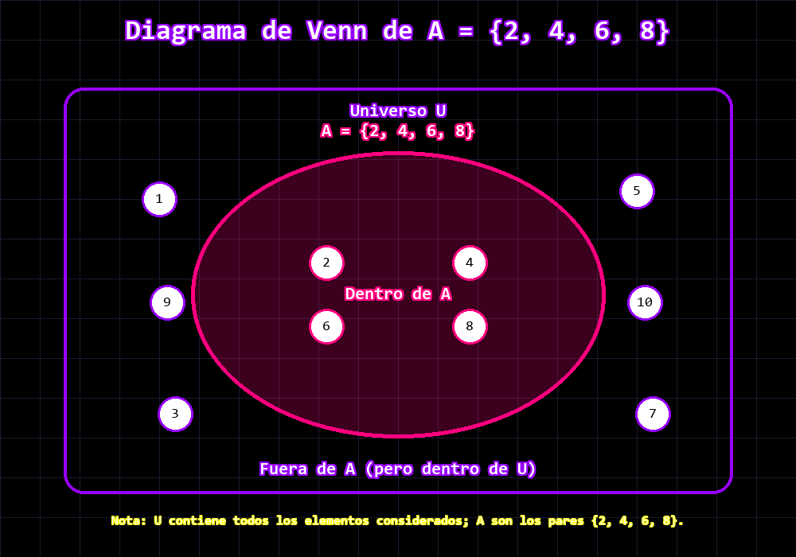
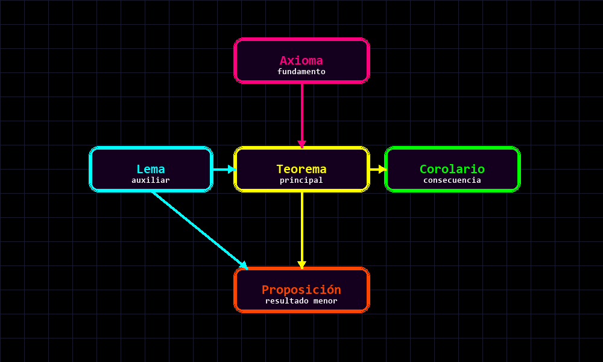
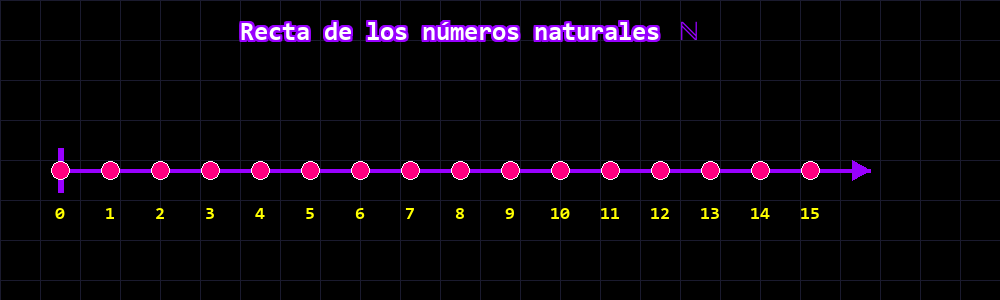
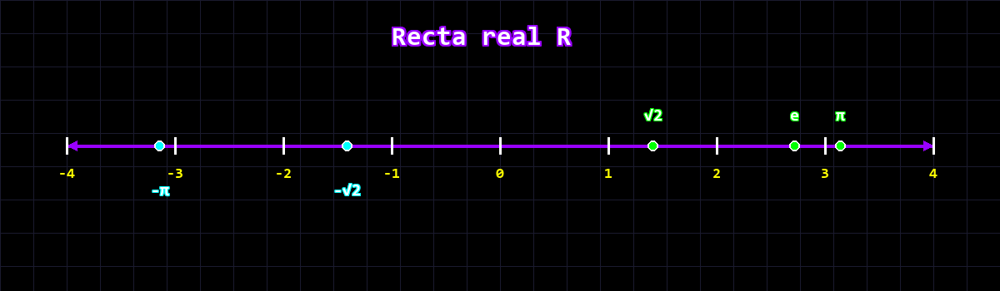
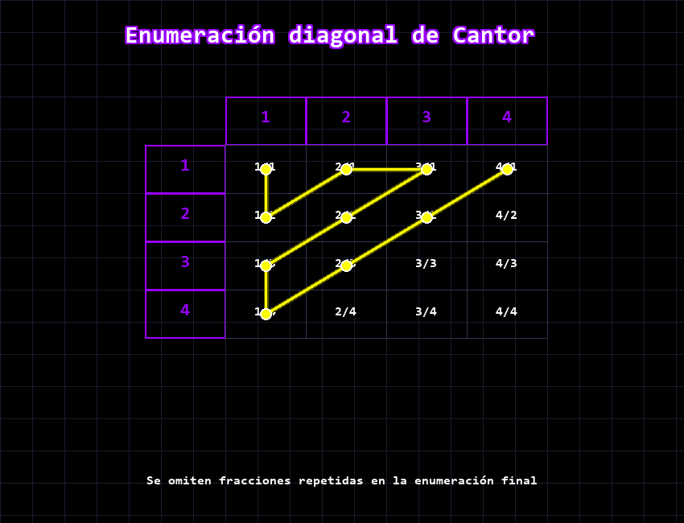
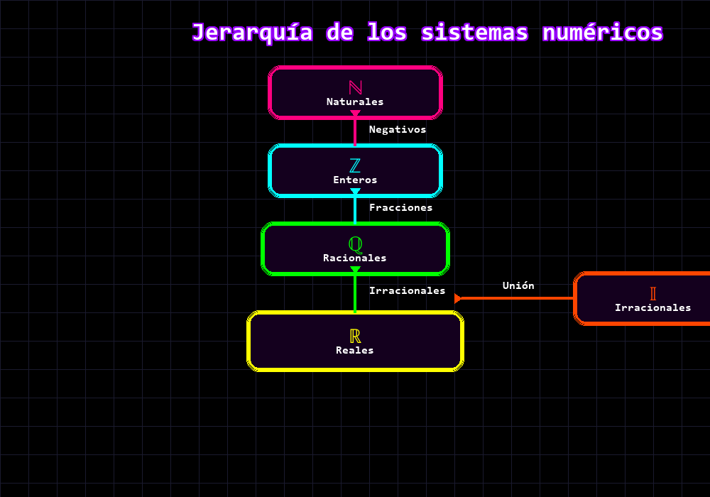

# Los Números: Fundamentos y Construcción

En esta clase se construyen los sistemas numéricos fundamentales —naturales, enteros, racionales, irracionales y reales— a partir de la teoría de conjuntos, y se establecen los axiomas que caracterizan a los números reales como cuerpo ordenado completo.

## 1. Teoría de conjuntos: Lenguaje fundamental de las matemáticas

### 1.1 Concepto intuitivo de conjunto

Pensemos en una colección de objetos bien definidos: los colores primarios, los números pares, o los puntos de una recta. En matemáticas, a esas colecciones se las llama **conjuntos**, y a cada objeto individual se lo llama **elemento**. Esta noción, propuesta por Georg Cantor en 1874, es la base de toda la matemática moderna.

**Definición 1.1 (Conjunto y elemento):**
Un **conjunto** es una colección bien definida de objetos, llamados **elementos**. Si $x$ es un elemento del conjunto $A$, se escribe $x \in A$ (se lee "$x$ pertenece a $A$"); en caso contrario, se escribe $x \notin A$.

> **Nota:** En este curso trabajaremos con conjuntos "concretos" (números, puntos, funciones). La definición formal y axiomática de conjunto se desarrolla en la teoría de conjuntos de Zermelo-Fraenkel (ZFC) y se estudia en cursos avanzados de lógica.

**Ejemplo 1.1:**
Sea $A = \{1, 2, 3, 4, 5\}$ el conjunto de los primeros cinco números naturales. Entonces $3 \in A$ pero $7 \notin A$. Sea $B = \{a, e, i, o, u\}$ el conjunto de las vocales; entonces $a \in B$ pero $b \notin B$.

> **Observación:** Los elementos de un conjunto no se repiten ni tienen orden prefijado. Por ejemplo, $\{2, 2, 3\} = \{2, 3\}$ y $\{1, 2, 3\} = \{3, 2, 1\}$.
### 1.2 Formas de especificar un conjunto

A menudo necesitamos describir conjuntos que tienen muchos elementos o incluso infinitos. Listar uno por uno no siempre es práctico, así que disponemos de distintas formas de especificar qué elementos pertenecen a un conjunto.

**Definición 1.2 (Notación por extensión):**
Un conjunto está dado **por extensión** cuando se enumeran todos sus elementos entre llaves:
$$A = \{2, 4, 6, 8\}.$$

**Definición 1.3 (Notación por comprensión):**
Un conjunto está dado **por comprensión** cuando se indica una propiedad $P(x)$ que caracteriza a sus elementos dentro de un universo $U$:
$$A = \{x \in U : P(x)\}.$$
Se lee: "$A$ es el conjunto de todos los $x$ en $U$ tales que $P(x)$ se cumple".

**Ejemplo 1.2:**
- Por extensión: $V = \{a, e, i, o, u\}$.
- Por comprensión: $P = \{x \in \mathbb{N} : x \text{ es par y } x \leq 8\} = \{2, 4, 6, 8\}$.

**Representación gráfica: diagramas de Venn**
Además de las notaciones algebraicas, los conjuntos pueden representarse gráficamente mediante **diagramas de Venn**. En estos diagramas cada conjunto se dibuja como una curva cerrada y los elementos como puntos en su interior. La intersección aparece como la región común y la inclusión como una curva dentro de otra.

**Aplicaciones:**
La notación por comprensión es la base de los lenguajes de consulta en bases de datos (como SQL) y de la especificación de propiedades en lógica y programación. Los diagramas de Venn se usan en probabilidad para visualizar eventos y sus intersecciones.

> **Observación:** La notación por comprensión tiene la forma general $\{x \in U : P(x)\}$, donde $U$ es un "universo" de referencia y $P(x)$ es un predicado. Siempre debe quedar claro cuál es el universo; de lo contrario la descripción puede ser ambigua.

### 1.3 Operaciones entre conjuntos

Dados dos conjuntos, es natural combinarlos o compararlos: reunir todos sus elementos, quedarnos solo con los comunes, o eliminar los elementos de uno que aparecen en otro. Estas operaciones son el lenguaje con el que se expresan relaciones entre colecciones.

**Definición 1.4 (Unión):**
La **unión** de $A$ y $B$ es el conjunto de elementos que pertenecen a $A$ **o** a $B$ (o a ambos):
$$A \cup B = \{x : x \in A \text{ o } x \in B\}.$$
*Se lee "$A$ unión $B$".*

**Definición 1.5 (Intersección):**
La **intersección** de $A$ y $B$ es el conjunto de elementos que pertenecen a $A$ **y** a $B$ simultáneamente:
$$A \cap B = \{x : x \in A \text{ y } x \in B\}.$$
*Se lee "$A$ intersección $B$".*

**Definición 1.6 (Diferencia):**
La **diferencia** $A \setminus B$ es el conjunto de elementos de $A$ que **no** están en $B$:
$$A \setminus B = \{x : x \in A \text{ y } x \notin B\}.$$
*Se lee "$A$ menos $B$".*

**Ejemplo 1.3:**
Sean $A = \{1, 2, 3, 4\}$ y $B = \{3, 4, 5, 6\}$. Entonces:
- $A \cup B = \{1, 2, 3, 4, 5, 6\}$,
- $A \cap B = \{3, 4\}$,
- $A \setminus B = \{1, 2\}$,
- $B \setminus A = \{5, 6\}$.

**Aplicaciones:**
Las operaciones entre conjuntos modelan situaciones cotidianas y técnicas: la unión describe la combinación de listas de clientes o genes; la intersección identifica características compartidas entre grupos; la diferencia filtra elementos excluyendo ciertos criterios. En probabilidad, estas operaciones corresponden a eventos "o", "y" y "no".

> **Observación:** Dos conjuntos $A$ y $B$ se dicen **disjuntos** cuando $A \cap B = \emptyset$, es decir, cuando no tienen elementos en común.

### 1.4 La paradoja de Russell y los límites de la intuición

La noción intuitiva de conjunto parece suficiente para trabajar con colecciones de números o puntos, pero permite formar expresiones como "el conjunto de todos los conjuntos". A principios del siglo XX, Bertrand Russell descubrió que esta libertad conduce a contradicciones lógicas. Comprender este límite justifica por qué la matemática moderna requiere axiomas precisos para hablar de conjuntos.

**La paradoja de Russell:**
Consideremos el conjunto $R$ definido como:
$$R = \{x : x \text{ es un conjunto y } x \notin x\}.$$
Es decir, $R$ es el conjunto de todos los conjuntos que **no se contienen a sí mismos**.

Ahora preguntamos: ¿Es $R \in R$?
- Si $R \in R$, entonces por definición de $R$, debe cumplirse $R \notin R$. **Contradicción**.
- Si $R \notin R$, entonces cumple la condición para estar en $R$, luego $R \in R$. **Contradicción**.

**Conclusión:** La noción "ingenua" de conjunto conduce a contradicciones lógicas. Por ello, en el siglo XX se desarrolló la **Teoría Axiomática de Conjuntos** (Zermelo-Fraenkel, ZFC), que establece reglas precisas sobre qué colecciones son conjuntos válidos.

> **Nota:** Para este curso trabajaremos con conjuntos "naturales" (números, funciones, puntos geométricos) que no presentan estas paradojas. Las sutilezas formales se estudiarán en cursos avanzados de Lógica Matemática o Teoría de Conjuntos.

### 1.5 El conjunto vacío

Entre todas las colecciones posibles, hay una que resulta especial: la colección que no contiene ningún elemento. Aunque pueda parecer anodina a primera vista, el conjunto vacío es indispensable: actúa como elemento neutro para la unión y como punto de partida para construir los números naturales.

**Definición 1.7 (Conjunto vacío):**
El **conjunto vacío**, denotado por $\emptyset$ o $\{\}$, es el único conjunto que no contiene elementos. Formalmente:
$$\emptyset = \{\} \quad \text{tal que} \quad \forall x, \, x \notin \emptyset.$$

> **Nota:** El símbolo $\forall$ se lee "para todo". La condición anterior afirma que ningún objeto $x$ pertenece a $\emptyset$.

**Propiedades fundamentales:**

1. **Unicidad.** Existe exactamente un conjunto vacío. Si $A$ y $B$ son dos conjuntos sin elementos, entonces $A = B = \emptyset$.

2. **Subconjunto universal.** El conjunto vacío es subconjunto de cualquier conjunto:
   $$\forall A, \quad \emptyset \subseteq A.$$
   *Se lee "el conjunto vacío es subconjunto de $A$".*
   
   **Justificación:** La implicación "$x \in \emptyset \Rightarrow x \in A$" es **vacuamente verdadera**, ya que no existe ningún $x \in \emptyset$ que pueda contradecirla.

3. **Unión e intersección:**
   - $A \cup \emptyset = A$ (el vacío es neutro para la unión),
   - $A \cap \emptyset = \emptyset$ (la intersección con el vacío es siempre vacía),
   - $A \setminus \emptyset = A$,
   - $\emptyset \setminus A = \emptyset$.

**Ejemplo 1.4:**
- $\mathcal{P}(\emptyset) = \{\emptyset\}$ (el conjunto potencia del vacío tiene un elemento).
- Si $A = \{1, 2, 3\}$, entonces $A \cap \emptyset = \emptyset$ y $A \cup \emptyset = \{1, 2, 3\}$.

> **Observación filosófica:** El conjunto vacío puede parecer abstracto o incluso paradójico ("¿cómo puede existir un conjunto de nada?"), pero es absolutamente fundamental en matemáticas. Es el "ladrillo" más básico desde el cual se construyen todos los números (ver Sección 4). Así como el cero es esencial en aritmética, el conjunto vacío es esencial en teoría de conjuntos.

> **Analogía:** El conjunto vacío puede imaginarse como una caja vacía: la caja existe aunque no contenga nada. El conjunto vacío es "algo" (un conjunto válido), pero ese algo no contiene elementos.

> **Notación importante:** No confundir:
> - $\emptyset$ (el conjunto vacío, que no tiene elementos),
> - $\{\emptyset\}$ (el conjunto que contiene al conjunto vacío como único elemento, por lo tanto tiene 1 elemento),
> - $\{\{\emptyset\}\}$ (el conjunto que contiene al conjunto $\{\emptyset\}$, tiene 1 elemento).
>
> Estas distinciones serán cruciales en la construcción de von Neumann de los números naturales.

### 1.6 Cardinalidad

Una de las primeras preguntas que surge ante un conjunto es "¿cuántos elementos tiene?". La cardinalidad responde esa pregunta de manera precisa y permite comparar tamaños incluso cuando los conjuntos son infinitos.

**Definición 1.8 (Cardinalidad):**
La **cardinalidad** de un conjunto finito $A$, denotada $|A|$, $\#A$ o $\operatorname{card}(A)$, es el **número de elementos** que contiene.

**Ejemplo 1.5:**
- $|\{2, 4, 6\}| = 3$.
- $|\{a, b, c, d, e\}| = 5$.
- $|\emptyset| = 0$ (el conjunto vacío no tiene elementos).

> **Observación:** Para conjuntos infinitos, la noción de cardinalidad es más sutil y se basa en la idea de **biyecciones** entre conjuntos (ver Sección 8).

### 1.7 Conjunto potencia

Dado un conjunto, a menudo interesa estudiar todas las subcolecciones que se pueden formar con sus elementos. El conjunto de todos esos subconjuntos recibe el nombre de **conjunto potencia** y aparece de manera natural en combinatoria, lógica y teoría de la computación.

**Definición 1.9 (Conjunto potencia):**
Dado un conjunto $A$, el **conjunto potencia** de $A$, denotado $\mathcal{P}(A)$ o $2^A$, es el conjunto de **todos los subconjuntos** de $A$:
$$\mathcal{P}(A) = \{B : B \subseteq A\}.$$

**Ejemplo 1.6:**
Si $A = \{1, 2\}$, entonces:
$$\mathcal{P}(A) = \{\emptyset, \{1\}, \{2\}, \{1,2\}\}.$$
Se observa que $|\mathcal{P}(A)| = 4$.

**Ejemplo 1.7:**
Si $A = \{a, b, c\}$, entonces:
$$\mathcal{P}(A) = \{\emptyset, \{a\}, \{b\}, \{c\}, \{a,b\}, \{a,c\}, \{b,c\}, \{a,b,c\}\},$$
y $|\mathcal{P}(A)| = 8$.

**Caso especial - El conjunto vacío:**
$$\mathcal{P}(\emptyset) = \{\emptyset\}.$$
El conjunto potencia del vacío **no es vacío**: contiene un elemento (el conjunto vacío mismo).

**Teorema 1.1 (Cardinalidad del conjunto potencia):**
Si $A$ es un conjunto finito con $|A| = n$, entonces:
$$|\mathcal{P}(A)| = 2^n.$$

**Demostración (idea intuitiva):**
Para construir un subconjunto de $A$, debemos decidir, para cada elemento de $A$, si lo incluimos o no. Son 2 opciones por cada uno de los $n$ elementos, lo que da $2 \times 2 \times \cdots \times 2 = 2^n$ posibilidades. $\square$

**Ejemplo 1.8 (Crecimiento exponencial):**
- $|\emptyset| = 0$, $|\mathcal{P}(\emptyset)| = 2^0 = 1$.
- $|\{a\}| = 1$, $|\mathcal{P}(\{a\})| = 2^1 = 2$.
- $|\{a,b\}| = 2$, $|\mathcal{P}(\{a,b\})| = 2^2 = 4$.
- $|\{a,b,c\}| = 3$, $|\mathcal{P}(\{a,b,c\})| = 2^3 = 8$.
- $|\{a,b,c,d\}| = 4$, $|\mathcal{P}(\{a,b,c,d\})| = 2^4 = 16$.

**Aplicaciones:**
El conjunto potencia es central en combinatoria (contar subconjuntos), en lógica proposicional (cada subconjunto de variables puede interpretarse como una asignación de valores de verdad) y en teoría de la computación (autómatas y lenguajes formales).

**Teorema de Cantor (1891):**
Para **cualquier** conjunto $A$ (finito o infinito), no existe ninguna función sobreyectiva de $A$ a $\mathcal{P}(A)$. En particular:
$$|A| < |\mathcal{P}(A)|.$$

Este resultado implica que existe una **jerarquía infinita de infinitos**:
$$|\mathbb{N}| < |\mathcal{P}(\mathbb{N})| < |\mathcal{P}(\mathcal{P}(\mathbb{N}))| < \cdots$$

> **Observación profunda:** El teorema de Cantor muestra que, dado cualquier conjunto infinito, siempre se puede construir uno de cardinalidad estrictamente mayor (su conjunto potencia). Esta idea es una de las más importantes de las matemáticas modernas.

> **Observación:** La notación $2^A$ proviene de que $|2^A| = 2^{|A|}$ cuando $A$ es finito. Además, se tiene siempre $|A| < |\mathcal{P}(A)|$, de modo que $n < 2^n$ para todo $n \geq 0$.

---

## 2. Símbolos lógicos y lenguaje matemático

Las matemáticas usan un lenguaje simbólico para expresar ideas con precisión, brevedad y universalidad. Aprender a leer estos símbolos es tan importante como aprender a leer ecuaciones: permite traducir definiciones, teoremas y demostraciones de manera inequívoca.

### 2.1 Símbolos lógicos y de conjuntos

Los símbolos lógicos y de pertenencia aparecen en casi toda definición y teorema. La siguiente tabla resume los más frecuentes.

|      Símbolo      | Significado                   | Ejemplo                              | Lectura                                                       |
| :---------------: | :---------------------------- | :----------------------------------- | :------------------------------------------------------------ |
|     $\forall$     | Para todo, para cada          | $\forall x \in \mathbb{N}, x \geq 0$ | "Para todo x natural, x es mayor o igual a 0"                 |
|     $\exists$     | Existe (al menos uno)         | $\exists x \in \mathbb{R}: x^2 = 2$  | "Existe un real x tal que x² = 2"                             |
|   $\exists!$      | Existe único                  | $\exists! x \in \mathbb{R}: x^2 = 4 \land x > 0$ | "Existe un único real positivo x tal que x² = 4" |
|    $\nexists$     | No existe                     | $\nexists x \in \mathbb{Q}: x^2 = 2$ | "No existe un racional x tal que x² = 2"                      |
|   $\therefore$    | Por lo tanto, entonces        | $x=2 \therefore x^2=4$               | "x igual 2, por lo tanto x² igual 4"                          |
|      $\land$      | Y (conjunción lógica)         | $x > 0 \land x < 5$                  | "x mayor que 0 y x menor que 5"                               |
|      $\lor$       | O (disyunción lógica)         | $x < 0 \lor x > 10$                  | "x menor que 0 o x mayor que 10"                              |
|      $\neg$       | Negación (no)                 | $\neg(x > 0)$                        | "no (x mayor que 0)" o "x no es mayor que 0"                  |
|   $\Rightarrow$   | Implica                       | $x = 2 \Rightarrow x^2 = 4$          | "x igual 2 implica x² igual 4"                                |
| $\Leftrightarrow$ | Si y solo si (sii)            | $x^2 = 4 \Leftrightarrow x = \pm 2$  | "x² igual 4 si y solo si x es ±2"                             |
|       $\in$       | Pertenece a                   | $3 \in \mathbb{N}$                   | "3 pertenece a los naturales"                                 |
|     $\notin$      | No pertenece a                | $-1 \notin \mathbb{N}$               | "-1 no pertenece a los naturales"                             |
|     $\subset$     | Subconjunto propio            | $\mathbb{N} \subset \mathbb{Z}$      | "Los naturales están contenidos (propiamente) en los enteros" |
|    $\subseteq$    | Subconjunto (puede ser igual) | $A \subseteq B$                      | "A está contenido en B (posiblemente A = B)"                  |
|    $\supset$      | Superconjunto propio          | $\mathbb{Z} \supset \mathbb{N}$      | "Los enteros contienen propiamente a los naturales"           |
|    $\supseteq$    | Superconjunto (puede ser igual) | $B \supseteq A$                    | "B contiene a A (posiblemente B = A)"                         |

### 2.2 Símbolos de orden y comparación

Para comparar cantidades y expresar relaciones de igualdad o desigualdad se usan los siguientes símbolos.

|  Símbolo   | Significado                      | Ejemplo                  | Lectura                               |
| :--------: | :------------------------------- | :----------------------- | :------------------------------------ |
|    $=$     | Igual a                          | $2 + 2 = 4$              | "2 más 2 igual a 4"                   |
|   $\neq$   | Distinto de, diferente de        | $3 \neq 5$               | "3 distinto de 5"                     |
|    $<$     | Menor que (estrictamente)        | $2 < 5$                  | "2 menor que 5"                       |
|    $>$     | Mayor que (estrictamente)        | $7 > 3$                  | "7 mayor que 3"                       |
|   $\leq$   | Menor o igual que                | $x \leq 10$              | "x menor o igual que 10"              |
|   $\geq$   | Mayor o igual que                | $y \geq 0$               | "y mayor o igual que 0"               |
|   $\ll$    | Mucho menor que                  | $0.001 \ll 1000$         | "0.001 mucho menor que 1000"          |
|   $\gg$    | Mucho mayor que                  | $10^6 \gg 10$            | "un millón mucho mayor que 10"        |
|  $\approx$ | Aproximadamente igual            | $\pi \approx 3.14$       | "pi aproximadamente 3.14"             |
|  $\equiv$  | Idénticamente igual, congruente  | $x^2 - 1 \equiv (x-1)(x+1)$ | "x² - 1 idénticamente igual a (x-1)(x+1)" |

> **Observación sobre $\Rightarrow$ vs $\geq$:**
> - $\Rightarrow$ (flecha simple) denota **implicación lógica** entre proposiciones
> - $\geq$ denota **relación de orden** entre números
> - No confundir: "$x > 0 \Rightarrow x^2 > 0$" (implicación) vs "$x \geq 0$" (comparación)

### 2.3 Terminología matemática fundamental

En matemáticas se clasifican las afirmaciones según su papel y su importancia relativa. Conocer esta terminología ayuda a entender qué se está afirmando y qué tipo de justificación se espera.

**Definición 2.1 (Axioma):**
Un **axioma** (o **postulado**) es una proposición que se acepta como verdadera sin demostración y que sirve de fundamento para una teoría matemática.

**Ejemplo 2.1:**
- "Dos puntos determinan una única recta" (axioma de geometría euclidiana).
- Los axiomas de Peano para los números naturales.
- Los axiomas de cuerpo para $\mathbb{R}$ (ver Sección 9).

**Definición 2.2 (Teorema):**
Un **teorema** es una proposición matemática importante que ha sido demostrada a partir de axiomas y resultados previos.

**Ejemplo 2.2:**
- Teorema 5.1: Caracterización decimal de racionales.
- Teorema 7.1: $|\mathbb{Z}| = |\mathbb{N}|$.
- Teorema 8.1: Los reales no son numerables (Teorema de Cantor).

**Definición 2.3 (Lema):**
Un **lema** es una proposición auxiliar que se demuestra para facilitar la demostración de un teorema más importante.

**Ejemplo 2.3:**
- Lema de Euclides: si un primo divide un producto, divide algún factor.
- Lema de Zorn (teoría de conjuntos).

**Definición 2.4 (Corolario):**
Un **corolario** es una proposición que se deduce de manera directa de un teorema o proposición anterior.

**Ejemplo 2.4:**
- Corolario del Teorema 5.1: Los números con expansión decimal infinita no periódica son irracionales.

**Definición 2.5 (Proposición):**
Una **proposición** es un resultado matemático demostrado, pero de menor importancia o generalidad que un teorema.

**Ejemplo 2.5:**
- Proposición 3.1: Propiedades de la suma en $\mathbb{N}$.
- Proposición 10.1: $1 + 0 = 1$.

**Jerarquía conceptual:**

La siguiente imagen resume las relaciones entre los distintos tipos de enunciados.

> **Observación:** En la práctica, la distinción entre teorema, proposición y lema no siempre es estricta. Lo que un autor llama "proposición" otro podría llamar "teorema" si lo considera suficientemente importante. Sin embargo, los axiomas y corolarios tienen roles más precisamente definidos.

### 2.4 El alfabeto griego

El alfabeto latino solo ofrece 26 letras, una cantidad insuficiente para nombrar la diversidad de variables, parámetros, funciones y constantes que aparecen en matemáticas. El alfabeto griego aporta 24 símbolos más, muchos de los cuales adquirieron significados casi universales gracias al trabajo de Leonhard Euler en el siglo XVIII. Por esta razón, resulta indispensable reconocer su pronunciación y sus usos más frecuentes.

**Distinción conceptual:**
- Letras latinas ($x, y, z$): típicamente variables o coordenadas.
- Letras griegas ($\alpha, \beta, \theta$): ángulos, parámetros, funciones especiales.

**Convenciones universales:**
- $\pi$: razón entre la circunferencia y el diámetro, $\pi\approx 3{,}14159\ldots$
- $\Sigma$ (sigma mayúscula): suma de una serie.
- $\Delta$ (delta mayúscula): diferencia o cambio.
- $\epsilon$ (épsilon): cantidad arbitrariamente pequeña, típica en límites.
- $\theta, \phi$: ángulos en trigonometría.
- $\lambda$: valores propios, longitud de onda.
- $\mu$: media de una distribución, coeficiente de fricción.
- $\sigma$: desviación estándar.

> **Nota histórica:** Leonhard Euler popularizó muchas de estas convenciones en el siglo XVIII, como $\pi$ para la constante circular (1737) y $\Sigma$ para sumatorias. Durante los siglos XIX y XX la notación griega se estandarizó en el análisis matemático, la física teórica, la estadística y la probabilidad.

**El alfabeto griego completo:**

| Mayúscula  |        Minúscula        | Nombre  | Pronunciación | Uso común en matemáticas                        |
| :--------: | :---------------------: | :------ | :------------ | :---------------------------------------------- |
|  $\Alpha$  |        $\alpha$         | Alfa    | alfa          | Ángulos, coeficientes                           |
|  $\Beta$   |         $\beta$         | Beta    | beta          | Ángulos, coeficientes                           |
|  $\Gamma$  |        $\gamma$         | Gamma   | gama          | Función Gamma, ángulos                          |
|  $\Delta$  |        $\delta$         | Delta   | delta         | Diferencia, incremento, discriminante           |
| $\Epsilon$ | $\epsilon, \varepsilon$ | Épsilon | épsilon       | Número pequeño, límites                         |
|  $\Zeta$   |         $\zeta$         | Zeta    | dseta         | Función zeta de Riemann                         |
|   $\Eta$   |         $\eta$          | Eta     | eta           | Eficiencia, coordenadas                         |
|  $\Theta$  |   $\theta, \vartheta$   | Theta   | theta         | Ángulos, temperatura                            |
|  $\Iota$   |         $\iota$         | Iota    | iota          | Índices                                         |
|  $\Kappa$  |        $\kappa$         | Kappa   | kapa          | Curvatura, constante dieléctrica                |
| $\Lambda$  |        $\lambda$        | Lambda  | lambda        | Valores propios, longitud de onda               |
|   $\Mu$    |          $\mu$          | Mu      | mu            | Media, coeficiente de fricción, micro-          |
|   $\Nu$    |          $\nu$          | Nu      | nu            | Frecuencia, grados de libertad                  |
|   $\Xi$    |          $\xi$          | Xi      | ksi           | Variable aleatoria, coordenadas                 |
| $\Omicron$ |           $o$           | Ómicron | ómicron       | Raramente usado (se confunde con O latina)      |
|   $\Pi$    |      $\pi, \varpi$      | Pi      | pi            | Constante π ≈ 3.14159..., producto              |
|   $\Rho$   |     $\rho, \varrho$     | Rho     | ro            | Densidad, radio polar, correlación              |
|  $\Sigma$  |   $\sigma, \varsigma$   | Sigma   | sigma         | Suma ($\Sigma$), desviación estándar ($\sigma$) |
|   $\Tau$   |         $\tau$          | Tau     | tau           | Constante de tiempo, torque, τ = 2π             |
| $\Upsilon$ |       $\upsilon$        | Ípsilon | ípsilon       | Raramente usado                                 |
|   $\Phi$   |     $\phi, \varphi$     | Fi      | fi            | Función, ángulo, razón áurea                    |
|   $\Chi$   |         $\chi$          | Ji      | ji            | Distribución chi-cuadrado                       |
|   $\Psi$   |         $\psi$          | Psi     | psi           | Función de onda (mecánica cuántica)             |
|  $\Omega$  |        $\omega$         | Omega   | omega         | Frecuencia angular, resistencia eléctrica (Ω)   |

> **Observaciones importantes:**
>
> 1. **Variantes tipográficas:** Algunas letras tienen variantes estilísticas:
>    - Épsilon: $\epsilon$ (lunate) vs $\varepsilon$ (curvilínea)
>    - Theta: $\theta$ (con línea) vs $\vartheta$ (script theta)
>    - Pi: $\pi$ (normal) vs $\varpi$ (variante pomega)
>    - Rho: $\rho$ (normal) vs $\varrho$ (con cola)
>    - Phi: $\phi$ (cerrada) vs $\varphi$ (abierta)
>
> 2. **Letras griegas en mayúscula que se parecen a las latinas:**
>    - $\Alpha$ (A), $\Beta$ (B), $\Epsilon$ (E), $\Zeta$ (Z), $\Eta$ (H), $\Iota$ (I), $\Kappa$ (K), $\Mu$ (M), $\Nu$ (N), $\Omicron$ (O), $\Rho$ (P), $\Tau$ (T), $\Chi$ (X)
>    - Por esta similitud, raramente se usan las mayúsculas de estas letras en notación matemática
>
> 3. **Letras distintivas más usadas:**
>    - Mayúsculas: $\Gamma, \Delta, \Theta, \Lambda, \Xi, \Pi, \Sigma, \Phi, \Psi, \Omega$
>    - Minúsculas: $\alpha, \beta, \gamma, \delta, \epsilon, \zeta, \theta, \lambda, \mu, \pi, \rho, \sigma, \tau, \phi, \omega$

> **Recomendación práctica:** Es recomendable familiarizarse con la pronunciación y escritura de las letras griegas, ya que resultan imprescindibles para la lectura y la comunicación matemática efectivas.

---

## 3. Construcción de los números naturales

Después de establecer el lenguaje de conjuntos, podemos construir los números naturales sin apelar a la intuición de "contar". La idea es partir de un objeto básico —el conjunto vacío— y definir cada número como el conjunto de todos los anteriores. Este proceso, desarrollado por John von Neumann en 1923, muestra que la aritmética puede fundarse únicamente en teoría de conjuntos.

### 3.1 El conjunto vacío y la construcción de von Neumann

**Definición 3.1 (Números naturales según von Neumann):**
Partiendo del conjunto vacío $\emptyset$, se define recursivamente:
$$0 := \emptyset = \{\},$$
$$1 := \{0\} = \{\emptyset\},$$
$$2 := \{0, 1\} = \{\emptyset, \{\emptyset\}\},$$
$$3 := \{0, 1, 2\},$$
y en general:
$$n := \{0, 1, 2, \dots, n-1\}.$$

En esta construcción, cada número natural $n$ es el conjunto de todos los números naturales menores que $n$. Notamos que $|n| = n$; es decir, la cardinalidad del conjunto coincide con el número mismo.

**Definición 3.2 (Función sucesor):**
La función sucesor $S$ se define como:
$$S(n) = n \cup \{n\}.$$
De esta manera, $S(n)$ representa al siguiente número natural, es decir, $n + 1$.

**Ejemplo 3.1:**
$$S(2) = 2 \cup \{2\} = \{0, 1\} \cup \{2\} = \{0, 1, 2\} = 3.$$

**Definición 3.3 (Conjunto de los números naturales):**
$$\mathbb{N} = \{0, 1, 2, 3, 4, \dots\}.$$

> **Convención para este curso:**
> - $\mathbb{N}^{*} = \{1, 2, 3, 4, \dots\}$ (naturales **sin** cero, también denotado $\mathbb{N}^{+}$).
> - $\mathbb{N} = \{0, 1, 2, 3, \dots\}$ (naturales **con** cero, también denotado $\mathbb{N}_0$).
>
> Diferentes textos usan convenciones distintas; lo esencial es declarar la convención al inicio de cada desarrollo.

### 3.2 La recta numérica de los naturales

La recta numérica permite visualizar $\mathbb{N}$ como puntos discretos sobre una línea. Esta representación es útil para entender el orden y la noción de "siguiente".

**Características:**
- $\mathbb{N}$ tiene un primer elemento, el $0$.
- No tiene último elemento: es infinito.
- Está bien ordenado: entre dos naturales consecutivos no hay otro natural.
- Es discreto: no hay continuidad entre sus elementos.
- Existe un orden natural; por ejemplo, $5 > 3$, por lo que $\mathbb{N}$ es un conjunto ordenado.

### 3.3 La suma en $\mathbb{N}$

Una vez construidos los números, definimos la suma de manera recursiva a partir de la función sucesor. Esta definición captura la idea intuitiva de "seguir contando".

**Definición 3.4 (Suma de números naturales):**
Para cualesquiera $m, n \in \mathbb{N}$:
1. **Caso base:** $m + 0 = m$.
2. **Caso recursivo:** $m + S(n) = S(m + n)$.

> **Nota:** La definición anterior afirma que sumar $m + n$ equivale a aplicar la función sucesor $n$ veces al número $m$.

**Ejemplo 3.2 (Calculando $2 + 3$):**
$$\begin{align}
2 + 3 &= 2 + S(2) \\
&= S(2 + 2) \\
&= S(2 + S(1)) \\
&= S(S(2 + 1)) \\
&= S(S(2 + S(0))) \\
&= S(S(S(2 + 0))) \\
&= S(S(S(2))) \\
&= S(S(3)) \\
&= S(4) \\
&= 5.
\end{align}$$

**Proposición 3.1 (Propiedades de la suma):**
La suma en $\mathbb{N}$ satisface:
1. **Cerradura:** $\forall m, n \in \mathbb{N},\; m + n \in \mathbb{N}$.
2. **Asociatividad:** $\forall m, n, p \in \mathbb{N},\; (m + n) + p = m + (n + p)$.
3. **Conmutatividad:** $\forall m, n \in \mathbb{N},\; m + n = n + m$.
4. **Elemento neutro:** $\forall m \in \mathbb{N},\; m + 0 = 0 + m = m$.
5. **Ley de cancelación:** $\forall m, n, p \in \mathbb{N},\; m + p = n + p \Rightarrow m = n$.

> **Nota:** Estas propiedades se demuestran por inducción matemática, técnica que se estudia en detalle en el curso de Álgebra I.

### 3.4 La resta en $\mathbb{N}$: una operación parcial

En los naturales no siempre es posible restar: no existe un natural $k$ tal que $5 + k = 3$. Esta limitación es importante porque motiva la ampliación a los enteros.

**Definición 3.5 (Resta en $\mathbb{N}$):**
Dados $m, n \in \mathbb{N}$, decimos que $m - n$ existe en $\mathbb{N}$ si y solo si existe $k \in \mathbb{N}$ tal que:
$$n + k = m.$$
En ese caso, escribimos $k = m - n$.

**Ejemplo 3.3:**
- $12 - 2 = 10$ está definida en $\mathbb{N}$, porque $2 + 10 = 12$.
- $7 - 4 = 3$ está definida en $\mathbb{N}$, porque $4 + 3 = 7$.
- $3 - 5$ no está definida en $\mathbb{N}$, porque no existe $k \in \mathbb{N}$ tal que $5 + k = 3$.

**Condición necesaria y suficiente:**
$$m - n \in \mathbb{N} \quad \Longleftrightarrow \quad m \geq n.$$

> **Observación:** Cuando escribimos $m - n$ en $\mathbb{N}$, asumimos implícitamente que $m \geq n$. Ecuaciones como $5 + x = 3$ no tienen solución en $\mathbb{N}$; se resolverán al ampliar a $\mathbb{Z}$.

### 3.5 La multiplicación en $\mathbb{N}$

La multiplicación se introduce como suma repetida, lo que permite definirla recursivamente a partir de la suma.

**Definición 3.6 (Multiplicación de números naturales):**
Para cualesquiera $m, n \in \mathbb{N}$:
1. **Caso base:** $m \cdot 0 = 0$.
2. **Caso recursivo:** $m \cdot S(n) = m \cdot n + m$.

Equivalentemente, $m \cdot n = \underbrace{m + m + \cdots + m}_{n \text{ veces}}$.

**Ejemplo 3.4 (Calculando $3 \times 4$):**
$$\begin{align}
3 \cdot 4 &= 3 \cdot S(3) \\
&= 3 \cdot 3 + 3 \\
&= (3 \cdot S(2)) + 3 \\
&= (3 \cdot 2 + 3) + 3 \\
&= \cdots \\
&= 12.
\end{align}$$

**Proposición 3.2 (Propiedades de la multiplicación):**
La multiplicación en $\mathbb{N}$ satisface:
1. **Cerradura:** $\forall m, n \in \mathbb{N},\; m \cdot n \in \mathbb{N}$.
2. **Asociatividad:** $\forall m, n, p \in \mathbb{N},\; (m \cdot n) \cdot p = m \cdot (n \cdot p)$.
3. **Conmutatividad:** $\forall m, n \in \mathbb{N},\; m \cdot n = n \cdot m$.
4. **Elemento neutro:** $\forall m \in \mathbb{N},\; m \cdot 1 = 1 \cdot m = m$.
5. **Distributividad:** $\forall m, n, p \in \mathbb{N},\; m \cdot (n + p) = m \cdot n + m \cdot p$.
6. **Ley de cancelación:** $\forall m, n, p \in \mathbb{N},\; m \cdot p = n \cdot p \land p \neq 0 \Rightarrow m = n$.
7. **Absorción del cero:** $\forall m \in \mathbb{N},\; m \cdot 0 = 0 \cdot m = 0$.

> **Nota:** Estas propiedades se demuestran por inducción matemática a partir de la Definición 3.6; el desarrollo detallado se verá en el curso de Álgebra I.

### 3.6 Múltiplos en $\mathbb{N}$

La noción de múltiplo surge directamente de la multiplicación y será esencial para estudiar divisibilidad, MCD y MCM.

**Definición 3.7 (Múltiplo):**
Dados $a, b \in \mathbb{N}$, decimos que $b$ es un **múltiplo** de $a$ si existe $k \in \mathbb{N}$ tal que:
$$b = a \cdot k.$$
También se dice que $a$ es un **factor** de $b$ o que $b$ es divisible por $a$.

**Ejemplo 3.5:**
- $12$ es múltiplo de $3$, pues $12 = 3 \cdot 4$.
- $20$ es múltiplo de $5$, pues $20 = 5 \cdot 4$.
- $0$ es múltiplo de cualquier $a$, pues $0 = a \cdot 0$.

**Conjunto de múltiplos:**
El conjunto de todos los múltiplos de $a \in \mathbb{N}$ se denota:
$$M(a) = \{a \cdot k : k \in \mathbb{N}\} = \{0, a, 2a, 3a, \dots\}.$$

**Ejemplo 3.6:**
- $M(2) = \{0, 2, 4, 6, 8, \dots\}$ (números pares).
- $M(3) = \{0, 3, 6, 9, 12, \dots\}$.
- $M(1) = \mathbb{N}$.

> **Observación:** El estudio de múltiplos y divisores se extiende en la Sección 4 al conjunto de los números enteros, donde la divisibilidad adquiere mayor simetría.

**Aplicaciones:**
La construcción recursiva de los naturales y sus operaciones es la base de la aritmética computacional: los procesadores implementan suma y multiplicación mediante operaciones iteradas sobre representaciones binarias. Los múltiplos y la divisibilidad aparecen en criptografía (RSA), teoría de números y algoritmos de sincronización.

## 4. Los números enteros: $\mathbb{Z}$

### 4.1 Motivación: la resta en los naturales

Pensemos en la ecuación $5 + x = 3$. En $\mathbb{N}$, dicha ecuación no tiene solución, pues la resta $3 - 5$ no está definida. Los números naturales permiten contar y sumar libremente, pero no restar en todas las situaciones. Para que toda ecuación de la forma $a + x = b$ posea una solución, se extiende $\mathbb{N}$ a un conjunto que incluya los números negativos.

> **Nota histórica:** Los números negativos fueron rechazados durante siglos en Europa, mientras que en la India Brahmagupta ya los manipulaba sistemáticamente en el siglo VII. No se aceptaron plenamente en Occidente hasta el Renacimiento, con trabajos de Cardano y Descartes.

**Definición 4.1 (Conjunto de los números enteros):**
El conjunto de los **números enteros** es
$$\mathbb{Z} = \{ \dots, -3, -2, -1, 0, 1, 2, 3, \dots \}.$$
El símbolo $\mathbb{Z}$ proviene del alemán *Zahlen* (números).

Se distinguen los siguientes subconjuntos:
- **Enteros positivos:** $\mathbb{Z}^+ = \{1, 2, 3, \dots\} = \mathbb{N}^*$.
- **Enteros negativos:** $\mathbb{Z}^- = \{\dots, -3, -2, -1\}$.
- **Enteros no negativos:** $\mathbb{Z}_{\geq 0} = \{0, 1, 2, 3, \dots\} = \mathbb{N}$.

> **Observación:** En este proyecto se utiliza $\mathbb{N} = \{0, 1, 2, \dots\}$. Por tanto, $\mathbb{Z}^+ = \mathbb{N} \setminus \{0\} = \mathbb{N}^*$, y $\mathbb{Z} = \mathbb{Z}^- \cup \{0\} \cup \mathbb{Z}^+$ es una unión disjunta.

**Ejemplo 4.1:**
Se tiene que $-7 \in \mathbb{Z}$ pero $-7 \notin \mathbb{N}$; $0 \in \mathbb{Z} \cap \mathbb{N}$; y $\dfrac{1}{2} \notin \mathbb{Z}$.

**Aplicaciones:**
Los enteros modelan situaciones con dos direcciones opuestas: temperaturas bajo cero, saldos deudores, desplazamientos hacia la izquierda en la recta numérica y diferencias de tiempo. Sin ellos, la resta general no estaría definida.

### 4.2 Construcción formal por clases de equivalencia (opcional)

La descripción $\mathbb{Z} = \{\dots, -2, -1, 0, 1, 2, \dots\}$ es intuitiva, pero no explica por qué $-3$ es un objeto matemático legítimo ni cómo se suman los negativos. Una construcción rigurosa parte exclusivamente de los números naturales.

**Definición 4.2 (Construcción de los enteros):**
Se define $\mathbb{Z}$ como el conjunto de clases de equivalencia del producto cartesiano $\mathbb{N} \times \mathbb{N}$ bajo la relación
$$(a,b) \sim (c,d) \quad \Longleftrightarrow \quad a + d = b + c,$$
donde el par $(a,b)$ representa intuitivamente la diferencia $a - b$.

La suma y el producto se definen sobre las clases mediante representantes:
$$[(a,b)] + [(c,d)] = [(a+c, b+d)],$$
$$[(a,b)] \cdot [(c,d)] = [(ac + bd, ad + bc)].$$

Se verifica que estas operaciones no dependen de los representantes elegidos. La clase $[(0,0)]$ actúa como cero, y $[(b,a)]$ es el inverso aditivo de $[(a,b)]$.

> **Nota:** Esta construcción muestra que los enteros negativos no son símbolos arbitrarios, sino pares ordenados de naturales identificados mediante una relación de equivalencia. Puede omitirse en una primera lectura sin pérdida de continuidad.

### 4.3 Operaciones en $\mathbb{Z}$

Una vez construido $\mathbb{Z}$, las operaciones se extienden de $\mathbb{N}$ conservando las propiedades algebraicas deseables: asociatividad, conmutatividad y distributividad.

**Definición 4.3 (Suma y resta en $\mathbb{Z}$):**
Dados $m, n \in \mathbb{Z}$, la **suma** $m + n$ extiende la suma en $\mathbb{N}$ y satisface $m + (-m) = 0$ para todo $m \in \mathbb{Z}$. La **resta** se define como
$$m - n := m + (-n),$$
donde $-n$ es el **inverso aditivo** de $n$, es decir, el único entero tal que $n + (-n) = 0$.

**Definición 4.4 (Multiplicación en $\mathbb{Z}$):**
Dados $m, n \in \mathbb{Z}$, el producto $m \cdot n$ se define de modo que:
- si $n > 0$, entonces $m \cdot n = \underbrace{m + m + \dots + m}_{n \text{ veces}}$;
- $m \cdot 0 = 0$;
- si $n < 0$, entonces $m \cdot n = -(m \cdot |n|)$.

**Proposición 4.1 (Propiedades algebraicas de $\mathbb{Z}$):**
Para cualesquiera $a, b, c \in \mathbb{Z}$ se cumple:
1. **Cerradura:** $a + b \in \mathbb{Z}$ y $a \cdot b \in \mathbb{Z}$.
2. **Asociatividad:** $(a + b) + c = a + (b + c)$ y $(a \cdot b) \cdot c = a \cdot (b \cdot c)$.
3. **Conmutatividad:** $a + b = b + a$ y $a \cdot b = b \cdot a$.
4. **Elementos neutros:** $a + 0 = a$ y $a \cdot 1 = a$.
5. **Inverso aditivo:** existe $-a \in \mathbb{Z}$ tal que $a + (-a) = 0$.
6. **Distributividad:** $a \cdot (b + c) = a \cdot b + a \cdot c$.
7. **Producto nulo:** $a \cdot b = 0 \Longleftrightarrow a = 0$ o $b = 0$.

> **Observación:** $(\mathbb{Z}, +, \cdot)$ es un **anillo conmutativo con unidad**. No es un cuerpo, porque la mayoría de los enteros no tienen inverso multiplicativo en $\mathbb{Z}$; por ejemplo, no existe $x \in \mathbb{Z}$ tal que $2x = 1$.

> **Nota:** Las demostraciones de estas propiedades a partir de la construcción por clases de equivalencia de la Definición 4.2 se desarrollan en cursos de álgebra abstracta. Aquí se aceptan como consecuencia de dicha construcción y de la extensión natural de las operaciones en $\mathbb{N}$.

**Ejemplo 4.2:**
Calcular $(-3) \cdot (-5)$ y $4 \cdot (-2)$:
$$(-3) \cdot (-5) = -(3 \cdot (-5)) = -(-(3 \cdot 5)) = 15,$$
$$4 \cdot (-2) = -(4 \cdot 2) = -8.$$

La regla de los signos se resume en la siguiente tabla:

| $a$ | $b$ | $a \cdot b$ |
|:---:|:---:|:-----------:|
| $+$ | $+$ | $+$ |
| $+$ | $-$ | $-$ |
| $-$ | $+$ | $-$ |
| $-$ | $-$ | $+$ |

### 4.4 Divisibilidad y conjunto de divisores

En $\mathbb{Z}$ no siempre es posible dividir: $7 \div 2$ no produce un entero. La divisibilidad captura exactamente cuándo sí es posible efectuar la división dentro de $\mathbb{Z}$.

**Definición 4.5 (Divisibilidad):**
Sean $a, b \in \mathbb{Z}$ con $b \neq 0$. Se dice que $b$ **divide** a $a$, y se escribe $b \mid a$, si existe $c \in \mathbb{Z}$ tal que
$$a = b \cdot c.$$
En tal caso, $b$ es un **divisor** de $a$, y $a$ es un **múltiplo** de $b$. Si $b$ no divide a $a$, se escribe $b \nmid a$.

**Proposición 4.2 (Propiedades de la divisibilidad):**
Para cualesquiera $a, b, c \in \mathbb{Z}$ (con los divisores no nulos cuando se requiera):
1. $a \mid a$ para todo $a \in \mathbb{Z} \setminus \{0\}$.
2. Si $a \mid b$ y $b \mid c$, entonces $a \mid c$.
3. $1 \mid a$ y $a \mid 0$ para todo $a \in \mathbb{Z} \setminus \{0\}$.
4. Si $a \mid b$ y $a \mid c$, entonces $a \mid (b + c)$ y $a \mid (b - c)$.

**Demostración:**
Se prueba la propiedad 4 como ejemplo. Si $a \mid b$ y $a \mid c$, existen $k, \ell \in \mathbb{Z}$ tales que $b = ak$ y $c = a\ell$. Entonces
$$b + c = ak + a\ell = a(k + \ell),$$
y $k + \ell \in \mathbb{Z}$, luego $a \mid (b + c)$. Análogamente, $b - c = a(k - \ell)$, por lo que $a \mid (b - c)$. $\blacksquare$

**Definición 4.6 (Conjunto de divisores positivos):**
Dado $n \in \mathbb{Z} \setminus \{0\}$, su conjunto de divisores positivos es
$$D(n) = \{ d \in \mathbb{N}^* : d \mid n \}.$$

**Definición 4.7 (Número primo):**
Un entero $p > 1$ es **primo** si sus únicos divisores positivos son $1$ y $p$, es decir, $D(p) = \{1, p\}$. Un entero mayor que $1$ que no es primo se llama **compuesto**.

> **Observación:** El número $1$ no es primo ni compuesto. Todo entero no nulo divide a $0$, pues $0 = a \cdot 0$.

**Ejemplo 4.3:**
- $3 \mid 12$ porque $12 = 3 \cdot 4$.
- $6 \nmid 15$ pues no existe $c \in \mathbb{Z}$ tal que $15 = 6c$.
- $D(12) = \{1, 2, 3, 4, 6, 12\}$.
- $D(7) = \{1, 7\}$, por lo que $7$ es primo.

### 4.5 División euclidiana

Aunque la división exacta no siempre es posible, sí se puede dividir con resto. Este resultado es la base del algoritmo de Euclides y de la aritmética modular.

> **Nota histórica:** La división con resto aparece ya en los *Elementos* de Euclides (c. 300 a.C.), donde se utiliza como herramienta fundamental para estudiar la divisibilidad.

**Teorema 4.1 (División euclidiana):**
Dados $a, b \in \mathbb{Z}$ con $b > 0$, existen únicos enteros $q$ (cociente) y $r$ (resto) tales que
$$a = b \cdot q + r \quad \text{con} \quad 0 \leq r < b.$$

**Demostración:**

*Existencia.* Sea $S = \{ a - bq : q \in \mathbb{Z} \} \cap \mathbb{N}$. Como $b > 0$, eligiendo $q$ suficientemente negativo se tiene $a - bq \geq 0$, así que $S$ es no vacío. Por el principio del buen orden, $S$ posee un mínimo $r = a - bq_0$ para algún $q_0 \in \mathbb{Z}$. Entonces $r \geq 0$. Si $r \geq b$, se tendría
$$a - b(q_0 + 1) = r - b \geq 0,$$
lo cual contradice la minimalidad de $r$. Por tanto $r < b$.

*Unicidad.* Supongamos que $a = bq + r = bq' + r'$ con $0 \leq r, r' < b$. Restando,
$$b(q - q') = r' - r.$$
Como $-b < r' - r < b$, el único múltiplo de $b$ en ese intervalo es $0$. Luego $r' = r$ y, puesto que $b \neq 0$, se deduce $q' = q$. $\blacksquare$

**Ejemplo 4.4:**
- $17 = 5 \cdot 3 + 2$, de modo que $q = 3$ y $r = 2$.
- $-17 = 5 \cdot (-4) + 3$, pues se exige $0 \leq r < 5$; no se admite $-17 = 5 \cdot (-3) + (-2)$.

### 4.6 Aritmética modular

La división euclidiana asigna a cada entero un resto respecto de un divisor fijo. Ese resto es la piedra angular de la aritmética modular.

**Definición 4.8 (Operación módulo):**
Dados $a, b \in \mathbb{Z}$ con $b > 0$, el **módulo** de $a$ respecto de $b$, denotado $a \bmod b$, es el único resto $r$ de la división euclidiana de $a$ entre $b$:
$$a \bmod b = r \quad \text{donde} \quad a = bq + r, \quad 0 \leq r < b.$$
La notación $a \equiv c \pmod{b}$ indica que $a \bmod b = c \bmod b$.

**Proposición 4.3 (Propiedades del módulo):**
Para cualesquiera $a, c \in \mathbb{Z}$ y $b > 0$ se cumple:
1. $0 \leq a \bmod b < b$.
2. $a \bmod b = 0 \Longleftrightarrow b \mid a$.
3. $(a + c) \bmod b = \bigl((a \bmod b) + (c \bmod b)\bigr) \bmod b$.
4. $(a \cdot c) \bmod b = \bigl((a \bmod b) \cdot (c \bmod b)\bigr) \bmod b$.

**Demostración:**
Las dos primeras propiedades se siguen directamente de la Definición 4.8 y del Teorema 4.1. Para la tercera, escribamos $a = bq_1 + r_1$ y $c = bq_2 + r_2$ con $0 \leq r_1, r_2 < b$. Entonces
$$a + c = b(q_1 + q_2) + (r_1 + r_2).$$
Si $r_1 + r_2 < b$, el resto de $a + c$ al dividir por $b$ es $r_1 + r_2$; si $r_1 + r_2 \geq b$, se le resta $b$ el número necesario de veces. En ambos casos el resultado coincide con $(r_1 + r_2) \bmod b$, que es la propiedad enunciada. La demostración para el producto es análoga, pues
$$a \cdot c = b^2 q_1 q_2 + b(q_1 r_2 + q_2 r_1) + r_1 r_2,$$
y el resto de $a \cdot c$ respecto de $b$ es el mismo que el de $r_1 r_2$. $\blacksquare$

**Ejemplo 4.5:**
- $23 \bmod 7 = 2$ porque $23 = 7 \cdot 3 + 2$.
- $101 \bmod 7 = 3$ porque $101 = 7 \cdot 14 + 3$.
- $(17 + 8) \bmod 5 = 25 \bmod 5 = 0$, y también $(2 + 3) \bmod 5 = 0$.

**Aplicaciones:**
La aritmética modular aparece en criptografía (RSA, curvas elípticas), en el diseño de funciones hash, en la generación de números pseudoaleatorios, en la corrección de errores y en la programación de calendarios y relojes. Por ejemplo, las $15:00$ horas equivalen a las $3:00$ PM porque $15 \bmod 12 = 3$.

### 4.7 Máximo común divisor y mínimo común múltiplo

El divisor común más grande de dos enteros y el múltiplo común más pequeño son dos cantidades fundamentales en la teoría de números.

> **Nota histórica:** El algoritmo de Euclides para calcular el máximo común divisor es uno de los algoritmos más antiguos conocidos y aparece en el Libro VII de los *Elementos* de Euclides.

**Definición 4.9 (Máximo común divisor):**
Dados $a, b \in \mathbb{Z}$ no ambos nulos, el **máximo común divisor** de $a$ y $b$ es
$$\gcd(a,b) = \max\{ d \in \mathbb{N}^* : d \mid a \text{ y } d \mid b \}.$$
Equivalentemente, $\gcd(a,b) = \max\bigl(D(a) \cap D(b)\bigr)$.

**Definición 4.10 (Números coprimos):**
Dos enteros $a$ y $b$ son **coprimos** (o primos relativos) si $\gcd(a,b) = 1$.

**Ejemplo 4.6:**
- $\gcd(12, 18) = 6$ pues $D(12) \cap D(18) = \{1, 2, 3, 6\}$.
- $\gcd(7, 11) = 1$, por lo que $7$ y $11$ son coprimos.
- $\gcd(0, 5) = 5$ porque todo entero positivo divide a $0$.

**Teorema 4.2 (Algoritmo de Euclides):**
Sean $a, b \in \mathbb{Z}$ con $b > 0$. Si $a = bq + r$ con $0 \leq r < b$, entonces
$$\gcd(a,b) = \gcd(b,r).$$

**Demostración:**
Sea $d = \gcd(a,b)$. Entonces $d \mid a$ y $d \mid b$, de modo que $d \mid (a - bq) = r$. Así $d$ es divisor común de $b$ y $r$, luego $d \leq \gcd(b,r)$.

Recíprocamente, sea $d' = \gcd(b,r)$. Entonces $d' \mid b$ y $d' \mid r$, por lo que $d' \mid (bq + r) = a$. Luego $d'$ es divisor común de $a$ y $b$, de donde $d' \leq \gcd(a,b)$.

De ambas desigualdades se concluye que $\gcd(a,b) = \gcd(b,r)$. $\blacksquare$

**Ejemplo 4.7 (Cálculo de $\gcd(48, 18)$):**
Aplicando divisiones sucesivas:
$$\begin{align}
48 &= 18 \cdot 2 + 12, \\
18 &= 12 \cdot 1 + 6, \\
12 &= 6 \cdot 2 + 0.
\end{align}$$
El último resto no nulo es $6$, por lo que $\gcd(48, 18) = 6$.

**Definición 4.11 (Mínimo común múltiplo):**
Dados $a, b \in \mathbb{Z} \setminus \{0\}$, el **mínimo común múltiplo** de $a$ y $b$ es
$$\operatorname{lcm}(a,b) = \min\{ m \in \mathbb{N}^* : a \mid m \text{ y } b \mid m \}.$$

**Teorema 4.3 (Relación entre MCD y MCM):**
Para cualesquiera $a, b \in \mathbb{Z}^+$ se cumple
$$\gcd(a,b) \cdot \operatorname{lcm}(a,b) = a \cdot b.$$

**Demostración:**
Sea $d = \gcd(a,b)$. Entonces $a = d a_1$ y $b = d b_1$ con $\gcd(a_1, b_1) = 1$. Sea $m = d a_1 b_1$. Se verifica que $a \mid m$ y $b \mid m$, así que $\operatorname{lcm}(a,b) \leq m$.

Recíprocamente, sea $M$ un múltiplo común positivo de $a$ y $b$. Entonces $M = a k = b \ell$ para algunos $k, \ell \in \mathbb{Z}^+$. Sustituyendo,
$$d a_1 k = d b_1 \ell \quad \Longrightarrow \quad a_1 k = b_1 \ell.$$
Como $\gcd(a_1, b_1) = 1$, se tiene $a_1 \mid \ell$, luego $\ell = a_1 t$ para algún $t \in \mathbb{Z}^+$. Por tanto
$$M = b \ell = d b_1 a_1 t = m \cdot t \geq m.$$
Así, $m$ es el menor múltiplo común positivo, es decir, $\operatorname{lcm}(a,b) = d a_1 b_1$. Finalmente,
$$\gcd(a,b) \cdot \operatorname{lcm}(a,b) = d \cdot (d a_1 b_1) = (d a_1)(d b_1) = a \cdot b. \quad \blacksquare$$

**Ejemplo 4.8:**
Como $\gcd(48, 18) = 6$, se tiene
$$\operatorname{lcm}(48, 18) = \frac{48 \cdot 18}{6} = 144.$$
En efecto, $144 = 48 \cdot 3 = 18 \cdot 8$.

> **Observación:** Para calcular el mínimo común múltiplo de más de dos enteros se aplica la propiedad asociativa: $\operatorname{lcm}(a,b,c) = \operatorname{lcm}(\operatorname{lcm}(a,b),c)$, y análogamente para el máximo común divisor.

### 4.8 Valor absoluto

El valor absoluto mide la distancia de un entero al origen, independientemente de su signo. Es una herramienta central para definir distancia y convergencia.

**Definición 4.12 (Valor absoluto):**
El **valor absoluto** de $a \in \mathbb{Z}$ se define como
$$|a| = \begin{cases}
a & \text{si } a \geq 0, \\
-a & \text{si } a < 0.
\end{cases}$$

**Ejemplo 4.9:**
$|5| = 5$, $|-5| = 5$, $|0| = 0$ y $|-12| = 12$.

**Proposición 4.4 (Propiedades del valor absoluto):**
Para cualesquiera $a, b \in \mathbb{Z}$ se cumple:
1. $|a| \geq 0$, y $|a| = 0 \Longleftrightarrow a = 0$.
2. $|-a| = |a|$.
3. $|a \cdot b| = |a| \cdot |b|$.
4. $|a + b| \leq |a| + |b|$ (desigualdad triangular).

> **Nota:** Las tres primeras propiedades se verifican directamente separando los casos $a \geq 0$ y $a < 0$ en la definición de valor absoluto.

**Demostración (desigualdad triangular):
Se analizan los signos de $a$ y $b$. Si ambos tienen el mismo signo o alguno es cero, entonces $|a+b| = |a| + |b|$. Si tienen signos opuestos, la suma se cancela parcialmente y $|a+b| < |a| + |b|$. En todos los casos se cumple $|a+b| \leq |a| + |b|$. $\blacksquare$

### 4.9 De enteros a fracciones

Los enteros permiten contar objetos enteros, pero no expresar partes de un todo. Una **fracción** es la representación natural de una cantidad que resulta de dividir una unidad en partes iguales.

**Definición 4.13 (Fracción):**
Una **fracción** es una expresión de la forma
$$\frac{a}{b},$$
donde $a \in \mathbb{Z}$ es el **numerador**, $b \in \mathbb{Z} \setminus \{0\}$ es el **denominador**, y $b$ indica en cuántas partes iguales se divide la unidad.

**Definición 4.14 (Fracciones equivalentes):**
Dos fracciones $\frac{a}{b}$ y $\frac{c}{d}$ son **equivalentes** si
$$\frac{a}{b} = \frac{c}{d} \quad \Longleftrightarrow \quad a \cdot d = b \cdot c.$$
Equivalentemente, $\frac{a}{b} = \frac{a \cdot k}{b \cdot k}$ para todo $k \in \mathbb{Z} \setminus \{0\}$.

**Definición 4.15 (Fracción irreducible):**
Una fracción $\frac{a}{b}$ está en **forma irreducible** si $\gcd(a,b) = 1$.

**Ejemplo 4.10:**
La fracción $\frac{48}{60}$ se simplifica dividiendo numerador y denominador por $\gcd(48, 60) = 12$:
$$\frac{48}{60} = \frac{48 \div 12}{60 \div 12} = \frac{4}{5}.$$
Como $\gcd(4,5) = 1$, la fracción $\frac{4}{5}$ es irreducible.

> **Nota:** El estudio completo de las fracciones —suma, resta, multiplicación, división, comparación y representación decimal— se desarrolla en la Sección 5, dedicada a los números racionales $\mathbb{Q}$.

---

## 5. Los números racionales: $\mathbb{Q}$

### 5.1 Motivación y definición

En $\mathbb{Z}$ la ecuación $2x = 3$ no tiene solución, pues no existe un entero cuyo producto por $2$ sea $3$. La división exacta no siempre es posible en los enteros; para resolver ecuaciones de la forma $bx = a$ con $b \neq 0$ sin restricciones, se amplía $\mathbb{Z}$ al conjunto de los números racionales.

> **Nota histórica:** Los egipcios ya usaban fracciones unitarias; la notación moderna $\frac{a}{b}$ se consolidó en la India y en el mundo árabe medieval. El conjunto $\mathbb{Q}$ se formalizó en el siglo XIX con la aritmetización del análisis.

**Definición 5.1 (Números racionales):**
El conjunto de los **números racionales** es
$$\mathbb{Q} = \left\{ \frac{p}{q} : p, q \in \mathbb{Z},\ q \neq 0 \right\}.$$
El símbolo $\mathbb{Q}$ proviene del inglés *quotient* (cociente).

Un racional $\frac{p}{q}$ está en **forma irreducible** si $\gcd(p,q) = 1$ y $q > 0$.

**Ejemplo 5.1:**
- $\frac{1}{2},\ -\frac{3}{4},\ \frac{7}{5},\ \frac{0}{1} = 0,\ \frac{5}{1} = 5$ son números racionales.
- $\frac{2}{4}$ no está en forma irreducible; simplificando se obtiene $\frac{1}{2}$.

> **Observación:** Todo entero es racional, pues $n = \frac{n}{1}$. Por tanto, $\mathbb{Z} \subset \mathbb{Q}$.

### 5.2 Operaciones con fracciones

Las fracciones representan partes de una unidad, y las operaciones entre ellas extienden las operaciones entre enteros.

**Definición 5.2 (Operaciones con fracciones):**
Dadas fracciones $\frac{a}{b}, \frac{c}{d} \in \mathbb{Q}$ con $b, d \neq 0$:
- **Suma y resta:** $\dfrac{a}{b} \pm \dfrac{c}{d} = \dfrac{ad \pm bc}{bd}$.
- **Multiplicación:** $\dfrac{a}{b} \cdot \dfrac{c}{d} = \dfrac{ac}{bd}$.
- **División:** $\dfrac{a}{b} \div \dfrac{c}{d} = \dfrac{a}{b} \cdot \dfrac{d}{c} = \dfrac{ad}{bc}$, siempre que $c \neq 0$.

> **Observación:** Para sumar fracciones conviene usar el mínimo común múltiplo de los denominadores, aunque la fórmula anterior siempre es válida.

**Ejemplo 5.2:**
- $\dfrac{2}{3} + \dfrac{1}{4} = \dfrac{8 + 3}{12} = \dfrac{11}{12}$.
- $\dfrac{5}{6} - \dfrac{1}{2} = \dfrac{5 - 3}{6} = \dfrac{2}{6} = \dfrac{1}{3}$.
- $\dfrac{3}{5} \cdot \dfrac{10}{9} = \dfrac{30}{45} = \dfrac{2}{3}$.
- $\dfrac{4}{7} \div \dfrac{2}{5} = \dfrac{4}{7} \cdot \dfrac{5}{2} = \dfrac{20}{14} = \dfrac{10}{7}$.

**Proposición 5.1 (Propiedades algebraicas de $\mathbb{Q}$):**
El conjunto $(\mathbb{Q}, +, \cdot)$ es un **cuerpo ordenado**. En particular, para cualesquiera $x, y, z \in \mathbb{Q}$ se cumplen:
1. **Cerradura, asociatividad y conmutatividad** de la suma y el producto.
2. **Elementos neutros:** $x + 0 = x$ y $x \cdot 1 = x$.
3. **Inverso aditivo y multiplicativo:** existe $-x \in \mathbb{Q}$ y, si $x \neq 0$, existe $x^{-1} \in \mathbb{Q}$.
4. **Distributividad:** $x \cdot (y + z) = x \cdot y + x \cdot z$.

> **Nota:** La verificación formal de que $(\mathbb{Q}, +, \cdot)$ es un cuerpo se obtiene a partir de la Definición 5.2; el desarrollo detallado corresponde a cursos de álgebra abstracta.

### 5.3 Decimales exactos

La representación decimal de un racional se obtiene al dividir numerador entre denominador. El primer caso es aquel en que el proceso termina.

**Definición 5.3 (Decimal exacto):**
Un número racional $\frac{p}{q}$ en forma irreducible tiene **representación decimal exacta** si al dividir $p$ entre $q$ se obtiene resto cero después de un número finito de pasos.

**Proposición 5.2 (Caracterización de decimales exactos):**
Un racional $\frac{p}{q}$ en forma irreducible tiene expansión decimal exacta si y solo si $q = 2^a 5^b$ para algunos $a, b \in \mathbb{N}_0$.

**Demostración (idea intuitiva):**
Si $q = 2^a 5^b$, multiplicando numerador y denominador por la potencia adecuada de $2$ o $5$ se obtiene una fracción con denominador $10^n$, que se escribe directamente como un decimal finito. Recíprocamente, si el decimal termina, el número es de la forma $\frac{N}{10^n}$; al reducir, el denominador solo puede contener factores $2$ y $5$. $\square$

**Ejemplo 5.3:**
- $\frac{1}{2} = 0.5$ (denominador $2$).
- $\frac{13}{20} = 0.65$ (denominador $2^2 \cdot 5$).
- $\frac{7}{25} = 0.28$ (denominador $5^2$).

### 5.4 Decimales periódicos puros

Cuando el denominador no contiene factores $2$ ni $5$, la expansión decimal no termina pero repite un bloque indefinidamente.

**Definición 5.4 (Decimal periódico puro):**
Un número racional tiene **expansión decimal periódica pura** si, después del punto decimal, existe un bloque de dígitos que se repite indefinidamente sin dígitos no periódicos previos.

**Proposición 5.3 (Caracterización de decimales periódicos puros):**
Un racional $\frac{p}{q}$ en forma irreducible es periódico puro si y solo si $\gcd(q, 10) = 1$.

**Demostración:**

$(\Rightarrow)$ Supongamos que $\frac{p}{q}=0.\overline{a_1 a_2 \dots a_k}$ con $q>0$ y $\gcd(p,q)=1$. Sea $N$ el entero cuya expansión decimal es $a_1 a_2 \dots a_k$. Entonces
$$\frac{p}{q}=\frac{N}{10^k-1}.$$
Como $\frac{p}{q}$ está en forma irreducible, $q$ divide a $10^k-1$. Por tanto, ningún primo que divida a $q$ puede dividir a $10$, de donde $\gcd(q,10)=1$.

$(\Leftarrow)$ Supongamos que $\gcd(q,10)=1$. Escribamos $\frac{p}{q}=a+\frac{r}{q}$, donde $a\in\mathbb{Z}$ y $0\le r<q$. Basta probar que la parte fraccionaria $\frac{r}{q}$ es periódica pura; si $r=0$ el decimal es exacto, lo cual se puede ver como un caso límite de período cero.

Al realizar la división de $r$ entre $q$, los restos sucesivos $r_i$ se definen por $r_0=r$ y $r_{i+1}\equiv 10r_i \pmod{q}$. Como $\gcd(q,10)=1$, la multiplicación por $10$ es una biyección de los restos no nulos módulo $q$. En consecuencia, la sucesión de restos es periódica desde el primer término, y los dígitos decimales generados también lo son. Así, la expansión decimal de $\frac{r}{q}$ carece de antiperíodo, es decir, es periódica pura. $\blacksquare$

**Ejemplo 5.4:**
- $\frac{1}{3} = 0.\overline{3}$.
- $\frac{2}{11} = 0.\overline{18}$.
- $\frac{1}{7} = 0.\overline{142857}$ (período de longitud $6$).

### 5.5 Decimales semiperiódicos

El caso intermedio ocurre cuando el denominador contiene factores $2$ o $5$ junto con otros primos.

**Definición 5.5 (Decimal semiperiódico):**
Un número racional tiene **expansión decimal semiperiódica** (o periódica mixta) si presenta una parte no periódica (antiperíodo) seguida de una parte periódica.

**Proposición 5.4 (Caracterización de decimales semiperiódicos):**
Un racional $\frac{p}{q}$ en forma irreducible es semiperiódico si y solo si $q$ tiene factores primos $2$ o $5$ y, además, al menos un factor primo distinto de $2$ y $5$.

**Demostración:**

$(\Rightarrow)$ Supongamos que $\frac{p}{q}$ es semiperiódico. Entonces su expansión decimal es de la forma
$$N.a_1 a_2 \dots a_m \, \overline{b_1 b_2 \dots b_k},$$
con $m \ge 1$ (existe antiperíodo) y $k \ge 1$. Sea $A$ el entero formado por $a_1 a_2 \dots a_m$ y $B$ el formado por $b_1 b_2 \dots b_k$. Multiplicando por $10^m$ para dejar el período justo después del punto decimal se obtiene
$$10^m\left(\frac{p}{q}-N\right)=A+0.\overline{b_1 b_2 \dots b_k}=A+\frac{B}{10^k-1}.$$
Por tanto,
$$\frac{p}{q}=N+\frac{A}{10^m}+\frac{B}{10^m(10^k-1)}.$$
Reduciendo a denominador común $10^m(10^k-1)$, el denominador de la fracción resultante divide a $10^m(10^k-1)$. Como $\frac{p}{q}$ está en forma irreducible, $q$ divide a $10^m(10^k-1)$. El factor $10^m$ solo aporta primos $2$ y $5$, mientras que $10^k-1$ es coprimo con $10$. Como $m\ge 1$, $q$ posee factores $2$ o $5$; como la expansión no es exacta, $q$ no puede dividir solo a $10^m$, así que también posee algún factor primo distinto de $2$ y $5$.

$(\Leftarrow)$ Escribamos $q=2^a 5^b q'$, donde $a,b \ge 0$ y $\gcd(q',10)=1$. Por hipótesis, $q'>1$ y $a+b\ge 1$. Sea $m=\max(a,b)$. Multiplicando numerador y denominador por $2^{m-a}5^{m-b}$ se consigue
$$\frac{p}{q}=\frac{p \cdot 2^{m-a}5^{m-b}}{10^m q'}=\frac{C}{10^m q'}.$$
Dividimos $C$ entre $q'$: existen $s,r\in\mathbb{Z}$ con $0\le r<q'$ tales que $C=s q'+r$. Entonces
$$\frac{C}{10^m q'}=\frac{s}{10^m}+\frac{r}{10^m q'}.$$
Como $\gcd(p,q)=1$ y $q'>1$, se tiene $r\neq 0$; de lo contrario $q'$ dividiría a $C$ y, al ser coprimo con $10$, dividiría a $p$, lo cual es imposible. Como $\gcd(q',10)=1$ y $0<r<q'$, la fracción $\frac{r}{q'}$ es periódica pura por la Proposición 5.3. Dividirla por $10^m$ desplaza la coma decimal $m$ lugares, produciendo un antiperíodo de longitud $m$ seguido de un período. El término $\frac{s}{10^m}$ es un decimal finito que solo modifica los dígitos del antiperíodo. Por tanto, $\frac{p}{q}$ es semiperiódica. $\blacksquare$

**Ejemplo 5.5:**
- $\frac{1}{6} = 0.1\overline{6}$ (denominador $2 \cdot 3$).
- $\frac{7}{12} = 0.58\overline{3}$ (denominador $2^2 \cdot 3$).
- $\frac{11}{30} = 0.3\overline{6}$ (denominador $2 \cdot 3 \cdot 5$).

### 5.6 Teorema de caracterización decimal

El siguiente resultado resume los tres casos anteriores y caracteriza a los racionales mediante su expansión decimal.

**Teorema 5.1 (Caracterización decimal de los racionales):**
Un número real es racional si y solo si su expansión decimal es exacta, periódica pura o semiperiódica.

**Demostración:**

*($\Rightarrow$) Toda expansión decimal exacta, periódica pura o semiperiódica es un número racional.*

Sea $x$ un número real con una de estas expansiones. Separamos la parte entera, que es un entero, y analizamos la parte fraccionaria.

1. **Decimal exacta:** Si la parte decimal termina después de $m$ cifras, digamos $0.a_1 a_2 \dots a_m$, entonces:
$$x = N + \frac{A}{10^m},$$
donde $N$ es la parte entera y $A = a_1 a_2 \dots a_m$ es el entero formado por las cifras decimales. Como $N$ y $A$ son enteros, $x$ es racional.

2. **Decimal periódico puro:** Si $x = N + 0.\overline{b_1 b_2 \dots b_k}$, sea $B$ el entero formado por el período $b_1 b_2 \dots b_k$. Multiplicando por $10^k$ se obtiene:
$$10^k(x - N) = B + 0.\overline{b_1 b_2 \dots b_k} = B + (x - N).$$
Por tanto $(10^k - 1)(x - N) = B$, de donde:
$$x = N + \frac{B}{10^k - 1},$$
que es racional.

3. **Decimal semiperiódico:** Si $x = N.a_1 a_2 \dots a_m \overline{b_1 b_2 \dots b_k}$, multiplicamos por $10^m$ para dejar el período justo después del punto decimal:
$$10^m(x - N) = A + 0.\overline{b_1 b_2 \dots b_k},$$
donde $A$ es el entero formado por $a_1 a_2 \dots a_m$. La parte periódica es racional por el caso anterior, luego $x$ es racional.

*($\Leftarrow$) Todo número racional tiene expansión decimal exacta, periódica pura o semiperiódica.*

Sea $x = \frac{p}{q}$ con $p \in \mathbb{Z}$, $q \in \mathbb{Z}^+$ y la fracción reducida. Al efectuar la división de $p$ entre $q$, en cada paso se obtiene un resto $r_i$ que cumple $0 \leq r_i < q$. Como solo existen $q$ restos posibles, después de a lo más $q$ pasos algún resto debe repetirse (principio del palomar). Una vez que un resto se repite, el proceso de división reproduce las mismas cifras, por lo que la expansión decimal se vuelve periódica a partir de ese momento.

Más aún, escribiendo $q = 2^a \cdot 5^b \cdot q'$ con $\gcd(q', 10) = 1$:
- si $q' = 1$, el decimal es exacto;
- si $a = b = 0$, el decimal es periódico puro;
- en cualquier otro caso, el decimal es semiperiódico.

En todos los casos la expansión decimal es de uno de los tres tipos permitidos. $\blacksquare$

**Corolario 5.1:**
Los números reales con expansión decimal infinita no periódica son irracionales.

> **Observación:** Este corolario explica por qué $\sqrt{2}$, $\pi$ o $e$ no pueden expresarse como cociente de enteros.

### 5.7 Conversión de decimales periódicos a fracciones

La técnica consiste en multiplicar por potencias de $10$ para alinear el período y luego restar.

**Ejemplo 5.6 (Periódico puro):**
Sea $x = 0.\overline{36}$. Multiplicando por $100$:
$$100x = 36.\overline{36}.$$
Restando $x$:
$$99x = 36 \quad \Longrightarrow \quad x = \frac{36}{99} = \frac{4}{11}.$$

**Ejemplo 5.7 (Semiperiódico):**
Sea $x = 0.58\overline{3}$. Entonces
$$10x = 5.8\overline{3}, \qquad 100x = 58.\overline{3}.$$
Restando:
$$90x = 52.5 = \frac{105}{2} \quad \Longrightarrow \quad x = \frac{105}{180} = \frac{7}{12}.$$

**Proposición 5.5 (Fórmulas generales):**
- Para un periódico puro $0.\overline{a_1 a_2 \dots a_n}$:
  $$0.\overline{a_1 a_2 \dots a_n} = \frac{a_1 a_2 \dots a_n}{\underbrace{99\dots9}_{n \text{ veces}}}.$$
- Para un semiperiódico $0.b_1 b_2 \dots b_m \overline{a_1 a_2 \dots a_n}$:
  $$0.b_1 b_2 \dots b_m \overline{a_1 a_2 \dots a_n} = \frac{b_1 b_2 \dots b_m a_1 a_2 \dots a_n - b_1 b_2 \dots b_m}{\underbrace{99\dots9}_{n \text{ veces}}\underbrace{00\dots0}_{m \text{ veces}}},$$
donde $b_1 b_2 \dots b_m a_1 a_2 \dots a_n$ denota el entero formado por todos esos dígitos.

> **Advertencia:** En la fórmula semiperiódica, $b_1 \dots b_m a_1 \dots a_n$ denota el entero formado por todos esos dígitos, no un producto.

### 5.8 Densidad de los racionales

A diferencia de los enteros, entre dos racionales distintos siempre hay otro racional; de hecho, hay infinitos.

**Teorema 5.2 (Densidad de $\mathbb{Q}$):**
Para cualesquiera $a, b \in \mathbb{Q}$ con $a < b$, existe $r \in \mathbb{Q}$ tal que $a < r < b$.

**Demostración:**
Basta tomar $r = \frac{a + b}{2}$. Como $a < b$, se tiene $a < \frac{a + b}{2} < b$, y la suma y la división por $2$ cierran en $\mathbb{Q}$. $\blacksquare$

**Ejemplo 5.8:**
Entre $\frac{1}{4}$ y $\frac{1}{2}$ se tiene $r = \frac{3}{8}$, pues
$$\frac{1}{4} = \frac{2}{8} < \frac{3}{8} < \frac{4}{8} = \frac{1}{2}.$$
Reiterando el proceso se obtienen infinitos racionales en ese intervalo.

**Aplicaciones:**
La densidad de $\mathbb{Q}$ es esencial en el análisis: permite aproximar cualquier número real por racionales. Este hecho fundamenta métodos numéricos, aproximaciones decimales y la construcción de los números reales mediante cortaduras de Dedekind o sucesiones de Cauchy.

> **Observación:** Aunque los racionales son densos en la recta, no la llenan por completo: existen números irracionales como $\sqrt{2}$, lo cual se estudia en la Sección 6.

---

## 6. Los números irracionales y reales

### 6.1 El problema de la raíz: irracionales

Pensemos en la ecuación $x^2 = 2$. En $\mathbb{Q}$ no tiene solución: no existe una fracción cuyo cuadrado sea $2$. Esto muestra que los racionales, aunque densos, no cubren todos los puntos de la recta. Para llenar esos huecos se necesitan los números irracionales.

> **Nota histórica:** Los pitagóricos descubrieron la inconmensurabilidad de la diagonal del cuadrado con su lado, un resultado que contradecía su creencia de que todo era número racional. La prueba clásica de la irracionalidad de $\sqrt{2}$ se atribuye a Hipaso de Metaponto.

**Teorema 6.1 (Irracionalidad de $\sqrt{2}$):**
No existe $r \in \mathbb{Q}$ tal que $r^2 = 2$.

**Demostración (por contradicción):**
Supongamos que $r = \frac{p}{q} \in \mathbb{Q}$ en forma irreducible cumple $r^2 = 2$. Entonces $p^2 = 2q^2$, luego $p^2$ es par y, por tanto, $p$ es par. Escribiendo $p = 2k$ para algún $k \in \mathbb{Z}$ se obtiene
$$(2k)^2 = 2q^2 \quad \Longrightarrow \quad 4k^2 = 2q^2 \quad \Longrightarrow \quad q^2 = 2k^2,$$
de modo que $q^2$ es par y, en consecuencia, $q$ también es par. Pero si $p$ y $q$ son ambos pares, entonces $\gcd(p,q) \geq 2$, lo cual contradice la hipótesis de que la fracción es irreducible. Por lo tanto, $\sqrt{2} \notin \mathbb{Q}$. $\blacksquare$

**Definición 6.1 (Números irracionales):**
Un número real $x$ es **irracional** si $x \notin \mathbb{Q}$. El conjunto de los números irracionales se denota
$$\mathbb{I} = \mathbb{R} \setminus \mathbb{Q}.$$

**Ejemplo 6.1:**
- $\sqrt{2}, \sqrt{3}, \sqrt{5}$ son irracionales.
- $\pi$, $e$ y $\phi = \frac{1 + \sqrt{5}}{2}$ son irracionales.
- El número $0{,}1010010001\dots$, con bloques crecientes de ceros entre unos, es irracional.

> **Observación:** La definición formal de $\mathbb{I}$ requiere la noción de número real. Una construcción rigurosa de $\mathbb{R}$ se estudia en cursos de Análisis Real.

### 6.2 Los números reales

La necesidad de completar $\mathbb{Q}$ con todos los límites posibles conduce a los números reales. Este conjunto permite resolver ecuaciones como $x^2 = 2$ y garantiza que toda sucesión convergente tenga límite.

> **Nota histórica:** Las construcciones rigurosas de $\mathbb{R}$ mediante cortaduras de Dedekind y sucesiones de Cauchy fueron publicadas por Richard Dedekind y Georg Cantor en 1872.

**Definición 6.2 (Números reales):**
El conjunto de los **números reales** $\mathbb{R}$ es la completación de $\mathbb{Q}$ que contiene a todos los racionales e irracionales:
$$\mathbb{R} = \mathbb{Q} \cup \mathbb{I}.$$
Geométricamente, $\mathbb{R}$ corresponde a todos los puntos de la recta numérica.

**Teorema 6.2 (Propiedades fundamentales de $\mathbb{R}$):**
El conjunto $(\mathbb{R}, +, \cdot, \leq)$ es un **cuerpo ordenado completo**. En particular:
1. **Cuerpo:** satisface los axiomas de cuerpo respecto de la suma y el producto.
2. **Ordenado:** la relación $\leq$ es total y compatible con las operaciones.
3. **Completo:** toda sucesión de Cauchy converge en $\mathbb{R}$.

> **Nota:** La demostración detallada de estas propiedades a partir de las construcciones de Dedekind o de Cauchy se desarrolla en cursos de Análisis Real.

**Ejemplo 6.2:**
- $-\pi \in \mathbb{R}$, $\frac{2}{3} \in \mathbb{R}$ y $\sqrt{7} \in \mathbb{R}$.
- La ecuación $x^2 = 2$ tiene soluciones $x = \pm \sqrt{2}$ en $\mathbb{R}$.

### 6.3 La recta real

La representación geométrica de $\mathbb{R}$ es la recta numérica, donde cada punto corresponde a un único número real y viceversa.

**Características de $\mathbb{R}$:**
- Es **continuo**: no tiene huecos.
- Es **denso en sí mismo**: entre dos reales distintos hay infinitos reales.
- Es **completo**: toda sucesión convergente de reales tiene límite en $\mathbb{R}$.
- Es **no numerable**: $|\mathbb{R}| = \mathfrak{c} = 2^{\aleph_0} > \aleph_0$ (ver Sección 8).

> **Observación:** La cardinalidad del continuo se demuestra rigurosamente en el Teorema 8.1.

### 6.4 Operaciones con potencias, raíces y logaritmos (opcional)

Las operaciones de potenciación, radicación y logaritmo son centrales en el cálculo. Aunque se estudian con profundidad en clases posteriores, conviene recordar sus definiciones y propiedades básicas.

**Definición 6.3 (Potenciación):**
Para $a \in \mathbb{R}$ y $n \in \mathbb{N}$,
$$a^n = \underbrace{a \cdot a \cdot \dots \cdot a}_{n \text{ veces}}.$$
Se extiende con $a^0 = 1$ para $a \neq 0$ y $a^{-n} = \frac{1}{a^n}$ para $a \neq 0$.

**Definición 6.4 (Raíz n-ésima):**
Dados $a \geq 0$ y $n \in \mathbb{N}$, $n \geq 2$, la **raíz n-ésima** de $a$ es el único número $x \geq 0$ tal que $x^n = a$, denotado $\sqrt[n]{a}$.

**Definición 6.5 (Logaritmo):**
Dados $b > 0$, $b \neq 1$ y $a > 0$, el **logaritmo en base $b$** de $a$ es el único $x \in \mathbb{R}$ tal que $b^x = a$, denotado $\log_b(a)$.

**Proposición 6.1 (Propiedades básicas):**
Para $a, b > 0$ y exponentes reales donde estén definidas las expresiones se cumple:
1. $a^m \cdot a^n = a^{m+n}$.
2. $(a^m)^n = a^{mn}$.
3. $\sqrt[n]{a} \cdot \sqrt[n]{b} = \sqrt[n]{ab}$.
4. $\log_b(ac) = \log_b(a) + \log_b(c)$.
5. $\log_b(a^c) = c \log_b(a)$.
6. $\log_b(a) = \frac{\log_c(a)}{\log_c(b)}$ para $c > 0$, $c \neq 1$.

> **Nota:** Las demostraciones rigurosas de estas propiedades, especialmente para exponentes reales arbitrarios, requieren la construcción de la función exponencial y se tratan en clases posteriores.

**Ejemplo 6.3:**
- $2^3 \cdot 2^4 = 2^7 = 128$.
- $\sqrt{4} \cdot \sqrt{9} = \sqrt{36} = 6$.
- $\log_2(32) = 5$ porque $2^5 = 32$.
- $\ln(e^7) = 7$.

**Aplicaciones:**
Las potencias modelan crecimiento exponencial y decaimiento radiactivo; las raíces aparecen en geometría y ecuaciones algebraicas; los logaritmos se usan en escalas logarítmicas (pH, decibeles, magnitud de Richter), complejidad algorítmica y cálculo de tiempos de duplicación.

---

## 7. Conjuntos infinitos y cardinalidad [Opcional]

### 7.1 La noción de infinito

Muchos conjuntos de interés en matemáticas no pueden contarse con un número natural: los naturales mismos, los enteros, los racionales. La teoría de cardinalidad, desarrollada por Georg Cantor en el siglo XIX, permite comparar el tamaño de conjuntos infinitos de manera rigurosa.

> **Nota histórica:** Cantor introdujo la noción de cardinalidad y los números cardinales transfinitos en una serie de artículos entre 1874 y 1897, sentando las bases de la teoría moderna de conjuntos.

**Definición 7.1 (Conjunto infinito):**
Un conjunto $A$ es **finito** si existe $n \in \mathbb{N}$ y una biyección entre $A$ y $\{0, 1, \dots, n-1\}$. Un conjunto es **infinito** si no es finito.

**Ejemplo 7.1:**
- $\mathbb{N}$, $\mathbb{Z}$, $\mathbb{Q}$ y $\mathbb{R}$ son conjuntos infinitos.
- El conjunto de los números pares $\{2, 4, 6, \dots\}$ es infinito.

### 7.2 Conjuntos numerables

Dos conjuntos tienen la misma cardinalidad cuando sus elementos pueden emparejarse mediante una biyección. Esta idea permite comparar conjuntos infinitos sin recurrir al conteo finito.

**Definición 7.2 (Conjunto numerable):**
Un conjunto infinito $A$ es **numerable** si existe una biyección $f: A \to \mathbb{N}$. Su cardinalidad se denota $\aleph_0$.

**Ejemplo 7.2:**
- $\mathbb{N}$ es numerable mediante la función identidad.
- Todo conjunto finito no es numerable en este sentido; la notación $\aleph_0$ se reserva para los conjuntos infinitos numerables.

### 7.3 Los enteros son numerables

Aunque $\mathbb{Z}$ incluye los enteros negativos, puede listarse siguiendo un patrón que alterna signos.

**Teorema 7.1 ($|\mathbb{Z}| = \aleph_0$):**
Existe una biyección entre $\mathbb{Z}$ y $\mathbb{N}$.

**Demostración:**
Definimos $f: \mathbb{N} \to \mathbb{Z}$ mediante
$$f(n) = \begin{cases}
0 & \text{si } n = 0, \\
\dfrac{n}{2} & \text{si } n > 0 \text{ es par}, \\
-\dfrac{n+1}{2} & \text{si } n > 0 \text{ es impar}.
\end{cases}$$

Esta función asigna $0 \mapsto 0$, $1 \mapsto -1$, $2 \mapsto 1$, $3 \mapsto -2$, $4 \mapsto 2$, y así sucesivamente.

Para verificar que $f$ es inyectiva, observamos que los naturales pares se envían a enteros no negativos y los impares a enteros negativos; por tanto, un par y un impar no pueden tener la misma imagen. Si $n_1, n_2$ son pares y $f(n_1)=f(n_2)$, entonces $\frac{n_1}{2}=\frac{n_2}{2}$, de donde $n_1=n_2$. Si son impares y $f(n_1)=f(n_2)$, entonces $-\frac{n_1+1}{2}=-\frac{n_2+1}{2}$, de donde $n_1=n_2$. Además, $f(0)=0$ no coincide con la imagen de ningún natural positivo, pues estos se asignan a enteros distintos de cero. Por lo tanto $f$ es inyectiva.

Para la sobreyectividad, dado $z \in \mathbb{Z}$, si $z = 0$ se toma $n = 0$; si $z > 0$ se toma $n = 2z$; si $z < 0$ se toma $n = -2z - 1$. Así, $f$ es biyectiva. $\blacksquare$

### 7.4 Los racionales son numerables

El resultado más destacado es que $\mathbb{Q}$, aunque denso en la recta real, también es numerable.

**Teorema 7.2 ($|\mathbb{Q}| = \aleph_0$):**
Existe una biyección entre $\mathbb{Q}$ y $\mathbb{N}$.

**Demostración (enumeración diagonal de Cantor):**
Basta construir una enumeración de $\mathbb{Q}$. Organizamos los racionales positivos en una tabla infinita donde la fila $q$ y la columna $p$ contienen $\frac{p}{q}$. El siguiente diagrama muestra el inicio del recorrido diagonal.

Recorriendo la tabla por diagonales en zigzag y omitiendo las fracciones repetidas, se obtiene una lista de todos los racionales positivos. Intercalando el cero y los racionales negativos se construye una enumeración completa de $\mathbb{Q}$. Por tanto, $|\mathbb{Q}| = \aleph_0$. $\blacksquare$

> **Observación:** El argumento diagonal convierte una tabla bidimensional infinita en una secuencia unidimensional. La misma idea subyace a la demostración de que $\mathbb{R}$ no es numerable, aunque con conclusión opuesta.

### 7.5 El hotel de Hilbert

David Hilbert propuso una analogía que ilustra las propiedades de los conjuntos infinitos numerables.

> **Escenario 1:** Un hotel con infinitas habitaciones numeradas $1, 2, 3, \dots$ está lleno. Si llega un nuevo huésped, basta pedir a cada huésped que se mude a la habitación siguiente: el de la habitación $n$ pasa a la $n+1$. La habitación $1$ queda libre. Esto refleja que $\aleph_0 + 1 = \aleph_0$.

> **Escenario 2:** Si llegan infinitos nuevos huéspedes, cada huéspede actual se muda a la habitación $2n$, dejando libres las impares. Esto muestra que $\aleph_0 + \aleph_0 = \aleph_0$.

> **Escenario 3:** Si llegan infinitos autobuses con infinitos pasajeros cada uno, se puede acomodar a todos usando una enumeración de pares de naturales, lo que ilustra que $\aleph_0 \cdot \aleph_0 = \aleph_0$.

### 7.6 Aritmética básica de $\aleph_0$

Las operaciones con el infinito numerable producen resultados que difieren de la aritmética finita.

**Proposición 7.1 (Aritmética de $\aleph_0$):**
Para cualquier $n \in \mathbb{N}$ finito se cumple:
1. $\aleph_0 + n = \aleph_0$.
2. $\aleph_0 + \aleph_0 = \aleph_0$.
3. $n \cdot \aleph_0 = \aleph_0$.
4. $\aleph_0 \cdot \aleph_0 = \aleph_0$.
5. $\aleph_0^n = \aleph_0$ para todo $n \in \mathbb{N}$.

> **Advertencia:** Estas identidades no se extienden a la potencia $2^{\aleph_0}$, que es estrictamente mayor que $\aleph_0$, como se demuestra en la Sección 8.

---

## 8. Cardinalidad del continuo [Opcional]

### 8.1 Los reales no son numerables

Cantor demostró que, a pesar de que $\mathbb{Q}$ es numerable, $\mathbb{R}$ tiene una cardinalidad estrictamente mayor.

**Teorema 8.1 (Teorema de Cantor):**
El conjunto $\mathbb{R}$ no es numerable.

**Demostración (argumento diagonal):**
Supongamos, por contradicción, que existe una biyección entre $\mathbb{N}$ y $[0,1]$. Entonces podemos listar todos los números de $[0,1]$ como
$$r_1 = 0.a_{11} a_{12} a_{13} \dots,$$
$$r_2 = 0.a_{21} a_{22} a_{23} \dots,$$
$$r_3 = 0.a_{31} a_{32} a_{33} \dots,$$
$$\vdots$$
Definimos $r = 0.b_1 b_2 b_3 \dots$ eligiendo cada dígito $b_i$ de modo que $b_i \neq a_{ii}$ y $b_i \neq 9$ para evitar ambigüedades decimales. Entonces $r \in [0,1]$ difiere de $r_i$ en el $i$-ésimo dígito, así que $r$ no aparece en la lista. Esto contradice la suposición de que la lista era exhaustiva. Por tanto, $\mathbb{R}$ no es numerable. $\blacksquare$

### 8.2 La cardinalidad del continuo

**Definición 8.1 (Cardinalidad del continuo):**
La cardinalidad de $\mathbb{R}$ se denota $\mathfrak{c}$ y se cumple $\mathfrak{c} = 2^{\aleph_0}$.

> **Observación:** La igualdad $\mathfrak{c} = \aleph_1$, conocida como Hipótesis del Continuo, afirma que no hay cardinales entre $\aleph_0$ y $\mathfrak{c}$. Kurt Gödel y Paul Cohen demostraron que esta hipótesis es independiente de los axiomas de ZFC: no puede demostrarse ni refutarse dentro del sistema axiomático estándar.

**Ejemplo 8.1:**
- $|\mathbb{N}| = |\mathbb{Z}| = |\mathbb{Q}| = \aleph_0$.
- $|\mathbb{R}| = \mathfrak{c} = 2^{\aleph_0} > \aleph_0$.

### 8.3 Biyecciones entre intervalos y la recta

**Teorema 8.2:**
El intervalo abierto $(0,1)$ tiene la misma cardinalidad que $\mathbb{R}$.

**Demostración:**
La función $f: (0,1) \to \mathbb{R}$ definida por
$$f(x) = \tan\left(\pi\left(x - \frac{1}{2}\right)\right)$$
es biyectiva: es continua, estrictamente creciente, y sus límites en los extremos son $-\infty$ y $+\infty$. Por tanto, $|(0,1)| = |\mathbb{R}| = \mathfrak{c}$. $\blacksquare$

**Ejemplo 8.2:**
Asimismo, el círculo unitario y la recta real tienen la misma cardinalidad, como se muestra mediante la proyección estereográfica.

> **Observación:** Estos ejemplos muestran que la noción de cardinalidad no respeta la intuición geométrica de longitud o tamaño: un segmento finito contiene tantos puntos como toda la recta.

---

## 9. Axiomas de los números reales

Los números reales no son solo un conjunto: son una estructura algebraica con dos operaciones y una relación de orden. Los axiomas recogen las propiedades básicas que se aceptan sin demostración y de las cuales se derivan todas las demás propiedades del cálculo.

> **Nota histórica:** La axiomatización moderna de los números reales como cuerpo ordenado completo se consolidó a finales del siglo XIX con los trabajos de Richard Dedekind, Georg Cantor y David Hilbert.

### 9.1 Axiomas de Peano

Antes de caracterizar $\mathbb{R}$, conviene recordar los axiomas que fundamentan a los números naturales, pues de ellos se construyen los demás sistemas numéricos.

**Definición 9.1 (Sistema de Peano):**
Un **sistema de Peano** es un conjunto $\mathbb{N}$ con un elemento distinguido $0 \in \mathbb{N}$ y una función sucesor $S: \mathbb{N} \to \mathbb{N}$ que satisfacen los siguientes postulados.

**Postulado 9.1:** $0 \in \mathbb{N}$.

**Postulado 9.2:** Para todo $n \in \mathbb{N}$, $S(n) \in \mathbb{N}$.

**Postulado 9.3:** Para todo $n \in \mathbb{N}$, $S(n) \neq 0$.

**Postulado 9.4:** Si $S(n) = S(m)$, entonces $n = m$.

**Postulado 9.5 (Inducción):** Si $P(0)$ es verdadero y $P(n) \Rightarrow P(S(n))$ para todo $n \in \mathbb{N}$, entonces $P(n)$ es verdadero para todo $n \in \mathbb{N}$.

> **Observación:** A partir de estos postulados se definen la suma, el producto y el orden en $\mathbb{N}$, y de ellos se construyen sucesivamente $\mathbb{Z}$, $\mathbb{Q}$ y $\mathbb{R}$.

### 9.2 Axiomas de cuerpo

Un cuerpo es una estructura algebraica en la que las operaciones de suma y multiplicación se comportan de manera similar a las de los números racionales y reales.

**Definición 9.2 (Cuerpo):**
Un **cuerpo** es un conjunto $F$ con dos operaciones binarias $+$ y $\cdot$ que satisfacen los postulados siguientes.

**Axiomas de la suma:**

**Postulado 9.6 (Cerradura):** Para cualesquiera $a, b \in F$ se cumple $a + b \in F$.

**Postulado 9.7 (Asociatividad):** Para cualesquiera $a, b, c \in F$ se cumple $(a + b) + c = a + (b + c)$.

**Postulado 9.8 (Elemento neutro):** Existe $0 \in F$ tal que $a + 0 = a$ para todo $a \in F$.

**Postulado 9.9 (Inverso aditivo):** Para cada $a \in F$ existe $(-a) \in F$ tal que $a + (-a) = 0$.

**Postulado 9.10 (Conmutatividad):** Para cualesquiera $a, b \in F$ se cumple $a + b = b + a$.

**Axiomas de la multiplicación:**

**Postulado 9.11 (Cerradura):** Para cualesquiera $a, b \in F$ se cumple $a \cdot b \in F$.

**Postulado 9.12 (Asociatividad):** Para cualesquiera $a, b, c \in F$ se cumple $(a \cdot b) \cdot c = a \cdot (b \cdot c)$.

**Postulado 9.13 (Elemento neutro):** Existe $1 \in F$, con $1 \neq 0$, tal que $a \cdot 1 = a$ para todo $a \in F$.

**Postulado 9.14 (Inverso multiplicativo):** Para cada $a \in F \setminus \{0\}$ existe $a^{-1} \in F$ tal que $a \cdot a^{-1} = 1$.

**Postulado 9.15 (Conmutatividad):** Para cualesquiera $a, b \in F$ se cumple $a \cdot b = b \cdot a$.

**Axioma distributivo:**

**Postulado 9.16 (Distributividad):** Para cualesquiera $a, b, c \in F$ se cumple $a \cdot (b + c) = a \cdot b + a \cdot c$.

**Ejemplo 9.1:**
- $\mathbb{Q}$ y $\mathbb{R}$ son cuerpos.
- $\mathbb{Z}$ no es cuerpo, pues $2 \in \mathbb{Z}$ pero su inverso multiplicativo $\frac{1}{2} \notin \mathbb{Z}$.

### 9.3 Axiomas de orden

Un cuerpo ordenado es un cuerpo equipado con una relación de orden total compatible con las operaciones.

**Definición 9.3 (Cuerpo ordenado):**
Un cuerpo $F$ es **ordenado** si existe una relación $\leq$ en $F$ que satisface los siguientes postulados.

**Postulado 9.17 (Tricotomía):** Para cualesquiera $a, b \in F$, exactamente una de las siguientes afirmaciones es verdadera: $a < b$, $a = b$ o $a > b$.

**Postulado 9.18 (Transitividad):** Si $a \leq b$ y $b \leq c$, entonces $a \leq c$.

**Postulado 9.19 (Compatibilidad con la suma):** Si $a \leq b$, entonces $a + c \leq b + c$ para todo $c \in F$.

**Postulado 9.20 (Compatibilidad con la multiplicación):** Si $a \leq b$ y $c \geq 0$, entonces $a \cdot c \leq b \cdot c$.

> **Observación:** De estos postulados se deducen las reglas usuales de manipulación de desigualdades.

### 9.4 Axioma de completitud

El axioma de completitud es el que distingue a $\mathbb{R}$ de $\mathbb{Q}$ y hace posible el análisis matemático.

**Definición 9.4 (Cota superior y supremo):**
Sea $A \subseteq \mathbb{R}$ no vacío. Un número $M \in \mathbb{R}$ es una **cota superior** de $A$ si $a \leq M$ para todo $a \in A$. El **supremo** de $A$, denotado $\sup A$, es la menor de las cotas superiores de $A$.

**Postulado 9.21 (Completitud):**
Todo subconjunto no vacío de $\mathbb{R}$ acotado superiormente tiene supremo en $\mathbb{R}$.

> **Observación:** Este postulado garantiza que $\mathbb{R}$ no tiene huecos y es indispensable para definir límites, continuidad y convergencia en el cálculo.

**Ejemplo 9.2:**
- El conjunto $A = \{x \in \mathbb{Q} : x^2 < 2\}$ está acotado superiormente en $\mathbb{Q}$ (por ejemplo, por $2$), pero no tiene supremo en $\mathbb{Q}$; su supremo en $\mathbb{R}$ es $\sqrt{2}$.
- El intervalo $[0, 1)$ tiene supremo $1$ en $\mathbb{R}$.

### 9.5 Caracterización de los números reales

**Definición 9.5 (Números reales):**
El conjunto $\mathbb{R}$ es el único cuerpo ordenado completo, es decir, el único conjunto que satisface los Postulados 9.6–9.21.

> **Observación:** La unicidad se entiende salvo isomorfismo ordenado. La existencia se construye mediante cortaduras de Dedekind o sucesiones de Cauchy.

---

## 10. Demostraciones elementales con los axiomas

Los axiomas de cuerpo y orden permiten demostrar propiedades aparentemente evidentes. Estas demostraciones muestran cómo se deducen resultados concretos a partir de los postulados establecidos en la sección anterior.

### 10.1 Elemento neutro de la suma

**Proposición 10.1:**
Para todo $a \in \mathbb{R}$ se cumple $a + 0 = a$.

**Demostración:**
Es una aplicación directa del Postulado 9.8 (elemento neutro de la suma). En particular, para $a = 1$ se tiene $1 + 0 = 1$. $\blacksquare$

### 10.2 Definición de $2$

**Proposición 10.2:**
$1 + 1 = 2$.

**Demostración:**
En la construcción de Peano, $2$ se define como el sucesor de $1$, es decir, $2 := S(1)$. La operación suma se define de modo que $1 + 1 := S(1)$. Por tanto, $1 + 1 = 2$ por definición. $\blacksquare$

> **Nota histórica:** Bertrand Russell y Alfred North Whitehead dedicaron cientos de páginas en *Principia Mathematica* (1910-1913) a derivar $1 + 1 = 2$ desde fundamentos lógicos.

### 10.3 Ley de cancelación de la suma

**Proposición 10.3 (Ley de cancelación):**
Si $a + b = a + c$, entonces $b = c$.

**Demostración:**
Supongamos que $a + b = a + c$. Sumando el inverso aditivo $-a$ a ambos lados (Postulado 9.9) se obtiene
$$(-a) + (a + b) = (-a) + (a + c).$$
Por asociatividad (Postulado 9.7),
$$\big((-a) + a\big) + b = \big((-a) + a\big) + c.$$
Por conmutatividad (Postulado 9.10) e inverso aditivo, $(-a) + a = 0$:
$$0 + b = 0 + c.$$
Finalmente, por el elemento neutro (Postulado 9.8), $b = c$. $\blacksquare$

**Ejemplo 10.1:**
Si $5 + x = 5 + 3$, entonces por la ley de cancelación se tiene $x = 3$.

### 10.4 El número $\sqrt{2}$ es irracional

**Proposición 10.4:**
$\sqrt{2} \in \mathbb{I}$.

**Demostración:**
Por el Teorema 6.1 se sabe que $\sqrt{2} \notin \mathbb{Q}$. Como $\sqrt{2} \in \mathbb{R}$ y $\mathbb{I} = \mathbb{R} \setminus \mathbb{Q}$ (Definición 6.1), se concluye que $\sqrt{2} \in \mathbb{I}$. $\blacksquare$

---

## 11. Temas varios de números reales

Además de las operaciones y conjuntos estudiados, existen funciones y técnicas elementales que aparecen con frecuencia en el trabajo matemático cotidiano. Esta sección recoge algunas de ellas, organizadas como material de referencia.

### 11.1 Funciones sucesor y antecesor

La idea de "siguiente" y "anterior" se formaliza mediante dos funciones sencillas que resultan útiles en la construcción de los números naturales y en los razonamientos por inducción.

**Definición 11.1 (Función sucesor):**
La función sucesor $S: \mathbb{R} \to \mathbb{R}$ se define por
$$S(n) = n + 1.$$

**Definición 11.2 (Función antecesor):**
La función antecesor $A: \mathbb{R} \to \mathbb{R}$ se define por
$$A(n) = n - 1.$$

**Ejemplo 11.1:**
- $S(5) = 6$, $S(-3) = -2$, $S(0) = 1$.
- $A(5) = 4$, $A(0) = -1$, $A(-3) = -4$.

**Proposición 11.1:**
Para todo $n \in \mathbb{R}$ se cumple
$$A(S(n)) = S(A(n)) = n.$$

**Demostración:**
En efecto,
$$A(S(n)) = A(n + 1) = (n + 1) - 1 = n,$$
y análogamente $S(A(n)) = S(n - 1) = (n - 1) + 1 = n$. $\blacksquare$

### 11.2 Factorial

El factorial cuenta el número de formas de ordenar un conjunto finito y aparece de manera central en combinatoria, probabilidad y desarrollos en series.

**Definición 11.3 (Factorial):**
El factorial de $n \in \mathbb{N}$ se define recursivamente por
$$n! = \begin{cases}
1 & \text{si } n = 0, \\
n \cdot (n-1)! & \text{si } n \geq 1.
\end{cases}$$

**Ejemplo 11.2:**
- $0! = 1$, $1! = 1$, $2! = 2$, $3! = 6$, $4! = 24$, $5! = 120$.
- $10! = 3\,628\,800$.

**Proposición 11.2 (Propiedades del factorial):**
Para $n \in \mathbb{N}$ con $n \geq 1$ se cumple:
1. $n! = n \cdot (n-1)!$.
2. $\dfrac{n!}{(n-1)!} = n$.

**Demostración:**

La primera identidad es consecuencia directa de la Definición 11.3: para $n \ge 1$,
$$n! = n \cdot (n-1) \cdot (n-2) \cdots 2 \cdot 1 = n \cdot \bigl((n-1) \cdot (n-2) \cdots 1\bigr) = n \cdot (n-1)!.$$

Para la segunda identidad, como $(n-1)! \neq 0$ para todo $n \ge 1$, se puede dividir la primera identidad entre $(n-1)!$:
$$\frac{n!}{(n-1)!} = \frac{n \cdot (n-1)!}{(n-1)!} = n.$$

Por lo tanto ambas propiedades se verifican para todo $n \ge 1$. $\blacksquare$

**Aplicaciones:**
- El número de permutaciones de $n$ objetos distintos es $n!$.
- Los coeficientes binomiales se expresan como $\displaystyle\binom{n}{k} = \frac{n!}{k!(n-k)!}$.
- Aparece en los desarrollos en series de Taylor.

> **Observación:** El factorial puede extenderse a los números reales positivos mediante la función Gamma, que satisface $\Gamma(n+1) = n!$ para todo $n \in \mathbb{N}_0$.

### 11.3 Números pares e impares

La divisibilidad por $2$ clasifica a los enteros en dos clases disjuntas. Esta distinción simplifica muchas demostraciones y algoritmos elementales.

**Definición 11.4 (Número par):**
Un entero $n$ es **par** si existe $k \in \mathbb{Z}$ tal que $n = 2k$.

**Definición 11.5 (Número impar):**
Un entero $n$ es **impar** si existe $k \in \mathbb{Z}$ tal que $n = 2k + 1$.

**Ejemplo 11.3:**
- Pares: $\dots, -6, -4, -2, 0, 2, 4, 6, \dots$
- Impares: $\dots, -5, -3, -1, 1, 3, 5, \dots$

**Proposición 11.3 (Partición de $\mathbb{Z}$):**
Todo entero es par o impar, pero no ambos.

**Demostración:**
Dado $n \in \mathbb{Z}$, el Teorema 4.1 con divisor $2$ garantiza la existencia de únicos $q, r \in \mathbb{Z}$ con $0 \leq r < 2$ tales que $n = 2q + r$. Si $r = 0$, entonces $n$ es par; si $r = 1$, entonces $n$ es impar. La unicidad de $r$ impide que $n$ pertenezca a ambas clases. $\blacksquare$

**Proposición 11.4 (Reglas de paridad):**
Sean $m, n \in \mathbb{Z}$.
1. par + par = par.
2. impar + impar = par.
3. par + impar = impar.
4. par $\times$ par = par.
5. impar $\times$ impar = impar.
6. par $\times$ impar = par.

**Demostración:**
Se escriben $m$ y $n$ en la forma $2a$ o $2a+1$ según su paridad y se opera. Por ejemplo, si $m = 2a$ es par y $n = 2b+1$ es impar, entonces
$$m + n = 2a + 2b + 1 = 2(a+b) + 1,$$
que es impar. Los demás casos se verifican de forma análoga. $\blacksquare$

**Ejemplo 11.4:**
- $14 + 22 = 36$ es par.
- $7 + 13 = 20$ es par.
- $4 + 9 = 13$ es impar.
- $6 \cdot 5 = 30$ es par.
- $3 \cdot 7 = 21$ es impar.

### 11.4 Criterios de divisibilidad

Los criterios de divisibilidad permiten decidir, mediante reglas sencillas sobre los dígitos de un número, si es divisible por otro sin efectuar la división completa.

**Proposición 11.5 (Divisibilidad por 2):**
Un entero es divisible por $2$ si y solo si su última cifra es par.

**Demostración:**
Escribamos $n = 10a + b$, donde $b$ es la última cifra. Como $10a = 2(5a)$, se tiene $n = 2(5a) + b$, de modo que $2 \mid n$ si y solo si $2 \mid b$. $\blacksquare$

**Ejemplo 11.5:**
- $3458$ es divisible por $2$ porque termina en $8$.
- $1237$ no es divisible por $2$ porque termina en $7$.

**Proposición 11.6 (Divisibilidad por 3):**
Un entero es divisible por $3$ si y solo si la suma de sus cifras es divisible por $3$.

**Demostración:**
Si $n = a_k 10^k + a_{k-1} 10^{k-1} + \dots + a_1 10 + a_0$, como $10 \equiv 1 \pmod{3}$, se tiene $10^j \equiv 1 \pmod{3}$ para todo $j$. Por tanto,
$$n \equiv a_k + a_{k-1} + \dots + a_1 + a_0 \pmod{3},$$
y la conclusión se sigue. $\blacksquare$

**Ejemplo 11.6:**
- $12345$: suma de cifras $1+2+3+4+5 = 15$, divisible por $3$, luego $3 \mid 12345$.
- $7891$: suma $7+8+9+1 = 25$, no divisible por $3$, luego $3 \nmid 7891$.

**Proposición 11.7 (Divisibilidad por 4):**
Un entero es divisible por $4$ si y solo si el número formado por sus dos últimas cifras es divisible por $4$.

**Demostración:**
Escribamos $n = 100a + b$, donde $0 \leq b < 100$ representa las dos últimas cifras. Como $100 = 4 \cdot 25$, se tiene $n = 4(25a) + b$, luego $4 \mid n$ si y solo si $4 \mid b$. $\blacksquare$

**Ejemplo 11.7:**
- $3528$ termina en $28 = 4 \cdot 7$, así que $4 \mid 3528$.
- $4567$ termina en $67$, y $4 \nmid 67$, así que $4 \nmid 4567$.

**Proposición 11.8 (Divisibilidad por 5):**
Un entero es divisible por $5$ si y solo si su última cifra es $0$ o $5$.

**Demostración:**
Escribiendo $n = 10a + b$, como $10a = 5(2a)$, se tiene $5 \mid n$ si y solo si $5 \mid b$. Los únicos dígitos divisibles por $5$ son $0$ y $5$. $\blacksquare$

**Ejemplo 11.8:**
- $2345$ termina en $5$, luego $5 \mid 2345$.
- $8932$ termina en $2$, luego $5 \nmid 8932$.

**Proposición 11.9 (Divisibilidad por 6):**
Un entero es divisible por $6$ si y solo si es divisible por $2$ y por $3$.

**Demostración:**
Como $6 = 2 \cdot 3$ y $\gcd(2,3) = 1$, la divisibilidad por $6$ equivale a la divisibilidad simultánea por $2$ y por $3$. $\blacksquare$

**Ejemplo 11.9:**
- $1236$ termina en $6$ (divisible por $2$) y la suma de sus cifras es $12$ (divisible por $3$), así que $6 \mid 1236$.

**Proposición 11.10 (Divisibilidad por 8):**
Un entero es divisible por $8$ si y solo si el número formado por sus tres últimas cifras es divisible por $8$.

**Demostración:**
Escribamos $n = 1000a + b$, con $0 \leq b < 1000$. Como $1000 = 8 \cdot 125$, se tiene $n = 8(125a) + b$, de donde $8 \mid n$ si y solo si $8 \mid b$. $\blacksquare$

**Ejemplo 11.10:**
- $45216$ termina en $216 = 8 \cdot 27$, luego $8 \mid 45216$.
- $12345$ termina en $345$, y $8 \nmid 345$, luego $8 \nmid 12345$.

**Proposición 11.11 (Divisibilidad por 9):**
Un entero es divisible por $9$ si y solo si la suma de sus cifras es divisible por $9$.

**Demostración:**
La demostración es análoga a la del criterio de $3$, usando que $10 \equiv 1 \pmod{9}$. $\blacksquare$

**Ejemplo 11.11:**
- $7281$: suma $7+2+8+1 = 18$, divisible por $9$, luego $9 \mid 7281$.

**Proposición 11.12 (Divisibilidad por 10):**
Un entero es divisible por $10$ si y solo si su última cifra es $0$.

**Demostración:**
Escribiendo $n = 10a + b$ con $0 \leq b \leq 9$, se tiene $n \equiv b \pmod{10}$. Por tanto $10 \mid n$ si y solo si $10 \mid b$, lo cual ocurre solo cuando $b = 0$. $\blacksquare$

**Proposición 11.13 (Divisibilidad por 11):**
Un entero es divisible por $11$ si y solo si la suma alternada de sus cifras, empezando por la derecha, es divisible por $11$.

**Demostración:**
Como $10 \equiv -1 \pmod{11}$, se tiene $10^j \equiv (-1)^j \pmod{11}$. Si $n = a_k 10^k + \dots + a_1 10 + a_0$, entonces
$$n \equiv a_k(-1)^k + \dots - a_1 + a_0 \pmod{11},$$
y la conclusión se sigue. $\blacksquare$

**Ejemplo 11.12:**
- $1331$: suma alternada $1 - 3 + 3 - 1 = 0$, divisible por $11$, luego $11 \mid 1331$.
- $4576$: suma alternada $6 - 7 + 5 - 4 = 0$, luego $11 \mid 4576$.

**Proposición 11.14 (Divisibilidad por 7):**
Sea $n = 10a + b$, donde $b$ es la última cifra. Entonces $7 \mid n$ si y solo si $7 \mid (a - 2b)$.

**Demostración:**
Multiplicando por $2$ se tiene $2n = 20a + 2b$. Como $20 \equiv -1 \pmod{7}$, resulta $2n \equiv -a + 2b \pmod{7}$. Puesto que $\gcd(2,7) = 1$, la congruencia $7 \mid n$ equivale a $7 \mid 2n$, es decir, $-a + 2b \equiv 0 \pmod{7}$, lo cual es equivalente a $a - 2b \equiv 0 \pmod{7}$. $\blacksquare$

**Ejemplo 11.13:**
- Para $343$: $34 - 2 \cdot 3 = 28$, y $7 \mid 28$, luego $7 \mid 343$.
- Para $1234$: $123 - 2 \cdot 4 = 115$, y luego $11 - 2 \cdot 5 = 1$; como $7 \nmid 1$, se tiene $7 \nmid 1234$.

**Proposición 11.15 (Criterios compuestos):**
Si $n = p \cdot q$ con $\gcd(p,q) = 1$, entonces para todo $m \in \mathbb{Z}$:
$$n \mid m \quad \Longleftrightarrow \quad (p \mid m) \land (q \mid m).$$

**Demostración:**

$(\Rightarrow)$ Si $n \mid m$, entonces existe $k \in \mathbb{Z}$ tal que $m = n k = p q k$. Por tanto $p \mid m$ y $q \mid m$.

$(\Leftarrow)$ Supongamos que $p \mid m$ y $q \mid m$. Como $\gcd(p,q)=1$, la identidad de Bézout garantiza la existencia de enteros $x,y \in \mathbb{Z}$ tales que
$$x p + y q = 1.$$
Multiplicando por $m$ se obtiene
$$m = m \cdot 1 = m(xp + yq) = x(mp) + y(mq).$$
Como $q \mid m$, escribimos $m = q b$ con $b \in \mathbb{Z}$; como $p \mid m$, escribimos $m = p a$ con $a \in \mathbb{Z}$. Sustituyendo,
$$m = x(qb)p + y(pa)q = pq(xb + ya) = n(xb + ya).$$
Así, $n \mid m$. $\blacksquare$

**Ejemplo 11.14:**
- $15 \mid n$ si y solo si $3 \mid n$ y $5 \mid n$. Por ejemplo, $1275$ termina en $5$ y la suma de sus cifras es $15$, divisible por $3$, así que $15 \mid 1275$.
- $12 \mid n$ si y solo si $3 \mid n$ y $4 \mid n$.
- $18 \mid n$ si y solo si $2 \mid n$ y $9 \mid n$.

### 11.5 Hiperoperaciones (opcional)

Más allá de la potenciación, existe una jerarquía infinita de operaciones conocida como **hiperoperaciones**. Así como la multiplicación es suma iterada y la potenciación es multiplicación iterada, se pueden definir operaciones sucesivas de crecimiento cada vez más rápido.

**Definición 11.6 (Hiperoperaciones):**
La sucesión de hiperoperaciones $H_n$, para $n \in \mathbb{N}$, comienza con:
- $H_0(a,b) = b + 1$ (sucesor),
- $H_1(a,b) = a + b$ (suma),
- $H_2(a,b) = a \cdot b$ (multiplicación),
- $H_3(a,b) = a^b$ (potenciación),
- $H_4(a,b) = {^{b}a}$ (tetración),
y continúa de manera recursiva.

**Ejemplo 11.15:**
- ${^{2}3} = 3^3 = 27$.
- ${^{3}2} = 2^{2^2} = 16$.
- ${^{4}2} = 2^{2^{2^2}} = 65\,536$.

> **Observación:** La tetración y las hiperoperaciones superiores crecen con mucha mayor rapidez que las funciones elementales. Aparecen en contextos especializados de teoría de números, lógica y ciencias de la computación.

### 11.6 Teorema Fundamental de la Aritmética (opcional)

El Teorema Fundamental de la Aritmética establece que todo número natural mayor que $1$ se descompone de manera única como producto de números primos. Es uno de los resultados centrales de la teoría de números.

**Definición 11.7 (Número primo):**
Un número natural $p > 1$ es **primo** si sus únicos divisores positivos son $1$ y $p$.

**Definición 11.8 (Número compuesto):**
Un número natural $n > 1$ es **compuesto** si no es primo.

**Teorema 11.1 (Teorema Fundamental de la Aritmética):**
Todo número natural $n > 1$ puede escribirse de manera única, salvo el orden de los factores, como
$$n = p_1^{e_1} p_2^{e_2} \cdots p_k^{e_k},$$
donde $p_1 < p_2 < \dots < p_k$ son primos y $e_i \in \mathbb{N}^*$.

**Demostración (idea intuitiva):**
La demostración consta de dos partes:
1. **Existencia:** si $n$ es primo, ya está factorizado; si es compuesto, $n = a \cdot b$ con $1 < a,b < n$ y se repite el proceso. Como los factores decrecen, el proceso termina en factores primos.
2. **Unicidad:** suponiendo dos factorizaciones $p_1 \cdots p_r = q_1 \cdots q_s$, el Lema de Euclides implica que $p_1$ divide algún $q_i$; como $q_i$ es primo, $p_1 = q_i$. Cancelando y repitiendo se obtiene que las factorizaciones coinciden salvo orden.

> **Nota:** La demostración completa y rigurosa se desarrolla en cursos de Teoría de Números, donde se prueba formalmente el Lema de Euclides.

**Ejemplo 11.16:**
- $60 = 2^2 \cdot 3 \cdot 5$.
- $100 = 2^2 \cdot 5^2$.
- $1001 = 7 \cdot 11 \cdot 13$.
- $2024 = 2^3 \cdot 11 \cdot 23$.

**Aplicaciones:**
- Simplificación de radicales: $\sqrt{180} = \sqrt{2^2 \cdot 3^2 \cdot 5} = 6\sqrt{5}$.
- Cálculo de MCD y MCM mediante factorización prima.
- Fundamento de la criptografía RSA.

---

## 12. Jerarquía de los sistemas numéricos

### 12.1 Cadenas de inclusiones

Hasta este punto cada conjunto numérico apareció como respuesta a una pregunta concreta: contar objetos, restar sin restricciones, dividir resultados, medir longitudes que no son fracción. Sin embargo, esos conjuntos no son independientes: cada uno se anida dentro del siguiente, formando una cadena que va de lo discreto a lo continuo. Entender esa jerarquía permite ver por qué algunas propiedades se heredan al ampliar un sistema y por qué otras desaparecen, y explica por qué el Cálculo exige trabajar en $\mathbb{R}$ y no en $\mathbb{Q}$.

> **Nota histórica:** La idea de que los números forman una sucesión de extensiones fue consolidada en el siglo XIX. Richard Dedekind y Georg Cantor dieron construcciones rigurosas de $\mathbb{R}$ a partir de $\mathbb{Q}$ —Dedekind por medio de cortaduras y Cantor por medio de sucesiones de Cauchy—, mostrando que la completitud no es un acto de fe geométrica sino una propiedad algebraica construible. Cantor, además, demostró que la cardinalidad de $\mathbb{R}$ supera la de $\mathbb{Q}$.

**Definición 12.1 (Jerarquía numérica):** Se denomina jerarquía de los sistemas numéricos a la familia de conjuntos
$$\mathbb{N},\ \mathbb{Z},\ \mathbb{Q},\ \mathbb{I},\ \mathbb{R}$$
junto con las inclusiones
$$\mathbb{N}\subseteq\mathbb{Z}\subseteq\mathbb{Q}\subseteq\mathbb{R},\qquad \mathbb{I}=\mathbb{R}\setminus\mathbb{Q}.$$

Cada inclusión es estricta:
- $1\in\mathbb{N}$ pero $-1\notin\mathbb{N}$, por lo tanto $\mathbb{N}\subsetneq\mathbb{Z}$.
- $\dfrac{1}{2}\in\mathbb{Q}$ pero $\dfrac{1}{2}\notin\mathbb{Z}$, por lo tanto $\mathbb{Z}\subsetneq\mathbb{Q}$.
- $\sqrt{2}\in\mathbb{I}\subset\mathbb{R}$ pero $\sqrt{2}\notin\mathbb{Q}$, por lo tanto $\mathbb{Q}\subsetneq\mathbb{R}$.

**Ejemplo 12.1:** Los números $-3$, $\dfrac{2}{5}$, $\sqrt{7}$ y $\pi$ ilustran las inclusiones estrictas anteriores:
- $-3\in\mathbb{Z}$ pero $-3\notin\mathbb{N}$;
- $\dfrac{2}{5}\in\mathbb{Q}$ pero $\dfrac{2}{5}\notin\mathbb{Z}$;
- $\sqrt{7},\pi\in\mathbb{I}\subset\mathbb{R}$ pero $\sqrt{7},\pi\notin\mathbb{Q}$.

### 12.2 Diagrama de inclusión

El siguiente diagrama resume la construcción: los naturales se extienden a enteros agregando negativos, los enteros a racionales agregando fracciones, y los racionales a reales agregando irracionales.

### 12.3 Resumen comparativo

| Conjunto | Notación | Problema que resuelve | Cardinalidad | Ejemplo |
|:---------|:---------|:---------------------|:-------------|:--------|
| Naturales | $\mathbb{N}$ | Contar objetos | $\aleph_0$ | $1,\ 2,\ 3,\ 42$ |
| Enteros | $\mathbb{Z}$ | Resta siempre definida | $\aleph_0$ | $-5,\ 0,\ 17$ |
| Racionales | $\mathbb{Q}$ | División siempre definida (excepto por 0) | $\aleph_0$ | $\dfrac{3}{4},\ -\dfrac{7}{2},\ 0.25$ |
| Irracionales | $\mathbb{I}$ | Medir longitudes no fraccionarias | $\mathfrak{c}$ | $\sqrt{2},\ \pi,\ e$ |
| Reales | $\mathbb{R}$ | Completitud (existencia de límites) | $\mathfrak{c}$ | Todos los anteriores |

### 12.4 Propiedades fundamentales

**Definición 12.2 (Cerradura):** Sea $A\subseteq\mathbb{R}$ no vacío y $*:A\times A\to\mathbb{R}$ una operación. Se dice que $A$ es cerrado bajo $*$ si
$$\forall x,y\in A,\quad x*y\in A.$$

La siguiente tabla resume las propiedades de cada sistema.

| Propiedad | $\mathbb{N}$ | $\mathbb{Z}$ | $\mathbb{Q}$ | $\mathbb{R}$ |
|:----------|:------------:|:------------:|:------------:|:------------:|
| Cerrado bajo suma | Sí | Sí | Sí | Sí |
| Cerrado bajo resta | No | Sí | Sí | Sí |
| Cerrado bajo multiplicación | Sí | Sí | Sí | Sí |
| Cerrado bajo división (excepto por 0) | No | No | Sí | Sí |
| Es un cuerpo ordenado | No | No | Sí | Sí |
| Es completo | No | No | No | Sí |
| Es discreto | Sí | Sí | No | No |
| Es denso | No | No | Sí | Sí |

**Teorema 12.1 (Caracterización de $\mathbb{R}$):** El conjunto $(\mathbb{R},+\,,\cdot\,,\le)$ es el único, salvo isomorfismo ordenado, cuerpo ordenado completo.

**Demostración:** La construcción de $\mathbb{R}$ a partir de $\mathbb{Q}$ mediante cortaduras de Dedekind produce un cuerpo ordenado completo. La unicidad, salvo isomorfismo ordenado, se establece demostrando que cualquier cuerpo ordenado completo contiene una copia isomorfa de $\mathbb{Q}$ y que la propiedad de completitud fuerza a que dicha copia sea densa y a que el cuerpo completo sea isomorfo a la construcción de Dedekind. Los detalles completos se desarrollan en un curso de Análisis Real. $\square$

### 12.5 Aplicaciones

La jerarquía explica la transición entre la aritmética elemental y el Cálculo. Los problemas de conteo y división se resuelven en $\mathbb{N}$ y $\mathbb{Q}$, pero los conceptos de límite, continuidad y derivada requieren que las sucesiones converjan dentro del sistema en el que se trabaja. Esa propiedad es la completitud, que solo posee $\mathbb{R}$ entre los conjuntos de la tabla anterior. De ahí que el Análisis Matemático estudie funciones $f:\mathbb{R}\to\mathbb{R}$ y no $f:\mathbb{Q}\to\mathbb{Q}$.

### 12.6 Observaciones

- La notación $\mathbb{I}$ para los irracionales no es universal; muchos textos escriben $\mathbb{R}\setminus\mathbb{Q}$.
- Ser denso no implica ser completo: $\mathbb{Q}$ es denso pero carece de límites de sucesiones cuyo límite es irracional.
- La cardinalidad cambia al pasar de $\mathbb{Q}$ a $\mathbb{R}$, aunque la inclusión $\mathbb{Q}\subset\mathbb{R}$ no lo sugiera visualmente.

---

## 13. Reflexiones finales y conexión con el Cálculo

### 13.1 ¿Por qué necesitamos $\mathbb{R}$ para el Cálculo?

El Cálculo se fundamenta en conceptos como:
- **Límites**: $\lim_{x \to a} f(x)$
- **Continuidad**: funciones sin "saltos"
- **Derivadas**: tasas de cambio instantáneas
- **Integrales**: áreas bajo curvas

Todos estos conceptos requieren la **completitud** de $\mathbb{R}$. En $\mathbb{Q}$, muchas sucesiones "deberían" converger pero no lo hacen (porque su límite es irracional).

**Ejemplo 13.1:** La sucesión en $\mathbb{Q}$:
$$1, \quad 1.4, \quad 1.41, \quad 1.414, \quad 1.4142, \quad \dots$$
formada por aproximaciones decimales de $\sqrt{2}$, converge en $\mathbb{R}$ a $\sqrt{2}$, pero no posee límite en $\mathbb{Q}$. Esto muestra que la completitud de $\mathbb{R}$ no es una propiedad meramente descriptiva: es la condición que permite que las sucesiones cuyo límite debería existir efectivamente converjan dentro del sistema numérico.

### 13.2 La belleza de la estructura matemática

La construcción de los números desde $\mathbb{N}$ hasta $\mathbb{R}$ es uno de los logros más elegantes de las matemáticas. Muestra cómo:
1. Partimos de una idea simple (conjunto vacío)
2. Construimos estructuras cada vez más ricas
3. Cada extensión resuelve un problema del sistema anterior
4. Llegamos a una estructura completa y coherente ($\mathbb{R}$) que modela el continuo

Esta "escalera" de conjuntos numéricos es el **fundamento** sobre el cual se construye todo el Cálculo y el Análisis Matemático.

---

## 14. Resumen de conceptos clave

**Teoría de conjuntos:**
- Conjuntos, elementos, pertenencia
- Operaciones: $\cup$, $\cap$, $\setminus$
- Paradoja de Russell: límites de la intuición
- Cardinalidad finita e infinita

**Los sistemas numéricos:**
- $\mathbb{N}$: naturales (contar)
- $\mathbb{Z}$: enteros (resta)
- $\mathbb{Q}$: racionales (división)
- $\mathbb{I}$: irracionales ($\sqrt{2}, \pi, e$)
- $\mathbb{R}$: reales (completitud)

**Cardinalidades infinitas:**
- $|\mathbb{N}| = |\mathbb{Z}| = |\mathbb{Q}| = \aleph_0$ (numerable)
- $|\mathbb{R}| = \mathfrak{c} > \aleph_0$ (no numerable)

**Axiomas de $\mathbb{R}$:**
- Axiomas de cuerpo (suma, multiplicación)
- Axiomas de orden ($\leq$)
- Axioma de completitud (supremo)

---
## 15. Ejercicios resueltos

### Ejercicio 15.1
Demostrar formalmente que la suma de dos números racionales es siempre un número racional.

**Solución:**
Para que un número sea racional ($\mathbb{Q}$), debe poder expresarse como el cociente de dos enteros donde el denominador es distinto de cero.

Sean $x$ e $y$ dos números racionales cualesquiera. Por definición, existen enteros $a, b, c, d$ con $b \neq 0$ y $d \neq 0$ tales que:
$$x = \frac{a}{b} \quad \text{y} \quad y = \frac{c}{d}$$

Realizamos la suma de ambos números:
$$x + y = \frac{a}{b} + \frac{c}{d}$$

Buscando un denominador común, se cumple que:
$$x + y = \frac{ad + bc}{bd}$$

Como el conjunto de los enteros ($\mathbb{Z}$) es cerrado bajo la multiplicación y la suma:
1. El numerador $(ad + bc)$ es un número entero.
2. El denominador $(bd)$ es un número entero.

Además, como $b \neq 0$ y $d \neq 0$, su producto se verifica no nulo: $bd \neq 0$.
Por lo tanto, la expresión final es el cociente de dos enteros con denominador no nulo, lo cual cumple exactamente la definición de un número racional.

**Respuesta final:** Se demuestra que la suma de dos racionales pertenece siempre a $\mathbb{Q}$. $\blacksquare$

### Ejercicio 15.2
Determinar si el número $45,312$ es divisible por $3$, $4$ y $9$, aplicando los criterios de divisibilidad estudiados.

**Solución:**
Se analiza cada caso aplicando su criterio correspondiente paso a paso:

**Paso 1: Divisibilidad por 3**
El criterio establece que la suma de las cifras debe ser múltiplo de $3$.
$$4 + 5 + 3 + 1 + 2 = 15$$
Dado que $15$ es divisible por $3$ ($15 = 3 \times 5$), se verifica que el número $45,312$ es divisible por $3$.

**Paso 2: Divisibilidad por 4**
El criterio establece que las dos últimas cifras deben formar un número múltiplo de $4$.
Las dos últimas cifras son $12$.
Dado que $12$ es divisible por $4$ ($12 = 4 \times 3$), se verifica que el número $45,312$ es divisible por $4$.

**Paso 3: Divisibilidad por 9**
El criterio establece que la suma de las cifras debe ser múltiplo de $9$.
Tomamos la suma ya calculada en el paso uno: $15$.
Dado que $15$ no es divisible por $9$, el número $45,312$ no es divisible por $9$.

**Respuesta final:** El número $45,312$ es divisible por $3$ y por $4$, pero no es divisible por $9$.

### Ejercicio 15.3
Demostrar que para dos cualesquiera números reales $a$ y $b$ se cumple que $a \cdot (-b) = -(ab)$.

**Solución:**
Queremos demostrar que la expresión $a \cdot (-b)$ actúa como el inverso aditivo de $ab$. Según el **Axioma 4** (elemento inverso de la suma), para probar que un elemento es el inverso de otro, basta con verificar que al sumarlos el resultado sea el elemento neutro ($0$):
$$(ab) + (a \cdot (-b)) = 0$$

**Paso 1: Aplicar distributividad**
Partimos de la expresión original y aplicamos el **Axioma 11** (Distributividad) para factorizar la variable $a$:
$$(ab) + (a \cdot (-b)) = a \cdot (b + (-b))$$

**Paso 2: Elemento inverso de la suma**
Por el **Axioma 4**, la suma de un número con su inverso aditivo siempre resulta en $0$. Por ende, reemplazamos $b + (-b)$ por $0$:
$$a \cdot (b + (-b)) = a \cdot 0$$

**Paso 3: Multiplicación por el neutro aditivo**
Por las propiedades deducidas de los axiomas de cuerpo, sabemos que todo número real multiplicado por cero da cero ($a \cdot 0 = 0$).
*(Nota: Esto se deduce de $a \cdot 0 = a \cdot (0 + 0) = a \cdot 0 + a \cdot 0$, lo que al restar $a \cdot 0$ a ambos lados demuestra que $0 = a \cdot 0$).*
Por lo tanto:
$$a \cdot 0 = 0$$

**Conclusión:**
Al encadenar todos los pasos, hemos comprobado que:
$$(ab) + (a \cdot (-b)) = 0$$
Dado que sumarle $a \cdot (-b)$ a $ab$ da como resultado $0$, queda certificado que $a \cdot (-b)$ es exactamente el inverso aditivo de $ab$.

**Respuesta final:** Por unicidad del inverso aditivo en $\mathbb{R}$, se demuestra que $a \cdot (-b) = -(ab)$. $\blacksquare$

---
## 16. Ejercicios propuestos

### Ejercicio 16.1
Demostrar que $\mathbb{Z}$ tiene la misma cardinalidad que $\mathbb{N}$ construyendo explícitamente una biyección entre ellos.

### Ejercicio 16.2
Probar que $\sqrt{3} \notin \mathbb{Q}$ usando un argumento similar al del Teorema 7.1.

### Ejercicio 16.3
Usando los axiomas de cuerpo, demostrar que:
a) $\forall a \in \mathbb{R}, \quad a \cdot 0 = 0$  
b) $\forall a \in \mathbb{R}, \quad (-1) \cdot a = -a$

### Ejercicio 16.4
Explicar por qué $\mathbb{Q}$ es denso pero no completo.

### Ejercicio 16.5
Investigar la construcción por cortaduras de Dedekind de $\mathbb{R}$ y explicar la idea central en un párrafo.

---

**Fin de la Clase 2: Los Números**
