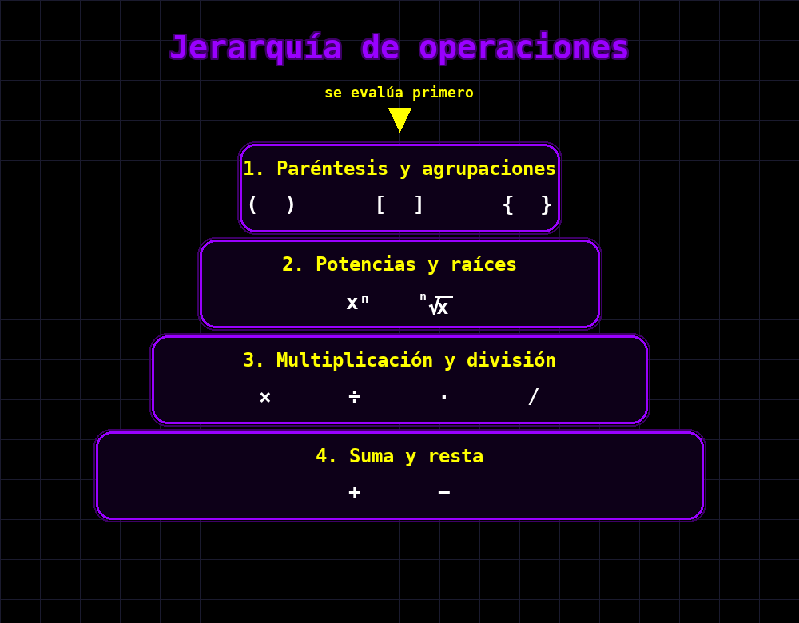

# Ecuaciones: Fundamentos Algebraicos

En esta clase se estudian las herramientas algebraicas fundamentales para resolver ecuaciones: jerarquía de operaciones, manipulación de raíces y logaritmos, y los principales tipos de ecuaciones (lineales, cuadráticas, de grado superior, racionales, sistemas y no lineales), con énfasis en el rigor de las demostraciones y las aplicaciones en ciencias e ingeniería.

## 1. Operaciones combinadas y jerarquía

### 1.1 Jerarquía de operaciones (Orden de evaluación)

Cuando evaluamos expresiones matemáticas con múltiples operaciones, seguimos un **orden de precedencia** estricto para evitar ambigüedades.

**Definición 1.1 (Jerarquía de operaciones):**
El orden de evaluación de operaciones es:

1. **Paréntesis y agrupaciones**: $( )$, $[ ]$, $\{ \}$
2. **Potencias y raíces**: $x^n$, $\sqrt[n]{x}$
3. **Multiplicación y división**: $\times$, $\div$, $\cdot$, $/$ (de izquierda a derecha)
4. **Suma y resta**: $+$, $-$ (de izquierda a derecha)

**Mnemotecnia:** PEMDAS (Paréntesis, Exponentes, Multiplicación/División, Adición/Sustracción)

**Ejemplo 1.1 (Evaluación paso a paso):**

Evaluemos: $5 + 3 \times 2^2 - (8 \div 4)$

$$\begin{align}
5 + 3 \times 2^2 - (8 \div 4) &= 5 + 3 \times 2^2 - 2 \quad \text{(paréntesis primero)} \\
&= 5 + 3 \times 4 - 2 \quad \text{(exponentes)} \\
&= 5 + 12 - 2 \quad \text{(multiplicación)} \\
&= 17 - 2 \quad \text{(suma de izq. a der.)} \\
&= 15
\end{align}$$

**Ejemplo 1.2 (Caso ambiguo sin paréntesis):**

La expresión $6 \div 2(1 + 2)$ es ambigua y genera controversia. Dos interpretaciones:

**Interpretación A** (división primero):
$$6 \div 2 \times (1 + 2) = 3 \times 3 = 9$$

**Interpretación B** (multiplicación implícita tiene prioridad):
$$6 \div [2(1 + 2)] = 6 \div 6 = 1$$

**Recomendación:** Siempre usar **paréntesis explícitos** para evitar ambigüedad. Escribir:
- $\frac{6}{2}(1+2) = 9$ o
- $\frac{6}{2(1+2)} = 1$

El siguiente diagrama muestra la jerarquía de operaciones en forma de pirámide: la cúspide (paréntesis) se evalúa primero y la base (suma y resta) al final.

---

## 2. Manipulación de exponentes

Antes de trabajar con raíces y logaritmos conviene repasar las reglas básicas de los exponentes, que se usarán continuamente a lo largo de la clase.

**Definición 2.1 (Exponente entero):**
Para $a \in \mathbb{R}$, $a \neq 0$, y $n \in \mathbb{N}$:
$$a^n = \underbrace{a \cdot a \cdots a}_{n \text{ veces}}, \qquad a^0 = 1, \qquad a^{-n} = \frac{1}{a^n}.$$

**Propiedades de los exponentes:**
Para $a, b \in \mathbb{R}$, $a, b \neq 0$, y $m, n \in \mathbb{Z}$:

1. **Producto de misma base:** $a^m \cdot a^n = a^{m+n}$.
2. **Cociente de misma base:** $\dfrac{a^m}{a^n} = a^{m-n}$.
3. **Potencia de potencia:** $(a^m)^n = a^{mn}$.
4. **Producto de distinta base:** $(ab)^n = a^n b^n$.
5. **Cociente de distinta base:** $\left(\dfrac{a}{b}\right)^n = \dfrac{a^n}{b^n}$.
6. **Exponente fraccionario:** $a^{1/n} = \sqrt[n]{a}$ y, en general, $a^{m/n} = \sqrt[n]{a^m} = \left(\sqrt[n]{a}\right)^m$.

**Demostración:**
Las propiedades 1–5 se siguen por inducción sobre el exponente y la definición de potencia entera; la propiedad 6 conecta con la raíz $n$-ésima y se justifica por la unicidad de la raíz principal (Definición 4.1). $\blacksquare$

**Ejemplo 2.1 (Manipulación de exponentes):**

a) Simplifique $2^3 \cdot 2^5$:
$$2^3 \cdot 2^5 = 2^{3+5} = 2^8 = 256.$$

b) Simplifique $\dfrac{x^{7}}{x^{3}}$ (con $x \neq 0$):
$$\frac{x^{7}}{x^{3}} = x^{7-3} = x^{4}.$$

c) Evalúe $\left(\dfrac{2}{3}\right)^{-2}$:
$$\left(\frac{2}{3}\right)^{-2} = \left(\frac{3}{2}\right)^{2} = \frac{9}{4}.$$

d) Reescribir $\sqrt[3]{x^5}$ con exponente fraccionario:
$$\sqrt[3]{x^5} = x^{5/3}.$$

> **Nota:** Estas propiedades se generalizan a exponentes reales arbitrarios, pero su demostración rigurosa requiere la construcción de la función exponencial, que se verá en [[Clase 6 - Funciones Parte 1]]. Aquí se trabajan desde el punto de vista aritmético/algebraico.

---

## 3. Manipulación de raíces

### 3.1 Definición y propiedades básicas

**Definición 2.1 (Raíz n-ésima):**
Sean $a \in \mathbb{R}$ y $n \in \mathbb{N}$, $n \geq 2$. La **raíz n-ésima** de $a$ es el número $b$ tal que:
$$b^n = a$$
Notación: $b = \sqrt[n]{a}$ o $b = a^{1/n}$.

**Dominio:**
- Si $n$ es **par**, se requiere $a \ge 0$ y $b \ge 0$ (raíz principal no negativa).
- Si $n$ es **impar**, $a$ puede ser cualquier número real y $b$ tiene el mismo signo que $a$.

**Casos especiales:**
- $n = 2$: raíz cuadrada, $\sqrt{a}$ (se omite el índice)
- $n = 3$: raíz cúbica, $\sqrt[3]{a}$

**Proposición 2.1 (Propiedades de las raíces):**

Para $a, b \in \mathbb{R}^+$ y $m, n \in \mathbb{N}$:

1. **Producto:** $\sqrt[n]{a} \cdot \sqrt[n]{b} = \sqrt[n]{ab}$
2. **Cociente:** $\frac{\sqrt[n]{a}}{\sqrt[n]{b}} = \sqrt[n]{\frac{a}{b}}$ (si $b \neq 0$)
3. **Potencia:** $\left(\sqrt[n]{a}\right)^m = \sqrt[n]{a^m} = a^{m/n}$
4. **Composición:** $\sqrt[m]{\sqrt[n]{a}} = \sqrt[mn]{a}$
5. **Simplificación:** $\sqrt[n]{a^n} = |a|$ si $n$ es par; $\sqrt[n]{a^n} = a$ si $n$ es impar

**Demostración:**

Por la Definición 2.1, $\sqrt[n]{a}$ es el único número no negativo cuyo $n$-ésimo poder es $a$ (cuando $n$ es par; para $n$ impar se permite $a<0$ y el resultado tiene el mismo signo que $a$).

1. **Producto:** Sea $x = \sqrt[n]{a} \cdot \sqrt[n]{b}$. Entonces $x^n = (\sqrt[n]{a})^n \cdot (\sqrt[n]{b})^n = a \cdot b$. Como $x \ge 0$ y $x^n = ab$, por unicidad $x = \sqrt[n]{ab}$.

2. **Cociente:** Sea $y = \frac{\sqrt[n]{a}}{\sqrt[n]{b}}$. Entonces $y^n = \frac{(\sqrt[n]{a})^n}{(\sqrt[n]{b})^n} = \frac{a}{b}$. Como $y \ge 0$ y $y^n = a/b$, se sigue $y = \sqrt[n]{a/b}$.

3. **Potencia:** Sea $z = \left(\sqrt[n]{a}\right)^m$. Entonces $z^n = \left(\sqrt[n]{a}\right)^{m n} = a^m$. Como $z \ge 0$ y $z^n = a^m$, se sigue $z = \sqrt[n]{a^m}$. La igualdad con $a^{m/n}$ se deduce de las leyes de exponentes.

4. **Composición:** Sea $w = \sqrt[m]{\sqrt[n]{a}}$. Entonces $w^m = \sqrt[n]{a}$, de modo que $(w^m)^n = w^{mn} = a$. Como $w \ge 0$ y $w^{mn} = a$, se sigue $w = \sqrt[mn]{a}$.

5. **Simplificación:** Si $n$ es **par**, entonces $a^n = |a|^n$, de modo que $\sqrt[n]{a^n} = \sqrt[n]{|a|^n} = |a|$ (raíz principal no negativa). Si $n$ es **impar**, entonces $a^n$ tiene el mismo signo que $a$, y la única raíz real $n$-ésima de $a^n$ es $a$ mismo, por lo que $\sqrt[n]{a^n} = a$. $\blacksquare$

**Ejemplo 3.1 (Simplificación de raíces):**

a) Simplifique $\sqrt{72}$:
$$\sqrt{72} = \sqrt{36 \times 2} = \sqrt{36} \cdot \sqrt{2} = 6\sqrt{2}$$

b) Simplifique $\sqrt[3]{54}$:
$$\sqrt[3]{54} = \sqrt[3]{27 \times 2} = \sqrt[3]{27} \cdot \sqrt[3]{2} = 3\sqrt[3]{2}$$

c) Simplifique $\sqrt{50} + \sqrt{32} - \sqrt{18}$:
$$\sqrt{50} + \sqrt{32} - \sqrt{18} = 5\sqrt{2} + 4\sqrt{2} - 3\sqrt{2} = 6\sqrt{2}$$

### 3.2 Suma y resta de raíces

**Definición 2.2 (Raíces semejantes):**
Dos o más raíces son **semejantes** (o similares) si tienen el mismo índice y el mismo radicando (el número bajo la raíz).

**Proposición 2.2 (Suma y resta de raíces semejantes):**
Para sumar o restar raíces semejantes, se **suman o restan los coeficientes** y se mantiene la raíz común:
$$a\sqrt[n]{c} + b\sqrt[n]{c} = (a + b)\sqrt[n]{c}$$

Esta operación es análoga a sumar términos semejantes en álgebra: $2x + 7x = 9x$.

**Ejemplo 3.2 (Suma de raíces semejantes):**

a) $2\sqrt{5} + 7\sqrt{5} = (2 + 7)\sqrt{5} = 9\sqrt{5}$

b) $8\sqrt{3} - 5\sqrt{3} = (8 - 5)\sqrt{3} = 3\sqrt{3}$

c) $4\sqrt[3]{2} + 6\sqrt[3]{2} - \sqrt[3]{2} = (4 + 6 - 1)\sqrt[3]{2} = 9\sqrt[3]{2}$

**Ejemplo 3.3 (Raíces NO semejantes):**

Las siguientes expresiones **NO** se pueden simplificar combinando términos porque las raíces no son semejantes:

a) $\sqrt{2} + \sqrt{3}$ (diferentes radicandos)

b) $\sqrt{5} + \sqrt[3]{5}$ (diferentes índices)

c) $2\sqrt{7} + 3\sqrt{11}$ (diferentes radicandos)

**Ejemplo 3.4 (Simplificación previa para identificar raíces semejantes):**

A veces es necesario **simplificar primero** las raíces para identificar términos semejantes:

$$\sqrt{8} + \sqrt{18} - \sqrt{32}$$

Simplificamos cada raíz:
$$\sqrt{8} = \sqrt{4 \cdot 2} = 2\sqrt{2}$$
$$\sqrt{18} = \sqrt{9 \cdot 2} = 3\sqrt{2}$$
$$\sqrt{32} = \sqrt{16 \cdot 2} = 4\sqrt{2}$$

Ahora todas son semejantes:
$$2\sqrt{2} + 3\sqrt{2} - 4\sqrt{2} = (2 + 3 - 4)\sqrt{2} = \sqrt{2}$$

**Ejemplo 3.5 (Expresión con múltiples raíces diferentes):**

$$5\sqrt{2} + 3\sqrt{3} + 2\sqrt{2} - \sqrt{3}$$

Agrupamos términos semejantes:
$$(5\sqrt{2} + 2\sqrt{2}) + (3\sqrt{3} - \sqrt{3})$$
$$= 7\sqrt{2} + 2\sqrt{3}$$

Esta es la forma más simplificada, ya que $\sqrt{2}$ y $\sqrt{3}$ no son semejantes.

> **Observación importante:** No se puede "distribuir" la raíz sobre sumas:
$$\sqrt{a + b} \neq \sqrt{a} + \sqrt{b}$$

Por ejemplo: $\sqrt{9 + 16} = \sqrt{25} = 5$, pero $\sqrt{9} + \sqrt{16} = 3 + 4 = 7 \neq 5$

### 3.3 Racionalización de denominadores

En el cálculo y la manipulación algebraica formal, es conveniente expresar las fracciones de manera que los radicales no aparezcan en el denominador, para lograr este objetivo se deberán "Subir" los radicales al numerador. Esta convención, denominada **racionalización**, simplifica operaciones posteriores como la suma de fracciones, la derivación, la evaluación numérica y la identificación de formas canónicas.

**Definición 2.3 (Racionalización):**
Es el proceso de **eliminar raíces del denominador** de una fracción, multiplicando por una expresión conveniente.

**Técnica 1: Raíz simple en el denominador**

Para racionalizar $\frac{a}{\sqrt{b}}$, multiplicamos por $\frac{\sqrt{b}}{\sqrt{b}}$:

$$\frac{a}{\sqrt{b}} = \frac{a}{\sqrt{b}} \cdot \frac{\sqrt{b}}{\sqrt{b}} = \frac{a\sqrt{b}}{b}$$

**Ejemplo 3.6:**
$$\frac{5}{\sqrt{3}} = \frac{5\sqrt{3}}{3}$$

**Técnica 2: Binomio con raíz en el denominador**

Para racionalizar $\frac{a}{b + \sqrt{c}}$, usamos el **conjugado** $b - \sqrt{c}$:

$$\frac{a}{b + \sqrt{c}} = \frac{a}{b + \sqrt{c}} \cdot \frac{b - \sqrt{c}}{b - \sqrt{c}} = \frac{a(b - \sqrt{c})}{b^2 - c}$$

**Identidad clave:** $(b + \sqrt{c})(b - \sqrt{c}) = b^2 - c$ (diferencia de cuadrados)

**Ejemplo 3.7:**
$$\frac{1}{2 + \sqrt{3}} = \frac{1}{2 + \sqrt{3}} \cdot \frac{2 - \sqrt{3}}{2 - \sqrt{3}} = \frac{2 - \sqrt{3}}{4 - 3} = 2 - \sqrt{3}$$

**Ejemplo 3.8 (Binomio con dos raíces):**
$$\frac{6}{\sqrt{5} - \sqrt{2}} = \frac{6(\sqrt{5} + \sqrt{2})}{(\sqrt{5} - \sqrt{2})(\sqrt{5} + \sqrt{2})} = \frac{6(\sqrt{5} + \sqrt{2})}{5 - 2} = \frac{6(\sqrt{5} + \sqrt{2})}{3} = 2(\sqrt{5} + \sqrt{2})$$

#### 3.3.1 Racionalización de raíces cúbicas

Cuando el denominador contiene una **raíz cúbica**, necesitamos una técnica diferente porque no podemos usar conjugados (que funcionan solo con raíces cuadradas).

**Técnica 3: Raíz cúbica simple en el denominador**

Para racionalizar $\frac{a}{\sqrt[3]{b}}$, usamos la identidad:
$$\sqrt[3]{b} \cdot \sqrt[3]{b^2} = \sqrt[3]{b^3} = b$$

Por lo tanto, multiplicamos por $\frac{\sqrt[3]{b^2}}{\sqrt[3]{b^2}}$:

$$\frac{a}{\sqrt[3]{b}} = \frac{a}{\sqrt[3]{b}} \cdot \frac{\sqrt[3]{b^2}}{\sqrt[3]{b^2}} = \frac{a\sqrt[3]{b^2}}{b}$$

**Ejemplo 3.9:**
Racionalice $\frac{5}{\sqrt[3]{4}}$:

$$\begin{align}
\frac{5}{\sqrt[3]{4}} &= \frac{5}{\sqrt[3]{4}} \cdot \frac{\sqrt[3]{4^2}}{\sqrt[3]{4^2}} \
&= \frac{5\sqrt[3]{16}}{\sqrt[3]{4^3}} \
&= \frac{5\sqrt[3]{16}}{4}
\end{align}$$

**Ejemplo 3.10:**
Racionalice $\frac{3}{\sqrt[3]{9}}$:

Nota: $\sqrt[3]{9} = \sqrt[3]{3^2}$, entonces necesitamos $\sqrt[3]{3}$ para completar el cubo:

$$\begin{align}
\frac{3}{\sqrt[3]{9}} &= \frac{3}{\sqrt[3]{3^2}} \cdot \frac{\sqrt[3]{3}}{\sqrt[3]{3}} \
&= \frac{3\sqrt[3]{3}}{\sqrt[3]{3^3}} \
&= \frac{3\sqrt[3]{3}}{3} \
&= \sqrt[3]{3}
\end{align}$$

**Técnica 4: Raíz cúbica con coeficiente en el denominador**

Para $\frac{a}{c\sqrt[3]{b}}$, multiplicamos por $\frac{\sqrt[3]{b^2}}{\sqrt[3]{b^2}}$:

$$\frac{a}{c\sqrt[3]{b}} = \frac{a\sqrt[3]{b^2}}{cb}$$

**Ejemplo 3.11:**
**Ejemplo 3.12:**
Racionalice $\frac{12}{2\sqrt[3]{5}}$:

$$\begin{align}
\frac{12}{2\sqrt[3]{5}} &= \frac{12}{2\sqrt[3]{5}} \cdot \frac{\sqrt[3]{5^2}}{\sqrt[3]{5^2}} \
&= \frac{12\sqrt[3]{25}}{2 \cdot 5} \
&= \frac{12\sqrt[3]{25}}{10} \
&= \frac{6\sqrt[3]{25}}{5}
\end{align}$$

**Técnica 5: Expresión de la forma $\sqrt[3]{a} + \sqrt[3]{b}$ en el denominador**

Esta situación es **más compleja**. Usamos la identidad algebraica:
$$(x + y)(x^2 - xy + y^2) = x^3 + y^3$$

Si $x = \sqrt[3]{a}$ y $y = \sqrt[3]{b}$, entonces:
$$(\sqrt[3]{a} + \sqrt[3]{b})\left((\sqrt[3]{a})^2 - \sqrt[3]{a}\sqrt[3]{b} + (\sqrt[3]{b})^2\right) = a + b$$

Por lo tanto, multiplicamos por:
$$\frac{\sqrt[3]{a^2} - \sqrt[3]{ab} + \sqrt[3]{b^2}}{\sqrt[3]{a^2} - \sqrt[3]{ab} + \sqrt[3]{b^2}}$$

**Ejemplo 3.13:**
Racionalice $\frac{1}{\sqrt[3]{2} + \sqrt[3]{3}}$:

El factor racionalizante es:
$$\sqrt[3]{2^2} - \sqrt[3]{2 \cdot 3} + \sqrt[3]{3^2} = \sqrt[3]{4} - \sqrt[3]{6} + \sqrt[3]{9}$$

$$\begin{align}
\frac{1}{\sqrt[3]{2} + \sqrt[3]{3}} &= \frac{1}{\sqrt[3]{2} + \sqrt[3]{3}} \cdot \frac{\sqrt[3]{4} - \sqrt[3]{6} + \sqrt[3]{9}}{\sqrt[3]{4} - \sqrt[3]{6} + \sqrt[3]{9}} \
&= \frac{\sqrt[3]{4} - \sqrt[3]{6} + \sqrt[3]{9}}{(\sqrt[3]{2})^3 + (\sqrt[3]{3})^3} \
&= \frac{\sqrt[3]{4} - \sqrt[3]{6} + \sqrt[3]{9}}{2 + 3} \
&= \frac{\sqrt[3]{4} - \sqrt[3]{6} + \sqrt[3]{9}}{5}
\end{align}$$

**Tabla resumen de racionalización:**

| Tipo de denominador | Factor racionalizante | Identidad usada |
|:---------------------|:----------------------|:----------------|
| $\sqrt{a}$ | $\sqrt{a}$ | $\sqrt{a} \cdot \sqrt{a} = a$ |
| $\sqrt[3]{a}$ | $\sqrt[3]{a^2}$ | $\sqrt[3]{a} \cdot \sqrt[3]{a^2} = a$ |
| $b + \sqrt{c}$ | $b - \sqrt{c}$ | $(b+\sqrt{c})(b-\sqrt{c}) = b^2 - c$ |
| $\sqrt[3]{a} + \sqrt[3]{b}$ | $\sqrt[3]{a^2} - \sqrt[3]{ab} + \sqrt[3]{b^2}$ | $(x+y)(x^2-xy+y^2) = x^3+y^3$ |

**Proposición 2.6 (Generalización para raíz n-ésima):**
Para racionalizar $\frac{1}{\sqrt[n]{a}}$, multiplicamos por $\frac{\sqrt[n]{a^{n-1}}}{\sqrt[n]{a^{n-1}}}$:

$$\frac{1}{\sqrt[n]{a}} = \frac{\sqrt[n]{a^{n-1}}}{a}$$

**Ejemplo 3.14:**
Para racionalizar $\frac{1}{\sqrt[4]{3}}$, necesitamos $\sqrt[4]{3^3}$:

$$\frac{1}{\sqrt[4]{3}} = \frac{1}{\sqrt[4]{3}} \cdot \frac{\sqrt[4]{3^3}}{\sqrt[4]{3^3}} = \frac{\sqrt[4]{27}}{3}$$
Como $\sqrt[4]{3} = 3^{1/4}$ tenemos que completar la fracción: $$1/4 + 3/4 = 1 \to 3^{1/4} \cdot 3^{3/4} = 3^{1/4+3/4} = 3^{4/4} = 3$$ 
### 3.4 Valor absoluto y raíces

#### 3.4.1 Relación entre valor absoluto y raíz cuadrada

**Proposición 2.4 (Identidad fundamental):**
Para todo $a \in \mathbb{R}$:
$$|a| = \sqrt{a^2}$$

**Demostración:**
El valor absoluto $|a|$ se define como:
$$|a| = \begin{cases}
a & \text{si } a \geq 0 \
-a & \text{si } a < 0
\end{cases}$$

Por otro lado, $\sqrt{a^2}$ es el número no negativo cuyo cuadrado es $a^2$:

- Si $a \geq 0$: $\sqrt{a^2} = a = |a|$
- Si $a < 0$: $\sqrt{a^2} = -a = |a|$ (porque $(-a)^2 = a^2$ y $-a > 0$)

En ambos casos, $\sqrt{a^2} = |a|$. $\square$

**Ejemplo 3.15 (Valor absoluto como raíz):**

a) $|3| = \sqrt{3^2} = \sqrt{9} = 3$

b) $|-5| = \sqrt{(-5)^2} = \sqrt{25} = 5$

c) $|x - 2| = \sqrt{(x-2)^2}$

**Corolario 2.1:**
Para todo $n \in \mathbb{N}$ par:
$$\sqrt[n]{a^n} = |a|$$

Para $n$ impar:
$$\sqrt[n]{a^n} = a$$

**Ejemplo 3.16:**

- $\sqrt[4]{(-2)^4} = \sqrt[4]{16} = 2 = |-2|$ (exponente par)
- $\sqrt[3]{(-2)^3} = \sqrt[3]{-8} = -2$ (exponente impar)

#### 3.4.2 Precauciones al aplicar raíces en ecuaciones (complemento sección 7)

> **Advertencia crítica:** Al **elevar ambos lados** de una ecuación a una potencia par (especialmente al cuadrado), o al **extraer raíces pares**, pueden **introducirse soluciones extrañas** (falsas) que **no satisfacen** la ecuación original.

**Proposición 2.5 (Implicación unidireccional):**
Si $a = b$, entonces $a^2 = b^2$.

**Pero el recíproco NO es cierto:** Si $a^2 = b^2$, entonces $a = b$ **o** $a = -b$.

**Principio fundamental:**
$$x^2 = c \quad \Rightarrow \quad x = \pm\sqrt{c}$$

**Ejemplo 3.17 (Soluciones extrañas al elevar al cuadrado):**

Resuelva: $\sqrt{x} = -2$

**Solución incorrecta (sin verificar):**
Elevamos al cuadrado ambos lados:
$$(\sqrt{x})^2 = (-2)^2$$
$$x = 4$$

**Verificación:**
$$\sqrt{4} = 2 \neq -2 \quad \text{¡FALSO!}$$

**Conclusión:** La ecuación $\sqrt{x} = -2$ **no tiene solución** en $\mathbb{R}$ porque $\sqrt{x} \geq 0$ por definición.

La "solución" $x = 4$ es **extraña** (introducida al elevar al cuadrado).

**Ejemplo 3.18 (Caso con solución válida y otra extraña):**

Resuelva: $\sqrt{x + 3} = x - 3$

**Paso 1:** Elevamos al cuadrado:
$$(\sqrt{x + 3})^2 = (x - 3)^2$$
$$x + 3 = x^2 - 6x + 9$$
$$0 = x^2 - 7x + 6$$

**Paso 2:** Factorizamos:
$$0 = (x - 1)(x - 6)$$
$$x = 1 \quad \text{o} \quad x = 6$$

**Paso 3:** VERIFICACIÓN (OBLIGATORIA):

Para $x = 1$:
$$\sqrt{1 + 3} = \sqrt{4} = 2$$
$$x - 3 = 1 - 3 = -2$$
$$2 \neq -2 \quad \text{¡FALSO! Solución extraña}$$

Para $x = 6$:
$$\sqrt{6 + 3} = \sqrt{9} = 3$$
$$x - 3 = 6 - 3 = 3$$
$$3 = 3 \quad \checkmark \text{ VÁLIDA}$$

**Solución:** $x = 6$ únicamente.

**Ejemplo 3.19 (Ecuación con dos raíces):**

Resuelva: $\sqrt{x} + \sqrt{x - 5} = 5$

**Paso 1:** Aislamos una raíz:
$$\sqrt{x} = 5 - \sqrt{x - 5}$$

**Paso 2:** Elevamos al cuadrado:
$$x = 25 - 10\sqrt{x - 5} + (x - 5)$$
$$x = 20 + x - 10\sqrt{x - 5}$$
$$10\sqrt{x - 5} = 20$$
$$\sqrt{x - 5} = 2$$

**Paso 3:** Elevamos al cuadrado nuevamente:
$$x - 5 = 4$$
$$x = 9$$

**Paso 4:** Verificación:
$$\sqrt{9} + \sqrt{9 - 5} = 3 + \sqrt{4} = 3 + 2 = 5 \quad \checkmark$$

**Solución:** $x = 9$

**Reglas de seguridad al resolver ecuaciones con raíces:**

1. **Dominio:** Verificar que las expresiones bajo raíces pares sean no negativas
2. **Elevación al cuadrado:** Al elevar al cuadrado, anotar que pueden introducirse soluciones extrañas
3. **Verificación obligatoria:** SIEMPRE sustituir las soluciones candidatas en la ecuación original
4. **Descarte:** Eliminar las soluciones que no satisfacen la ecuación original

**Ejemplo 3.20 (Restricciones de dominio):**

Para resolver $\sqrt{x - 2} + \sqrt{4 - x} = 3$, primero establecemos:

**Dominio:**
- $x - 2 \geq 0 \Rightarrow x \geq 2$
- $4 - x \geq 0 \Rightarrow x \leq 4$

Por lo tanto: $x \in [2, 4]$

Cualquier solución fuera de este intervalo debe descartarse automáticamente.

**Tabla resumen de precauciones:**

| Operación | Peligro | Prevención |
|:----------|:--------|:-----------|
| Elevar al cuadrado | Soluciones extrañas | Verificar en ecuación original |
| Extraer raíz par | Olvidar $\pm$ | Considerar ambos signos cuando sea apropiado |
| Raíz de expresión | Dominio incorrecto | Establecer condiciones $\geq 0$ |
| Simplificar $\sqrt{x^2}$ | Asumir que es $x$ | Recordar que es $\|x\|$ |

**Observación filosófica:** La necesidad de verificación surge porque las operaciones como elevar al cuadrado **no son inyectivas**: distintos valores pueden dar el mismo resultado ($2^2 = (-2)^2 = 4$). Por eso, al "deshacer" estas operaciones, recuperamos múltiples candidatos, no todos válidos.

---

## 4. Manipulación de logaritmos

### 4.1 Definición y propiedades

**Definición 4.1 (Logaritmo):**
Sea $a > 0$, $a \neq 1$ y $b > 0$. El **logaritmo en base $a$ de $b$** es el exponente al cual hay que elevar $a$ para obtener $b$:
$$\log_a(b) = x \quad \Leftrightarrow \quad a^x = b$$

**Casos especiales:**
- **Logaritmo natural:** $\ln(x) = \log_e(x)$ (base $e \approx 2.71828$)
- **Logaritmo decimal:** $\log(x) = \log_{10}(x)$ (base 10)
- **Logaritmo binario:** $\log_2(x)$ (base 2, usado en computación)

**Proposición 3.1 (Propiedades de los logaritmos):**

Para $a, b, c > 0$ con $a \neq 1$:

1. **Logaritmo del producto:** $\log_a(bc) = \log_a(b) + \log_a(c)$
2. **Logaritmo del cociente:** $\log_a\left(\frac{b}{c}\right) = \log_a(b) - \log_a(c)$
3. **Logaritmo de una potencia:** $\log_a(b^c) = c \cdot \log_a(b)$
4. **Cambio de base:** $\log_a(b) = \frac{\log_c(b)}{\log_c(a)}$
5. **Identidades fundamentales:** 
   - $\log_a(a) = 1$
   - $\log_a(1) = 0$
   - $a^{\log_a(b)} = b$
   - $\log_a(a^b) = b$

**Ejemplo 4.1 (Aplicación de propiedades):**

Simplifique: $\log_2(8) + \log_2(16) - \log_2(4)$

$$\begin{align}
\log_2(8) + \log_2(16) - \log_2(4) &= \log_2\left(\frac{8 \cdot 16}{4}\right) \quad \text{(propiedad 1 y 2)} \
&= \log_2(32) \
&= \log_2(2^5) \
&= 5 \quad \text{(propiedad 3)}
\end{align}$$

**Ejemplo 4.2 (Cambio de base):**

Exprese $\log_3(10)$ en términos de logaritmos naturales:

$$\log_3(10) = \frac{\ln(10)}{\ln(3)}$$

---

## 5. Ecuaciones lineales 

### 5.1 Variables y ecuaciones: Conceptos fundamentales

Antes de estudiar ecuaciones, debemos entender qué es una variable y cómo se relaciona con las ecuaciones.

**Definición 5.1 (Variable):**
Una **variable** es un símbolo (comúnmente una letra como $x$, $y$, $t$, etc.) que representa un valor **desconocido** o que puede **variar** dentro de un conjunto determinado.

**Características de una variable:**
- Representa cantidades que no conocemos o que pueden cambiar
- Actúa como un "contenedor" que puede tomar diferentes valores
- Su dominio es el conjunto de valores que puede asumir (típicamente $\mathbb{R}$ en este curso)

**Ejemplo 5.1 (Variables en diferentes contextos):**

a) **En geometría:** "Sea $r$ el radio de un círculo" → $r$ es una variable que representa una longitud
b) **En física:** "Sea $t$ el tiempo transcurrido" → $t$ es una variable que representa tiempo
c) **En álgebra:** "Encuentre el valor de $x$ tal que $2x + 5 = 11$" → $x$ es la incógnita (variable a determinar)

**Definición 5.2 (Constante):**
Una **constante** es un valor **fijo** que no cambia. Se representa con números o letras específicas (como $a$, $b$, $c$ cuando representan coeficientes conocidos).

**Ejemplo 5.2:**
En la expresión $3x + 7$:
- $x$ es la **variable** (puede tomar diferentes valores)
- $3$ y $7$ son **constantes** (valores fijos)

**Definición 5.3 (Ecuación):**
Una **ecuación** es una igualdad que contiene una o más variables, y que es **verdadera solo para ciertos valores** de dichas variables.

**Componentes de una ecuación:**
- **Miembro izquierdo:** Expresión a la izquierda del signo $=$
- **Miembro derecho:** Expresión a la derecha del signo $=$
- **Solución:** Valor(es) de la variable que hacen verdadera la ecuación
- **Resolver:** Proceso de encontrar todas las soluciones

**Ejemplo 5.3:**
En la ecuación $2x + 3 = 11$:
- Miembro izquierdo: $2x + 3$
- Miembro derecho: $11$
- Variable: $x$
- Solución: $x = 4$ (porque $2(4) + 3 = 11$)

**Definición 5.4 (Identidad vs. Ecuación condicional):**

Una **identidad** es una igualdad verdadera para **todos** los valores de la variable:
$$x + x = 2x \quad \text{(verdadero para todo } x \in \mathbb{R}\text{)}$$

Una **ecuación condicional** es verdadera solo para **ciertos valores específicos**:
$$x + 3 = 7 \quad \text{(solo verdadero para } x = 4\text{)}$$

**Notación:** 
- Usamos $=$ para ecuaciones condicionales: $x^2 + 1 = 10$
- Usamos $\equiv$ o $=$ para identidades: $\sin^2(x) + \cos^2(x) \equiv 1$

### 5.2 Definición y forma general

**Definición 5.5 (Ecuación lineal):**
Una **ecuación lineal** en una variable $x$ es una ecuación de la forma:
$$ax + b = 0$$
donde $a, b \in \mathbb{R}$ y $a \neq 0$.

La que llamaremos su forma general. Se pueden presentar ecuaciones lineales con mas términos como por ejemplo:
$$ax + b = cx + d$$
donde $a, b, c, d \in \mathbb{R}$ y $a \neq c$.
Pero todas estas ecuaciones se puede reducirse a su forma general agrupando términos.

### 5.3 Resolución de ecuaciones lineales

**Teorema 5.1 (Solución de la ecuación lineal):**
Toda ecuación lineal de la forma $ax + b = 0$ (con $a \neq 0$) tiene una **única solución** dada por:
$$x = -\frac{b}{a}$$

**Demostración:**
Partimos de:
$$ax + b = 0$$

Restamos $b$ de ambos lados:
$$ax = -b$$

Dividimos por $a$ (válido pues $a \neq 0$):
$$x = -\frac{b}{a}$$

$\square$

> **Observación:** Esta fórmula nos dice que:
- Toda ecuación lineal tiene **exactamente una solución** (es **compatible determinada**)
- La solución depende únicamente de los coeficientes $a$ y $b$
- El proceso de resolución consiste en transformar cualquier ecuación lineal a la forma estándar $ax + b = 0$

**Método de resolución general:**

1. **Agrupar términos:** Llevar todos los términos con $x$ a un lado y las constantes al otro
2. **Forma estándar:** Reducir a la forma $ax + b = 0$
3. **Aplicar la fórmula:** $x = -\frac{b}{a}$

Alternativamente, el método paso a paso es:
1. **Agrupar términos:** Llevar todos los términos con $x$ a un lado y las constantes al otro
2. **Factorizar:** Factorizar $x$ si es necesario
3. **Despejar:** Dividir por el coeficiente de $x$

**Ejemplo 5.4:**
$$3x + 5 = 2x - 7$$
$$3x - 2x = -7 - 5$$
$$x = -12$$

**Verificación:**
$$3(-12) + 5 = -36 + 5 = -31$$
$$2(-12) - 7 = -24 - 7 = -31 \quad \checkmark$$

**Ejemplo 5.5 (Con fracciones):**
$$\frac{x}{3} + \frac{2x}{5} = 4$$

Multiplicamos por el mínimo común múltiplo de 3 y 5 (que es 15):
$$15 \cdot \frac{x}{3} + 15 \cdot \frac{2x}{5} = 15 \cdot 4$$
$$5x + 6x = 60$$
$$11x = 60$$
$$x = \frac{60}{11}$$

### 5.4 Casos especiales

**Caso 1: Infinitas soluciones (identidad)**
$$2x + 3 = 2x + 3$$
$$0 = 0 \quad \text{(verdadero para todo } x \in \mathbb{R}\text{)}$$
**Solución:** $x \in \mathbb{R}$ (infinitas soluciones)

**Caso 2: Sin solución (contradicción)**
$$x + 2 = x + 5$$
$$2 = 5 \quad \text{(falso)}$$
**Solución:** $\emptyset$ (conjunto vacío, sin solución)

---

## 6. Ecuaciones cuadráticas

### 6.1 Definición y forma general

**Definición 6.1 (Ecuación cuadrática):**
Una **ecuación cuadrática** (o de segundo grado) en la variable $x$ es una ecuación de la forma:
$$ax^2 + bx + c = 0$$
donde $a, b, c \in \mathbb{R}$ y $a \neq 0$.
Igualmente que con las ecuaciones de primer grado, se pueden tener una ecuación con una estructura diferente pero siempre se podrá reducir a su forma general

**Terminología:**
- $a$: coeficiente cuadrático (o líder)
- $b$: coeficiente lineal
- $c$: término independiente (o constante)

### 6.2 Factorización

Cuando es posible factorizar la ecuación cuadrática, podemos resolver usando el **principio del producto cero**.

**Proposición 5.1 (Principio del producto cero):**
$$ab = 0 \quad \Leftrightarrow \quad a = 0 \text{ o } b = 0$$

**Ejemplo 6.1 (Factorización directa):**
$$x^2 - 5x + 6 = 0$$
$$(x - 2)(x - 3) = 0$$
$$x - 2 = 0 \quad \text{o} \quad x - 3 = 0$$
$$x = 2 \quad \text{o} \quad x = 3$$

**Ejemplo 6.2 (Factor común):**
$$3x^2 - 12x = 0$$
$$3x(x - 4) = 0$$
$$x = 0 \quad \text{o} \quad x = 4$$

### 6.3 Productos notables

Los **productos notables** son identidades algebraicas que facilitan la factorización:

**Proposición 5.2 (Productos notables fundamentales):**

1. **Cuadrado de un binomio:**
   - $(a + b)^2 = a^2 + 2ab + b^2$
   - $(a - b)^2 = a^2 - 2ab + b^2$

2. **Diferencia de cuadrados:**
   - $(a + b)(a - b) = a^2 - b^2$

3. **Cubo de un binomio:**
   - $(a + b)^3 = a^3 + 3a^2b + 3ab^2 + b^3$
   - $(a - b)^3 = a^3 - 3a^2b + 3ab^2 - b^3$

4. **Suma y diferencia de cubos:**
   - $a^3 + b^3 = (a + b)(a^2 - ab + b^2)$
   - $a^3 - b^3 = (a - b)(a^2 + ab + b^2)$

5. **Trinomio cuadrado perfecto:**
   - $a^2 + 2ab + b^2 = (a + b)^2$
   - $a^2 - 2ab + b^2 = (a - b)^2$

**Ejemplo 6.3 (Uso de diferencia de cuadrados):**
$$x^2 - 25 = 0$$
$$(x + 5)(x - 5) = 0$$
$$x = -5 \quad \text{o} \quad x = 5$$

**Ejemplo 6.4 (Trinomio cuadrado perfecto):**
$$x^2 + 6x + 9 = 0$$
$$(x + 3)^2 = 0$$
$$x = -3 \quad \text{(raíz doble)}$$

### 6.3.1 Técnica de completar el cuadrado

La técnica de **completar el cuadrado** (o completación cuadrática) es un método algebraico fundamental que transforma una expresión cuadrática en un trinomio cuadrado perfecto. Esta técnica es esencial para:
- Derivar la fórmula cuadrática general
- Resolver ecuaciones cuadráticas
- Encontrar la forma canónica de una parábola
- Simplificar integrales en cálculo

**Objetivo:** Transformar $x^2 + bx$ en un cuadrado perfecto $(x + k)^2$ agregando y restando el término apropiado.

**Proposición 5.3 (Fórmula para completar el cuadrado):**
Para convertir $x^2 + bx$ en un trinomio cuadrado perfecto, se debe **sumar y restar** $\left(\frac{b}{2}\right)^2$:

$$x^2 + bx = x^2 + bx + \left(\frac{b}{2}\right)^2 - \left(\frac{b}{2}\right)^2 = \left(x + \frac{b}{2}\right)^2 - \left(\frac{b}{2}\right)^2$$

**Justificación:**
Queremos que $x^2 + bx + k = (x + m)^2$. Expandiendo el lado derecho:
$$(x + m)^2 = x^2 + 2mx + m^2$$

Comparando coeficientes:
- Coeficiente de $x$: $b = 2m \Rightarrow m = \frac{b}{2}$
- Término constante: $k = m^2 = \left(\frac{b}{2}\right)^2$

Por lo tanto, el término que completa el cuadrado es **la mitad del coeficiente lineal, elevada al cuadrado**.

**Receta práctica:**
1. Identificar el coeficiente $b$ del término lineal en $x^2 + bx$
2. Calcular $\left(\frac{b}{2}\right)^2$
3. Sumar y restar este valor (para mantener la igualdad)
4. Factorizar el trinomio cuadrado perfecto: $\left(x + \frac{b}{2}\right)^2$

**Ejemplo 6.5 (Completar el cuadrado: caso básico):**

Completar el cuadrado para $x^2 + 8x$:

**Paso 1:** Identificar $b = 8$

**Paso 2:** Calcular $\left(\frac{b}{2}\right)^2 = \left(\frac{8}{2}\right)^2 = 4^2 = 16$

**Paso 3:** Sumar y restar 16:
$$x^2 + 8x = x^2 + 8x + 16 - 16$$

**Paso 4:** Factorizar:
$$= (x + 4)^2 - 16$$

**Verificación:** $(x + 4)^2 - 16 = x^2 + 8x + 16 - 16 = x^2 + 8x$ ✓

**Ejemplo 6.6 (Completar el cuadrado: coeficiente negativo):**

Completar el cuadrado para $x^2 - 10x$:

$$\left(\frac{-10}{2}\right)^2 = (-5)^2 = 25$$

$$x^2 - 10x = (x - 5)^2 - 25$$

**Verificación:** $(x - 5)^2 - 25 = x^2 - 10x + 25 - 25 = x^2 - 10x$ ✓

**Ejemplo 6.7 (Completar el cuadrado: coeficiente fraccionario):**

Completar el cuadrado para $x^2 + 3x$:

$$\left(\frac{3}{2}\right)^2 = \frac{9}{4}$$

$$x^2 + 3x = \left(x + \frac{3}{2}\right)^2 - \frac{9}{4}$$

**Ejemplo 6.8 (Resolver ecuación completando el cuadrado):**

Resuelva $x^2 + 6x - 7 = 0$ completando el cuadrado:

**Paso 1:** Mover la constante al otro lado:
$$x^2 + 6x = 7$$

**Paso 2:** Completar el cuadrado en el lado izquierdo:
$$\left(\frac{6}{2}\right)^2 = 9$$

Sumamos 9 a ambos lados:
$$x^2 + 6x + 9 = 7 + 9$$

**Paso 3:** Factorizar el lado izquierdo:
$$(x + 3)^2 = 16$$

**Paso 4:** Tomar raíz cuadrada:
$$x + 3 = \pm 4$$

**Paso 5:** Resolver:
$$x = -3 + 4 = 1 \quad \text{o} \quad x = -3 - 4 = -7$$

**Soluciones:** $x = 1$ o $x = -7$

**Ejemplo 6.9 (Expresión cuadrática general con $a \neq 1$):**

Completar el cuadrado para $3x^2 + 12x + 5$:

**Paso 1:** Factorizar el coeficiente cuadrático:
$$3x^2 + 12x + 5 = 3(x^2 + 4x) + 5$$

**Paso 2:** Completar el cuadrado dentro del paréntesis:
$$\left(\frac{4}{2}\right)^2 = 4$$

$$= 3(x^2 + 4x + 4 - 4) + 5$$
$$= 3[(x + 2)^2 - 4] + 5$$
$$= 3(x + 2)^2 - 12 + 5$$
$$= 3(x + 2)^2 - 7$$

**Forma canónica:** $3(x + 2)^2 - 7$

Esta forma revela que la parábola tiene:
- Vértice en $(-2, -7)$
- Abre hacia arriba (coeficiente positivo)

**Aplicación en geometría analítica:**

La forma $a(x - h)^2 + k$ es la **forma canónica** o **forma vértice** de una parábola, donde $(h, k)$ es el vértice.

**Tabla resumen:**

| Expresión original | Término a agregar | Completación cuadrática |
|:------------------:|:-----------------:|:-----------------------:|
| $x^2 + 6x$ | $9$ | $(x + 3)^2 - 9$ |
| $x^2 - 8x$ | $16$ | $(x - 4)^2 - 16$ |
| $x^2 + 5x$ | $\frac{25}{4}$ | $\left(x + \frac{5}{2}\right)^2 - \frac{25}{4}$ |
| $x^2 - x$ | $\frac{1}{4}$ | $\left(x - \frac{1}{2}\right)^2 - \frac{1}{4}$ |

> **Observación:** Esta técnica se generaliza en el método de la demostración de la fórmula cuadrática (ver sección 5.4).

### 6.4 Fórmula general (cuadrática)

**Teorema 6.1 (Fórmula cuadrática):**
Las soluciones de la ecuación $ax^2 + bx + c = 0$ (con $a \neq 0$) están dadas por:
$$x = \frac{-b \pm \sqrt{b^2 - 4ac}}{2a}$$

**Demostración (Completar el cuadrado):**

Partimos de:
$$ax^2 + bx + c = 0$$

Dividimos por $a$ (ya que $a \neq 0$):
$$x^2 + \frac{b}{a}x + \frac{c}{a} = 0$$

Movemos el término constante:
$$x^2 + \frac{b}{a}x = -\frac{c}{a}$$

Completamos el cuadrado sumando $\left(\frac{b}{2a}\right)^2$ a ambos lados:
$$x^2 + \frac{b}{a}x + \left(\frac{b}{2a}\right)^2 = -\frac{c}{a} + \left(\frac{b}{2a}\right)^2$$

El lado izquierdo es un cuadrado perfecto:
$$\left(x + \frac{b}{2a}\right)^2 = -\frac{c}{a} + \frac{b^2}{4a^2}$$

Simplificamos el lado derecho:
$$\left(x + \frac{b}{2a}\right)^2 = \frac{-4ac + b^2}{4a^2} = \frac{b^2 - 4ac}{4a^2}$$

Tomamos raíz cuadrada:
$$x + \frac{b}{2a} = \pm \frac{\sqrt{b^2 - 4ac}}{2a}$$

Despejamos $x$:
$$x = -\frac{b}{2a} \pm \frac{\sqrt{b^2 - 4ac}}{2a} = \frac{-b \pm \sqrt{b^2 - 4ac}}{2a}$$

$\square$

**Definición 6.2 (Discriminante):**
El **discriminante** de la ecuación cuadrática es:
$$\Delta = b^2 - 4ac$$

**Naturaleza de las soluciones:**
- Si $\Delta > 0$: Dos soluciones reales distintas
- Si $\Delta = 0$: Una solución real (raíz doble)
- Si $\Delta < 0$: No hay soluciones reales (dos soluciones complejas conjugadas)

**Ejemplo 6.10:**
Resuelva $2x^2 - 5x - 3 = 0$

Identificamos: $a = 2$, $b = -5$, $c = -3$

Calculamos el discriminante:
$$\Delta = (-5)^2 - 4(2)(-3) = 25 + 24 = 49 > 0$$

Como $\Delta > 0$, hay dos soluciones reales:
$$x = \frac{-(-5) \pm \sqrt{49}}{2(2)} = \frac{5 \pm 7}{4}$$

$$x_1 = \frac{5 + 7}{4} = 3, \quad x_2 = \frac{5 - 7}{4} = -\frac{1}{2}$$

**Ejemplo 6.11 (Raíces no exactas):**
Resuelva $x^2 - 4x + 1 = 0$

Identificamos: $a = 1$, $b = -4$, $c = 1$

Calculamos el discriminante:
$$\Delta = (-4)^2 - 4(1)(1) = 16 - 4 = 12 > 0$$

Como $\Delta > 0$ pero no es un cuadrado perfecto, las soluciones son irracionales:
$$x = \frac{-(-4) \pm \sqrt{12}}{2(1)} = \frac{4 \pm \sqrt{12}}{2}$$

Simplificamos $\sqrt{12} = \sqrt{4 \cdot 3} = 2\sqrt{3}$:
$$x = \frac{4 \pm 2\sqrt{3}}{2} = 2 \pm \sqrt{3}$$

$$x_1 = 2 + \sqrt{3} \approx 3.732, \quad x_2 = 2 - \sqrt{3} \approx 0.268$$

**Verificación:** Podemos verificar usando la suma y producto de raíces:
- Suma: $(2 + \sqrt{3}) + (2 - \sqrt{3}) = 4 = -\frac{b}{a}$ ✓
- Producto: $(2 + \sqrt{3})(2 - \sqrt{3}) = 4 - 3 = 1 = \frac{c}{a}$ ✓

### 6.5 Soluciones complejas (Opcional)

Cuando el discriminante es negativo ($\Delta < 0$), la ecuación cuadrática no tiene soluciones reales, pero sí tiene **dos soluciones complejas conjugadas**.

**Definición 6.3 (Número complejo):**
Un **número complejo** es de la forma $z = a + bi$, donde:
- $a \in \mathbb{R}$ es la **parte real**
- $b \in \mathbb{R}$ es la **parte imaginaria**
- $i$ es la **unidad imaginaria**, definida por $i^2 = -1$

*Los números complejos se introducirán con mayor detalle en el curso de Algebra y se estudiaran a profundidad en el curso de Variable Compleja*

**Propiedades de $i$:**
$$i = \sqrt{-1}, \quad i^2 = -1, \quad i^3 = -i, \quad i^4 = 1$$

**Raíz cuadrada de números negativos:**
Para $a > 0$:
$$\sqrt{-a} = i\sqrt{a}$$

**Conjugado complejo:**
Si $z = a + bi$, su conjugado es $\overline{z} = a - bi$

**Teorema 6.2 (Soluciones complejas de ecuaciones cuadráticas):**
Si $\Delta = b^2 - 4ac < 0$, entonces las soluciones de $ax^2 + bx + c = 0$ son:
$$x = \frac{-b \pm i\sqrt{|\Delta|}}{2a} = \frac{-b \pm i\sqrt{4ac - b^2}}{2a}$$

Estas soluciones son **complejas conjugadas**.

**Ejemplo 6.12 (Discriminante negativo):**
Resuelva $x^2 + 2x + 5 = 0$

Identificamos: $a = 1$, $b = 2$, $c = 5$

Calculamos el discriminante:
$$\Delta = 2^2 - 4(1)(5) = 4 - 20 = -16 < 0$$

Como $\Delta < 0$, las soluciones son complejas:
$$x = \frac{-2 \pm \sqrt{-16}}{2(1)} = \frac{-2 \pm i\sqrt{16}}{2} = \frac{-2 \pm 4i}{2}$$

$$x_1 = -1 + 2i, \quad x_2 = -1 - 2i$$

**Verificación:** Sustituimos $x = -1 + 2i$:
$$\begin{align}
x^2 + 2x + 5 &= (-1 + 2i)^2 + 2(-1 + 2i) + 5 \
&= (1 - 4i + 4i^2) + (-2 + 4i) + 5 \
&= (1 - 4i - 4) + (-2 + 4i) + 5 \
&= -3 - 4i - 2 + 4i + 5 \
&= 0 \quad ✓
\end{align}$$

**Ejemplo 6.13:**
Resuelva $2x^2 - 3x + 4 = 0$

Identificamos: $a = 2$, $b = -3$, $c = 4$

$$\Delta = (-3)^2 - 4(2)(4) = 9 - 32 = -23 < 0$$

Soluciones complejas:
$$x = \frac{3 \pm \sqrt{-23}}{4} = \frac{3 \pm i\sqrt{23}}{4}$$

$$x_1 = \frac{3 + i\sqrt{23}}{4}, \quad x_2 = \frac{3 - i\sqrt{23}}{4}$$

> **Observación importante:**
- En el conjunto de los **números reales** $\mathbb{R}$, estas ecuaciones **no tienen solución**.
- En el conjunto de los **números complejos** $\mathbb{C}$, toda ecuación cuadrática tiene **exactamente 2 soluciones** (contando las soluciones repetidas o multiplicidad algebraica).
- Las soluciones complejas siempre aparecen en **pares conjugados** cuando los coeficientes son reales.

**Aplicaciones:**
Aunque pueden parecer abstractas, las soluciones complejas son fundamentales en:
- Ingeniería eléctrica (circuitos AC, impedancia)
- Procesamiento de señales (transformadas de Fourier)
- Mecánica cuántica (función de onda)
- Teoría de control (análisis de estabilidad)

### 6.6 Ecuaciones bicuadráticas

**Definición 6.6 (Ecuación bicuadrática):**
Una ecuación **bicuadrática** es una ecuación de cuarto grado que solo contiene potencias pares de $x$:
$$ax^4 + bx^2 + c = 0$$

**Método de resolución:** Sustituir $u = x^2$, resolver la ecuación cuadrática resultante, y luego despejar $x$.

**Ejemplo 6.14:**
$$x^4 - 5x^2 + 4 = 0$$

Sustituimos $u = x^2$:
$$u^2 - 5u + 4 = 0$$

Factorizamos:
$$(u - 1)(u - 4) = 0$$
$$u = 1 \quad \text{o} \quad u = 4$$

Deshacemos la sustitución:
- Si $u = 1$: $x^2 = 1 \Rightarrow x = \pm 1$
- Si $u = 4$: $x^2 = 4 \Rightarrow x = \pm 2$

**Soluciones:** $x \in \{-2, -1, 1, 2\}$

### 6.7 Ecuaciones reducibles a cuadráticas

Algunas ecuaciones pueden transformarse en cuadráticas mediante sustituciones ingeniosas.

**Ejemplo 6.15 (Ecuación exponencial):**
$$25^x + 5^x - 6 = 0$$

Notamos que $25^x = (5^2)^x = (5^x)^2$. Sustituimos $u = 5^x$ (con $u > 0$):
$$u^2 + u - 6 = 0$$

Factorizamos:
$$(u + 3)(u - 2) = 0$$
$$u = -3 \quad \text{o} \quad u = 2$$

Como $u = 5^x > 0$, descartamos $u = -3$. Para $u = 2$:
$$5^x = 2$$
$$x = \log_5(2) = \frac{\ln(2)}{\ln(5)}$$

**Ejemplo 6.16:**
$$x^{2/3} - 5x^{1/3} + 6 = 0$$

Sustituimos $u = x^{1/3}$:
$$u^2 - 5u + 6 = 0$$
$$(u - 2)(u - 3) = 0$$
$$u = 2 \quad \text{o} \quad u = 3$$

Deshacemos:
- Si $u = 2$: $x^{1/3} = 2 \Rightarrow x = 8$
- Si $u = 3$: $x^{1/3} = 3 \Rightarrow x = 27$

---

## 7. Ecuaciones de grado superior

### 7.1 Ecuaciones cúbicas (tercer grado)

**Definición 7.1 (Ecuación cúbica):**
Una ecuación cúbica es de la forma:
$$ax^3 + bx^2 + cx + d = 0$$
donde $a \neq 0$.

> **Nota histórica (Cardano–Tartaglia):**
> Existe una fórmula general para resolver ecuaciones cúbicas, descubierta en el siglo XVI por matemáticos italianos. La fórmula es extremadamente compleja y raramente se usa de forma académica.

> **Las batallas matemáticas del siglo XVI:**
> La resolución de la cúbica fue fruto de una de las rivalidades más célebres de la historia de las matemáticas. En 1535, Niccolò Tartaglia descubrió un método para resolver ecuaciones de la forma $x^3 + mx = n$ (cúbicas “deprimidas”), que mantuvo en secreto. Gerolamo Cardano, tras obtenerlo de Tartaglia bajo un juramento de confidencialidad, lo publicó en 1545 en su obra *Ars Magna*, atribuyendo el mérito a Tartaglia. Poco después, Ludovico Ferrari (discípulo de Cardano) extendió el resultado a las ecuaciones cuárticas. Durante décadas, los métodos fueron guardados celosamente y se transmitieron en forma de versos cifrados entre los algebristas italianos. Más tarde, en el siglo XVIII, la familia **Bernoulli** mantuvo bajo reserva varios resultados algebraicos avanzados, entre ellos variantes de la fórmula cúbica, hasta que finalmente fueron publicados por otros matemáticos europeos, desatando nuevas controversias.

#### 7.1.1 Reducción a la forma deprimida

Toda ecuación cúbica puede reducirse a una forma más sencilla, llamada **forma deprimida** (o reducida), mediante un cambio de variable que elimina el término cuadrático.

**Proposición 7.1 (Reducción a la forma deprimida):**
La sustitución $x = t - \dfrac{b}{3a}$ transforma la ecuación $ax^3 + bx^2 + cx + d = 0$ en:
$$t^3 + Bt - D = 0,$$
donde
$$B = \frac{3ac - b^2}{3a^2}, \qquad D = \frac{2b^3 - 9abc + 27a^2 d}{27a^3}.$$

**Demostración:**
Sustituyendo $x = t - \dfrac{b}{3a}$ en $ax^3 + bx^2 + cx + d$ y desarrollando, los términos en $t^2$ se cancelan exactamente. Se obtiene:
$$a\left(t^3 - \frac{b^3}{27a^3}\right) + c\left(t - \frac{b}{3a}\right) + d = 0,$$
que al reagruparse da $t^3 + Bt - D = 0$ con los coeficientes indicados. $\blacksquare$

**Ejemplo 7.1 (Reducción de una cúbica):**
Reduzca la cúbica $x^3 - 6x^2 + 11x - 6 = 0$ a su forma deprimida.

Con $a = 1$, $b = -6$, $c = 11$, $d = -6$:
$$B = \frac{3(1)(11) - (-6)^2}{3(1)^2} = \frac{33 - 36}{3} = -1,$$
$$D = \frac{2(-6)^3 - 9(1)(-6)(11) + 27(1)^2(-6)}{27(1)^3} = \frac{-432 + 594 - 162}{27} = \frac{0}{27} = 0.$$
Con el cambio $x = t - \dfrac{-6}{3(1)} = t + 2$, la ecuación se reduce a:
$$t^3 - t = 0 \quad \Longrightarrow \quad t(t-1)(t+1) = 0,$$
cuyas raíces son $t = 0, 1, -1$, y por tanto $x = 2, 3, 1$.

**Ejemplo 7.2 (Reducción con coeficientes racionales):**
Reduzca la cúbica $x^3 - 3x + 1 = 0$.

Con $a = 1$, $b = 0$, $c = -3$, $d = 1$:
$$B = \frac{3(1)(-3) - 0^2}{3(1)^2} = \frac{-9}{3} = -3,$$
$$D = \frac{2(0)^3 - 9(1)(0)(-3) + 27(1)^2(1)}{27(1)^3} = \frac{0 + 0 + 27}{27} = 1.$$
Con $x = t$ (ya que $b = 0$), la forma deprimida es:
$$t^3 - 3t + 1 = 0,$$
cuyas tres raíces reales son $\displaystyle t_k = 2\cos\!\left(\frac{1}{3}\arccos\!\left(-\frac{1}{2}\right) - \frac{2\pi k}{3}\right)$, $k = 0,1,2$. Aunque la forma es “limpia”, las raíces son expresiones con radicales anidados y no se simplifican a números racionales.

> **Nota:** En la práctica, las ecuaciones cúbicas se resuelven mediante:
> - Factorización (si es posible encontrar una raíz racional).
> - Métodos numéricos (Newton–Raphson, bisección).
> - Software matemático (Wolfram Alpha, MATLAB, Python).

#### 7.1.2 Factorización de una cúbica

Una ecuación cúbica $ax^3 + bx^2 + cx + d = 0$ con $a \neq 0$ puede factorizarse de dos maneras fundamentales:

1. **Tres raíces reales:** si todas las raíces son reales, el polinomio se descompone completamente como
$$ax^3 + bx^2 + cx + d = a(x - r_1)(x - r_2)(x - r_3).$$

2. **Una raíz real y dos complejas conjugadas:** si solo una raíz es real, la factorización tiene la forma
$$ax^3 + bx^2 + cx + d = a(x - r_1)(x^2 + px + q),$$
donde $x^2 + px + q$ es un trinomio irreducible en $\mathbb{R}$ (con discriminante negativo).

Cuando se conoce al menos una raíz $x = r$, se puede dividir el polinomio entre $(x - r)$ (por **división sintética** o **regla de Ruffini**) para obtener un polinomio de grado 2, que se resuelve con la fórmula cuadrática. Esta es la estrategia de la **factorización por raíz racional** (ver Ejemplo 7.5).

**Factorización por agrupación:**
En algunos casos, el polinomio se puede reordenar y agrupar términos para factorizar sin necesidad de conocer una raíz de antemano. El método consiste en:
1. Reordenar los términos del polinomio.
2. Agruparlos en parejas que tengan un factor común.
3. Factorizar cada grupo.
4. Si los grupos resultantes comparten un factor binomial, se extrae.

**Ejemplo 7.3 (Factorización por agrupación):**
Factorice $x^3 - 6x^2 + 11x - 6$.

Reordenamos y agrupamos:
$$\begin{aligned}
x^3 - 6x^2 + 11x - 6 &= (x^3 - 6x^2) + (11x - 6) \\
&= x^2(x - 6) + 11(x - 6) \\
&= (x - 6)(x^2 + 11).
\end{aligned}$$
Las raíces de esta factorización son $x = 6$ (real) y $x = \pm i\sqrt{11}$ (complejas conjugadas). Este es el caso típico de una cúbica con una raíz real y dos complejas. En general, la agrupación es útil cuando el polinomio tiene una estructura “amigable”; en otros casos se recurre a la raíz racional o a otros métodos.

**Ejemplo 7.4 (Factorización por agrupación con tres raíces reales):**
Factorice $x^3 - x^2 - 4x + 4$.

Agrupamos los términos de forma conveniente:
$$\begin{aligned}
x^3 - x^2 - 4x + 4 &= (x^3 - x^2) + (-4x + 4) \\
&= x^2(x - 1) - 4(x - 1) \\
&= (x - 1)(x^2 - 4) \\
&= (x - 1)(x - 2)(x + 2).
\end{aligned}$$
Las tres raíces son reales: $x = 1$, $x = 2$ y $x = -2$. Este ejemplo ilustra el caso en que la agrupación produce una factorización completa en $\mathbb{R}[x]$ con tres raíces reales, sin necesidad de recurrir a la raíz racional.

**Ejemplo 7.5 (Factorización por raíz racional):**
$$x^3 - 6x^2 + 11x - 6 = 0$$

Probamos divisores de 6: $x = 1$
$$1^3 - 6(1)^2 + 11(1) - 6 = 1 - 6 + 11 - 6 = 0 \quad \checkmark$$

Por tanto, $(x - 1)$ es un factor. Dividimos:
$$x^3 - 6x^2 + 11x - 6 = (x - 1)(x^2 - 5x + 6)$$

Factorizamos el trinomio:
$$= (x - 1)(x - 2)(x - 3)$$

Soluciones: $x = 1, 2, 3$

> **Nota:** El método de **división sintética** (o regla de Ruffini) para dividir entre $(x - r)$ se estudiará con detalle en el curso de **Álgebra**. Aquí se muestra únicamente la idea: encontrar una raíz racional y reducir el problema a uno de menor grado.

#### Fórmula de Cardano–Tartaglia

Aplicada a la forma deprimida $t^3 + Bt - D = 0$, la fórmula es:

$$t = \sqrt[3]{\frac{D}{2} + \sqrt{\left(\frac{D}{2}\right)^2 + \left(\frac{B}{3}\right)^3}} \;+\; \sqrt[3]{\frac{D}{2} - \sqrt{\left(\frac{D}{2}\right)^2 + \left(\frac{B}{3}\right)^3}}.$$

> **Nota:** La fórmula anterior es bastante larga y engorrosa, tiene varias formas de escribirse pero todas son equivalentes. Se incluye únicamente como referencia de que existen tales desarrollos, útiles para calculadora o programación.

#### Fórmula general de la cúbica

Combinando el cambio de variable $x = t - \dfrac{b}{3a}$ con la fórmula deprimida y sustituyendo los valores de $B$ y $D$, se obtiene la **fórmula general** para la ecuación $ax^3 + bx^2 + cx + d = 0$:

$$
\begin{aligned}
x &= \sqrt[3]{-\frac{b^3}{27a^3} + \frac{bc}{6a^2} - \frac{d}{2a} + \sqrt{\left(-\frac{b^3}{27a^3} + \frac{bc}{6a^2} - \frac{d}{2a}\right)^{\!2} + \left(\frac{c}{3a} - \frac{b^2}{9a^2}\right)^{\!3}}} \\
  &\quad + \sqrt[3]{-\frac{b^3}{27a^3} + \frac{bc}{6a^2} - \frac{d}{2a} - \sqrt{\left(-\frac{b^3}{27a^3} + \frac{bc}{6a^2} - \frac{d}{2a}\right)^{\!2} + \left(\frac{c}{3a} - \frac{b^2}{9a^2}\right)^{\!3}}} - \frac{b}{3a}.
\end{aligned}
$$

> **Nota:** Las ecuaciones cúbicas tienen **muchas formas equivalentes** de presentar su solución general (Cardano, Tartaglia, Vieta, etc.), todas algebraicamente equivalentes. Se incluye esta versión como referencia de que la solución existe en forma cerrada, aunque su uso a mano es impracticable.

### 7.2 Ecuaciones cuárticas (cuarto grado)

**Definición 7.2 (Ecuación cuártica):**
$$ax^4 + bx^3 + cx^2 + dx + e = 0$$
donde $a \neq 0$.

> **Nota histórica (Ferrari):**
> Existe una fórmula general para resolver ecuaciones cuárticas (descubierta por Lodovico Ferrari en 1540), pero es aún más compleja que la fórmula cúbica.

> **Observación histórica (Galois):**
> Évariste Galois demostró en 1830 que **no existe** una fórmula general usando radicales para ecuaciones de grado 5 o superior. Este es uno de los resultados más profundos del álgebra abstracta.

#### 7.2.1 Factorización y transformaciones

Al igual que en las ecuaciones cúbicas, las ecuaciones cuárticas se pueden factorizar si se conoce al menos una raíz o un factor cuadrático. Los métodos de **factorización por raíz racional**, **división sintética** y **agrupación** se aplican de la misma forma que en el grado 3.

Además, existen transformaciones que simplifican una cuártica completa a formas más manejables:

**Proposición 7.2 (Reducción a forma bicuadrática):**
Mediante una sucesión de sustituciones, toda ecuación cuártica $ax^4 + bx^3 + cx^2 + dx + e = 0$ con $a \neq 0$ puede reducirse a una ecuación **bicuadrática** de la forma $t^4 + p\,t^2 + q = 0$.

**Procedimiento:**
1. **Eliminar el término cúbico:** hacer el cambio $x = u - \dfrac{b}{4a}$, que anula el término de grado 3 y deja una ecuación “deprimida” en $u$:
$$u^4 + p\,u^2 + q\,u + r = 0.$$
2. **Eliminar el término lineal:** aplicar el método de Ferrari, que mediante una segunda sustitución (con ayuda de la resolvente cúbica) elimina el término en $u$ y reduce la ecuación a la forma bicuadrática $t^4 + p\,t^2 + q = 0$.
3. **Resolver la bicuadrática:** sustituir $v = t^2$ para obtener una ecuación de segundo grado en $v$, resolverla y deshacer las sustituciones.

> **Nota:** El método de Ferrari es algebraicamente correcto pero muy laborioso; rara vez se aplica a mano. Se incluye aquí para mostrar que toda cuártica completa puede reducirse a una bicuadrática, aunque en la práctica se prefiere el método de Ferrari directo o software algebraico.

**Ejemplo 7.6 (Reducción a bicuadrática):**
Reduzca la cuártica $x^4 + 4x^3 + 2x^2 - 4x + 1 = 0$ a una ecuación bicuadrática.

Con $a = 1$, $b = 4$, hacemos $x = u - \dfrac{4}{4(1)} = u - 1$:
$$
\begin{aligned}
(u-1)^4 + 4(u-1)^3 + 2(u-1)^2 - 4(u-1) + 1 &= 0 \\
u^4 - 4u^2 + 6u^2 - 4u + 1 + 4(u^3 - 3u^2 + 3u - 1) + 2(u^2 - 2u + 1) - 4u + 4 + 1 &= 0 \\
u^4 - 2u^2 - 1 &= 0.
\end{aligned}
$$
La ecuación deprimida es $u^4 - 2u^2 - 1 = 0$, que ya es bicuadrática. Aplicando Ferrari o resolviendo directamente con $v = u^2$:
$$v^2 - 2v - 1 = 0 \quad \Longrightarrow \quad v = 1 \pm \sqrt{2},$$
las raíces son $u = \pm\sqrt{1+\sqrt{2}}$ y $u = \pm\sqrt{1-\sqrt{2}}$ (esta última imaginaria). Deshaciendo $x = u - 1$ se obtienen las cuatro raíces de la cuártica original.

#### Fórmula de Ferrari

Tomando la ecuación $x^4 + ax^3 + bx^2 + cx + d = 0$, sus raíces están dadas por expresiones algebraicas extremadamente largas que involucran la resolvente cúbica $\Delta$ (un discriminante auxiliar). A continuación se muestra la forma simplificada de las cuatro raíces:

$$
\begin{aligned}
x_k &= -\frac{a}{4} - \frac{1}{2}\sqrt{\frac{a^{2}}{4} - \frac{2b}{3} + \frac{2^{1/3}(b^{2}-3ac+12d)}{3\Delta^{1/3}}} \\
&\quad + \frac{(-1)^k}{2}\sqrt{\frac{a^{2}}{2} - \frac{4b}{3} - \frac{2^{1/3}(b^{2}-3ac+12d)}{3\Delta^{1/3}} + \frac{(-1)^k(-a^3+4ab-8c)}{4\sqrt{\frac{a^{2}}{4} - \frac{2b}{3} + \frac{2^{1/3}(b^{2}-3ac+12d)}{3\Delta^{1/3}}}}} \\
&\quad + \frac{(-1)^k}{2}\sqrt{\frac{a^{2}}{2} - \frac{4b}{3} + \frac{2^{1/3}(b^{2}-3ac+12d)}{3\Delta^{1/3}} - \frac{(-1)^k(-a^3+4ab-8c)}{4\sqrt{\frac{a^{2}}{4} - \frac{2b}{3} + \frac{2^{1/3}(b^{2}-3ac+12d)}{3\Delta^{1/3}}}}}
\end{aligned}
$$

donde
$$\Delta = 2b^{3} - 9abc + 27c^{2} + 27a^{2}d - 72bd + \sqrt{-4(b^{2} - 3ac + 12d)^{3} + (2b^{3} - 9abc + 27c^{2} + 27a^{2}d - 72bd)^{2}},$$

y $k$ toma los valores adecuados. La fórmula completa de Ferrari se incluye solo como referencia de que existe; rara vez se usa a mano.

> **Nota:** Las fórmulas son aún más engorrosas que las cúbicas y para fines académicos son inviables, pero son perfectas para programarlas en una calculadora simbólica.

#### Solución general de 4°grado
tomando la ecuaciones $x^4 + ax^3 + bx^2 + cx + d = 0$, sus raíces estarán dadas por las expresiones.

$$
x_1 = -\frac{a}{4} - \frac{1}{2} \sqrt{\frac{a^{2}}{4} - \frac{2b}{3} + \frac{\sqrt[3]{2}\,(b^{2} - 3ac + 12d)}{3 \left(2b^{3} - 9abc + 27c^{2} + 27a^{2}d - 72bd + \sqrt{-4(b^{2} - 3ac + 12d)^{3} + (2b^{3} - 9abc + 27c^{2} + 27a^{2}d - 72bd)^{2}}\right)^{\frac{1}{3}}} + \frac{ \left(2b^{3} - 9abc + 27c^{2} + 27a^{2}d - 72bd + \sqrt{-4(b^{2} - 3ac + 12d)^{3} + (2b^{3} - 9abc + 27c^{2} + 27a^{2}d - 72bd)^{2}}\right)^{\frac{1}{3}} }{ 3 \sqrt[3]{2} }} \\
- \frac{1}{2} \sqrt{\frac{a^{2}}{2} - \frac{4b}{3} - \frac{\sqrt[3]{2}\,(b^{2} - 3ac + 12d)}{3 \left(2b^{3} - 9abc + 27c^{2} + 27a^{2}d - 72bd + \sqrt{-4(b^{2} - 3ac + 12d)^{3} + (2b^{3} - 9abc + 27c^{2} + 27a^{2}d - 72bd)^{2}}\right)^{\frac{1}{3}}} - \frac{ \left(2b^{3} - 9abc + 27c^{2} + 27a^{2}d - 72bd + \sqrt{-4(b^{2} - 3ac + 12d)^{3} + (2b^{3} - 9abc + 27c^{2} + 27a^{2}d - 72bd)^{2}}\right)^{\frac{1}{3}} }{ 3 \sqrt[3]{2} } - \frac{-a^{3} + 4ab - 8c}{ 4 \sqrt{\frac{a^{2}}{4} - \frac{2b}{3} + \frac{\sqrt[3]{2}\,(b^{2} - 3ac + 12d)}{3 \left(2b^{3} - 9abc + 27c^{2} + 27a^{2}d - 72bd + \sqrt{-4(b^{2} - 3ac + 12d)^{3} + (2b^{3} - 9abc + 27c^{2} + 27a^{2}d - 72bd)^{2}}\right)^{\frac{1}{3}}} + \frac{ \left(2b^{3} - 9abc + 27c^{2} + 27a^{2}d - 72bd + \sqrt{-4(b^{2} - 3ac + 12d)^{3} + (2b^{3} - 9abc + 27c^{2} + 27a^{2}d - 72bd)^{2}}\right)^{\frac{1}{3}} }{ 3 \sqrt[3]{2} } }}}.
$$
$$
x_2 = -\frac{a}{4} - \frac{1}{2} \sqrt{\frac{a^{2}}{4} - \frac{2b}{3} + \frac{\sqrt[3]{2}\,(b^{2} - 3ac + 12d)}{3 \left(2b^{3} - 9abc + 27c^{2} + 27a^{2}d - 72bd + \sqrt{-4(b^{2} - 3ac + 12d)^{3} + (2b^{3} - 9abc + 27c^{2} + 27a^{2}d - 72bd)^{2}}\right)^{\frac{1}{3}}} + \frac{ \left(2b^{3} - 9abc + 27c^{2} + 27a^{2}d - 72bd + \sqrt{-4(b^{2} - 3ac + 12d)^{3} + (2b^{3} - 9abc + 27c^{2} + 27a^{2}d - 72bd)^{2}}\right)^{\frac{1}{3}} }{ 3 \sqrt[3]{2} }} \\
+ \frac{1}{2} \sqrt{\frac{a^{2}}{2} - \frac{4b}{3} - \frac{\sqrt[3]{2}\,(b^{2} - 3ac + 12d)}{3 \left(2b^{3} - 9abc + 27c^{2} + 27a^{2}d - 72bd + \sqrt{-4(b^{2} - 3ac + 12d)^{3} + (2b^{3} - 9abc + 27c^{2} + 27a^{2}d - 72bd)^{2}}\right)^{\frac{1}{3}}} - \frac{ \left(2b^{3} - 9abc + 27c^{2} + 27a^{2}d - 72bd + \sqrt{-4(b^{2} - 3ac + 12d)^{3} + (2b^{3} - 9abc + 27c^{2} + 27a^{2}d - 72bd)^{2}}\right)^{\frac{1}{3}} }{ 3 \sqrt[3]{2} } - \frac{-a^{3} + 4ab - 8c}{ 4 \sqrt{\frac{a^{2}}{4} - \frac{2b}{3} + \frac{\sqrt[3]{2}\,(b^{2} - 3ac + 12d)}{3 \left(2b^{3} - 9abc + 27c^{2} + 27a^{2}d - 72bd + \sqrt{-4(b^{2} - 3ac + 12d)^{3} + (2b^{3} - 9abc + 27c^{2} + 27a^{2}d - 72bd)^{2}}\right)^{\frac{1}{3}}} + \frac{ \left(2b^{3} - 9abc + 27c^{2} + 27a^{2}d - 72bd + \sqrt{-4(b^{2} - 3ac + 12d)^{3} + (2b^{3} - 9abc + 27c^{2} + 27a^{2}d - 72bd)^{2}}\right)^{\frac{1}{3}} }{ 3 \sqrt[3]{2} } }}}.
$$
$$
x_3 = -\frac{a}{4} + \frac{1}{2} \sqrt{\frac{a^{2}}{4} - \frac{2b}{3} + \frac{\sqrt[3]{2}\,(b^{2} - 3ac + 12d)}{3 \left(2b^{3} - 9abc + 27c^{2} + 27a^{2}d - 72bd + \sqrt{-4(b^{2} - 3ac + 12d)^{3} + (2b^{3} - 9abc + 27c^{2} + 27a^{2}d - 72bd)^{2}}\right)^{\frac{1}{3}}} + \frac{ \left(2b^{3} - 9abc + 27c^{2} + 27a^{2}d - 72bd + \sqrt{-4(b^{2} - 3ac + 12d)^{3} + (2b^{3} - 9abc + 27c^{2} + 27a^{2}d - 72bd)^{2}}\right)^{\frac{1}{3}} }{ 3 \sqrt[3]{2} }} \\
- \frac{1}{2} \sqrt{\frac{a^{2}}{2} - \frac{4b}{3} - \frac{\sqrt[3]{2}\,(b^{2} - 3ac + 12d)}{3 \left(2b^{3} - 9abc + 27c^{2} + 27a^{2}d - 72bd + \sqrt{-4(b^{2} - 3ac + 12d)^{3} + (2b^{3} - 9abc + 27c^{2} + 27a^{2}d - 72bd)^{2}}\right)^{\frac{1}{3}}} - \frac{ \left(2b^{3} - 9abc + 27c^{2} + 27a^{2}d - 72bd + \sqrt{-4(b^{2} - 3ac + 12d)^{3} + (2b^{3} - 9abc + 27c^{2} + 27a^{2}d - 72bd)^{2}}\right)^{\frac{1}{3}} }{ 3 \sqrt[3]{2} } + \frac{-a^{3} + 4ab - 8c}{ 4 \sqrt{\frac{a^{2}}{4} - \frac{2b}{3} + \frac{\sqrt[3]{2}\,(b^{2} - 3ac + 12d)}{3 \left(2b^{3} - 9abc + 27c^{2} + 27a^{2}d - 72bd + \sqrt{-4(b^{2} - 3ac + 12d)^{3} + (2b^{3} - 9abc + 27c^{2} + 27a^{2}d - 72bd)^{2}}\right)^{\frac{1}{3}}} + \frac{ \left(2b^{3} - 9abc + 27c^{2} + 27a^{2}d - 72bd + \sqrt{-4(b^{2} - 3ac + 12d)^{3} + (2b^{3} - 9abc + 27c^{2} + 27a^{2}d - 72bd)^{2}}\right)^{\frac{1}{3}} }{ 3 \sqrt[3]{2} } }}}.
$$
$$
x_4 = -\frac{a}{4} + \frac{1}{2} \sqrt{\frac{a^{2}}{4} - \frac{2b}{3} + \frac{\sqrt[3]{2}\,(b^{2} - 3ac + 12d)}{3 \left(2b^{3} - 9abc + 27c^{2} + 27a^{2}d - 72bd + \sqrt{-4(b^{2} - 3ac + 12d)^{3} + (2b^{3} - 9abc + 27c^{2} + 27a^{2}d - 72bd)^{2}}\right)^{\frac{1}{3}}} + \frac{ \left(2b^{3} - 9abc + 27c^{2} + 27a^{2}d - 72bd + \sqrt{-4(b^{2} - 3ac + 12d)^{3} + (2b^{3} - 9abc + 27c^{2} + 27a^{2}d - 72bd)^{2}}\right)^{\frac{1}{3}} }{ 3 \sqrt[3]{2} }} \\
+ \frac{1}{2} \sqrt{\frac{a^{2}}{2} - \frac{4b}{3} - \frac{\sqrt[3]{2}\,(b^{2} - 3ac + 12d)}{3 \left(2b^{3} - 9abc + 27c^{2} + 27a^{2}d - 72bd + \sqrt{-4(b^{2} - 3ac + 12d)^{3} + (2b^{3} - 9abc + 27c^{2} + 27a^{2}d - 72bd)^{2}}\right)^{\frac{1}{3}}} - \frac{ \left(2b^{3} - 9abc + 27c^{2} + 27a^{2}d - 72bd + \sqrt{-4(b^{2} - 3ac + 12d)^{3} + (2b^{3} - 9abc + 27c^{2} + 27a^{2}d - 72bd)^{2}}\right)^{\frac{1}{3}} }{ 3 \sqrt[3]{2} } + \frac{-a^{3} + 4ab - 8c}{ 4 \sqrt{\frac{a^{2}}{4} - \frac{2b}{3} + \frac{\sqrt[3]{2}\,(b^{2} - 3ac + 12d)}{3 \left(2b^{3} - 9abc + 27c^{2} + 27a^{2}d - 72bd + \sqrt{-4(b^{2} - 3ac + 12d)^{3} + (2b^{3} - 9abc + 27c^{2} + 27a^{2}d - 72bd)^{2}}\right)^{\frac{1}{3}}} + \frac{ \left(2b^{3} - 9abc + 27c^{2} + 27a^{2}d - 72bd + \sqrt{-4(b^{2} - 3ac + 12d)^{3} + (2b^{3} - 9abc + 27c^{2} + 27a^{2}d - 72bd)^{2}}\right)^{\frac{1}{3}} }{ 3 \sqrt[3]{2} } }}}.
$$

las formulas son aun mas engorrosas y para fines académicos son inviables, pero son perfectas para programarlas en alguna calculadora.

### 7.3 Teorema Fundamental del Álgebra (Opcional)

**Teorema 7.1 (Teorema Fundamental del Álgebra):**
Todo polinomio de grado $n \geq 1$ con coeficientes complejos tiene **exactamente $n$ raíces complejas** (contando multiplicidades).
$$P(x)=a_n x^n + \cdots + a_1 x + a_0 \quad \text{con} \quad a_n \neq 0$$

$P(x)$ tiene exactamente $n$ raíces 

**Definición 7.2 (Multiplicidad algebraica):**
Sea $P(x)$ un polinomio y $r$ una raíz de $P(x)$. La **multiplicidad algebraica** de $r$ es el número entero positivo $m$ tal que $(x - r)^m$ divide a $P(x)$, pero $(x - r)^{m+1}$ no divide a $P(x)$.

Equivalentemente, $P(x)$ puede escribirse como:
$$P(x) = (x - r)^m \cdot Q(x)$$
donde $Q(x)$ es un polinomio tal que $Q(r) \neq 0$.

**Clasificación según multiplicidad:**
- Si $m = 1$: $r$ es una **raíz simple**
- Si $m = 2$: $r$ es una **raíz doble**
- Si $m = 3$: $r$ es una **raíz triple**
- Si $m \geq 2$: $r$ es una **raíz múltiple**

**Ejemplo 7.7:**
$$P(x) = (x - 2)^3(x + 1)^2(x - 5)$$

- $x = 2$ es raíz de multiplicidad $3$
- $x = -1$ es raíz de multiplicidad $2$
- $x = 5$ es raíz de multiplicidad $1$ (raíz simple)

El polinomio tiene grado $3 + 2 + 1 = 6$, consistente con tener 6 raíces contando multiplicidades.

**Ejemplo 7.8:**
$$P(x) = x^2 - 4x + 4 = (x - 2)^2$$

$x = 2$ es una raíz doble (multiplicidad 2).

**Consecuencias:**
- Un polinomio de grado $n$ puede factorizarse como:
$$a_n x^n + \cdots + a_1 x + a_0 = a_n(x - r_1)^{m_1}(x - r_2)^{m_2}\cdots(x - r_k)^{m_k}$$
donde $r_1, r_2, \ldots, r_k \in \mathbb{C}$ son las raíces **distintas** con multiplicidades $m_1, m_2, \ldots, m_k$ respectivamente, y $m_1 + m_2 + \cdots + m_k = n$.

- Si los coeficientes son reales y $z = a + bi$ es raíz de multiplicidad $m$, entonces su conjugado $\overline{z} = a - bi$ también es raíz de multiplicidad $m$.

**Ejemplo 7.9:** El polinomio $x^4 + 1$ tiene 4 raíces complejas:
$$x = \frac{1 \pm i}{\sqrt{2}}, \quad x = \frac{-1 \pm i}{\sqrt{2}}$$

Cada raíz tiene multiplicidad 1 (todas son raíces simples).
### 7.4 Números trascendentes

Habiendo explorado diversos tipos de ecuaciones polinomiales (cuadráticas, cúbicas, cuárticas), podemos hacer una distinción fundamental sobre la naturaleza de los números que surgen como solución.

**Definición 7.4 (Número trascendente):**
Un número real o complejo es **trascendente** (o trascendental) si no es raíz de ninguna ecuación polinómica no nula con coeficientes racionales. Es decir, no existe ninguna combinación de la forma:
$$a_n x^n + a_{n-1} x^{n-1} + \dots + a_1 x + a_0 = 0$$
donde los coeficientes $a_i$ sean números racionales ($a_i \in \mathbb{Q}$), que tenga a dicho número como solución $x$.

> **Observación:** Si un número sí es solución de algún polinomio con coeficientes racionales (como $\sqrt{2}$ lo es de $x^2 - 2 = 0$, o $\frac{1}{2}$ de $2x - 1 = 0$), se le denomina **número algebraico**.

**Ejemplo 7.10 (Constantes trascendentes famosas):**
Las constantes matemáticas como $\pi$ o el número de Euler $e$ son números trascendentes. Ningún ajuste polinomial logrará que se cumpla la igualdad:
$$a_n \pi^n + \dots + a_1 \pi + a_0 = 0$$

---

## 8. Ecuaciones racionales

**Definición 8.1 (Ecuación racional):**
Una ecuación **racional** es aquella que involucra cocientes de polinomios:
$$\frac{P(x)}{Q(x)} = R(x)$$
donde $P(x)$, $Q(x)$ y $R(x)$ son polinomios con $Q(x) \neq 0$. El dominio de la ecuación es el conjunto de $x \in \mathbb{R}$ tales que $Q(x) \neq 0$.

**Método de resolución:**

1. **Identificar restricciones:** $Q(x) \neq 0$ (valores que hacen indefinida la expresión)
2. **Multiplicar por el denominador:** Eliminar fracciones multiplicando por $Q(x)$
3. **Resolver la ecuación resultante**
4. **Verificar:** Excluir soluciones que violen las restricciones

**Ejemplo 8.1:**
$$\frac{x + 2}{x - 3} = \frac{5}{2}$$

**Restricción:** $x \neq 3$

Multiplicamos por $2(x - 3)$:
$$2(x + 2) = 5(x - 3)$$
$$2x + 4 = 5x - 15$$
$$19 = 3x$$
$$x = \frac{19}{3}$$

Verificamos que $\frac{19}{3} \neq 3$ ✓

**Ejemplo 8.2 (Con múltiples fracciones):**
$$\frac{1}{x} + \frac{1}{x - 1} = \frac{5}{6}$$

**Restricciones:** $x \neq 0$ y $x \neq 1$

Multiplicamos por $6x(x - 1)$:
$$6(x - 1) + 6x = 5x(x - 1)$$
$$6x - 6 + 6x = 5x^2 - 5x$$
$$12x - 6 = 5x^2 - 5x$$
$$0 = 5x^2 - 17x + 6$$

Usando la fórmula cuadrática:
$$x = \frac{17 \pm \sqrt{289 - 120}}{10} = \frac{17 \pm 13}{10}$$
$$x = 3 \quad \text{o} \quad x = \frac{2}{5}$$

Ambas soluciones satisfacen las restricciones ✓

---

## 9. Sistemas de ecuaciones

Un sistema de ecuaciones son un conjunto de ecuaciones con múltiples incógnitas, las respuestas a un sistema de ecuaciones debe satisfacerse simultáneamente a todas las ecuaciones
### 9.1 Sistemas de ecuaciones lineales

**Definición 9.1 (Sistema de ecuaciones lineales $2 \times 2$):**
$$\begin{cases}
ax + by = e \
cx + dy = f
\end{cases}$$

**Métodos de resolución:**

**Método 1: Sustitución**
1. Despejar una variable de una ecuación
2. Sustituir en la otra ecuación
3. Resolver para la variable restante
4. Calcular la otra variable

**Método 2: Eliminación (o reducción)**
1. Multiplicar ecuaciones para igualar coeficientes
2. Sumar o restar para eliminar una variable
3. Resolver y sustituir

**Método 3: Regla de Cramer (determinantes)**
$$x = \frac{\begin{vmatrix} e & b \ f & d \end{vmatrix}}{\begin{vmatrix} a & b \ c & d \end{vmatrix}}, \quad y = \frac{\begin{vmatrix} a & e \ c & f \end{vmatrix}}{\begin{vmatrix} a & b \ c & d \end{vmatrix}}$$
(siempre que el determinante del denominador sea no nulo) Este metodo se explicara en el curso de **Algebra Lineal**

**Ejemplo 9.1 (Método de sustitución):**
$$\begin{cases}
x + 2y = 7 \
3x - y = 5
\end{cases}$$

De la primera ecuación: $x = 7 - 2y$

Sustituimos en la segunda:
$$3(7 - 2y) - y = 5$$
$$21 - 6y - y = 5$$
$$-7y = -16$$
$$y = \frac{16}{7}$$

Entonces: $x = 7 - 2\left(\frac{16}{7}\right) = \frac{17}{7}$

**Solución:** $\left(\frac{17}{7}, \frac{16}{7}\right)$

---

## 10. Ecuaciones no lineales y sistemas no lineales [Demostrativo]

> **Nota:** Esta sección es **demostrativa** y no forma parte de los temas evaluables del curso. Su propósito es que el alumno se **familiarice con la terminología** y conozca la existencia de ecuaciones y sistemas no lineales, sin entrar en métodos de resolución detallados. Los temas aquí mencionados se estudiarán con profundidad en cursos posteriores (Variable Compleja, Análisis Numérico, etc.).

Una ecuación no lineal es cualquier tipo de ecuación que no tenga la forma de una ecuación lineal $ax + b = 0$. En las secciones anteriores hemos estudiado ecuaciones lineales (Sección 5), cuadráticas (Sección 6), de grado superior (Sección 7), racionales (Sección 8) y sistemas lineales (Sección 9). En esta sección presentamos brevemente las ecuaciones y sistemas que **no son lineales**, es decir, aquellos que involucran potencias, raíces, exponenciales, logaritmos u otras funciones no lineales.

### 10.1 Ecuaciones no lineales

**Definición 10.1 (Ecuación no lineal):**
Una **ecuación no lineal** es cualquier ecuación que no puede expresarse en la forma $ax + b = 0$. Incluye ecuaciones con:
- Potencias: $x^2$, $x^3$, $x^n$
- Raíces: $\sqrt{x}$, $\sqrt[3]{x}$
- Exponenciales: $e^x$, $2^x$
- Logaritmos: $\ln(x)$, $\log(x)$
- Funciones trigonométricas: $\sin(x)$, $\cos(x)$
- Combinaciones de las anteriores

**Ejemplos ya estudiados:**
- **Cuadráticas:** $x^2 - 5x + 6 = 0$ (Sección 6)
- **Cúbicas:** $x^3 - 6x^2 + 11x - 6 = 0$ (Sección 7.1)
- **Bicuadráticas:** $x^4 - 5x^2 + 4 = 0$ (Sección 7.4)
- **Exponenciales:** $25^x + 5^x - 6 = 0$ (Sección 7.5)
- **Racionales:** $\frac{x + 2}{x - 3} = \frac{5}{2}$ (Sección 8)
- **Con raíces:** $\sqrt{x + 3} = x - 3$ (Sección 3.4.2)

> **Nota:** Los siguientes son ejemplos de ecuaciones **más exóticas** que ilustran la diversidad del mundo no lineal. No se pretende resolverlas en este curso; se mencionan únicamente para reconocer su forma y los nombres asociados.

**Ejemplos no estudiados (a modo de curiosidad):**
- **Lemniscata de Bernoulli:** $(x^2 + y^2)^2 = 2(x^2 - y^2)$. En coordenadas polares: $r^2 = \cos(2\theta)$. Esta es la ecuación de una figura con forma de ocho.
- **Ecuación con valor absoluto:** $|x| + |x - 1| + |x - 2| = 4$. Resolver requiere dividir el dominio en regiones según el signo de cada valor absoluto.
- **Ecuación con función piso:** $\lfloor x \rfloor + \lfloor 2x \rfloor = 5$. La función piso introduce discontinuidades en cada entero, lo que obliga a probar intervalos.
- **Ecuación mixta algebraica–trigonométrica:** $x^2 - \cos(x) = 0$. Combina un polinomio con una función trigonométrica; no tiene solución algebraica cerrada.
- **Ecuación trascendente mixta:** $e^x = x^2 + 1$. Aparecen tanto una exponencial como un polinomio; el número de soluciones se estudia con análisis numérico.
- **Ecuación con función signo:** $\operatorname{sgn}(x) \cdot x^2 = 3$. La función $\operatorname{sgn}(x)$ vale $1$ si $x>0$, $-1$ si $x<0$ y $0$ si $x=0$, lo que genera dos ramas.
- **Curva deltoide:** $x^2 y^2 + x^2 + y^2 = 4xy$. Es una ecuación algebraica de cuarto grado en dos variables; aquí se cita solo como ejemplo de ecuación no lineal en más de una variable.

**Características generales:**
- Pueden tener **múltiples soluciones** o ninguna
- **No existe un método universal** que resuelva toda ecuación no lineal; sin embargo, **algunos tipos sí admiten fórmulas algebraicas** cuando se imponen condiciones especiales, por ejemplo:
  - **Lineales** ($ax+b=0$): fórmula directa $x=-b/a$.
  - **Cuadráticas** ($ax^2+bx+c=0$): fórmula general $x=\frac{-b\pm\sqrt{b^2-4ac}}{2a}$.
  - **Bicuadráticas** ($ax^4+bx^2+c=0$): sustitución $u=x^2$ que las reduce a una cuadrática.
  - **Cúbicas y cuárticas:** existen las fórmulas de Cardano-Tartaglia y Ferrari (sección 6), aunque son extremadamente complejas.
  - **Racionales sin denominador irreducible:** se reducen a polinomiales al multiplicar por el denominador.
- A menudo requieren **métodos numéricos** (Newton–Raphson, bisección) cuando no se dispone de una fórmula cerrada.
- La verificación de soluciones es **esencial** (especialmente con raíces y logaritmos).

**Ejemplo 10.1 (Ecuación logarítmica):**
$$\log_2(x) + \log_2(x - 2) = 3$$

**Solución:**
Aplicamos propiedades de logaritmos:
$$\log_2[x(x - 2)] = 3$$
$$x(x - 2) = 2^3 = 8$$
$$x^2 - 2x - 8 = 0$$
$$(x - 4)(x + 2) = 0$$
$$x = 4 \quad \text{o} \quad x = -2$$

**Verificación de dominio:**
Para $\log_2(x)$ y $\log_2(x-2)$, necesitamos $x > 0$ y $x - 2 > 0$, es decir $x > 2$.

Por lo tanto, $x = -2$ no es válida (fuera del dominio).

**Solución:** $x = 4$

**Ejemplo 10.2 (Ecuación exponencial):**
$$3^{x+1} = 5^{x}$$

Aplicamos logaritmo natural a ambos lados:
$$\ln(3^{x+1}) = \ln(5^x)$$
$$(x + 1)\ln(3) = x\ln(5)$$
$$x\ln(3) + \ln(3) = x\ln(5)$$
$$\ln(3) = x\ln(5) - x\ln(3)$$
$$\ln(3) = x[\ln(5) - \ln(3)]$$
$$x = \frac{\ln(3)}{\ln(5) - \ln(3)} = \frac{\ln(3)}{\ln(5/3)}$$

**Ejemplo 10.3 (Ecuación trigonométrica - mención):**
$$2\sin(x) = 1$$
$$\sin(x) = \frac{1}{2}$$
$$x = \frac{\pi}{6} + 2\pi k \quad \text{o} \quad x = \frac{5\pi}{6} + 2\pi k, \quad k \in \mathbb{Z}$$

> **Nota:** Las ecuaciones trigonométricas se estudiarán en profundidad en clases posteriores.

### 10.2 Sistemas de ecuaciones no lineales

**Definición 10.2 (Sistema no lineal):**
Un **sistema de ecuaciones no lineales** es un conjunto de dos o más ecuaciones donde al menos una de ellas es no lineal.

**Ejemplo 10.4 (Sistema cuadrático-lineal):**
$$\begin{cases}
x^2 + y^2 = 25 \
x + y = 7
\end{cases}$$

**Solución por sustitución:**

De la segunda ecuación: $y = 7 - x$

Sustituimos en la primera:
$$x^2 + (7 - x)^2 = 25$$
$$x^2 + 49 - 14x + x^2 = 25$$
$$2x^2 - 14x + 24 = 0$$
$$x^2 - 7x + 12 = 0$$
$$(x - 3)(x - 4) = 0$$

Por lo tanto: $x = 3$ o $x = 4$

- Si $x = 3$: $y = 7 - 3 = 4$
- Si $x = 4$: $y = 7 - 4 = 3$

**Soluciones:** $(3, 4)$ y $(4, 3)$

**Interpretación geométrica:** Intersección de una circunferencia de radio 5 centrada en el origen con una recta.

**Ejemplo 10.5 (Sistema exponencial):**
$$\begin{cases}
2^x \cdot 3^y = 12 \
2^x = 3^y
\end{cases}$$

De la segunda ecuación: $2^x = 3^y$

Sustituimos en la primera:
$$2^x \cdot 2^x = 12$$
$$2^{2x} = 12$$
$$2x = \log_2(12)$$
$$x = \frac{\log_2(12)}{2} = \frac{\ln(12)}{2\ln(2)}$$

Y como $2^x = 3^y$:
$$y = \log_3(2^x) = x \cdot \frac{\ln(2)}{\ln(3)}$$

**Métodos de resolución:**
1. **Sustitución:** Despejar una variable y sustituir (como en sistemas lineales)
2. **Eliminación:** Combinar ecuaciones para eliminar una variable
3. **Métodos gráficos:** Encontrar intersecciones de curvas
4. **Métodos numéricos:** Newton-Raphson multidimensional, gradiente

> **Observaciones finales:**
> - Los sistemas no lineales pueden tener **0, 1, 2 o infinitas soluciones**.
> - Geométricamente, representan intersecciones de curvas (parábolas, círculos, hipérbolas, etc.).
> - A menudo no tienen soluciones algebraicas cerradas.
> - Son fundamentales en física, ingeniería y economía (optimización, equilibrios).

**Aplicaciones:**
- **Física:** Trayectorias balísticas, órbitas planetarias.
- **Ingeniería:** Diseño de estructuras, circuitos no lineales.
- **Economía:** Equilibrios de mercado, modelos de crecimiento.
- **Biología:** Modelos de poblaciones, cinética química.

---
## 11. Ejercicios propuestos

### 11.1 Ecuaciones lineales y cuadráticas

1. Resuelva: $3(x - 2) + 5 = 2(x + 1) - 7$
2. Resuelva: $\frac{x}{2} - \frac{x-1}{3} = \frac{5}{6}$
3. Resuelva: $x^2 - 7x + 12 = 0$
4. Resuelva: $2x^2 + 3x - 5 = 0$
5. Determine el discriminante y la naturaleza de las raíces de $x^2 + 4x + 5 = 0$

### 11.2 Factorización y productos notables

6. Factorice: $x^2 - 16$
7. Factorice: $4x^2 + 12x + 9$
8. Expanda: $(2x - 3)^3$
9. Factorice: $x^3 - 27$
10. Factorice completamente: $x^4 - 1$

### 11.3 Ecuaciones especiales

11. Resuelva la ecuación bicuadrática: $x^4 - 13x^2 + 36 = 0$
12. Resuelva: $9^x - 4 \cdot 3^x + 3 = 0$
13. Resuelva: $\frac{2x}{x-1} - \frac{3}{x+2} = 1$
14. Resuelva el sistema:
$$\begin{cases}
2x + y = 5 \
x - 3y = -8
\end{cases}$$

### 11.4 Problemas aplicados

19. La suma de dos números es 15 y su diferencia es 3. ¿Cuáles son los números?

20. Un rectángulo tiene un perímetro de 40 cm. Si el largo es 4 cm mayor que el ancho, determine las dimensiones.

21. Un proyectil se lanza verticalmente con altura dada por $h(t) = -5t^2 + 20t + 1$ (metros). ¿En qué instantes está a 16 metros de altura?

22. Encuentre dos números consecutivos cuyo producto sea 132.

---

**Fin de la Clase 3: Ecuaciones**
