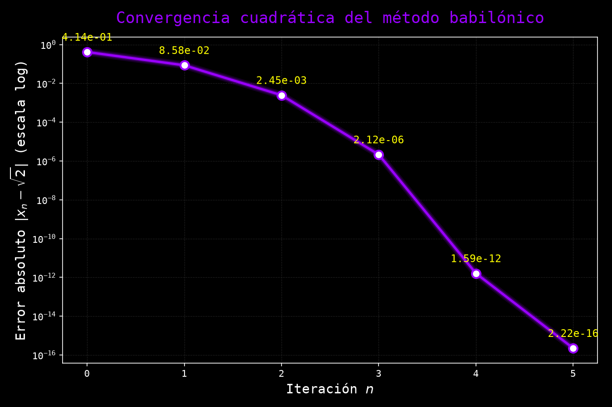
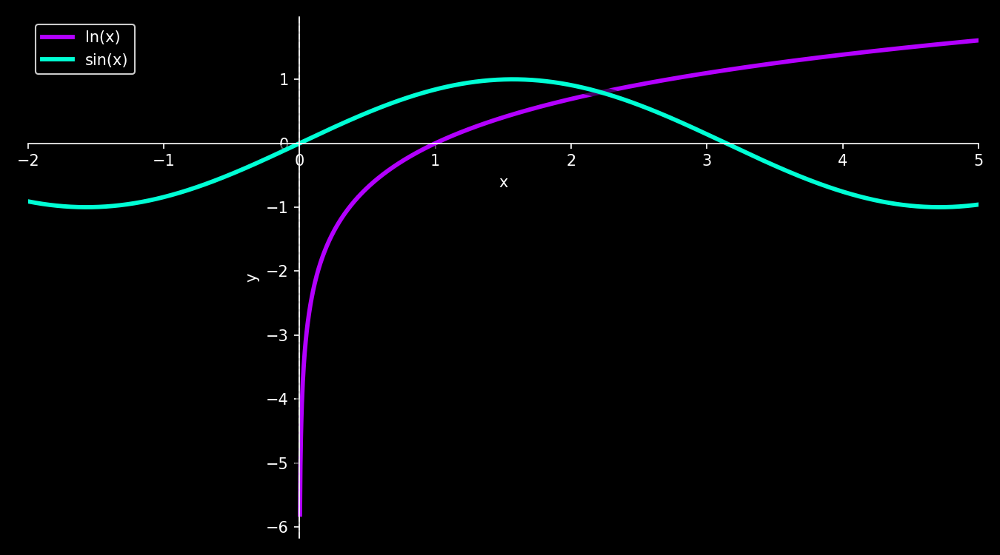
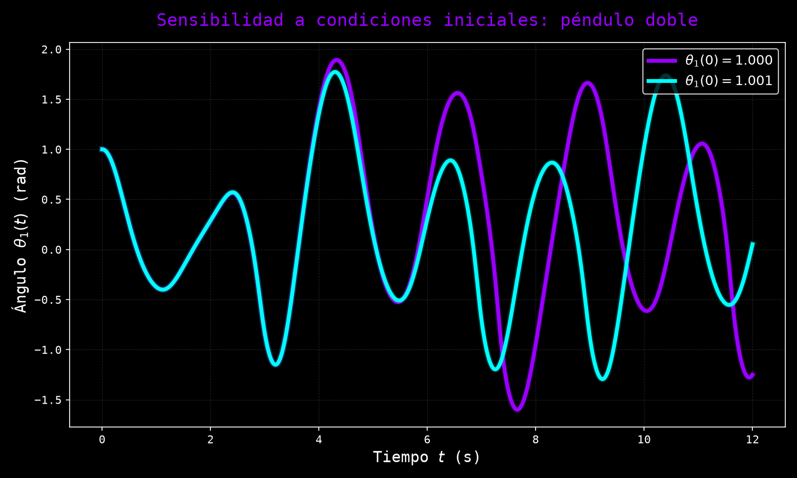
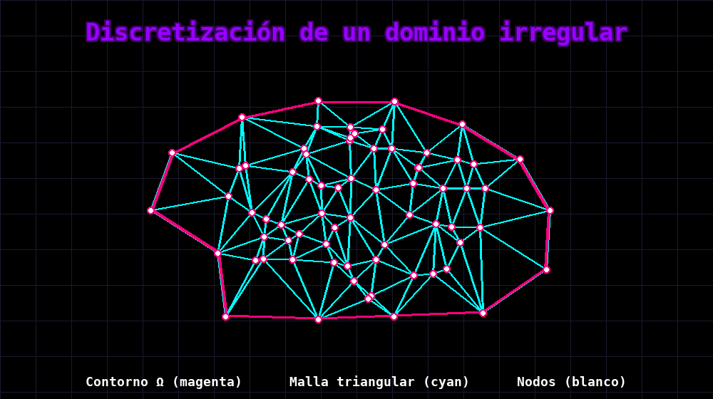

# Introducción a los Métodos Numéricos

En esta clase se presenta el objeto de estudio del curso: los métodos numéricos como herramientas algorítmicas para obtener soluciones aproximadas de problemas matemáticos que carecen de solución analítica cerrada, son computacionalmente prohibitivos o resultan intratables por otras vías, junto con los conceptos fundamentales de error, estabilidad y convergencia que se desarrollarán con rigor a lo largo del curso.

## 1. ¿Qué son los métodos numéricos?

### 1.1 Del problema continuo al cálculo aproximado

Pensemos en calcular $\sqrt{2}$. Sabemos que es un número irracional: su expansión decimal es infinita y no periódica, de modo que jamás podremos escribir su valor exacto con una cantidad finita de cifras. Sin embargo, en la práctica —para diseñar un puente, programar un videojuego o calcular una órbita— nunca necesitamos el valor exacto, sino un valor tan cercano al exacto como el problema lo requiera. Los métodos numéricos nacen precisamente de esta observación: en lugar de buscar una fórmula cerrada que exprese la solución exacta, se construye un procedimiento algorítmico que, mediante operaciones aritméticas elementales aplicadas repetidamente, se acerca progresivamente a esa solución hasta alcanzar la precisión deseada.

> **Nota histórica:** La tablilla babilónica YBC 7289 (c. 1800–1600 a.C.) contiene una aproximación de $\sqrt{2}$ correcta hasta la sexta cifra decimal, obtenida mediante un procedimiento iterativo de promediado que hoy reconocemos como un caso particular del método de Newton-Raphson. Herón de Alejandría formalizó este procedimiento en el siglo I d.C. en su obra *Métrica*. Sin embargo, el análisis numérico como disciplina sistemática es mucho más reciente: surge a mediados del siglo XX con la construcción de las primeras computadoras digitales programables, como la ENIAC (1945), que por primera vez permitieron ejecutar millones de operaciones aritméticas en tiempos razonables. John von Neumann y Alan Turing, entre otros, sentaron las bases teóricas de la computación numérica moderna al estudiar la propagación del error en cálculos automatizados de gran escala.

**Definición 1.1 (Método numérico):**
Un **método numérico** es un procedimiento algorítmico, compuesto por una secuencia finita de operaciones aritméticas elementales, que produce una aproximación $\tilde{x}$ a la solución exacta $x$ de un problema matemático. La calidad de la aproximación se mide mediante el error entre $\tilde{x}$ y $x$, y en general dicho error puede reducirse aumentando el número de operaciones o iteraciones del procedimiento.

**Ejemplo 1.1 (Aproximación iterativa de $\sqrt{2}$):**
El procedimiento babilónico mencionado anteriormente parte de una estimación inicial $x_0 > 0$ y la refina mediante la recurrencia:
$$x_{n+1} = \frac{1}{2}\left(x_n + \frac{2}{x_n}\right)$$

Partiendo de $x_0 = 1$, se obtienen las siguientes aproximaciones sucesivas:
$$\begin{align}
x_1 &= \frac{1}{2}\left(1 + \frac{2}{1}\right) = \frac{1}{2}(1 + 2) = 1.5 \\
x_2 &= \frac{1}{2}\left(1.5 + \frac{2}{1.5}\right) = \frac{1}{2}(1.5 + 1.3\overline{3}) \approx 1.41\overline{6} \\
x_3 &= \frac{1}{2}\left(1.41\overline{6} + \frac{2}{1.41\overline{6}}\right) \approx \frac{1}{2}(1.41\overline{6} + 1.41176) \approx 1.414215686
\end{align}$$

El valor real es $\sqrt{2} = 1.414213562\ldots$, de modo que tras solo tres iteraciones el error absoluto ya es inferior a $3 \times 10^{-6}$. Cada iteración adicional duplica aproximadamente el número de cifras decimales correctas, una propiedad conocida como **convergencia cuadrática** que se estudiará con rigor al tratar el método de Newton-Raphson.

La gráfica anterior muestra el error absoluto en escala logarítmica: la pendiente cada vez más pronunciada refleja que el número de cifras decimales correctas se duplica en cada iteración, pasando de un error de orden $10^{-1}$ a uno de orden $10^{-16}$ (el límite de precisión de la aritmética de punto flotante de doble precisión) en tan solo cinco pasos.

---

## 2. La necesidad de los métodos numéricos

Cabe preguntarse por qué, si problemas como la ecuación cuadrática o la integración por partes poseen fórmulas cerradas, es necesario un campo entero dedicado a las aproximaciones. La respuesta es que esas fórmulas cerradas son la excepción y no la regla: la inmensa mayoría de los problemas matemáticos que modelan fenómenos reales carecen de solución analítica expresable mediante un número finito de operaciones con funciones elementales. A continuación se examinan diez escenarios recurrentes en la ciencia y la ingeniería donde los métodos numéricos resultan indispensables.

### 2.1 Inexistencia de soluciones analíticas cerradas

Existen numerosos problemas cuya solución no puede expresarse en términos de funciones elementales mediante un número finito de operaciones algebraicas. El ejemplo más simple es una ecuación en la que la incógnita aparece como argumento de una función trascendente.

**Definición 2.1 (Ecuación trascendente):**
Una **ecuación trascendente** es una ecuación en la que la incógnita figura como argumento de una función no algebraica (exponencial, logarítmica o trigonométrica, entre otras), de modo que no es posible despejarla mediante un número finito de sumas, restas, productos, cocientes y radicaciones.

**Ejemplo 2.1:**
Consideremos la ecuación trascendente:
$$\ln(x) = \sin(x)$$

No es posible despejar $x$ mediante operaciones algebraicas convencionales, pero la continuidad de ambas funciones garantiza la existencia de al menos una intersección entre sus gráficas. Métodos numéricos como la bisección o el método de Newton-Raphson —que se estudiarán en la Parte V del curso— permiten aproximar esta intersección con la precisión que se desee.

### 2.2 Restricción a soluciones puntuales

No siempre es necesario conocer la solución analítica completa de un problema: en muchos casos prácticos solo se requieren valores numéricos en ciertos puntos o intervalos de tiempo. Las ecuaciones de Lotka-Volterra, que modelan la dinámica depredador-presa, ilustran esta situación:
$$\begin{cases}
\dfrac{dx}{dt} = \alpha \cdot x - \beta \cdot x \cdot y \\[10pt]
\dfrac{dy}{dt} = \delta \cdot x \cdot y - \gamma \cdot y
\end{cases}$$
donde $x(t)$ representa la población de presas, $y(t)$ la de depredadores, y $\alpha, \beta, \delta, \gamma$ son parámetros del modelo. Este sistema de ecuaciones diferenciales ordinarias no lineales rara vez tiene solución analítica, pero basta con conocer la evolución de las poblaciones en ciertos instantes de interés. Métodos como el de Runge-Kutta —que se desarrollarán en la Parte VI del curso, dedicada a las ecuaciones diferenciales ordinarias— permiten simular la evolución del sistema con la resolución temporal que se necesite, sin requerir jamás una fórmula cerrada para $x(t)$ y $y(t)$.

### 2.3 Limitaciones de precisión computacional

Las computadoras representan los números reales con una cantidad finita de bits, por lo que trabajan necesariamente con aproximaciones: nunca se obtienen resultados totalmente exactos. Por ejemplo, la representación decimal de $\pi$ es infinita:
$$\pi = 3.141592653589793\ldots$$
pero cualquier computadora debe truncarla o redondearla a una cantidad finita de cifras para almacenarla en memoria.

**Ejemplo 2.2 (Desaparición de un término por redondeo):**
Trabajando con una precisión hipotética de 4 dígitos significativos, la suma exacta y la suma redondeada difieren notablemente:
$$\begin{align}
\text{Exacto:} &\quad 1.000 + 0.0001234 = 1.0001234 \\
\text{Con 4 dígitos:} &\quad 1.000 + 0.0001234 \approx 1.000
\end{align}$$
El término pequeño desaparece por completo debido al redondeo, un fenómeno especialmente problemático al sumar muchos términos de magnitudes muy distintas.

**Ejemplo 2.3 (Cancelación catastrófica):**
Al restar dos números muy cercanos entre sí se pierden cifras significativas:
$$\begin{align}
a &= 3.141592653 \\
b &= 3.141591829 \\
a - b &= 0.000000824
\end{align}$$
Si originalmente se contaba con 10 dígitos de precisión en $a$ y $b$, tras la resta solo quedan 3 dígitos confiables en el resultado. Este tipo de errores puede acumularse y propagarse en algoritmos con muchas operaciones sucesivas, afectando significativamente la calidad del resultado final.

> **Nota:** Los conceptos de error absoluto, error relativo, representación de punto flotante (IEEE 754) y cancelación catastrófica se desarrollan con todo detalle y rigor en la Clase 3 (Análisis y teoría del error). Aquí solo se introduce el fenómeno para motivar su estudio posterior.

### 2.4 Complejidad computacional prohibitiva

Algunos problemas tienen solución analítica conocida, pero su cálculo directo requiere una cantidad de tiempo o recursos computacionales excesiva. Por ejemplo, resolver un sistema lineal grande:
$$A \cdot \vec{x} = \vec{b} \qquad \text{donde } A \in \mathbb{R}^{1000 \times 1000}$$

> **Nota (notación de orden):** La notación $\mathcal{O}(n^k)$ (notación de orden o "notación Big-O") indica que el número de operaciones de un algoritmo crece, en el peor caso, proporcionalmente a $n^k$ cuando el tamaño del problema $n$ es grande; permite comparar la eficiencia relativa de distintos algoritmos sin depender del hardware específico donde se ejecuten.

Usar eliminación gaussiana directamente requiere $\mathcal{O}(n^3)$ operaciones, lo que para $n = 1000$ significa aproximadamente mil millones de operaciones. Métodos numéricos iterativos —como Jacobi, Gauss-Seidel o el gradiente conjugado, que se estudiarán en la Parte II del curso— pueden ser mucho más eficientes, especialmente cuando $A$ es dispersa (tiene muchos ceros).

### 2.5 Problemas físicos de alta complejidad

Muchos problemas de la física y la ingeniería involucran ecuaciones en derivadas parciales no lineales que describen fenómenos complejos. Las ecuaciones de Navier-Stokes para fluidos incompresibles son un ejemplo central:
$$\rho \left(\dfrac{\partial\vec{v}}{\partial t} + \vec{v} \cdot \nabla \vec{v}\right) = -\nabla P + \mu \cdot \nabla^2 \vec{v} + \vec{f}$$
donde $\vec{v}$ es el campo de velocidad, $P$ la presión, $\rho$ la densidad, $\mu$ la viscosidad dinámica y $\vec{f}$ las fuerzas externas. Estas ecuaciones no tienen solución analítica general, y su resolución numérica —mediante elementos finitos, volúmenes finitos o diferencias finitas— es fundamental en aerodinámica, meteorología y muchas otras áreas de la ingeniería.

### 2.6 Sensibilidad a condiciones iniciales: sistemas caóticos

Algunos sistemas dinámicos son deterministas —su evolución futura queda completamente determinada por sus condiciones iniciales— pero exhiben un comportamiento imposible de predecir analíticamente más allá de cortos períodos de tiempo.

**Definición 2.2 (Sistema caótico):**
Un sistema dinámico se denomina **caótico** cuando pequeñas variaciones en sus condiciones iniciales producen divergencias que crecen exponencialmente con el tiempo en la evolución del sistema, a pesar de que las ecuaciones que lo gobiernan sean completamente deterministas.

> **Nota histórica:** Henri Poincaré descubrió este fenómeno a finales del siglo XIX al estudiar el problema de los tres cuerpos, sentando las bases de la teoría del caos. El meteorólogo Edward Lorenz lo popularizó en 1963 al observar, mediante simulaciones numéricas del clima, que redondear una condición inicial en la sexta cifra decimal bastaba para producir predicciones radicalmente distintas: el llamado "efecto mariposa".

**Ejemplo 2.4:**
El problema de los tres cuerpos en mecánica celeste,
$$m_i \dfrac{d^2\vec{r}_i}{dt^2} = \sum_{j \neq i} G \dfrac{m_i m_j (\vec{r}_j - \vec{r}_i)}{|\vec{r}_j - \vec{r}_i|^3}, \quad i = 1, 2, 3$$
no tiene solución analítica general (salvo casos muy especiales) y debe resolverse numéricamente. Otro ejemplo clásico es el péndulo doble, cuyas ecuaciones de movimiento son:
$$\begin{cases}
(m_1 + m_2)L_1\ddot{\theta}_1 + m_2L_2\ddot{\theta}_2\cos(\theta_1-\theta_2) + m_2L_2\dot{\theta}_2^2\sin(\theta_1-\theta_2) + (m_1+m_2)g\sin\theta_1 = 0 \\[8pt]
m_2L_2\ddot{\theta}_2 + m_2L_1\ddot{\theta}_1\cos(\theta_1-\theta_2) - m_2L_1\dot{\theta}_1^2\sin(\theta_1-\theta_2) + m_2g\sin\theta_2 = 0
\end{cases}$$
Aunque estas ecuaciones son deterministas, su naturaleza caótica hace que la simulación numérica sea la única herramienta práctica para estudiar su comportamiento a largo plazo.

La figura anterior integra numéricamente las ecuaciones del péndulo doble para dos condiciones iniciales que difieren en apenas $10^{-3}$ radianes. Durante los primeros segundos ambas trayectorias son indistinguibles, pero a partir de cierto instante divergen por completo: este es precisamente el comportamiento que hace imposible predecir el estado del sistema a largo plazo sin recurrir a la simulación numérica.

### 2.7 Dominios geométricos irregulares

Cuando es necesario resolver ecuaciones en regiones con formas complicadas, los métodos analíticos se vuelven intratables. Por ejemplo, calcular el flujo de calor en una pieza mecánica de forma arbitraria exige resolver:
$$\nabla^2 T = 0 \quad \text{en } \Omega$$
donde $\Omega$ es un dominio con geometría compleja, como el perfil de un álabe de turbina o el fuselaje de un avión. Los métodos numéricos discretizan el dominio mediante distintas técnicas:

- **Diferencias finitas:** requieren mallas estructuradas (rectangulares).
- **Elementos finitos:** permiten mallas no estructuradas que se adaptan a geometrías complejas.
- **Volúmenes finitos:** son útiles en problemas de conservación con geometrías arbitrarias.

Esta discretización del espacio transforma el problema continuo en un sistema algebraico resoluble.

### 2.8 Optimización con múltiples variables

En problemas de optimización con muchas variables, encontrar analíticamente el máximo o mínimo mediante cálculo diferencial resulta impracticable. El entrenamiento de una red neuronal, por ejemplo, exige minimizar una función de pérdida:
$$\min_{\vec{w}} \mathcal{L}(\vec{w}) = \min_{\vec{w}} \sum_{i=1}^{N} \left( y_i - f(\vec{x}_i; \vec{w}) \right)^2$$
donde $\vec{w} \in \mathbb{R}^n$ puede tener millones de componentes. Resolver $\nabla \mathcal{L}(\vec{w}) = 0$ analíticamente es imposible, por lo que se recurre a métodos iterativos, que se estudiarán en la Parte V del curso:

- **Descenso del gradiente:** $\vec{w}_{k+1} = \vec{w}_k - \alpha \nabla \mathcal{L}(\vec{w}_k)$.
- **Método de Newton multivariado:** utiliza información de segunda derivada (matriz Hessiana).
- **Algoritmos genéticos:** exploran espacios de búsqueda discretos o no diferenciables.

Otro ejemplo típico es la optimización de diseño en ingeniería, donde se busca minimizar el peso de una estructura sujeta a restricciones de resistencia.

### 2.9 Problemas inversos

**Definición 2.3 (Problema inverso):**
Un **problema inverso** consiste en determinar las causas o los parámetros de un sistema a partir de observaciones de sus efectos, en contraste con el **problema directo**, que predice los efectos a partir de causas y parámetros conocidos.

Estos problemas son típicamente mal condicionados —pequeños errores en los datos observados producen grandes errores en la solución reconstruida, concepto que se formaliza en la Definición 4.3— y requieren técnicas de regularización. Dos ejemplos importantes:

- **Tomografía computarizada:** a partir de proyecciones de rayos X desde múltiples ángulos, se reconstruye la imagen interna del cuerpo. Esto involucra invertir la transformada de Radon,
  $$g(\theta, s) = \int_{-\infty}^{\infty} f(x,y) \, dl$$
  donde $g$ son las mediciones y $f$ es la densidad interna que se desea reconstruir.
- **Identificación de parámetros:** en sistemas dinámicos, determinar parámetros desconocidos a partir de mediciones; por ejemplo, estimar la permeabilidad de un yacimiento petrolero a partir de datos de presión en pozos.

Estos problemas requieren métodos numéricos especializados, como mínimos cuadrados regularizados o métodos bayesianos.

### 2.10 Integrales sin forma cerrada

Muchas integrales fundamentales en ciencia e ingeniería no tienen antiderivada expresable mediante funciones elementales. La más conocida es:
$$\int e^{-x^2} \, dx$$
relacionada con la distribución normal en estadística. Otros ejemplos importantes son la integral elíptica completa de primera clase,
$$K(k) = \int_0^{\pi/2} \dfrac{d\theta}{\sqrt{1 - k^2\sin^2\theta}}$$
que aparece en el período de un péndulo simple con amplitud grande y en la longitud de arco de una elipse, y la función error,
$$\text{erf}(x) = \dfrac{2}{\sqrt{\pi}} \int_0^x e^{-t^2} \, dt$$
esencial en teoría de la probabilidad, difusión y propagación de calor. Para evaluar estas integrales en puntos específicos se emplean métodos de integración numérica —regla del trapecio, regla de Simpson y cuadratura de Gauss—, que se desarrollarán en la Parte IV del curso y que aproximan la integral mediante sumas ponderadas de valores de la función en puntos específicos.

### 2.11 Panorama general

La siguiente tabla resume los diez escenarios anteriores, el método numérico típico asociado a cada uno y la parte del programa del curso (véase la Clase 1) donde se estudiará con rigor:

| Escenario | Método numérico típico | Parte del curso |
| :--- | :--- | :---: |
| 2.1 Ecuaciones trascendentes | Bisección, Newton-Raphson | Parte V |
| 2.2 Sistemas dinámicos (EDO) | Runge-Kutta, Euler | Parte VI |
| 2.3 Precisión de máquina | Aritmética IEEE 754, análisis de error | Parte I |
| 2.4 Sistemas lineales grandes | Jacobi, Gauss-Seidel, gradiente conjugado | Parte II |
| 2.5 EDPs no lineales | Elementos finitos, volúmenes finitos, diferencias finitas | *(fuera del alcance directo del curso)* |
| 2.6 Sistemas caóticos | Runge-Kutta de alto orden | Parte VI |
| 2.7 Dominios irregulares | Elementos finitos | *(fuera del alcance directo del curso)* |
| 2.8 Optimización multivariable | Descenso del gradiente, Newton multivariado | Parte V |
| 2.9 Problemas inversos | Mínimos cuadrados regularizados | Parte III |
| 2.10 Integrales sin forma cerrada | Trapecio, Simpson, cuadratura de Gauss | Parte IV |

> **Nota:** Los escenarios 2.5 y 2.7 (ecuaciones en derivadas parciales y dominios geométricos irregulares) se mencionan por su relevancia en ciencia e ingeniería, pero sus métodos de resolución —principalmente el método de elementos finitos— exceden el alcance de este curso y corresponden a cursos especializados de análisis numérico avanzado o mecánica computacional.

---

## 3. Aplicaciones de los métodos numéricos

Los métodos numéricos son ubicuos en la ciencia y la ingeniería modernas:

- **Meteorología y climatología:** predicción del tiempo mediante modelos atmosféricos.
- **Ingeniería estructural:** análisis de tensiones y deformaciones en edificios y puentes.
- **Gráficos computacionales:** renderizado 3D, animaciones y simulaciones físicas.
- **Finanzas:** valoración de derivados financieros y análisis de riesgo.
- **Medicina:** procesamiento de imágenes médicas y simulación de sistemas biológicos.
- **Inteligencia artificial:** entrenamiento de redes neuronales mediante optimización numérica.
- **Industria automotriz:** simulación de colisiones y dinámica de vehículos.
- **Exploración espacial:** cálculo de trayectorias y optimización de misiones.

---

## 4. Conceptos fundamentales para el estudio de los métodos numéricos

Todo método numérico debe evaluarse según cinco criterios que atraviesan el curso completo. Se presentan aquí de manera introductoria; su desarrollo riguroso, con demostraciones y ejemplos cuantitativos, corresponde a las clases siguientes.

**Definición 4.1 (Error de truncamiento):**
El **error de truncamiento** es el error que se comete al aproximar un proceso infinito o continuo (una serie, una derivada, una integral) mediante un proceso finito o discreto. Es inherente al método numérico elegido, independientemente de la precisión de la máquina que lo ejecute.

**Definición 4.2 (Error de redondeo):**
El **error de redondeo** es el error que se comete al representar números reales con una cantidad finita de dígitos en una computadora. Es inherente a la aritmética de punto flotante, independientemente del método numérico empleado.

**Definición 4.3 (Condicionamiento de un problema):**
El **condicionamiento** de un problema matemático $f$ mide cuánto se amplifican, en la solución, las perturbaciones relativas de los datos de entrada; es una propiedad intrínseca del problema, independiente del algoritmo o de la aritmética empleados para resolverlo. Para un problema escalar diferenciable $y = f(x)$, se define el **número de condición** como
$$\kappa_f(x) = \left| \frac{x\, f'(x)}{f(x)} \right|$$
Un problema se denomina **bien condicionado** si $\kappa_f(x)$ es de orden moderado (perturbaciones pequeñas en $x$ producen perturbaciones comparables en $f(x)$), y **mal condicionado** si $\kappa_f(x)$ es muy grande (perturbaciones minúsculas en los datos se amplifican en errores considerables en la solución).

> **Observación importante:** El condicionamiento y la estabilidad son propiedades distintas y no deben confundirse: el condicionamiento depende únicamente del problema, mientras que la estabilidad depende del algoritmo utilizado para resolverlo. Un algoritmo estable aplicado a un problema mal condicionado seguirá produciendo resultados poco confiables, y ningún algoritmo, por estable que sea, puede compensar un mal condicionamiento inherente al problema en sí.

**Ejemplo 4.1 (Condicionamiento de la resta):**
Consideremos la operación de resta $f(a,b) = a - b$. Cuando $a$ y $b$ son cercanos entre sí, el número de condición relativo de esta operación es aproximadamente
$$\kappa \approx \frac{|a| + |b|}{|a - b|}$$
que crece sin cota a medida que $a \to b$. Esto explica formalmente el fenómeno de cancelación catastrófica observado en el Ejemplo 2.3: no se trata de un defecto del algoritmo de resta (que es exacto salvo por redondeo), sino de un mal condicionamiento inherente al problema de restar dos cantidades casi iguales.

**Definición 4.4 (Estabilidad de un algoritmo):**
Un algoritmo es **estable** si los errores de redondeo introducidos en sus etapas iniciales no crecen de manera descontrolada a medida que avanza el cálculo, de modo que el resultado final permanece cercano a la solución exacta del problema.

**Definición 4.5 (Convergencia de un método numérico):**
Un método numérico es **convergente** si la sucesión de aproximaciones que genera se acerca a la solución exacta del problema a medida que se refina el método (por ejemplo, al aumentar el número de iteraciones o al reducir el tamaño de paso), es decir, si el error tiende a cero en dicho límite.

> **Observación:** A estos cinco criterios se suma la **eficiencia**: el balance entre la precisión alcanzada y el costo computacional (tiempo y memoria) requerido para alcanzarla. Un método más preciso pero computacionalmente prohibitivo puede ser menos útil en la práctica que uno ligeramente menos preciso pero mucho más rápido.

Los errores de truncamiento y de redondeo, junto con el condicionamiento de problemas, se estudian con rigor en la Clase 3 (Análisis y teoría del error); la estabilidad y la convergencia de algoritmos específicos se retoman en cada método particular a lo largo del curso.

---

**Fin de la Clase 2: Introducción a los Métodos Numéricos**