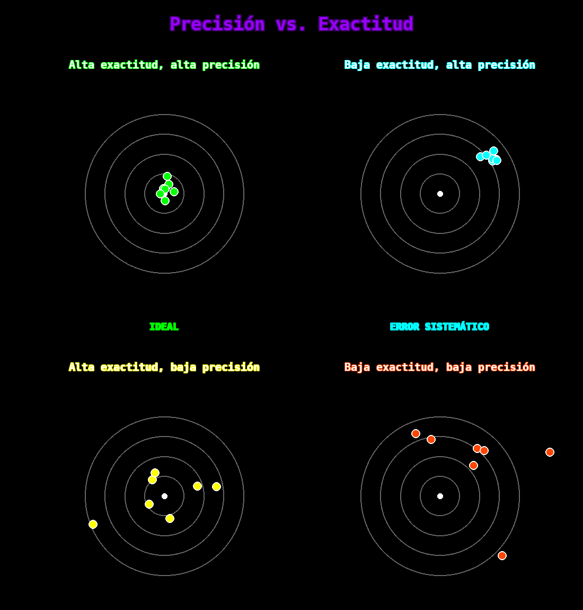
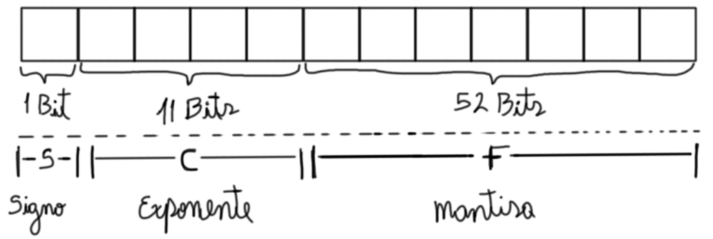
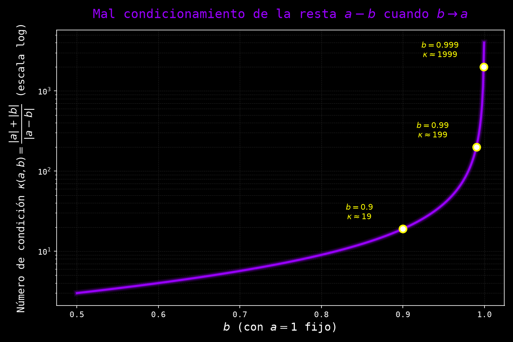

# Análisis y Teoría del Error

En esta clase se estudian con rigor los distintos tipos de error que aparecen en el cálculo científico y computacional —absoluto, relativo, de medición, sistemático, aleatorio, de redondeo y de truncamiento—, la representación de números reales en aritmética de punto flotante según el estándar IEEE 754, y las leyes de propagación y condicionamiento que determinan la confiabilidad de un resultado numérico.

## 1. Introducción a la teoría del error

### 1.1 Concepto fundamental

Pensemos en medir el largo de una hoja de papel con una regla. Una primera regla arroja $15.41$ cm, una segunda $15.37$ cm y una tercera $15.43$ cm. Las tres mediciones son razonables y, sin embargo, ninguna coincide con las otras: ¿cuál es, entonces, el valor "verdadero" del largo de la hoja? En la práctica, obtener el valor exacto de cualquier magnitud medida es prácticamente imposible, pues todo instrumento de medición tiene una resolución finita que limita la precisión alcanzable. Esta misma limitación reaparece, bajo una forma distinta, en el cálculo computacional: las computadoras representan los números reales con una cantidad finita de bits, de modo que también ellas operan siempre con aproximaciones. La teoría del error es el marco matemático que permite cuantificar, comparar y controlar estas imprecisiones, tanto en mediciones experimentales como en cálculos numéricos.

> **Nota histórica:** La teoría del error se originó en la astronomía y la geodesia de los siglos XVIII y XIX, disciplinas que exigían combinar múltiples observaciones imprecisas de un mismo fenómeno celeste o terrestre en una única estimación confiable. Carl Friedrich Gauss, Pierre-Simon Laplace y Adrien-Marie Legendre desarrollaron las herramientas estadísticas fundamentales —en particular el método de mínimos cuadrados— para tratar sistemáticamente estas imprecisiones. Con el advenimiento de las computadoras digitales en el siglo XX, esta teoría se expandió para incluir los errores propios de la representación finita de números y del cálculo automatizado, dando lugar al análisis numérico moderno.

**Definición 1.1 (Teoría del error):**
La **teoría del error** es el análisis matemático de los errores causados por las mediciones, aproximaciones y representaciones numéricas en el cálculo científico y computacional.

**Ejemplo 1.1 (El problema de la hoja de papel):**
Retomando la situación inicial, si las tres reglas arrojan $15.41$, $15.37$ y $15.43$ cm, no existe forma de conocer con certeza absoluta el valor exacto del largo de la hoja; lo único que puede hacerse es reportar una estimación acompañada de una medida de su incertidumbre. Este problema —estimar un valor y acotar su error— se retomará formalmente en el Ejemplo 2.3, una vez introducidas las herramientas estadísticas necesarias.

### 1.2 Importancia en métodos numéricos

Aunque el concepto de teoría del error surgió históricamente ligado a mediciones experimentales de laboratorio, sus herramientas resultan igualmente indispensables en el análisis de métodos numéricos: todo algoritmo que aproxima una solución exacta mediante un proceso finito de cálculos hereda, en mayor o menor medida, los mismos problemas de imprecisión que un instrumento de medición físico.

**Áreas de aplicación:**
- Mediciones experimentales y de laboratorio.
- Cálculos científicos y de ingeniería.
- Simulaciones numéricas.
- Procesamiento de señales.
- Computación científica.
- Optimización numérica.

> **Observación:** Aunque el concepto de teoría del error se asocia tradicionalmente con mediciones experimentales, sus herramientas y conceptos son fundamentales para la solución de métodos numéricos, como se introdujo en la Clase 2 (Introducción a los Métodos Numéricos).

---


## 2. Tipos de errores

### 2.1 Error absoluto y error relativo

Una vez aceptado que toda medición o cálculo numérico conlleva una discrepancia respecto al valor exacto, el siguiente paso es cuantificar esa discrepancia. La forma más directa es medir la diferencia en las mismas unidades que la cantidad original —el **error absoluto**—, pero esta medida por sí sola puede ser engañosa: un error de un centímetro es insignificante al medir la distancia entre dos ciudades, pero catastrófico al medir el diámetro de un transistor. Para comparar errores de manera justa entre magnitudes de tamaños muy distintos es necesario, además, expresar el error en proporción al valor medido, dando lugar al **error relativo**.

**Definición 2.1 (Valor verdadero y valor aproximado):**
- $x$: **valor verdadero** (valor exacto que buscamos)
- $\tilde{x}$: **valor aproximado** (valor medido o calculado)

**Definición 2.2 (Error absoluto):**
El **error absoluto** es la diferencia entre el valor verdadero y el valor aproximado:
$$E_a = |x - \tilde{x}|$$

**Definición 2.3 (Error relativo):**
El **error relativo** es la razón entre el error absoluto y el valor verdadero:
$$E_r = \frac{|x - \tilde{x}|}{|x|}, \quad x \neq 0$$

**Error relativo porcentual:**
$$E_r\% = \frac{|x - \tilde{x}|}{|x|} \times 100\%$$

**Ejemplo 2.1:**
Si medimos la longitud de una hoja de papel:
- Valor verdadero (supuesto): $x = 15.40$ cm
- Valor medido: $\tilde{x} = 15.37$ cm

**Error absoluto:**
$$E_a = |15.40 - 15.37| = 0.03 \text{ cm}$$

**Error relativo:**
$$E_r = \frac{0.03}{15.40} \approx 0.001948 \approx 0.19\%$$

**Ejemplo 2.2 (Importancia del error relativo):**

**Caso 1:**
- Medición de distancia entre ciudades: $x = 100$ km, $\tilde{x} = 100.03$ km
- $E_a = 0.03$ km (30 metros)
- $E_r = 0.03\%$

**Caso 2:**
- Medición de un transistor: $x = 1$ mm, $\tilde{x} = 1.03$ mm
- $E_a = 0.03$ mm
- $E_r = 3\%$

**Conclusión:** Aunque el error absoluto es el mismo, el error relativo revela que la segunda medición es mucho menos precisa.

### 2.2 Error de medición

En la Sección 1.1 se mencionó, a través del ejemplo de la hoja de papel medida con tres reglas distintas, que ningún instrumento físico puede determinar una magnitud con exactitud perfecta. Corresponde ahora precisar en qué consiste concretamente esa limitación y de qué factores depende.

**Definición 2.4 (Error de medición):**
El **error de medición** es la incertidumbre asociada con la limitación física de los instrumentos de medición.

**Características:**
1. **Resolución del instrumento:** Mínima división de escala
2. **Incertidumbre instrumental:** Típicamente $\pm$ la mitad de la división más pequeña
3. **Condiciones ambientales:** Temperatura, presión, humedad
4. **Error humano:** Lectura e interpretación

**Ejemplo 2.3:**
Medimos el tamaño de una hoja con tres reglas diferentes:
- Regla 1: $15.41$ cm
- Regla 2: $15.37$ cm
- Regla 3: $15.43$ cm

**Pregunta:** ¿Cuál es el valor real?

**Análisis estadístico:**
- **Media:** $\bar{x} = \frac{15.41 + 15.37 + 15.43}{3} = 15.40$ cm
- **Desviación estándar:** $s = \sqrt{\frac{\sum(x_i - \bar{x})^2}{n-1}} \approx 0.03$ cm
- **Valor reportado:** $x = 15.40 \pm 0.03$ cm

### 2.3 Errores sistemáticos y aleatorios

No todos los errores de medición se comportan de la misma manera. Algunos desplazan consistentemente el resultado en una dirección fija —por ejemplo, una balanza descalibrada que siempre agrega el mismo peso de más— mientras que otros fluctúan de forma impredecible de una medición a otra, sin un patrón discernible. Esta distinción es importante porque cada tipo de error admite una estrategia de corrección diferente: uno puede eliminarse mediante calibración, el otro solo puede reducirse estadísticamente promediando observaciones.

**Definición 2.5 (Error sistemático):**
Un **error sistemático** es un error que se repite consistentemente en la misma dirección debido a:
- Calibración incorrecta del instrumento
- Condiciones experimentales sesgadas
- Método defectuoso
- Limitaciones del modelo matemático

**Características:**
- Predecible y reproducible
- Puede ser corregido si se identifica
- Afecta la **exactitud**

**Ejemplo 2.4:**
Una balanza descalibrada que siempre suma 5 gramos produce un error sistemático de $+5$ g.

**Definición 2.6 (Error aleatorio):**
Un **error aleatorio** es una fluctuación impredecible causada por:
- Variaciones ambientales
- Limitaciones en la lectura
- Ruido en la medición

**Características:**
- Impredecible e irregular
- Se distribuye aleatoriamente alrededor del valor verdadero
- Afecta la **precisión**
- Se puede reducir mediante promedios

**Ejemplo 2.5:**
Variaciones en la temperatura ambiente que afectan ligeramente cada medición de manera diferente.

### 2.4 Precisión vs Exactitud

Los errores sistemáticos y aleatorios recién distinguidos se corresponden, respectivamente, con dos cualidades distintas de una medición: qué tan cerca está del valor verdadero y qué tan reproducible es al repetirla. En el lenguaje cotidiano estos dos rasgos suelen confundirse bajo la palabra "precisión", pero en ciencia reciben nombres técnicos propios y bien diferenciados.

**Definición 2.7 (Exactitud - Accuracy):**
La **exactitud** es la cercanía de un valor medido al valor verdadero. Mide qué tan correcto es el resultado.

**Definición 2.8 (Precisión - Precision):**
La **precisión** es la cercanía entre múltiples mediciones del mismo valor. Mide la reproducibilidad.



**Ejemplo 2.6:**
Un tirador realiza 5 disparos:

**Caso A (Alta precisión, alta exactitud):**
Todos los disparos están agrupados en el centro → **IDEAL**

**Caso B (Alta precisión, baja exactitud):**
Todos los disparos están agrupados pero lejos del centro → Error sistemático

**Caso C (Baja precisión, alta exactitud):**
Los disparos están dispersos pero centrados alrededor del objetivo → Errores aleatorios

**Caso D (Baja precisión, baja exactitud):**
Los disparos están dispersos y lejos del centro → **PEOR CASO**

**Relación con errores:**
- **Exactitud** está afectada por **errores sistemáticos**
- **Precisión** está afectada por **errores aleatorios**

---

## 3. Cálculos analíticos vs numéricos

### 3.1 Soluciones analíticas exactas

Antes de estudiar los métodos numéricos propiamente dichos, conviene precisar el punto de referencia frente al cual se mide su error: la solución analítica, es decir, aquella que se obtiene mediante una fórmula cerrada y no mediante un proceso de aproximación sucesiva.

**Definición 3.1 (Solución analítica):**
Una **solución analítica** (o exacta) es una expresión matemática cerrada que proporciona el valor exacto sin aproximaciones.

**Ejemplo 3.1 (Operaciones aritméticas exactas):**
$$\frac{10}{2} = 5$$

El resultado es **exacto**, sin error.

**Ejemplo 3.2 (Ecuación cuadrática):**
Resolver $x^2 - 6x + 8 = 0$:

$$\begin{align}
x &= \frac{6 \pm \sqrt{(-6)^2 - 4 \cdot 1 \cdot 8}}{2 \cdot 1} \\
&= \frac{6 \pm \sqrt{36 - 32}}{2} \\
&= \frac{6 \pm \sqrt{4}}{2} \\
&= \frac{6 \pm 2}{2}
\end{align}$$

**Soluciones exactas:**
$$x_1 = \frac{6 + 2}{2} = 4, \quad x_2 = \frac{6 - 2}{2} = 2$$

### 3.2 Limitaciones de las soluciones analíticas

Si toda ecuación tuviese una solución analítica como la cuadrática del Ejemplo 3.2, la teoría del error carecería de buena parte de su razón de ser. Sin embargo, la inmensa mayoría de los problemas matemáticos que surgen en la práctica no admiten una fórmula cerrada, lo cual obliga a recurrir a la aproximación numérica.

**Problemas sin solución analítica:**
1. Ecuaciones trascendentales: $e^x = x^2$
2. Integrales no elementales: $\int e^{-x^2} dx$
3. Sistemas no lineales complejos
4. Ecuaciones diferenciales no lineales

**Necesidad de métodos numéricos:**
Cuando no existe solución analítica o es impráctica de obtener, recurrimos a métodos numéricos que proporcionan **aproximaciones**.

**Ejemplo 3.3:**
La ecuación $\cos(x) = x$ no tiene solución analítica. Un método numérico (como Newton-Raphson) proporciona:
$$x \approx 0.739085133215$$

---

## 4. Notación científica

### 4.1 Definición y formato

Antes de estudiar cómo una computadora representa internamente los números reales, conviene repasar la notación científica, pues el formato de punto flotante que se introduce en la Sección 5 es, en esencia, una versión binaria y de precisión finita de esta misma idea.

**Definición 4.1 (Notación científica):**
La **notación científica** (o notación exponencial) expresa un número en la forma:
$$x = \pm m \times 10^e$$

donde:
- $m$ es la **mantisa** (o significando): $1 \leq |m| < 10$
- $e$ es el **exponente** (un entero)
- $\pm$ es el signo

**Formato normalizado:**
$$x = \pm d_0.d_1d_2d_3\ldots d_n \times 10^e$$

donde $d_0 \neq 0$ (excepto para el número cero).

### 4.2 Ventajas de la notación científica

Más allá de su compacidad, la notación científica resuelve varios problemas prácticos que surgen al trabajar con números de magnitudes extremas.

**Ventajas:**
1. **Compacidad:** Representa números muy grandes o muy pequeños
2. **Claridad:** Muestra explícitamente la magnitud
3. **Precisión:** Indica de forma explícita los dígitos significativos
4. **Operaciones:** Facilita multiplicación y división

**Ejemplo 4.1 (Números muy grandes):**
- Velocidad de la luz: $299,792,458$ m/s = $2.99792458 \times 10^8$ m/s
- Número de Avogadro: $6.022 \times 10^{23}$ moléculas/mol
- Distancia Tierra-Sol: $1.496 \times 10^{11}$ m

**Ejemplo 4.2 (Números muy pequeños):**
- Masa del electrón: $9.109 \times 10^{-31}$ kg
- Carga del electrón: $1.602 \times 10^{-19}$ C
- Constante de Planck: $6.626 \times 10^{-34}$ J·s

### 4.3 Operaciones en notación científica

Una de las mayores ventajas prácticas de la notación científica es que simplifica la multiplicación y la división de números de magnitudes muy distintas, reduciéndolas a operar por separado la mantisa y el exponente.

**Multiplicación:**
$$(m_1 \times 10^{e_1}) \times (m_2 \times 10^{e_2}) = (m_1 \times m_2) \times 10^{e_1 + e_2}$$

**División:**
$$\frac{m_1 \times 10^{e_1}}{m_2 \times 10^{e_2}} = \frac{m_1}{m_2} \times 10^{e_1 - e_2}$$

**Ejemplo 4.3:**
$$(3.0 \times 10^8) \times (2.0 \times 10^{-3}) = (3.0 \times 2.0) \times 10^{8 + (-3)} = 6.0 \times 10^5$$

**Ejemplo 4.4:**
$$\frac{6.0 \times 10^{12}}{2.0 \times 10^4} = \frac{6.0}{2.0} \times 10^{12 - 4} = 3.0 \times 10^8$$

### 4.4 Dígitos significativos

Una pregunta recurrente al reportar una medición o un resultado numérico es cuántas de sus cifras realmente aportan información confiable. Los **dígitos significativos** son precisamente la respuesta formal a esta pregunta, y la notación científica —como se verá al final de esta sección— es la forma más natural de expresarlos sin ambigüedad.

**Definición 4.2 (Dígitos significativos):**
Los **dígitos significativos** de un número son todos los dígitos que aportan información sobre su precisión, excluyendo ceros que solo indican la posición del punto decimal.

**Reglas:**
1. Todos los dígitos no ceros son significativos
2. Ceros entre dígitos no ceros son significativos
3. Ceros a la izquierda NO son significativos
4. Ceros a la derecha SÍ son significativos si hay punto decimal

**Ejemplo 4.5:**
- $123.45$ → 5 dígitos significativos
- $0.00456$ → 3 dígitos significativos (los ceros iniciales no cuentan)
- $1.2300$ → 5 dígitos significativos (los ceros finales cuentan)
- $1200$ → ambiguo (2, 3 o 4 dígitos significativos)
- $1.200 \times 10^3$ → sin ambigüedad, 4 dígitos significativos

**Observación:** La notación científica elimina la ambigüedad sobre dígitos significativos.

---

## 5. Aritmética computacional

### 5.1 Representación de números en computadoras

Una computadora almacena cualquier dato —incluidos los números reales— en una cantidad finita de bits. Puesto que $\mathbb{R}$ es un conjunto no numerable, es matemáticamente imposible representar exactamente todos los números reales con una cantidad finita de patrones binarios: toda computadora debe, necesariamente, elegir un subconjunto finito de valores representables y aproximar el resto. El estándar que rige cómo se realiza esa elección en la práctica totalidad del hardware moderno es el **IEEE 754**.

> **Nota histórica:** Antes de 1985 cada fabricante de computadoras implementaba su propio formato de punto flotante, con reglas de redondeo y manejo de casos especiales incompatibles entre sí, lo cual dificultaba la portabilidad de los cálculos científicos. En 1985, el **Instituto de Ingenieros Eléctricos y Electrónicos (IEEE)** publicó el estándar **IEEE 754-1985**, que unificó la aritmética binaria de punto flotante estableciendo formatos de representación, algoritmos de redondeo y un manejo consistente de excepciones (overflow, underflow, NaN, infinito). En 2008 se publicó una revisión, **IEEE 754-2008**, que amplió el estándar sin alterar sus principios fundamentales. Este estándar es usado hoy por prácticamente todas las computadoras modernas.

### 5.2 Formato de punto flotante de doble precisión (64 bits)

El formato más utilizado en la práctica científica es el de **doble precisión**, que emplea 64 bits por número. La idea central es la misma de la notación científica normalizada de la Sección 4: separar el número en signo, exponente y mantisa, pero codificando cada campo en una cantidad fija de bits.

**Definición 5.1 (Número de punto flotante IEEE 754):**
Un número real se representa usando **64 bits** (8 bytes) divididos en tres campos:



**Componentes:**

1. **S (Signo):** 1 bit
   - $S = 0$: número positivo
   - $S = 1$: número negativo

2. **C (Característica o exponente sesgado):** 11 bits
   - Rango: $0$ a $2^{11} - 1 = 2047$
   - Valores especiales: $0$ y $2047$ reservados
   - Exponente real: $e = C - 1023$ (sesgo de 1023)
   - Rango del exponente: $-1023$ a $+1024$

3. **F (Fracción o mantisa):** 52 bits
   - Representa la parte fraccionaria
   - Bit implícito: siempre hay un "1" antes del punto binario (normalización)
   - Mantisa completa: $1.f = 1 + F$

**Fórmula de representación:**
$$x = (-1)^S \times 2^{C - 1023} \times (1 + F)$$

donde:
$$F = \sum_{i=1}^{52} b_i \times 2^{-i}$$

y $b_i \in \{0, 1\}$ son los bits de la fracción.

### 5.3 Precisión y rango

El tamaño de cada uno de los tres campos definidos en la Sección 5.2 determina, respectivamente, cuántas cifras decimales pueden distinguirse (precisión) y qué tan grandes o pequénos pueden ser los números representables (rango).

**Proposición 5.1 (Precisión):**
La mantisa de 52 bits proporciona:
- Máximo valor de la fracción: $2^{52} - 1 = 4,503,599,627,370,495$
- Aproximadamente **16 dígitos decimales de precisión**

**Demostración:**
$$\log_{10}(2^{52}) \approx 52 \times 0.30103 \approx 15.65 \text{ dígitos decimales}$$

**Proposición 5.2 (Rango):**
El exponente de 11 bits proporciona:
- Rango del exponente: $-1023$ a $+1024$
- Número más pequeño (normalizado): $\approx 2.23 \times 10^{-308}$
- Número más grande: $\approx 1.80 \times 10^{308}$

**Demostración:**
De los $11$ bits de la característica $C$ se reservan los valores extremos $C=0$ y $C=2047$ para representar subnormales, ceros e infinitos/NaN (ver tabla de valores especiales más abajo), de modo que el exponente real $e = C - 1023$ toma valores efectivos entre $-1022$ y $+1023$ para números normalizados. El número normalizado positivo más pequeño corresponde al menor exponente con mantisa mínima ($F=0$):
$$x_{\min} = 1 \times 2^{-1022} \approx 2.23 \times 10^{-308}$$
El número normalizado más grande corresponde al mayor exponente con la mantisa máxima posible ($F = 1 - 2^{-52}$, es decir, todos los bits de la fracción en $1$):
$$x_{\max} = (2 - 2^{-52}) \times 2^{1023} \approx 1.80 \times 10^{308}$$
$\blacksquare$

**Valores especiales:**

| Caso | S | C | F | Significado |
|------|---|---|---|-------------|
| Cero | 0/1 | 0 | 0 | $+0$ o $-0$ |
| Infinito | 0/1 | 2047 | 0 | $+\infty$ o $-\infty$ |
| NaN | 0/1 | 2047 | ≠0 | Not a Number |
| Subnormal | 0/1 | 0 | ≠0 | $(-1)^S \times 2^{-1022} \times (0 + F)$ |

### 5.4 Ejemplo detallado

**Ejemplo 5.1:**
Considere el número de máquina representado en 64 bits:

```
0  10000000011  1011100100010000000000000000000000000000000000000000
```

**Análisis paso a paso:**

**1. Signo (S):**
$$S = 0 \Rightarrow \text{número positivo}$$

**2. Característica (C):**
$$(10000000011)_2 = 1 \times 2^{10} + 0 \times 2^9 + \cdots + 1 \times 2^1 + 1 \times 2^0 = 1024 + 2 + 1 = 1027$$

**Exponente:**
$$e = C - 1023 = 1027 - 1023 = 4$$
$$2^e = 2^4 = 16$$

**3. Mantisa (F):**
Bits de la fracción: $(1011100100010)_2$ (primeros 12 bits no ceros, resto ceros)

$$\begin{align}
F &= 1 \times 2^{-1} + 0 \times 2^{-2} + 1 \times 2^{-3} + 1 \times 2^{-4} + 1 \times 2^{-5} \\
  &\quad + 0 \times 2^{-6} + 0 \times 2^{-7} + 1 \times 2^{-8} + 0 \times 2^{-9} \\
  &\quad + 0 \times 2^{-10} + 0 \times 2^{-11} + 1 \times 2^{-12} \\
  &= \frac{1}{2} + \frac{1}{8} + \frac{1}{16} + \frac{1}{32} + \frac{1}{256} + \frac{1}{4096} \\
  &= 0.5 + 0.125 + 0.0625 + 0.03125 + 0.00390625 + 0.000244140625 \\
  &= 0.72290039063
\end{align}$$

**Mantisa completa:**
$$1 + F = 1.72290039063$$

**4. Valor decimal:**
$$\begin{align}
x &= (-1)^0 \times 2^4 \times 1.72290039063 \\
  &= 1 \times 16 \times 1.72290039063 \\
  &= 27.56640625
\end{align}$$

**Resultado:** El número de máquina representa exactamente $27.56640625$.

### 5.5 Errores de redondeo y truncamiento

Una consecuencia directa de que solo exista una cantidad finita de $2^{64}$ patrones de bits para representar los infinitos números reales es que la inmensa mayoría de ellos no tienen representación exacta en punto flotante y deben aproximarse al número representable más cercano.

**Definición 5.2 (Error de redondeo):**
El **error de redondeo** ocurre cuando un número real no puede representarse exactamente con un número finito de bits y debe aproximarse al número de punto flotante más cercano.

**Ejemplo 5.2:**
El número $0.1$ (decimal) no tiene representación exacta en binario:
$$(0.1)_{10} = (0.0001100110011001100110011\ldots)_2 \text{ (periódico)}$$

La computadora lo trunca o redondea, causando un error.

**Demostración numérica:**
```python
>>> 0.1 + 0.1 + 0.1 == 0.3
False
>>> 0.1 + 0.1 + 0.1
0.30000000000000004
```

**Definición 5.3 (Epsilon de máquina):**
El **epsilon de máquina** ($\epsilon_m$) es el número positivo más pequeño tal que:
$$1 + \epsilon_m \neq 1$$

en aritmética de punto flotante.

Para IEEE 754 doble precisión:
$$\epsilon_m = 2^{-52} \approx 2.22 \times 10^{-16}$$

**Implicación:** No podemos distinguir números que difieren en menos de $\epsilon_m$ del número base.

---

## 6. Propagación del error

### 6.1 Concepto de propagación

Hasta ahora se ha estudiado el error de una única cantidad medida o calculada. En la práctica, sin embargo, los datos de entrada con error se combinan mediante operaciones aritméticas y funciones para producir un resultado final, y resulta natural preguntarse cómo se acumulan o amplifican los errores individuales de entrada en el error del resultado.

**Definición 6.1 (Propagación del error):**
La **propagación del error** es el proceso por el cual los errores en las variables de entrada se transmiten y amplifican en el resultado de una operación o función.

**Observación crítica:** En cálculos numéricos largos, los errores pequeños pueden acumularse y producir resultados significativamente inexactos.

### 6.2 Propagación en operaciones aritméticas

El caso más simple de propagación de error, y el punto de partida para el caso general de la Sección 6.4, es el de las cuatro operaciones aritméticas elementales.

**Teorema 6.1 (Propagación en suma y resta):**
Si $x = a \pm b$ donde $a$ y $b$ se aproximan por $\tilde{a}$ y $\tilde{b}$ con errores absolutos $\delta a = |a - \tilde{a}|$ y $\delta b = |b - \tilde{b}|$, entonces el error absoluto de $\tilde{x} = \tilde{a} \pm \tilde{b}$ satisface
$$\delta x = |x - \tilde{x}| \leq \delta a + \delta b$$

**Demostración:**
Se tiene que
$$\delta x = |x - \tilde x| = |(a \pm b) - (\tilde a \pm \tilde b)| = |(a - \tilde a) \pm (b - \tilde b)|$$
Aplicando la desigualdad triangular al lado derecho,
$$|(a - \tilde a) \pm (b - \tilde b)| \leq |a - \tilde a| + |b - \tilde b| = \delta a + \delta b$$
de donde $\delta x \leq \delta a + \delta b$, como se quería demostrar. $\blacksquare$

**Interpretación:** Los errores absolutos se **suman** (en cota) en la adición y en la sustracción, independientemente de si la operación es una suma o una resta.

**Teorema 6.2 (Propagación en multiplicación y división):**
Si $x = a \times b$ o $x = a / b$, donde $a$ y $b$ se aproximan por $\tilde a = a(1+\epsilon_a)$ y $\tilde b = b(1+\epsilon_b)$ con errores relativos $\epsilon_a$ y $\epsilon_b$ pequeños, entonces el error relativo de $\tilde x$ satisface, en primera aproximación,
$$\epsilon_x \approx |\epsilon_a| + |\epsilon_b|$$

**Demostración (idea intuitiva):**
Para el producto, $\tilde a \tilde b = ab(1+\epsilon_a)(1+\epsilon_b) = ab\left(1 + \epsilon_a + \epsilon_b + \epsilon_a\epsilon_b\right)$. Como $\epsilon_a$ y $\epsilon_b$ son pequeños, el término de segundo orden $\epsilon_a \epsilon_b$ es despreciable frente a los términos lineales, de modo que
$$\frac{\tilde a \tilde b - ab}{ab} \approx \epsilon_a + \epsilon_b$$
Para el cociente, $\dfrac{\tilde a}{\tilde b} = \dfrac{a}{b}\cdot\dfrac{1+\epsilon_a}{1+\epsilon_b} \approx \dfrac{a}{b}(1+\epsilon_a)(1-\epsilon_b) \approx \dfrac{a}{b}\left(1 + \epsilon_a - \epsilon_b\right)$, usando la aproximación $\frac{1}{1+\epsilon_b} \approx 1 - \epsilon_b$ para $\epsilon_b$ pequeño y despreciando de nuevo el término de segundo orden. En ambos casos, el error relativo resultante es una suma (algebraica) de $\epsilon_a$ y $\epsilon_b$, cuyo valor absoluto queda acotado por $|\epsilon_a|+|\epsilon_b|$ mediante la desigualdad triangular. $\square$

**Interpretación:** Los errores relativos se **suman** (en cota) en la multiplicación y en la división.

### 6.3 Ejemplo de propagación de error

**Ejemplo 6.1:**
Calcular $100 \times \sqrt{2} \times \sqrt{3}$ usando aproximaciones con 2 decimales.

**Valores aproximados:**
$$\sqrt{2} \approx 1.41 \pm 0.005 \quad \text{(precisión de 2 decimales)}$$
$$\sqrt{3} \approx 1.73 \pm 0.005$$

**Método 1 (Con aproximaciones):**
$$100 \times 1.41 \times 1.73 = 243.93$$

**Método 2 (Calculadora con mayor precisión):**
$$100 \times \sqrt{2} \times \sqrt{3} = 100 \times \sqrt{6} \approx 244.9489742783$$

**Error:**
$$E_a = |244.9489742783 - 243.93| = 1.0190 \text{ (aproximadamente)}$$

$$E_r = \frac{1.0190}{244.9489742783} \approx 0.416\%$$

**Análisis de propagación:**

Si escribimos:
$$\sqrt{2} = 1.41 \pm 0.005, \quad \sqrt{3} = 1.73 \pm 0.005$$

El producto puede estar en el rango:
$$\begin{align}
\text{Mínimo:} &\quad 100 \times (1.41 - 0.005) \times (1.73 - 0.005) = 242.762 \\
\text{Máximo:} &\quad 100 \times (1.41 + 0.005) \times (1.73 + 0.005) = 245.105
\end{align}$$

**Incertidumbre propagada:**
$$100 \times \sqrt{2} \times \sqrt{3} = 243.93 \pm 1.17$$

### 6.4 Fórmulas generales de propagación

Las fórmulas del Teorema 6.1 y del Teorema 6.2 son casos particulares de un resultado más general, válido para cualquier función diferenciable de varias variables, que se demuestra a continuación mediante linealización de primer orden.

**Teorema 6.3 (Propagación general):**
Para una función diferenciable $f(x_1, x_2, \ldots, x_n)$ con errores absolutos $\delta x_i$ pequeños en las variables de entrada:

**Error absoluto (aproximación lineal):**
$$\delta f \approx \sum_{i=1}^{n} \left| \frac{\partial f}{\partial x_i} \right| \delta x_i$$

**Error relativo:**
$$\epsilon_f \approx \sum_{i=1}^{n} \left| \frac{\partial \ln f}{\partial \ln x_i} \right| \epsilon_{x_i}$$

**Demostración (idea intuitiva):**
Sea $\tilde x_i = x_i + \delta x_i$ para $i=1,\ldots,n$. Expandiendo $f$ en serie de Taylor de primer orden alrededor del punto $(x_1,\ldots,x_n)$,
$$f(\tilde x_1, \ldots, \tilde x_n) \approx f(x_1,\ldots,x_n) + \sum_{i=1}^n \frac{\partial f}{\partial x_i}\,\delta x_i$$
y despreciando los términos de orden dos y superior en los $\delta x_i$ (válido cuando estos son pequeños), el error absoluto $\delta f = |f(\tilde x_1,\ldots,\tilde x_n) - f(x_1,\ldots,x_n)|$ queda acotado, por la desigualdad triangular, por
$$\delta f \lesssim \sum_{i=1}^n \left|\frac{\partial f}{\partial x_i}\right| \delta x_i$$
Para el error relativo, se divide la expresión anterior por $f(x_1,\ldots,x_n)$ y se multiplica y divide cada término del lado derecho por $x_i$:
$$\begin{align}
\epsilon_f = \frac{\delta f}{|f|} &\lesssim \sum_{i=1}^n \left|\frac{\partial f}{\partial x_i}\right| \frac{\delta x_i}{|f|} \\
&= \sum_{i=1}^n \left|\frac{x_i}{f}\frac{\partial f}{\partial x_i}\right| \frac{\delta x_i}{|x_i|} \\
&= \sum_{i=1}^n \left|\frac{\partial \ln f}{\partial \ln x_i}\right| \epsilon_{x_i}
\end{align}$$
donde en el último paso se usa la identidad exacta de la regla de la cadena $\dfrac{\partial \ln f}{\partial \ln x_i} = \dfrac{x_i}{f}\dfrac{\partial f}{\partial x_i}$, válida para $f, x_i \neq 0$. $\square$

**Ejemplo 6.2:**
Para $f(x, y) = x^2 y$:

$$\frac{\partial f}{\partial x} = 2xy, \quad \frac{\partial f}{\partial y} = x^2$$

$$\delta f \approx |2xy| \delta x + |x^2| \delta y$$

**Ejemplo 6.3:**
Para $f(x) = x^n$:

$$\epsilon_f \approx n \epsilon_x$$

**Conclusión:** Las potencias **amplifican** el error relativo por un factor de $n$.

### 6.5 Cancelación catastrófica

El Teorema 6.1 mostró que, en una resta, los errores absolutos se suman. Esto parece inofensivo, pero oculta un peligro: si el resultado de la resta $a - b$ es mucho más pequeño en magnitud que $a$ y $b$ por separado —porque $a$ y $b$ son casi iguales—, ese mismo error absoluto (pequeño en términos absolutos) puede representar un error relativo enorme respecto al resultado. Este fenómeno recibe un nombre propio.

**Definición 6.2 (Cancelación catastrófica):**
La **cancelación catastrófica** (o pérdida de significancia) ocurre cuando se restan dos números casi iguales, causando una pérdida significativa de dígitos significativos.

**Ejemplo 6.4:**
Calcular $x - y$ donde:
$$x = 1.234567, \quad y = 1.234560$$

Resultado: $x - y = 0.000007$

**Problema:** Si ambos números tienen error en el 6to decimal, el resultado tiene error del 100%.

**Ejemplo 6.5 (Fórmula cuadrática):**
Para resolver $ax^2 + bx + c = 0$, la fórmula:
$$x = \frac{-b \pm \sqrt{b^2 - 4ac}}{2a}$$

puede sufrir cancelación cuando $b^2 \gg 4ac$ y usamos el signo que hace que el numerador sea la resta de números casi iguales.

**Solución alternativa:**
$$x_1 = \frac{-b - \text{sgn}(b)\sqrt{b^2 - 4ac}}{2a}, \quad x_2 = \frac{c}{ax_1}$$

---

## 7. Tipos de errores en métodos numéricos

Hasta este punto se han estudiado los errores propios de mediciones y de la representación numérica en la computadora. Al aplicar un método numérico concreto —como los que se estudiarán a lo largo del curso— estos errores se combinan con otras fuentes de imprecisión propias del proceso de aproximación algorítmico, que conviene clasificar con precisión.

### 7.1 Clasificación de errores

En todo problema resuelto numéricamente pueden identificarse hasta cuatro fuentes de error, que actúan de manera independiente y se acumulan en el resultado final:
- Simplificaciones en el modelo matemático
- Suposiciones sobre el sistema físico

**2. Error de datos:**
- Incertidumbre en los parámetros de entrada
- Errores de medición

**3. Error de truncamiento:**
- Aproximación de procesos infinitos con procesos finitos
- Series de Taylor truncadas
- Número finito de iteraciones

**4. Error de redondeo:**
- Limitaciones de la aritmética de punto flotante
- Acumulación en cálculos largos

### 7.2 Error de truncamiento

De las cuatro fuentes de error anteriores, el error de truncamiento es particular de los métodos numéricos —a diferencia del error de redondeo, ya estudiado en la Sección 5, que existe incluso en un único cálculo aritmético elemental— y surge específicamente de sustituir un proceso infinito por uno finito.

**Definición 7.1 (Error de truncamiento):**
El **error de truncamiento** es el error introducido al aproximar un proceso matemático infinito con uno finito.

**Ejemplo 7.1 (Serie de Taylor):**
$$e^x = 1 + x + \frac{x^2}{2!} + \frac{x^3}{3!} + \cdots$$

Si truncamos después de $n$ términos:
$$e^x \approx \sum_{k=0}^{n} \frac{x^k}{k!}$$

**Error de truncamiento:**
$$E_T = e^x - \sum_{k=0}^{n} \frac{x^k}{k!} = \sum_{k=n+1}^{\infty} \frac{x^k}{k!}$$

**Ejemplo 7.2 (Diferencias finitas):**
La derivada $f'(x)$ puede aproximarse:
$$f'(x) \approx \frac{f(x+h) - f(x)}{h}$$

**Error de truncamiento:** $O(h)$ (orden de $h$)

### 7.3 Orden de convergencia

No todos los métodos numéricos reducen su error de truncamiento a la misma velocidad al refinar el parámetro $h$ (por ejemplo, el tamaño de paso o el recíproco del número de términos). El **orden de convergencia** cuantifica precisamente esa velocidad.

**Definición 7.2 (Orden de convergencia):**
Decimos que una aproximación tiene **orden** $p$ si:
$$E(h) = O(h^p)$$

es decir, existe una constante $C$ tal que:
$$|E(h)| \leq C h^p$$

para $h$ suficientemente pequeño.

**Interpretación:**
- Mayor $p$ → convergencia más rápida
- Si $p = 1$: convergencia lineal
- Si $p = 2$: convergencia cuadrática

---

## 8. Estrategias para minimizar errores

### 8.1 Buenas prácticas

Conocidas las fuentes de error de las secciones anteriores, cabe preguntarse cómo minimizar su impacto en la práctica. Las siguientes recomendaciones, aunque no eliminan el error por completo, reducen significativamente su magnitud en la implementación de un algoritmo:

**1. Evitar cancelación catastrófica:**
- Reformular expresiones algebraicamente
- Usar identidades trigonométricas

**2. Ordenar operaciones:**
- Sumar números del más pequeño al más grande
- Evitar sumar cantidades de magnitudes muy diferentes

**3. Usar mayor precisión:**
- Cálculos intermedios con doble precisión
- Acumuladores de alta precisión

**4. Algoritmos estables:**
- Preferir métodos numéricamente estables
- Evitar divisiones por números muy pequeños

**5. Análisis de sensibilidad:**
- Estudiar cómo los errores de entrada afectan la salida
- Calcular números de condición

### 8.2 Condicionamiento

Las estrategias anteriores atañen todas al algoritmo empleado. Existe, sin embargo, una fuente de error que es inherente al problema mismo, independiente de qué tan cuidadosamente se implemente el cálculo: algunos problemas amplifican de forma intrínseca cualquier perturbación en sus datos de entrada, sin importar cuán preciso sea el algoritmo usado para resolverlos. Esta sensibilidad estructural, ya anticipada en la Clase 2 (Definición 4.3), es el **condicionamiento** de un problema, y corresponde ahora desarrollarla con rigor.

**Definición 8.1 (Número de condición):**
El **número de condición** de un problema mide cuánto se amplifican, en la solución, las perturbaciones relativas de los datos de entrada; es una propiedad intrínseca del problema, independiente del algoritmo o de la aritmética empleados para resolverlo. Para un problema escalar diferenciable $y = f(x)$ con $x \neq 0$ y $f(x) \neq 0$, se define el **número de condición** como
$$\kappa_f(x) = \left| \frac{x\, f'(x)}{f(x)} \right|$$

**Interpretación:**
- $\kappa_f(x) \approx 1$: problema **bien condicionado** (perturbaciones pequeñas en $x$ producen perturbaciones comparables en $f(x)$).
- $\kappa_f(x) \gg 1$: problema **mal condicionado** (perturbaciones minúsculas en los datos se amplifican en errores considerables en la solución).

> **Observación importante:** El condicionamiento y la estabilidad son propiedades distintas y no deben confundirse: el condicionamiento depende únicamente del problema, mientras que la estabilidad depende del algoritmo utilizado para resolverlo. Un algoritmo estable aplicado a un problema mal condicionado seguirá produciendo resultados poco confiables, y ningún algoritmo, por estable que sea, puede compensar un mal condicionamiento inherente al problema en sí.

**Proposición 8.1 (Origen del número de condición):**
Si $\tilde x = x(1+\varepsilon)$ es una perturbación relativa de $x$ con $\varepsilon$ pequeño, entonces el error relativo propagado a la salida satisface
$$\epsilon_f := \frac{|f(\tilde x) - f(x)|}{|f(x)|} \approx \kappa_f(x)\, |\varepsilon|$$
de modo que $\kappa_f(x)$ es exactamente el factor de amplificación entre el error relativo de entrada y el error relativo de salida.

**Demostración:**
Basta aplicar el Teorema 6.3 (propagación general) con una sola variable $x_1 = x$ y error relativo de entrada $\epsilon_{x_1} = |\varepsilon|$:
$$\epsilon_f \approx \left|\frac{\partial \ln f}{\partial \ln x}\right| \epsilon_x = \left|\frac{x f'(x)}{f(x)}\right| |\varepsilon| = \kappa_f(x)\,|\varepsilon|$$
lo cual es precisamente la fórmula enunciada. $\blacksquare$

**Ejemplo 8.1 (Condicionamiento de las potencias):**
Para $f(x) = x^n$ se tiene $f'(x) = nx^{n-1}$, de modo que
$$\kappa_f(x) = \left|\frac{x \cdot n x^{n-1}}{x^n}\right| = n$$
Las potencias de exponente alto están, por lo tanto, mal condicionadas: un error relativo del $1\%$ en $x$ se amplifica a un error relativo de aproximadamente $n\%$ en $x^n$.

**Ejemplo 8.2 (Condicionamiento de la resta):**
Consideremos la operación de resta $f(a,b) = a - b$, ya anticipada informalmente en la Clase 2 (Ejemplo 4.1). Al tratarse de una función de dos variables, se aplica el Teorema 6.3 con $n=2$: las derivadas parciales son $\frac{\partial f}{\partial a} = 1$ y $\frac{\partial f}{\partial b} = -1$, por lo que los números de condición parciales son
$$\kappa_a = \left|\frac{a \cdot 1}{a-b}\right| = \frac{|a|}{|a-b|}, \qquad \kappa_b = \left|\frac{b \cdot (-1)}{a-b}\right| = \frac{|b|}{|a-b|}$$
Sumando ambas contribuciones como indica el Teorema 6.3,
$$\kappa \approx \kappa_a + \kappa_b = \frac{|a| + |b|}{|a-b|}$$
Esta cantidad crece sin cota a medida que $a \to b$, lo cual explica formalmente el fenómeno de cancelación catastrófica observado en el Ejemplo 6.4: no se trata de un defecto del algoritmo de resta (que es exacto salvo por redondeo), sino de un mal condicionamiento inherente al problema de restar dos cantidades casi iguales.



La gráfica anterior fija $a=1$ y muestra cómo $\kappa(a,b)$ se dispara varios órdenes de magnitud a medida que $b \to 1$: con $b=0.9$ el número de condición ya es $\kappa \approx 19$, y al acercarse a $b=0.999$ alcanza $\kappa \approx 1999$, de modo que un error relativo minúsculo en los datos de entrada se traduce en un error relativo casi dos mil veces mayor en el resultado.

---

## 9. Ejercicios propuestos

### 9.1 Errores básicos

1. Calcule el error absoluto y relativo si el valor verdadero es $\pi = 3.141592654$ y la aproximación es $3.14$

2. Una medición de 1000 kg tiene un error de 1 kg. Otra de 10 kg tiene un error de 0.5 kg. ¿Cuál es más precisa en términos relativos?

3. Explique la diferencia entre precisión y exactitud usando un ejemplo concreto

### 9.2 Notación científica

4. Exprese en notación científica:
   a) $0.000000456$
   b) $123,000,000,000$
   c) Masa del protón: $0.000000000000000000000000001673$ kg

5. Calcule $(3.2 \times 10^{-5}) \times (2.5 \times 10^{8})$

6. ¿Cuántos dígitos significativos tiene $0.00304$?

### 9.3 Punto flotante

7. Convierta $(1.25)_{10}$ a representación IEEE 754 de 64 bits

8. ¿Cuál es el número decimal representado por:
   ```
   0  01111111110  1000000000000000000000000000000000000000000000000000
   ```

9. Explique por qué $0.1 + 0.2 \neq 0.3$ en aritmética de punto flotante

### 9.4 Propagación de errores

10. Si $x = 10.0 \pm 0.1$ y $y = 5.0 \pm 0.1$, encuentre el rango de valores para:
    a) $x + y$
    b) $x - y$
    c) $x \times y$
    d) $x / y$

11. Calcule $\sqrt{4.01} - \sqrt{4.00}$ de dos formas:
    a) Directamente
    b) Racionalizando
    ¿Cuál método es mejor numéricamente?

12. Para $f(x,y) = xy^2$, si $x = 2 \pm 0.01$ y $y = 3 \pm 0.02$, estime el error en $f$

### 9.5 Análisis de errores

13. Demuestre que el error relativo en $x^n$ es aproximadamente $n$ veces el error relativo en $x$

14. ¿Por qué es problemático calcular $(1 - \cos x)$ para $x$ pequeño? Proponga una alternativa

15. Analice la estabilidad de calcular las raíces de $x^2 - 2px + q = 0$ cuando $p^2 \gg q$

### 9.6 Aplicaciones

16. Un algoritmo calcula $\pi$ con error relativo $10^{-10}$. ¿Cuántos dígitos decimales son confiables?

17. En un experimento, medimos $t = 2.5 \pm 0.1$ s. La distancia es $d = v \times t$ donde $v = 10 \pm 0.2$ m/s. Calcule $d$ con su incertidumbre

18. Explique por qué sumar $1 + 10^{-20}$ mil millones de veces en una computadora puede dar resultado $1$

### 9.7 Problemas avanzados

19. Compare el error de truncamiento al aproximar $\sin(0.1)$ usando:
    a) $\sin(x) \approx x$
    b) $\sin(x) \approx x - \frac{x^3}{6}$

20. Investigue el número de condición de evaluar $f(x) = \frac{1}{1-x}$ cerca de $x = 1$

---

**Fin de la Clase 3: Análisis y Teoría del Error**
