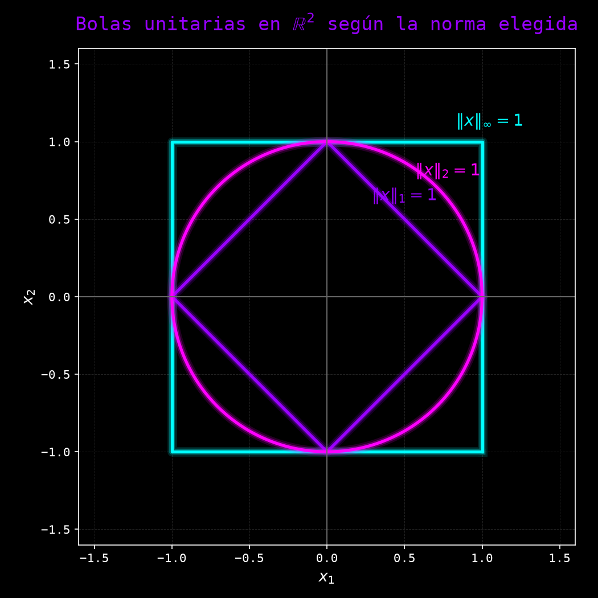
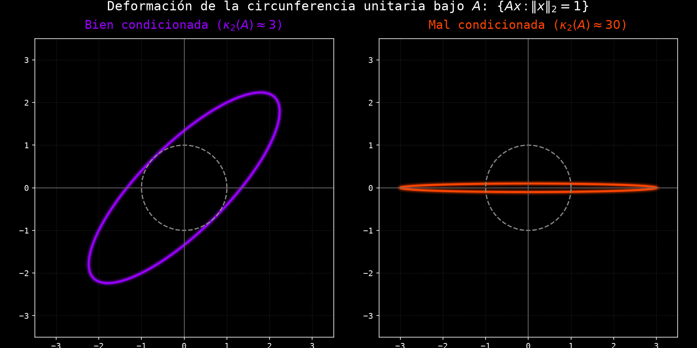

# Normas y Condicionamiento de Matrices

En esta clase se extiende el marco de la teoría del error de la Clase 3, hasta ahora restringido a cantidades escalares, al contexto vectorial y matricial: se introducen las normas vectoriales y matriciales necesarias para medir el tamaño de un vector y la amplificación producida por una matriz, y se define el número de condición $\kappa(A)$, que cuantifica la sensibilidad de un sistema lineal $Ax=b$ a perturbaciones en sus datos de entrada, sentando las bases necesarias para el estudio de los métodos directos e iterativos de las clases siguientes.

## 1. Normas vectoriales

### 1.1 Motivación y axiomas de una norma

En la Clase 3, el error se trató siempre como una cantidad escalar: la diferencia $|x-\tilde x|$ entre dos números. Sin embargo, muchos problemas de la ciencia y la ingeniería —en particular, resolver un sistema de ecuaciones lineales $Ax=b$— involucran no un solo número sino un vector de incógnitas $x \in \mathbb{R}^n$. Para poder hablar del "error" entre una solución exacta $x$ y una aproximada $\tilde x$, es necesario primero generalizar la noción de valor absoluto a una función que asigne a cada vector un único número no negativo que represente su tamaño, y que conserve las propiedades esenciales que ya intuimos del valor absoluto: solo el vector nulo mide cero, escalar un vector escala su tamaño en la misma proporción, y la distancia recorrida en dos tramos nunca es menor que la distancia directa entre los extremos.

> **Nota histórica:** La noción axiomática de norma se consolidó a comienzos del siglo XX dentro del análisis funcional, en el trabajo de Maurice Fréchet sobre espacios métricos abstractos (1906) y, de manera decisiva, en la tesis doctoral de Stefan Banach (1920), que dio origen a los hoy llamados espacios de Banach: espacios vectoriales normados y completos. Aunque este marco se desarrolló originalmente para espacios de dimensión infinita (como espacios de funciones), su restricción a $\mathbb{R}^n$ es exactamente la herramienta que necesita el análisis numérico para medir errores vectoriales.

**Definición 1.1 (Norma vectorial):**
Una **norma vectorial** sobre $\mathbb{R}^n$ es una función $\|\cdot\| : \mathbb{R}^n \to \mathbb{R}$ que satisface, para todo $x,y \in \mathbb{R}^n$ y todo escalar $\alpha \in \mathbb{R}$:
1. $\|x\| \geq 0$, y $\|x\| = 0 \iff x = 0$ (definida positiva).
2. $\|\alpha x\| = |\alpha|\,\|x\|$ (homogeneidad).
3. $\|x + y\| \leq \|x\| + \|y\|$ (desigualdad triangular).

### 1.2 Normas usuales en $\mathbb{R}^n$

De las infinitas funciones que satisfacen los tres axiomas de la Definición 1.1, tres resultan de uso constante en el análisis numérico, cada una capturando una noción distinta de "tamaño": la suma de las magnitudes de las componentes, la longitud euclidiana habitual, y la magnitud de la componente dominante.

**Definición 1.2 (Norma 1 o de Manhattan):**
$$\|x\|_1 = \sum_{i=1}^{n} |x_i|$$

**Definición 1.3 (Norma euclidiana o norma 2):**
$$\|x\|_2 = \left( \sum_{i=1}^{n} x_i^2 \right)^{1/2}$$

**Definición 1.4 (Norma infinito o del máximo):**
$$\|x\|_\infty = \max_{1 \leq i \leq n} |x_i|$$

**Ejemplo 1.1:**
Para el vector $x = (3,-4) \in \mathbb{R}^2$:
$$\|x\|_1 = |3| + |-4| = 7, \qquad \|x\|_2 = \sqrt{3^2 + (-4)^2} = \sqrt{25} = 5, \qquad \|x\|_\infty = \max(3,4) = 4$$

Nótese que las tres normas asignan un valor distinto al mismo vector: la elección de norma no es un simple detalle técnico, sino que determina numéricamente qué tan "grande" se considera un error.

La figura anterior ilustra geométricamente esta diferencia: la **bola unitaria** de cada norma —el conjunto $\{x : \|x\| = 1\}$— tiene una forma distinta según la norma elegida. Bajo la norma 1 es un diamante (rombo), bajo la norma 2 es la circunferencia habitual, y bajo la norma infinito es un cuadrado; el círculo unitario queda inscrito en el diamante y circunscrito en el cuadrado, una relación geométrica que se formaliza en la Observación al final de la Sección 1.3.

### 1.3 Equivalencia de normas

Dado que distintas normas asignan valores numéricos distintos a un mismo vector, cabe preguntarse si esto tiene consecuencias cualitativas: ¿podría un vector tener error "pequeño" bajo una norma pero error "grande" bajo otra? En dimensión finita, la respuesta es negativa: todas las normas son equivalentes, en el sentido de que dan lugar a la misma noción de convergencia y de acotamiento, difiriendo únicamente por constantes multiplicativas.

**Teorema 1.1 (Equivalencia de normas en $\mathbb{R}^n$):**
Sean $N_1$ y $N_2$ dos normas cualesquiera sobre $\mathbb{R}^n$. Entonces existen constantes $c, C > 0$, dependientes de $n$ pero no de $x$, tales que
$$c\, N_2(x) \leq N_1(x) \leq C\, N_2(x) \quad \text{para todo } x \in \mathbb{R}^n$$

**Demostración:**
Basta demostrar el resultado para $N_2 = \|\cdot\|_2$, pues la relación de equivalencia es transitiva y toda norma queda así comparada, a través de la euclidiana, con cualquier otra. Sea $N$ una norma arbitraria sobre $\mathbb{R}^n$ y $\{e_1,\ldots,e_n\}$ la base canónica. Para $x = \sum_{i=1}^n x_i e_i$, la desigualdad triangular y la homogeneidad dan
$$N(x) \leq \sum_{i=1}^n |x_i|\, N(e_i)$$
y aplicando la desigualdad de Cauchy-Schwarz al lado derecho,
$$\sum_{i=1}^n |x_i|\, N(e_i) \leq \left(\sum_{i=1}^n N(e_i)^2\right)^{1/2} \left(\sum_{i=1}^n x_i^2\right)^{1/2} = C\, \|x\|_2, \qquad C := \left(\sum_{i=1}^n N(e_i)^2\right)^{1/2}$$
lo cual establece la cota superior $N(x) \leq C\|x\|_2$. Esta misma desigualdad, aplicada a $x-y$ en lugar de $x$, junto con la desigualdad triangular inversa $|N(x)-N(y)| \leq N(x-y)$, muestra que $N$ es una función continua respecto a la topología inducida por $\|\cdot\|_2$: $|N(x)-N(y)| \leq N(x-y) \leq C\|x-y\|_2$.

Considérese ahora la esfera unitaria $S = \{x \in \mathbb{R}^n : \|x\|_2 = 1\}$, que es un conjunto cerrado y acotado y, por el teorema de Heine-Borel, compacto. Al ser $N$ continua sobre el compacto $S$, el teorema del valor extremo garantiza que $N$ alcanza un valor mínimo $m = \min_{x \in S} N(x)$. Como $x \neq 0$ para todo $x \in S$, el primer axioma de norma implica $N(x) > 0$ en $S$, de modo que $m > 0$. Para cualquier $x \neq 0$, el vector $x/\|x\|_2$ pertenece a $S$, luego $N(x/\|x\|_2) \geq m$ y, por homogeneidad, $N(x) \geq m\|x\|_2$. Tomando $c := m$ se obtiene la cota inferior buscada, y junto con la cota superior ya establecida,
$$c\|x\|_2 \leq N(x) \leq C\|x\|_2$$
para todo $x \in \mathbb{R}^n$. $\blacksquare$

> **Observación:** Para las tres normas usuales de la Definición 1.2-1.4 pueden darse las constantes explícitas
> $$\|x\|_\infty \leq \|x\|_2 \leq \|x\|_1 \leq n\,\|x\|_\infty, \qquad \|x\|_2 \leq \|x\|_1 \leq \sqrt{n}\,\|x\|_2$$
> Esto explica geométricamente la Figura de la Sección 1.2: el círculo unitario ($\|\cdot\|_2$) queda inscrito en el diamante ($\|\cdot\|_1$) y circunscrito en el cuadrado ($\|\cdot\|_\infty$), reflejando que $\|x\|_\infty \leq \|x\|_2 \leq \|x\|_1$ para todo $x$.

---

## 2. Normas matriciales

### 2.1 Norma matricial inducida

Una matriz $A \in \mathbb{R}^{n\times n}$ actúa como una transformación lineal sobre $\mathbb{R}^n$: a cada vector $x$ le asocia el vector $Ax$. Del mismo modo en que se necesitó una norma para medir el tamaño de un vector, se necesita ahora una medida del tamaño de una matriz que capture cuánto puede llegar a "amplificar" ésta a un vector en el peor de los casos, pues es precisamente esa amplificación la que determina cómo se propagan los errores de entrada al resolver un sistema lineal.

**Definición 2.1 (Norma matricial inducida):**
Dada una norma vectorial $\|\cdot\|$ sobre $\mathbb{R}^n$, la **norma matricial inducida** (o subordinada) de $A \in \mathbb{R}^{n\times n}$ es
$$\|A\| = \sup_{x \neq 0} \frac{\|Ax\|}{\|x\|} = \max_{\|x\|=1} \|Ax\|$$
La segunda igualdad es válida porque la esfera unitaria $\{x : \|x\|=1\}$ es compacta (Teorema 1.1) y $x \mapsto \|Ax\|$ es continua, de modo que el supremo se alcanza efectivamente como máximo.

**Teorema 2.1 (Propiedades de la norma inducida):**
Para $A, B \in \mathbb{R}^{n\times n}$ y $x \in \mathbb{R}^n$ cualesquiera, la norma inducida satisface:
$$\|Ax\| \leq \|A\|\,\|x\| \qquad \text{y} \qquad \|AB\| \leq \|A\|\,\|B\|$$

**Demostración:**
Para $x=0$ ambos lados de la primera desigualdad valen $0$. Para $x \neq 0$, por definición de supremo,
$$\|A\| = \sup_{y \neq 0} \frac{\|Ay\|}{\|y\|} \geq \frac{\|Ax\|}{\|x\|}$$
y despejando se obtiene $\|Ax\| \leq \|A\|\,\|x\|$. Para la segunda desigualdad, aplicando la primera dos veces,
$$\|ABx\| \leq \|A\|\,\|Bx\| \leq \|A\|\,\|B\|\,\|x\|$$
para todo $x$, de modo que $\|AB\| = \max_{\|x\|=1}\|ABx\| \leq \|A\|\,\|B\|$. $\blacksquare$

### 2.2 Fórmulas explícitas para las normas usuales

Calcular una norma matricial directamente a partir de la Definición 2.1 requiere, en principio, resolver un problema de optimización. Afortunadamente, para las tres normas vectoriales usuales existen fórmulas cerradas expresadas únicamente en términos de las entradas de $A$.

**Proposición 2.1 (Norma matricial 1):**
$$\|A\|_1 = \max_{1 \leq j \leq n} \sum_{i=1}^{n} |a_{ij}|$$
es decir, la máxima suma de valores absolutos por columna.

**Demostración:**
Para $\|x\|_1 = 1$,
$$\|Ax\|_1 = \sum_{i=1}^n \left| \sum_{j=1}^n a_{ij} x_j \right| \leq \sum_{i=1}^n \sum_{j=1}^n |a_{ij}||x_j| = \sum_{j=1}^n |x_j| \sum_{i=1}^n |a_{ij}| \leq \left(\max_j \sum_{i=1}^n |a_{ij}|\right) \sum_{j=1}^n |x_j| = \max_j \sum_{i=1}^n |a_{ij}|$$
lo cual da la cota superior $\|A\|_1 \leq \max_j \sum_i |a_{ij}|$. Esta cota se alcanza tomando $x = e_k$, el vector canónico correspondiente a la columna $k$ que realiza el máximo: en tal caso $\|e_k\|_1=1$ y $\|Ae_k\|_1 = \sum_i |a_{ik}| = \max_j \sum_i |a_{ij}|$, de modo que el supremo de la Definición 2.1 efectivamente iguala esta cota. $\blacksquare$

**Proposición 2.2 (Norma matricial infinito):**
$$\|A\|_\infty = \max_{1 \leq i \leq n} \sum_{j=1}^{n} |a_{ij}|$$
es decir, la máxima suma de valores absolutos por fila.

**Demostración:**
Para $\|x\|_\infty = 1$ (es decir, $|x_j| \leq 1$ para todo $j$),
$$\|Ax\|_\infty = \max_i \left| \sum_{j=1}^n a_{ij} x_j \right| \leq \max_i \sum_{j=1}^n |a_{ij}||x_j| \leq \max_i \sum_{j=1}^n |a_{ij}|$$
lo cual da la cota superior. Sea $k$ la fila que realiza el máximo; tomando $x_j = \text{sgn}(a_{kj})$ (de modo que $\|x\|_\infty=1$), se tiene $\sum_j a_{kj}x_j = \sum_j |a_{kj}|$, y como esta es exactamente la componente $k$ de $Ax$,
$$\|Ax\|_\infty \geq \left|\sum_{j=1}^n a_{kj}x_j\right| = \sum_{j=1}^n |a_{kj}| = \max_i \sum_{j=1}^n |a_{ij}|$$
de modo que la cota se alcanza y $\|A\|_\infty = \max_i \sum_j |a_{ij}|$. $\blacksquare$

**Proposición 2.3 (Norma matricial 2):**
$$\|A\|_2 = \sigma_{\max}(A)$$
donde $\sigma_{\max}(A)$ es el mayor **valor singular** de $A$, es decir, $\sigma_{\max}(A) = \sqrt{\lambda_{\max}(A^TA)}$, con $\lambda_{\max}(A^TA)$ el mayor valor propio de la matriz simétrica $A^TA$.

**Demostración:** Se demostrará con rigor en la Semana 6 del curso (valores y vectores propios), donde se estudiará la descomposición en valores singulares de una matriz; su justificación requiere diagonalizar la matriz simétrica $A^TA$, herramienta aún no introducida. Por ahora se acepta el resultado enunciado, que en el caso particular de una matriz $A$ simétrica se reduce a $\|A\|_2 = \max_i |\lambda_i(A)|$, el mayor valor propio de $A$ en valor absoluto (radio espectral).

**Ejemplo 2.1:**
Sea $A = \begin{pmatrix} 2 & 1 \\ 1 & 2 \end{pmatrix}$. Por la Proposición 2.1, la suma de valores absolutos de cada columna es $2+1=3$ en ambas columnas, de modo que $\|A\|_1 = 3$. Por la Proposición 2.2, ambas filas también suman $3$, de modo que $\|A\|_\infty = 3$. Como $A$ es simétrica, sus valores propios se obtienen de $(2-\lambda)^2 = 1$, es decir $\lambda = 1$ o $\lambda = 3$; por la Proposición 2.3, $\|A\|_2 = \max(1,3) = 3$. Las tres normas coinciden en este ejemplo particular, dando $\|A\|_1 = \|A\|_2 = \|A\|_\infty = 3$.

---

## 3. Número de condición de una matriz

### 3.1 Definición y motivación

En la Clase 3 (Ejemplo 8.2) se estudió el número de condición de la resta escalar $f(a,b)=a-b$, y se mostró que crece sin cota cuando $a$ y $b$ son casi iguales. El problema de resolver un sistema lineal $Ax=b$ admite un análisis completamente análogo: interesa saber cuánto se amplifica, en la solución $x$, una pequeña perturbación relativa en los datos de entrada $A$ o $b$. La cantidad que responde a esta pregunta es el **número de condición de la matriz** $A$.

> **Nota histórica:** El número de condición de una matriz fue introducido explícitamente por Alan Turing en su artículo "Rounding-Off Errors in Matrix Processes" (1948), en el contexto del análisis del error en la resolución numérica de sistemas lineales mediante computadoras digitales recién inventadas. John von Neumann y Herman Goldstine habían anticipado ideas similares un año antes, en 1947, al estudiar la inversión numérica de matrices. Ambos trabajos, mencionados ya de forma general en la Clase 2 al hablar del origen del análisis numérico moderno, establecieron por primera vez que el condicionamiento de un problema —y no únicamente la precisión aritmética de la máquina— determina la confiabilidad de una solución numérica.

**Definición 3.1 (Número de condición de una matriz):**
Sea $A \in \mathbb{R}^{n\times n}$ invertible y $\|\cdot\|$ una norma matricial inducida. El **número de condición** de $A$ respecto a esa norma es
$$\kappa(A) = \|A\| \, \|A^{-1}\|$$
Por convención, se define $\kappa(A) = \infty$ si $A$ es singular (no invertible).

**Proposición 3.1 (Cota inferior del número de condición):**
Para toda matriz invertible $A$, $\kappa(A) \geq 1$.

**Demostración:**
Como la norma matricial inducida de la identidad es $\|I\| = \max_{\|x\|=1}\|Ix\| = \max_{\|x\|=1}\|x\| = 1$, y por el Teorema 2.1, $1 = \|I\| = \|AA^{-1}\| \leq \|A\|\,\|A^{-1}\| = \kappa(A)$. $\blacksquare$

> **Observación:** Un número de condición cercano a $1$ (el mínimo posible) indica un problema **bien condicionado**: perturbaciones relativas pequeñas en los datos producen perturbaciones relativas comparables en la solución. Un número de condición $\kappa(A) \gg 1$ indica un problema **mal condicionado**. El valor numérico exacto de $\kappa(A)$ depende de la norma elegida, pero por el Teorema 1.1 todas resultan del mismo orden de magnitud salvo por una constante que depende solo de $n$.

### 3.2 Cota del error relativo en sistemas lineales

**Teorema 3.1 (Cota de perturbación para sistemas lineales):**
Sea $A$ invertible, $Ax = b$ con $b \neq 0$, y sea $x + \delta x$ la solución del sistema perturbado $A(x+\delta x) = b + \delta b$. Entonces
$$\frac{\|\delta x\|}{\|x\|} \leq \kappa(A) \, \frac{\|\delta b\|}{\|b\|}$$

**Demostración:**
Restando $Ax=b$ de $A(x+\delta x)=b+\delta b$ se obtiene $A\,\delta x = \delta b$, de donde $\delta x = A^{-1}\delta b$ y, por el Teorema 2.1,
$$\|\delta x\| \leq \|A^{-1}\|\, \|\delta b\|$$
Por otro lado, de $b = Ax$ y el Teorema 2.1 se sigue $\|b\| \leq \|A\|\,\|x\|$, es decir, $\dfrac{1}{\|x\|} \leq \dfrac{\|A\|}{\|b\|}$ (válido pues $x\neq 0$, ya que $b\neq 0$ y $A$ es invertible). Multiplicando ambas desigualdades,
$$\frac{\|\delta x\|}{\|x\|} \leq \|A^{-1}\|\,\|\delta b\| \cdot \frac{\|A\|}{\|b\|} = \|A\|\,\|A^{-1}\| \, \frac{\|\delta b\|}{\|b\|} = \kappa(A)\,\frac{\|\delta b\|}{\|b\|}$$
$\blacksquare$

**Ejemplo 3.1 (Sistema mal condicionado):**
Sea $\varepsilon = 10^{-4}$ y considérese la matriz casi singular
$$B = \begin{pmatrix} 1 & 1 \\ 1 & 1+\varepsilon \end{pmatrix}, \qquad \det(B) = \varepsilon$$
El sistema $Bx = b$ con $b = (2,\, 2+\varepsilon)$ tiene solución exacta $x=(1,1)$, como se verifica directamente: $1\cdot 1 + 1\cdot 1 = 2$ y $1\cdot 1 + (1+\varepsilon)\cdot 1 = 2+\varepsilon$. Perturbemos ahora únicamente la segunda componente de $b$ en $\delta = 10^{-4}$, obteniendo $b' = (2,\, 2+\varepsilon+\delta) = (2,\, 2.0002)$. Usando
$$B^{-1} = \frac{1}{\varepsilon}\begin{pmatrix} 1+\varepsilon & -1 \\ -1 & 1 \end{pmatrix}$$
la nueva solución es $x' = B^{-1}b' = \left(1 - \dfrac{\delta}{\varepsilon},\; 1 + \dfrac{\delta}{\varepsilon}\right) = (1-1,\, 1+1) = (0, 2)$, pues $\delta/\varepsilon = 1$.

**Comparación de errores relativos:**
$$\frac{\|\delta b\|_\infty}{\|b\|_\infty} = \frac{10^{-4}}{2.0001} \approx 5\times 10^{-5} \qquad \text{(perturbación de entrada: } 0.005\%\text{)}$$
$$\frac{\|\delta x\|_\infty}{\|x\|_\infty} = \frac{\max(|0-1|,\,|2-1|)}{1} = 1 \qquad \text{(cambio en la solución: } 100\%\text{)}$$
Una perturbación de apenas el $0.005\%$ en un solo dato de entrada produjo un cambio del $100\%$ en la solución. Esto es consistente con el Teorema 3.1: se calcula $\|B\|_\infty = 2+\varepsilon \approx 2$ y $\|B^{-1}\|_\infty = (2+\varepsilon)/\varepsilon \approx 2\times 10^4$, de donde $\kappa_\infty(B) = \|B\|_\infty\|B^{-1}\|_\infty \approx 4\times 10^4$, muy por encima de la amplificación observada ($1 / (5\times 10^{-5}) = 2\times 10^4$), tal como exige la desigualdad (no necesariamente ajustada) del Teorema 3.1.

La figura anterior ilustra geométricamente el fenómeno con dos matrices más manejables visualmente: la matriz $A$ del Ejemplo 2.1 ($\kappa_2(A) \approx 3$) apenas deforma la circunferencia unitaria en una elipse moderadamente alargada, mientras que una matriz diagonal con $\kappa_2 \approx 30$ la aplana en una elipse muy delgada. Cuanto mayor es $\kappa_2(A)$, más extrema es la razón entre el semieje mayor y el menor de la elipse imagen, y más direcciones existen en las que una perturbación pequeña de entrada se amplifica considerablemente en la salida.

---

## 4. Condicionamiento y estabilidad de sistemas lineales

### 4.1 Relación con la estabilidad de algoritmos

> **Observación importante:** El número de condición $\kappa(A)$, tal como se definió en la Definición 3.1, es una propiedad exclusiva del problema —la matriz $A$ y el vector $b$— e independiente por completo del algoritmo empleado para resolver $Ax=b$. Esto es exactamente análogo a la distinción establecida en la Clase 2 (Definición 4.4) y retomada en la Clase 3 (Sección 8.2) entre condicionamiento y estabilidad: un algoritmo **estable** (Definición 4.4 de la Clase 2) evita introducir amplificaciones adicionales de error más allá de las inherentes al problema, pero ningún algoritmo, por estable que sea, puede producir una solución confiable si $\kappa(A)$ es intrínsecamente grande.

**Ejemplo 4.1 (Anticipando la próxima clase):**
La eliminación gaussiana con pivoteo parcial —que se estudiará en la Clase 5 (Semana 4 del programa)— es un algoritmo numéricamente estable para resolver sistemas lineales. Sin embargo, al aplicarlo al sistema $Bx=b$ del Ejemplo 3.1, con $\kappa_\infty(B) \approx 4\times 10^4$, seguirá produciendo una solución sumamente sensible a pequeñas perturbaciones en $b$ (como las inevitables al representar los datos en aritmética de punto flotante, Clase 3, Sección 5): el $100\%$ de error relativo observado en el Ejemplo 3.1 no es un defecto del algoritmo de eliminación, sino una consecuencia ineludible del mal condicionamiento de $B$.

---

## 5. Ejercicios propuestos

### 5.1 Normas vectoriales

1. Calcule $\|x\|_1$, $\|x\|_2$ y $\|x\|_\infty$ para $x = (1,-2,2)$.

2. Demuestre, usando únicamente los tres axiomas de la Definición 1.1, que $\|-x\| = \|x\|$ para toda norma vectorial.

3. Verifique numéricamente las desigualdades $\|x\|_\infty \leq \|x\|_2 \leq \|x\|_1$ de la Observación de la Sección 1.3 para $x=(1,1,1,1)$, y determine si alguna de las desigualdades es una igualdad.

### 5.2 Normas matriciales

4. Calcule $\|A\|_1$, $\|A\|_\infty$ para $A = \begin{pmatrix} 1 & -2 \\ 3 & 4 \end{pmatrix}$ usando las Proposiciones 2.1 y 2.2.

5. Demuestre que $\|I\|=1$ para la norma matricial inducida por cualquier norma vectorial (use la Definición 2.1 directamente).

6. Para $A = \begin{pmatrix} 3 & 0 \\ 0 & -5 \end{pmatrix}$, calcule $\|A\|_2$ usando la Proposición 2.3 y compárelo con $\|A\|_1$ y $\|A\|_\infty$.

### 5.3 Número de condición

7. Calcule $\kappa_1(A)$ y $\kappa_\infty(A)$ para $A = \begin{pmatrix} 2 & 1 \\ 1 & 2 \end{pmatrix}$ del Ejemplo 2.1, verificando que coinciden con $\kappa_2(A)$ calculado en la Sección 3.1.

8. Para $\varepsilon = 10^{-6}$ (en lugar de $10^{-4}$) en la matriz $B$ del Ejemplo 3.1, estime cómo cambia $\kappa_\infty(B)$ y prediga la amplificación de error resultante.

9. Explique, usando el Teorema 3.1 y sin hacer ningún cálculo numérico adicional, por qué un sistema con $\kappa(A) \approx 1$ garantiza que errores relativos pequeños en $b$ producen errores relativos comparables en $x$.

10. Investigue el número de condición de la matriz de Hilbert $H_{ij} = 1/(i+j-1)$ para $n=3$ y compárelo con el de una matriz identidad de igual tamaño.

---

**Fin de la Clase 4: Normas y Condicionamiento de Matrices**
