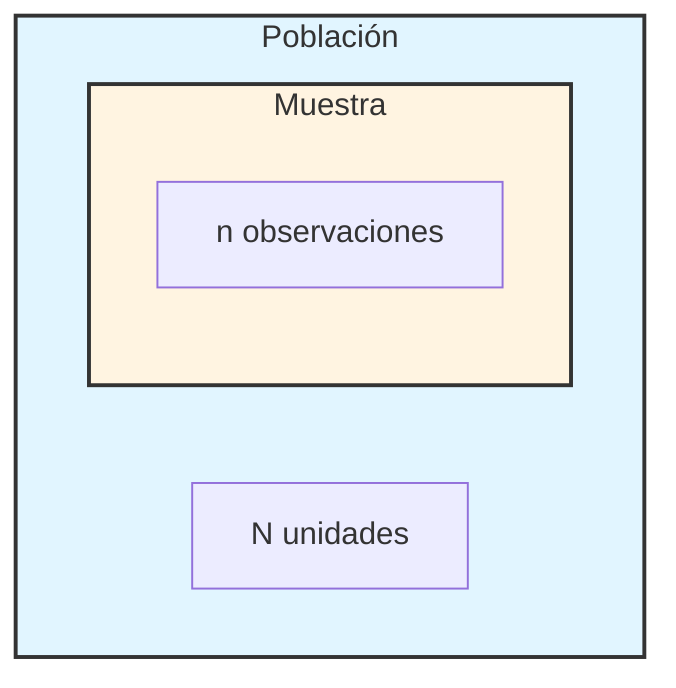
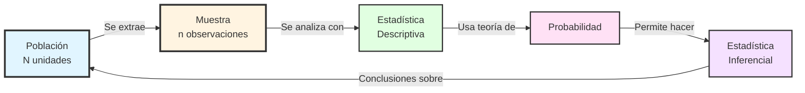
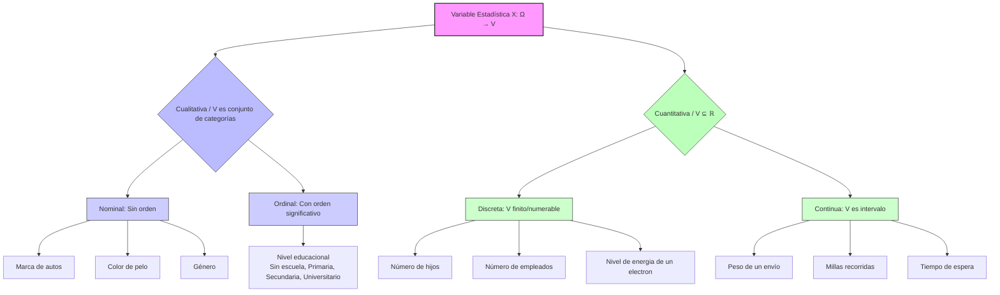
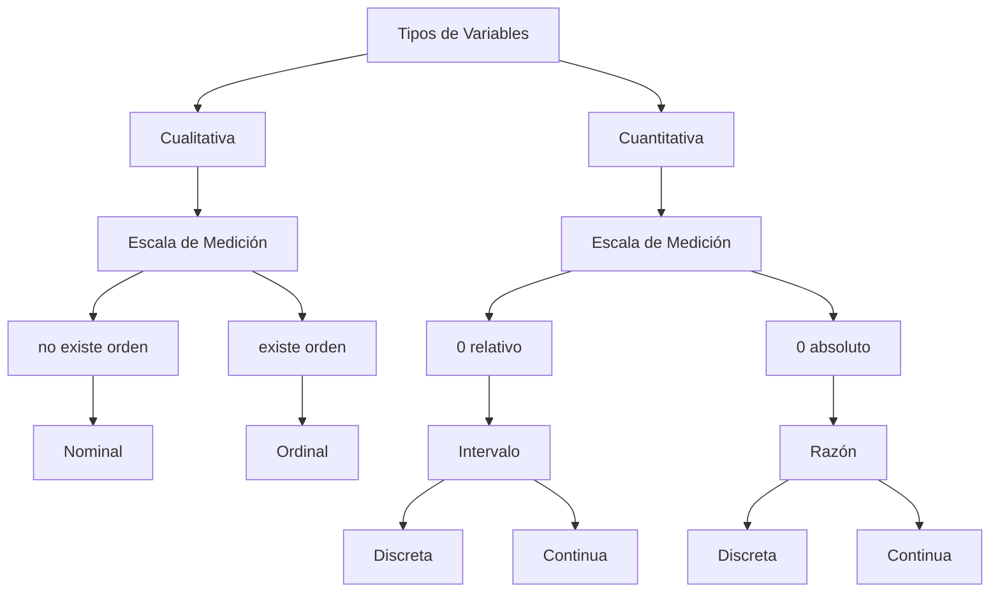

# Conceptos de Estadística

## ¿Qué es la estadística?

La estadística es la ciencia de recolectar, organizar, describir, presentar e interpretar datos, convierte información en conocimiento como un apoyo eficiente para la toma de decisiones en presencia de incertidumbre.
**Formalmente** La **Estadística** es la rama de las matemáticas aplicadas que se ocupa del desarrollo teórico y la aplicación práctica de **métodos para el tratamiento de datos empíricos**, entendidos como realizaciones de mecanismos aleatorios. Su estructura se bifurca en dos pilares complementarios: la **Estadística Descriptiva** y la **Estadística Inferencial**, cuyo sustento axiomático es proporcionado por la **Teoría de la Probabilidad**.
### Definiciones de conceptos clave:

**Estadística Descriptiva** *(o Análisis Exploratorio de Datos - EDA)*
* Es el conjunto de técnicas para **organizar, resumir y visualizar** la información contenida en un conjunto de datos (usualmente una muestra), sin intentar sacar conclusiones que vayan más allá de los datos mismos. Responde a la pregunta: _"¿Qué puedo observar directamente en estos datos?"_.
* **Formalmente:** Dado un vector de datos $x=(x_1,x_2,...,x_n) \in R^n$, que representa una realización muestral de una variable $X$, la **Estadística Descriptiva** se ocupa del cálculo de **estadísticos** $T(x)$ (como $\overline{x}$,$s^2$, cuantiles) y la construcción de **representaciones gráficas** (histogramas, diagramas de caja, scatterplot) que caractericen la distribución empírica de $X$. Su objeto es la descripción sintética de las propiedades de la **función de distribución empírica** $F_n(x)=\frac{1}{n}\sum_{i=1}^{n}\mathbb{I}_{(-\infty,\,x]}(x_i)$, donde $\mathbb{I}$ es la función indicadora.

**Estadística Inferencial**
* Es el conjunto de métodos que, partiendo de los datos de una **muestra**, permiten **formular conclusiones (inferencias), estimaciones y predicciones** sobre la **población** de la cual proviene la muestra, así como cuantificar el grado de incertidumbre asociado a dichas conclusiones. Responde a la pregunta: _"Dado lo que observo en esta muestra, ¿Qué puedo decir (con cierto nivel de confianza) sobre toda la población?"_.
* **Definición Formal:** Sea $\{X_1,X_2,...,X_n\}$ un conjunto de **variables aleatorias** que constituyen una **muestra aleatoria** de una **población** caracterizada por una **distribución de probabilidad** $F_\theta$ o una **función de densidad** $f_\theta$​, donde $\theta \in \Theta$ es un parámetro desconocido que pertenece a un espacio paramétrico $\Theta$. La **Estadística Inferencial** provee procedimientos basados en **estadísticos** $T(X_1,...,X_n)$ para:    
    1. **Estimación:** Construir funciones $\hat{\theta}(X_1,...,X_n)$ que aproximen el valor de $\theta$ (estimación puntual) o un subconjunto de $\Theta$ que probablemente lo contenga (intervalo de confianza).        
    2. **Contraste de Hipótesis:** Decidir, con un error controlado, entre dos afirmaciones contradictorias ($H_0$ vs $H_1$​) sobre $\theta$. Su validez depende críticamente de la **Teoría de la Probabilidad** para modelar el comportamiento de la muestra y de los estadísticos.

**Probabilidad** *(Teoría Matemática)*
* Es el **lenguaje y el marco matemático riguroso** para modelar, cuantificar la **incertidumbre**, la aleatoriedad o la posibilidad de ocurrencia de eventos y hacer predicciones basadas en datos muestrales. Es el _andamiaje teórico_ que sustenta toda la Estadística Inferencial.
* **Definición Axiomática de Kolmogorov:** Dado un **espacio muestral** $\Omega$ (conjunto de todos los resultados posibles de un experimento aleatorio) y una $\sigma$-álgebra $\mathcal{F}$ de subconjuntos de $\Omega$ (los **eventos**), una **medida de probabilidad** $\mathbb{P}$ es una función $\mathbb{P}: \mathcal{F}\to[0,1]$ que satisface: 
    1. **No negatividad:** $\forall A \in \mathcal{F}$ cumple $\mathbb{P}(A)\geq 0$.
    2. **Normalización:** $\mathbb{P}(\Omega)=1$.    
    3. **σ-Aditividad:** Para cualquier secuencia numerable de eventos mutuamente excluyentes $\{A\}_{i=0}^{\infty}$ en $\mathcal{F}$, se cumple $\mathbb{P}(\bigcup_{i=1}^{n} A_i)=\sum_{i=1}^{\infty}{\mathbb{P}(A_i)}$. La terna$(\Omega,\mathcal{F},\mathbb{P})$ se denomina **espacio de probabilidad**. Sobre este fundamento, se definen objetos clave como **variables aleatorias**, **funciones de distribución**, **esperanza** y **varianza**, que constituyen el puente formal entre el modelo teórico (PP) y los datos observados.

TEORÍA DE LA PROBABILIDAD
    └── (Proporciona el modelo matemático)
            ↓
ESTADÍSTICA INFERENCIAL
    └── (Aplica el modelo para generalizar a partir de datos)
            ↑
ESTADÍSTICA DESCRIPTIVA
    └── (Proporciona el resumen inicial de los datos observados)

**Población:** 
* Conjunto total de unidades de análisis correspondientes al estudio que se desea realizar. La cantidad total de unidades de una población es denotada por $N$ y es llamado tamaño poblacional.

**Muestra:** 
* Es un subconjunto de la población sobre el cual realmente recogemos datos, debe ser representativa y aleatoria. La muestra es representativa si su información se asemeja a la población; y es aleatoria si los datos fueron obtenidos de manera espontánea sin preferencia. La cantidad de observaciones de una muestra es denotada por $n$ y es llamada tamaño muestral.

**Definición Formal:**
* Sea el estudio de una característica. Definimos la **población** como un conjunto $\Omega$ (llamado espacio muestral en el contexto de probabilidades), donde cada elemento $\omega \in \Omega$ es una unidad de observación. Una **muestra** $S$ es cualquier subconjunto finito de $\Omega$, es decir, $S \subseteq \Omega$ con $|S| = n < \infty$.

#### Relación entre Población y Muestra

#### Esquema conceptual de la Estadística

**Muestreo**:
* El **muestreo** es el proceso de **seleccionar un subconjunto** de elementos (muestra) de una **población** más grande, con el objetivo de estudiar las propiedades de la población a partir de la información contenida en la muestra.
* Sea $\Omega$ una **población**, un **muestreo** es un procedimiento que genera una **muestra** $S$, definida como una colección de $n$ elementos de $\Omega$:
					  $S=\{\omega_1,\omega_2,...,\omega_n\}\subset \Omega$ 
  donde $n$ es el tamaño muestral. El muestreo puede verse como una función aleatoria que asigna a la población $\Omega$ un subconjunto $S$ según ciertas reglas probabilísticas:

**Tipos de muestreos Probabilístico**: 
Cada elemento de la población tiene una **probabilidad conocida y positiva** de ser seleccionado.
* **a) Muestreo Aleatorio Simple (MAS)**: Cada posible muestra de tamaño $n$ tiene **igual probabilidad** de ser seleccionada. *Matemáticamente:* Si $|\Omega|=N$, hay $\binom{N}{n}$ muestras posibles, cada una con probabilidad $1 / \binom{N}{n}$.
  **Ejemplo:** Sortear 100 nombres de una lista de 10,000 empleados.
* **b) Muestreo Sistemático**: Se selecciona un elemento al azar entre los primeros $k$ y luego cada k-ésimo elemento.
  **Fórmula:** Si $N=nk$, se elige aleatoriamente un número $r\in \{1,2,...,k\}$ y la muestra es $\{r,r+k,r+2k,...,r+(n-1)k\}$.
  **Peligro:** Si existe periodicidad en la población que coincida con $k$, la muestra será sesgada.
* **c) Muestreo Estratificado**: La población se divide en **estratos** homogéneos internamente y se toma una muestra aleatoria simple de cada estrato. **Matemáticamente:** $\Omega = \bigcup_{i=1}^{H} \Omega_{i}$ con $\Omega_{i} \cap \Omega_{j}=\varnothing$ para $i \neq j$. Se selecciona una muestra $S_i$ de cada $\Omega_i$.
  **Ventaja:** Mayor precisión si los estratos son internamente homogéneos pero diferentes entre sí.
* **d) Muestreo por Conglomerados**: La población se divide en **conglomerados** (naturalmente existentes), se seleccionan algunos conglomerados aleatoriamente y se estudian **todos** sus elementos.
  **Ejemplo:** Para estudiar escuelas en una ciudad: seleccionar aleatoriamente 10 escuelas y encuestar a todos sus estudiantes.

**Tipos de muestreos No Probabilísticos**: 
La selección no sigue reglas aleatorias conocidas; la inferencia estadística formal no es válida.
- **Por Conveniencia:** Seleccionar los elementos más accesibles.    
- **Por Juicio:** El investigador selecciona basándose en su criterio.    
- **Por Cuotas:** Se busca replicar la composición de la población en ciertas características.

**Errores Comunes en Muestreo**:
1. **Error de cobertura:** El marco muestral no incluye toda la población.    
2. **Error de no respuesta:** Los seleccionados no participan.    
3. **Error de medición:** Los instrumentos miden mal.    
4. **Error de selección:** El procedimiento no es aleatorio.    
5. **Falacia del tamaño:** Creer que muestras grandes automáticamente son representativas.

Un hito crucial fue el trabajo de **Jerzy Neyman** en 1934, quien demostró matemáticamente que el **muestreo aleatorio estratificado** era más eficiente que el muestreo por cuotas (común en encuestas de la época). Durante la Segunda Guerra Mundial, el muestreo se aplicó intensivamente para control de calidad en la producción militar estadounidense, liderado por **Walter Shewhart** y **W. Edwards Deming**.

Paradójicamente, uno de los fracasos más famosos del muestreo fue la **encuesta de Literary Digest** de 1936: predijo erróneamente la victoria de Landon sobre Roosevelt usando una muestra enorme (2.4 millones) pero **sesgada** (de listas de teléfono y registros de automóviles, que en plena Gran Depresión representaban solo a los más ricos). Este episodio demostró que el **tamaño** de la muestra es menos importante que su **representatividad**.

---
**Variable Estadística**
* Es una propiedad o característica de interés de los individuos de una población.
* Una **variable estadística** es una función $X: \Omega \to \mathbb{R}$ que asigna un número real a cada unidad de la población. Por ejemplo, si tomamos un espacio muestral $\Omega$ como los alumnos de una clase, donde definimos nuestra variable estadística $X$ como la **altura en cm**, entonces tendremos una función que se verá de la siguiente forma:
-

     Ω Alumno (Población)      X: Ω → ℝ          ℝ (Valores posibles)
     ┌────────────┐           ┌──────────┐       ┌─────────────────┐
     │  ω₁: Ana   │──────────►│  170 cm  │       │    160          │
     ├────────────┤           ├──────────┤       │    170          │
     │  ω₂: Carlos│──────────►│  173 cm  │       │    173          │
     ├────────────┤           ├──────────┤       │    175          │
     │  ω₃: María │──────────►│  181 cm  │       │    180          │
     ├────────────┤           ├──────────┤       │    186          │
     │    ...     │           │   ...    │       │    ...          │
     └────────────┘           └──────────┘       └─────────────────┘
       (Dominio)               (Función X)         (Codominio/Imagen)

  Dependiendo de la naturaleza del conjunto imagen $X(\Omega)$, clasificamos la variable: 
	1) **Variable Cualitativa:** *(o Categórica)* Es una variable que describe una cualidad, atributo o categoría no numérica de los elementos de la población. Sus valores representan estados o grupos. Ejemplos de variables cualitativas pueden ser la marca de autos, el juego favorito o el nivel socioeconómico.
	   Una variable $X: \Omega \to \mathcal{C}$ es **cualitativa** si el conjunto $\mathcal{C}$ de sus posibles valores (codominio) es un conjunto numerable de **etiquetas** (categorías), donde la estructura de $\mathcal{C}$ puede o no carecer de una relación de orden total inherente. Según esto, se subclasifica en las siguientes escalas de medida:
		- *Nominal:* 
		  Las categorías no tienen un orden natural o jerárquico. Solo indican diferencia o pertenencia a un grupo (ej.: color de ojos, tipo de sangre, profesión, país de origen).
		  Sea $X: \Omega \to \mathcal{C}$ una variable cualitativa. Es **nominal** si el conjunto $\mathcal{C}$ está dotado únicamente de la relación de **igualdad/desigualdad**. No existe una relación de orden $\leq$ en $\mathcal{C}$ que sea relevante para el fenómeno modelado por $X$. Cualquier biyección $F:\mathcal{C} \to \{1,2,...,k\}$ es una codificación válida, pero la elección de $F$ es arbitraria (no preserva estructura).
		- *Ordinal:*
		  Las categorías tienen un orden o jerarquía natural, pero la _distancia_ entre categorías no está definida o no es uniforme (ej.: nivel de satisfacción ["Insatisfecho", "Neutral", "Satisfecho"], grado académico, etapa de una enfermedad ["Leve", "Moderado", "Severo"]).
		  Sea $X: \Omega \to \mathcal{C}$ una variable cualitativa. Es **ordinal** si el conjunto $\mathcal{C}$ está dotado de una relación de **orden total** $\leq$ que es significativa para el análisis. Existe una función inyectiva $g:\mathcal{C} \to \mathbb{R}$ que preserva el orden (es un **isomorfismo de orden**), pero ninguna función de ese tipo preserva necesariamente distancias. La codificación numérica (ej.: 1,2,3,...) representa el orden, pero operaciones aritméticas con esos números pueden carecer de sentido.
		  Por ejemplo, pensemos en $\mathcal{C}$ como el conjunto con el nivel de satisfacción antes mencionado. Una posible función $g$ podría asignar los valores:
		  Insatisfecho → 1
		  Neutral → 2
		  Satisfecho → 3
	2) **Variable Cuantitativa:** Es una variable que se expresa numéricamente mediante cantidades. Permite realizar operaciones aritméticas (suma, resta, promedio) con sentido. Ejemplos de variables cuantitativas pueden ser la temperatura a cierta hora, la resistencia eléctrica de un material, el número de hermanos o la altura de los alumnos.
	   Una variable $X: \Omega \to \mathbb{R}$ es **cuantitativa** si su conjunto de valores posibles $X(\Omega)$ es un subconjunto de $\mathbb{R}$ donde las operaciones aritméticas y la **métrica euclidiana estándar** (la distancia $|a-b|$) son interpretables en el contexto del fenómeno medido. Esta se puede dividir según su naturaleza en:
		- *Discreta:* 
		  Cuando solo puede tomar valores numéricos aislados. Sus posibles valores forman un conjunto finito o infinito numerable, como los valores en un dado común $(1,2,3,4,5,6)$, la cantidad de hojas usadas en una imprenta $(0,1,2,...)$, o la energía de un electrón en un átomo de hidrógeno $(-13.6eV, -3.4eV, -1.51eV)$.
		  Una variable cuantitativa $X: \Omega \to \mathbb{R}$ es **discreta** si el conjunto $X(\Omega) \subset \mathbb{R}$ es un conjunto **numerable**, es decir, de la forma $\{x_1,x_2,x_3\}$ o $\{x_1,x_2,x_3,x_4,x_5,...\}$. Equivalentemente, si su **función de distribución acumulada** $F(x)=\mathbb{P}(X \leq x)$ es una función escalonada con saltos en un conjunto numerable de puntos.
		- *Continua:*
		  Cuando puede tomar cualquier valor dentro de un intervalo (o unión de intervalos) de números reales. Por ejemplo, $X \in [a,b]$ o $X \in [a,b) \cup (c,d]$.
		  Una variable cuantitativa $X$ es **(absolutamente) continua** si existe una función integrable no negativa $f_X:\mathbb{R} \to \mathbb{R}_{\geq 0}$, llamada **función de densidad de probabilidad (FDP)**, tal que para cualquier intervalo $(a,b] \subset \mathbb{R}$, se cumple $\mathbb{P}(a<X\leq b) =\int_{a}^{b}f_X(x)dx$. Equivalentemente, su función de distribución $F_X(x)$ es una función absolutamente continua en $\mathbb{R}$.

Variable Estadística $X:\Omega \to V$
│
├───> Cualitativa ($V$ es un conjunto de categorías)
│      │
│      ├── Nominal: Solo igualdad/desigualdad. (Ej: Género {M, F, Otro})
│      │
│      └── Ordinal: Con orden significativo. (Ej: Grado de dolor {Bajo, Medio, Alto})
│
└───> Cuantitativa ($V \subset \mathbb{R}$, con estructura métrica)
       │
       ├── Discreta: $V$ es finito/numerable. (Ej: Número de fallos)
       │
       └── Continua: $V$ es un intervalo. (Ej: Concentración de glucosa)

        

Las variables cuantitativas también cuentan con sus escalas de medidas, estas son:
* **Intervalo:** 
	Es una escala cuantitativa donde las **diferencias** entre valores son significativas y consistentes, pero **no existe un cero absoluto** o natural. El cero es arbitrario (un punto de referencia convencional), por lo que no se pueden hacer afirmaciones sobre **proporciones** o **razones** entre valores.
	Sea $X:\Omega \to \mathbb{R}$ una variable cuantitativa. Decimos que $X$ está medida en una **escala de intervalo** si su estructura admite transformaciones **lineales afines** que preservan la información relevante. Es decir, si $Y=aX+b$ (con $a>0$) es una representación **igualmente válida** de la misma variable. La **métrica** es preservada solo para diferencias: $d(x_1,x_2)=|x_1-x_2|$ Es significativa pero los cocientes $x_1/x_2$ *no* son interpretables.
	Propiedades clave:
	* **Orden:** $x_1>x_2$​ tiene significado
	* **Diferencia:** $x_1-x_2=k$ tiene significado
	* **Origen (Cero):** El cero es arbitrario
	* **Razón:** $x_1/x_2$​ **no** tiene significado
	
	Algunos ejemplos son:
	* **Temperatura en grados Celsius o Fahrenheit:**
	  20°C no es "el doble de caliente" que 10°C (en términos de energía térmica), pero la diferencia 20°C−10°C=10°C es igual a la diferencia 30°C−20°C=10°C.
	* **Años en calendario (e.g., 2024, 1492):**
	  El año 0 es convencional (nacimiento de Cristo) y no significa ausencia de años. No podemos decir "2024 es el doble de 1012" en ningún sentido histórico significativo.
	* **Puntuación en tests estandarizados (SAT, IQ*):** 
	  Un IQ de 100 no significa "el doble de inteligencia" que uno de 50. (*Nota: El IQ es controvertido, pero técnicamente se diseña como escala de intervalo).
* **Razón (o Proporción):** 
	Es la escala cuantitativa **más rica**. Posee un **cero absoluto** que indica **ausencia total** de la cantidad medida. Esto permite comparaciones tanto de diferencias como de **proporciones** entre valores.
	Sea $X:\Omega \to \mathbb{R}_{\geq 0}$ una variable cuantitativa no negativa. Decimos que $X$ está medida en una **escala de razón** si su estructura admite únicamente transformaciones de **escala** (multiplicativas) que preservan la información. Es decir, si $Y=aX$ (con $a>0$) es una representación igualmente válida. La métrica preserva tanto diferencias como razones: $d(x_1,x_2)=|x_1-x_2|$ y $r(x_1,x_2)=x_1/x_2$ son significativas.
	Propiedades clave:
	* **Orden:** $x_1>x_2$​ tiene significado
	* **Diferencia:** $x_1-x_2=k$ tiene significado
	* **Origen (Cero):** Existe un cero absoluto (significa "nada de la cantidad")
	* **Razón:** $x_1/x_2$​ **sí** tiene significado ("$x_1$​ es el doble/triple de $x_2$​")

	Algunos ejemplos son:
	* **Longitud, masa, tiempo (en segundos):** 
	  0 cm = ausencia de longitud. 20 cm es **el doble** de 10 cm.
	* **Concentración química (mol/L):**
	  0 M = ausencia del soluto. Una solución 0.4 M tiene el doble de concentración que una 0.2 M.
	* **Ingreso monetario, densidad, energía cinética:**
	  Todos tienen cero absoluto y permiten afirmaciones de proporción.

**Variables Aleatorias**:
* Es una función que asigna valores, usualmente numéricos, al resultado de un experimento aleatorio, es decir toma un elemento del espacio muestral y le da un numero.
* Sea $(\Omega, \mathcal{F},\mathbb{P})$ un **espacio de probabilidad**. Una **variable aleatoria** (v.a.) es una función $X: \Omega \to \mathbb{R}$ que es $\mathcal{F}$-medible, es decir:
  $\forall B \in \mathcal{B}(\mathbb{R})$,  $X^{-1}(B)=\{\omega \in \Omega : X(\omega) \in B\} \in \mathcal{F}$
  donde $\mathcal{B}(\mathbb{R})$ es la $\sigma$-álgebra de Borel en $\mathbb{R}$.

---
**Parámetro**: 
* Es una **característica numérica fija** que describe alguna propiedad de una **población completa**. Es un valor constante (pero generalmente desconocido) que queremos conocer o estimar.
* Sea $\Omega$ una **población** y sea $P_{\theta}$ una **familia paramétrica de distribuciones de probabilidad** sobre $\Omega$, indexada por $\theta$. Un **parámetro** es un elemento $\theta \in \Theta$, donde $\Theta \subset \mathbb{R}^k$ es el **espacio paramétrico**. Más específicamente, un parámetro es una **función** que asigna a cada distribución $P$ en la familia un valor numérico: $\theta: \mathcal{P} \to \mathbb{R}^k$ donde $\mathcal{P}=\{P_\theta : \theta \in \Theta\}$ es la familia de distribuciones.
* **Características Esenciales**:
	* *Propiedad Poblacional*: Un parámetro describe a **toda la población**
	* *Constante Desconocida*: En la práctica, $\theta$ es fijo pero desconocido. Nunca lo observamos directamente (excepto en censos completos).
	* *Dimensión*: Un parámetro puede ser:
	  **Escalar**: $\theta \in \mathbb{R}$ (ej: media $\mu$)
	  **Vectorial**: $\theta \in \mathbb{R}^k$ (ej: $\theta = (\mu, \sigma^2)$ en distribución normal)

**Estadístico**:
* Es cualquier número o cantidad que se calcula a partir de los datos de una muestra. Es una función de los datos observados que resume o describe alguna característica de la población o muestra.
* Sea $X_1,X_2,...,X_n$ una **muestra aleatoria** de tamaño $n$, es decir, variables aleatorias independientes e idénticamente distribuidas (i.i.d.) con distribución $F_\theta$. Un **estadístico** $T$ es cualquier **función medible** de la muestra que **no depende de parámetros desconocidos**:   $T:\mathbb{R}^n \to \mathbb{R}^k$
  $T=g(X_1,X_2,...,X_n)$
  donde $g$ es una función **conocida** y **determinista** (no aleatoria en su forma funcional).

**Estimador**:
* Es un estadístico que tiene como objetivo aproximar el valor de un parámetro poblacional desconocido. Es una estimación de un parámetro en específico.
* Sea $(\Omega, \mathcal{F},P_\theta)$ un **modelo estadístico** paramétrico, donde $\theta \in \Theta \subseteq \mathbb{R}^k$ es el parámetro desconocido. Dada una muestra aleatoria $X_1,...,X_n\sim P_\theta$ i.i.d., un **estimador** de $\theta$ es una función medible:
  $\hat{\theta} : \mathcal{X}^n \to \Theta$
  $\hat{\theta}=T(X_1,...,X_n)$
  que asigna a cada posible realización muestral $(x_1,...,x_n)$ un valor en el espacio paramétrico $\Theta$.
