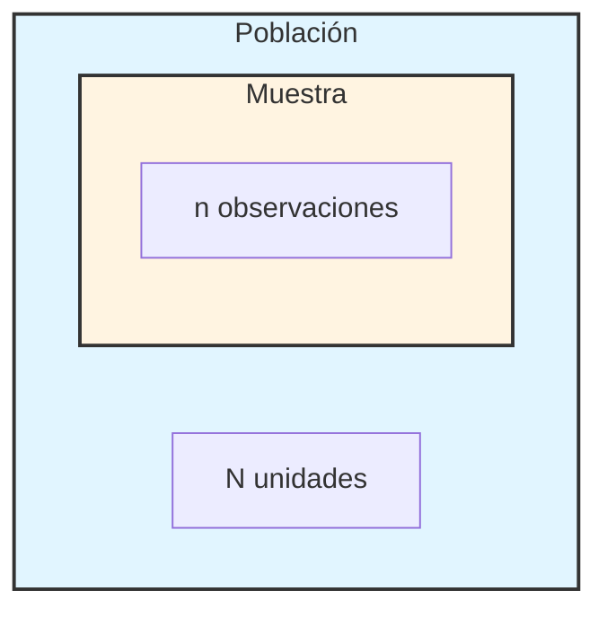
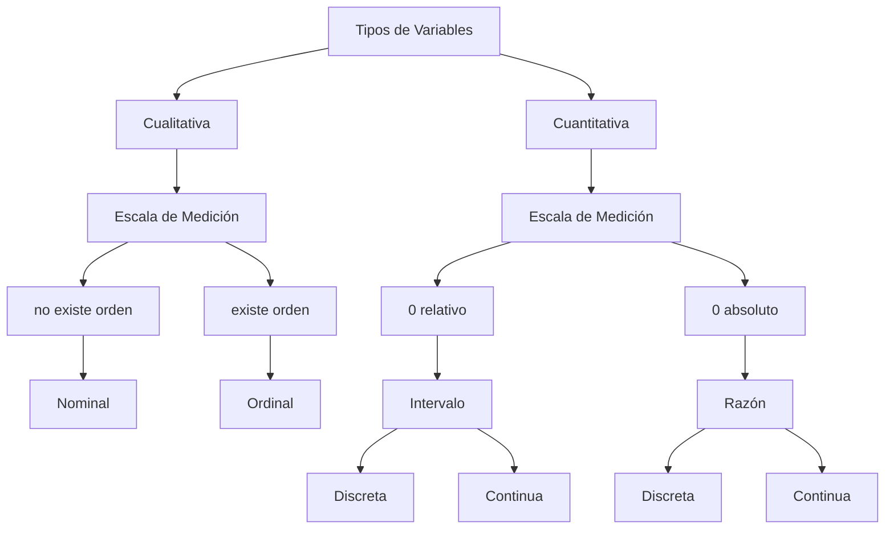

# Conceptos de Estadística

En esta clase se presentan, de manera introductoria, los conceptos y el lenguaje básico de la estadística: la distinción entre descripción e inferencia, la relación entre población y muestra, los métodos de muestreo, los tipos de variables, las escalas de medición, y los roles del parámetro, el estadístico y el estimador. El objetivo es familiarizarse con los términos; cada concepto se desarrollará en profundidad a lo largo del curso.

---
## 1. Estadística: descripción e inferencia

La estadística es la ciencia de recolectar, organizar, describir, presentar e interpretar datos; convierte información en conocimiento como un apoyo eficiente para la toma de decisiones en presencia de incertidumbre. **Formalmente**, la estadística es la rama de las matemáticas aplicadas que se ocupa del desarrollo teórico y la aplicación práctica de métodos para el tratamiento de datos empíricos, entendidos como realizaciones de mecanismos aleatorios. Su estructura se bifurca en dos pilares complementarios: la **estadística descriptiva** y la **estadística inferencial**, cuyo sustento axiomático es proporcionado por la **teoría de la probabilidad**.

### 1.1 Estadística descriptiva

Cuando nos enfrentamos a un conjunto de datos por primera vez, nuestro cerebro es incapaz de procesar el volumen bruto de información. Necesitamos herramientas que nos permitan simplificar la realidad observada para captar sus rasgos esenciales. La estadística descriptiva es el conjunto de técnicas para organizar, resumir y visualizar la información contenida en un conjunto de datos (usualmente una muestra), sin intentar sacar conclusiones que vayan más allá de los datos mismos. Responde a la pregunta: "¿Qué puedo observar directamente en estos datos?".

**Definición 1.1 (Estadística descriptiva):**
La **estadística descriptiva** es el conjunto de métodos que permiten organizar, resumir, visualizar y describir las características de un conjunto de datos.

Dada una realización muestral $\mathbf{x} = (x_1, x_2, \ldots, x_n) \in \mathbb{R}^n$ de una variable $X$, la estadística descriptiva estudia estadísticos $T(\mathbf{x})$, como la media muestral $\overline{x}$, la varianza muestral $s^2$ o los cuantiles, y construye representaciones gráficas como histogramas, diagramas de caja o diagramas de dispersión. Su objetivo es caracterizar la distribución empírica de los datos mediante la función de distribución empírica:
$$F_n(x) = \dfrac{1}{n} \sum_{i=1}^{n} \mathbb{I}_{(-\infty, x]}(x_i)$$
donde $\mathbb{I}_{(-\infty, x]}$ es la función indicadora del intervalo $(-\infty, x]$.

**Ejemplo 1.1:**
En un estudio sobre tiempos de respuesta de un servidor web se obtienen los siguientes datos (en milisegundos):
$$120, \; 135, \; 128, \; 142, \; 130, \; 125, \; 138, \; 131$$
La estadística descriptiva calcula, entre otras medidas:
$$\overline{x} = \dfrac{120 + 135 + 128 + 142 + 130 + 125 + 138 + 131}{8} = 131.125$$
y permite construir un histograma o un diagrama de caja para observar la dispersión y la forma de los datos.

> **Observación:** La estadística descriptiva no permite, por sí sola, afirmar que el tiempo promedio de respuesta de todos los servidores sea $131.125$ ms. Solo describe la muestra observada.

### 1.2 Estadística inferencial

El verdadero poder de la ciencia de datos reside en la capacidad de generalizar. Dado que casi nunca disponemos de recursos para censar o medir a cada miembro de una población de interés, debemos tomar decisiones basadas en información parcial. La estadística inferencial actúa como un microscopio matemático: nos permite extrapolar las observaciones locales obtenidas en una muestra representativa hacia toda la población, estimando el riesgo y el nivel de incertidumbre matemática de esta generalización.

**Definición 1.2 (Estadística inferencial):**
La **estadística inferencial** es el conjunto de métodos que, a partir de los datos de una muestra, permiten formular conclusiones, estimaciones o predicciones sobre una población, junto con una medida de la incertidumbre asociada.

Sean $X_1, X_2, \ldots, X_n$ variables aleatorias independientes e idénticamente distribuidas que constituyen una muestra aleatoria de una población con distribución $F_\theta$ (o densidad $f_\theta$), donde $\theta \in \Theta$ es un parámetro desconocido. La estadística inferencial proporciona procedimientos basados en estadísticos $T(X_1, \ldots, X_n)$ para:
1. **Estimación:** construir funciones $\hat{\theta}(X_1, \ldots, X_n)$ que aproximen el valor de $\theta$ o un subconjunto de $\Theta$ que lo contenga.
2. **Contraste de hipótesis:** decidir, con un error controlado, entre dos afirmaciones contradictorias $H_0$ y $H_1$ sobre $\theta$.

**Ejemplo 1.2:**
Si el tiempo promedio de respuesta observado en la muestra del Ejemplo 1.1 es $\overline{x} = 131.125$ ms, la inferencia estadística permite construir un intervalo de confianza para la media poblacional $\mu$. Por ejemplo:
$$\overline{x} \pm \text{margen de error}$$
Este intervalo indica un rango de valores plausibles para $\mu$, acompañado de una probabilidad de cobertura.

### 1.3 Probabilidad como fundamento

Para que las generalizaciones de la inferencia estadística no sean simples conjeturas o actos de fe, requerimos un lenguaje matemático que estructure y cuantifique la incertidumbre. La teoría de la probabilidad proporciona este marco axiomático riguroso. Sin ella, sería imposible modelar la aleatoriedad del muestreo ni evaluar la precisión de nuestros estimadores.

> **Nota histórica:** En 1900, David Hilbert incluyó entre sus famosos problemas el problema 6, que pedía axiomatizar la física y, dentro de ella, la teoría de probabilidades. No fue hasta 1933 cuando Andrei Kolmogorov publicó *Grundbegriffe der Wahrscheinlichkeitsrechnung*, donde estableció la axiomatización que hoy se conoce como los axiomas de Kolmogorov. Esta obra consolidó la probabilidad como una rama formal de las matemáticas y sentó las bases de la estadística matemática moderna.

**Definición 1.3 (Probabilidad):**
La **probabilidad** es el marco matemático que permite modelar, cuantificar y estudiar la incertidumbre asociada a fenómenos aleatorios.

Formalmente, dado un espacio muestral $\Omega$ y una $\sigma$-álgebra $\mathcal{F}$ de subconjuntos de $\Omega$, una **medida de probabilidad** es una función $\mathbb{P}: \mathcal{F} \to [0,1]$ que satisface:
1. **No negatividad:** $\forall A \in \mathcal{F}$, se cumple $\mathbb{P}(A) \geq 0$.
2. **Normalización:** $\mathbb{P}(\Omega) = 1$.
3. **$\sigma$-aditividad:** para cualquier sucesión $\{A_i\}_{i=1}^{\infty}$ de eventos mutuamente excluyentes en $\mathcal{F}$:
$$\mathbb{P}\left( \bigcup_{i=1}^{\infty} A_i \right) = \sum_{i=1}^{\infty} \mathbb{P}(A_i)$$
La terna $(\Omega, \mathcal{F}, \mathbb{P})$ se denomina **espacio de probabilidad**.

**Ejemplo 1.3 (Espacio de probabilidad discreto):**
Pensemos en el lanzamiento de una moneda equilibrada dos veces sucesivas. El espacio de todos los resultados posibles es el conjunto finito $\Omega = \{HH, HT, TH, TT\}$. Definimos la $\sigma$-álgebra como el conjunto potencia $\mathcal{F} = \mathcal{P}(\Omega)$, el cual contiene los $2^4 = 16$ eventos posibles. La medida de probabilidad asigna a cada evento elemental $\omega_i \in \Omega$ la probabilidad uniforme $\mathbb{P}(\{\omega_i\}) = 1/4$. Si definimos el evento $A$ como "obtener al menos una cara", entonces $A = \{HH, HT, TH\}$, y por la propiedad de aditividad:
$$\mathbb{P}(A) = \mathbb{P}(\{HH\}) + \mathbb{P}(\{HT\}) + \mathbb{P}(\{TH\}) = \dfrac{1}{4} + \dfrac{1}{4} + \dfrac{1}{4} = \dfrac{3}{4}$$

**Aplicaciones:**
La relación entre los tres pilares puede resumirse así: la estadística descriptiva resume los datos observados; la teoría de probabilidad modela el mecanismo aleatorio que los genera; y la estadística inferencial utiliza ese modelo para generalizar conclusiones. Esta estructura aparece en ingeniería, ciencias de la salud, economía y ciencias sociales, donde los datos son parciales pero las decisiones deben ser fundamentadas.

```
TEORÍA DE LA PROBABILIDAD
    └── (Proporciona el modelo matemático)
            ↓
ESTADÍSTICA INFERENCIAL
    └── (Aplica el modelo para generalizar a partir de datos)
            ↑
ESTADÍSTICA DESCRIPTIVA
    └── (Proporciona el resumen inicial de los datos observados)
```

---
## 2. Población y muestra

Cuando se realiza un estudio estadístico, es fundamental distinguir entre el conjunto completo de interés y la porción de ese conjunto sobre la que se recolectan datos.

### 2.1 Población

En el diseño de cualquier investigación, primero debemos delimitar con precisión matemática el universo total de objetos, personas o eventos que deseamos caracterizar. Este conjunto de interés representa el techo de nuestras posibles conclusiones.

**Definición 2.1 (Población):**
Una **población** es el conjunto total de unidades de análisis sobre las cuales se desea estudiar una característica.

El tamaño de la población se denota por $N$. Cada elemento de la población se denota por $\omega$, y el conjunto de todas las unidades posibles se representa por $\Omega$:
$$\Omega = \{ \omega_1, \omega_2, \ldots, \omega_N \}$$

**Ejemplo 2.1:**
Si se desea estudiar la estatura de todos los estudiantes de una universidad, la población $\Omega$ está formada por cada uno de esos estudiantes. El tamaño $N$ es el número total de estudiantes matriculados.

> **Observación:** Aunque teóricamente es común definir la población mediante un conjunto indexado y finito $\Omega = \{\omega_1, \ldots, \omega_N\}$, en la modelación estadística avanzada e inferencial es sumamente habitual concebir poblaciones de tamaño infinito (como el conjunto de todos los posibles tornillos producidos por una máquina bajo condiciones constantes, o las posibles lecturas futuras de un sensor de temperatura). En estos casos, la población se describe no por una lista discreta de elementos, sino a través de una distribución de probabilidad continua.

### 2.2 Muestra

Dado que acceder a toda la población suele ser impracticable debido a restricciones presupuestarias, de tiempo, o porque el proceso de medición destruye la unidad analizada, debemos trabajar con una porción representativa de ella.

**Definición 2.2 (Muestra):**
Una **muestra** es un subconjunto de la población sobre el cual se recolectan datos reales.

El tamaño de la muestra se denota por $n$, con $n < N$ en la mayoría de los casos. Una muestra $S$ se representa como:
$$S = \{ \omega_1, \omega_2, \ldots, \omega_n \} \subseteq \Omega$$
Una muestra es **representativa** cuando sus características se asemejan a las de la población, y es **aleatoria** cuando los elementos se seleccionan mediante un mecanismo que no introduce preferencias sistemáticas.

**Ejemplo 2.2:**
Si se seleccionan 100 estudiantes al azar de la universidad del Ejemplo 2.1 y se mide su estatura, esos 100 estudiantes constituyen una muestra de tamaño $n = 100$.

> **Observación importante:** Una muestra grande no garantiza por sí sola que sea representativa. El mecanismo de selección es más importante que el tamaño.

### 2.3 Relación entre población y muestra

La relación entre población y muestra es el punto de partida de toda la inferencia estadística. Los datos provienen de la muestra, pero las conclusiones buscan referirse a la población.


```mermaid
graph TB
    subgraph Población
        subgraph Muestra
            M[n observaciones]
        end
        P[N unidades]
    end
  
    style Población fill:#e1f5ff,stroke:#333,stroke-width:2px
    style Muestra fill:#fff4e1,stroke:#333,stroke-width:2px
```

**Ejemplo 2.3:**
En una fábrica de baterías, la población está formada por todas las baterías producidas en un mes. Como no es viable probar la duración de cada una (el test destruye la batería), se selecciona una muestra de 50 unidades. La duración promedio observada en la muestra se utiliza para estimar la duración promedio de toda la producción.

---
## 3. Muestreo

El muestreo es el procedimiento mediante el cual se selecciona una muestra de la población. La calidad de las conclusiones inferenciales depende directamente de cómo se realice esta selección.

**Definición 3.1 (Muestreo):**
El **muestreo** es el proceso de seleccionar un subconjunto de elementos de una población con el fin de estudiar las propiedades de esa población.

Formalmente, un procedimiento de muestreo puede verse como una función que asigna a la población $\Omega$ un subconjunto $S \subseteq \Omega$ de tamaño $n$, siguiendo ciertas reglas probabilísticas.

### 3.1 Muestreo probabilístico

Para poder estimar con rigor científico el error e incertidumbre de nuestras estimaciones, el mecanismo de selección de la muestra debe estar gobernado por el azar y no por la intuición del investigador. En el muestreo probabilístico, cada elemento de la población tiene una probabilidad conocida y positiva de ser seleccionado.

**Definición 3.2 (Muestreo aleatorio simple):**
Un **muestreo aleatorio simple (MAS)** es aquel en el que cada posible muestra de tamaño $n$ tiene la misma probabilidad de ser seleccionada.

Si la población tiene tamaño $N$, el número total de muestras posibles de tamaño $n$ es $\binom{N}{n}$, y cada una tiene probabilidad $1 / \binom{N}{n}$.

**Definición 3.3 (Muestreo sistemático):**
En el **muestreo sistemático** se selecciona un elemento al azar entre los primeros $k$ elementos y luego se elige cada $k$-ésimo elemento, donde $N = nk$.

Si $r$ se elige uniformemente en $\{1, 2, \ldots, k\}$, la muestra es:
$$\{ r, \, r + k, \, r + 2k, \, \ldots, \, r + (n-1)k \}$$

**Definición 3.4 (Muestreo estratificado):**
En el **muestreo estratificado** la población se divide en subgrupos homogéneos llamados **estratos**, y de cada estrato se extrae un muestreo aleatorio simple.

Si $\Omega = \bigcup_{i=1}^{H} \Omega_i$ con $\Omega_i \cap \Omega_j = \emptyset$ para $i \neq j$, se selecciona una muestra $S_i \subseteq \Omega_i$ de cada estrato.

**Definición 3.5 (Muestreo por conglomerados):**
En el **muestreo por conglomerados** la población se divide en grupos naturales (conglomerados), se seleccionan algunos conglomerados al azar mediante un muestreo probabilístico y se estudian todos los elementos de los conglomerados elegidos.

**Ejemplo 3.1 (Comparativa de métodos de muestreo):**
Supongamos una universidad con $N = 10,000$ estudiantes distribuidos en cuatro facultades (Ingeniería: 4,000; Medicina: 3,000; Derecho: 2,000; Artes: 1,000), de la cual deseamos extraer una muestra de tamaño $n = 100$:
- **Muestreo Aleatorio Simple:** Asignamos a cada alumno un identificador único del $1$ al $10,000$. Un algoritmo aleatorio selecciona 100 números distintos sin reemplazo. Cada alumno tiene una probabilidad exacta de selección de $p = n/N = 100 / 10,000 = 0.01$.
- **Muestreo Sistemático:** Calculamos el paso de selección $k = N/n = 10,000/100 = 100$. Seleccionamos un número entero aleatorio $r$ entre $1$ y $100$ (por ejemplo, $r=42$). La muestra la constituirán los estudiantes en las posiciones $42, 142, 242, \dots, 9942$.
- **Muestreo Estratificado (proporcional):** Usamos las facultades como estratos homogéneos. Para mantener la representatividad proporcional, extraemos mediante MAS:
  - De Ingeniería: $100 \times \frac{4,000}{10,000} = 40$ estudiantes.
  - De Medicina: $100 \times \frac{3,000}{10,000} = 30$ estudiantes.
  - De Derecho: $100 \times \frac{2,000}{10,000} = 20$ estudiantes.
  - De Artes: $100 \times \frac{1,000}{10,000} = 10$ estudiantes.
- **Muestreo por Conglomerados:** Asumimos que los estudiantes están agrupados de forma natural en 200 cursos de clase presencial de 50 alumnos cada uno. Seleccionamos aleatoriamente 2 cursos enteros mediante un MAS, e incluimos en la muestra a los 100 alumnos pertenecientes a esos 2 cursos.

> **Nota histórica:** En 1934, Jerzy Neyman demostró formalmente que el muestreo aleatorio estratificado es más eficiente que el muestreo por cuotas. Dos años después, la encuesta de *Literary Digest* predijo incorrectamente la victoria de Landon sobre Roosevelt con una muestra de 2.4 millones de personas, pero sesgada hacia los sectores más ricos. Este caso ilustró que el tamaño muestral no compensa una mala selección.

### 3.2 Muestreo no probabilístico

Cuando el acceso a un marco muestral formal es limitado, o en estudios preliminares rápidos, los investigadores suelen recurrir a mecanismos de conveniencia. En estos métodos, la selección no sigue reglas aleatorias conocidas y la probabilidad de elegir a cada elemento no se puede calcular.

- **Muestreo por conveniencia:** se seleccionan los elementos más accesibles.
- **Muestreo por juicio:** el investigador elige los elementos según su criterio.
- **Muestreo por cuotas:** se busca replicar la composición de la población en ciertas características, pero sin aleatorización.

> **Observación:** Los métodos no probabilísticos pueden ser útiles en etapas exploratorias, pero no permiten calcular intervalos de confianza ni valores $p$ válidos de manera general.

### 3.3 Errores de muestreo

Ningún muestreo empírico es perfecto. Incluso bajo diseños óptimos probabilísticos, los resultados muestrales difieren del valor poblacional debido a la naturaleza aleatoria del proceso. Sin embargo, existen sesgos y errores sistemáticos que deben ser minuciosamente identificados y minimizados.

- **Error de cobertura:** el marco muestral no incluye a toda la población.
- **Error de no respuesta:** los individuos seleccionados no participan o no aportan sus datos.
- **Error de medición:** los instrumentos de medición no registran correctamente los valores reales.
- **Error de selección:** el procedimiento de selección no es aleatorio o introduce preferencias.

> **Advertencia (Sesgo de selección y falacia del tamaño):** Un error muy común en la práctica experimental es suponer que el aumento del tamaño de la muestra ($n$) corrige de forma automática los sesgos en el mecanismo de muestreo. Si el diseño muestral es defectuoso (por ejemplo, muestreo no probabilístico de conveniencia), una muestra grande solo reproducirá con mayor precisión y menor varianza un estimador sesgado y erróneo.

---
## 4. Variables estadísticas y escalas de medición

Una vez definido el marco de recolección de datos mediante técnicas de muestreo, es imperativo establecer la naturaleza matemática de las observaciones. No todos los datos se comportan igual ante los operadores aritméticos; de hecho, la validez de cualquier cálculo descriptivo o inferencial depende estrictamente de cómo formalicemos la asignación de valores a los elementos de nuestro espacio muestral.

### 4.1 Definición y formalización de una variable estadística

Cuando observamos la realidad, necesitamos codificar sus atributos en estructuras analizables. Intuitivamente, una variable estadística es simplemente una regla que asocia a cada individuo bajo estudio una característica de interés. Para el estudiante de ciencias formales, esto se traduce rigurosamente en un mapeo matemático: una función cuyo dominio es el espacio de las unidades de análisis y cuyo codominio es el conjunto de posibles realizaciones.

**Definición 4.1 (Variable estadística):**
Sea $\Omega$ el espacio muestral que representa al conjunto de unidades de análisis observadas. Una **variable estadística** $X$ es una función que mapea cada elemento del dominio $\Omega$ a un valor en un conjunto $V$ de valores admisibles:
$$X: \Omega \to V$$
donde a cada elemento $\omega \in \Omega$ le corresponde una única realización $X(\omega) \in V$.

```
     Ω Alumno (Población)      X: Ω → ℝ          ℝ (Valores posibles)
     ┌────────────┐           ┌──────────┐       ┌─────────────────┐
     │  ω₁: Ana   │──────────►│  170 cm  │       │    160          │
     ├────────────┤           ├──────────┤       │    170          │
     │  ω₂: Carlos│──────────►│  173 cm  │       │    173          │
     ├────────────┤           ├──────────┤       │    175          │
     │  ω₃: María │──────────►│  181 cm  │       │    180          │
     ├────────────┤           ├──────────┤       │    186          │
     │    ...     │           │   ...    │       │    ...          │
     └────────────┘           └──────────┘       └─────────────────┘
       (Dominio)               (Función X)         (Codominio/Imagen)
```

**Ejemplo 4.1:**
Si estudiamos una muestra de servidores de un centro de datos, $\Omega$ es el conjunto de dichos servidores. Podemos definir la variable $X$ como "el estado del servidor", en cuyo caso el codominio es $V = \{\text{Activo}, \text{Inactivo}\}$; o la variable $Y$ como "el número de peticiones concurrentes", con codominio $V = \mathbb{N}_0$.

> **Observación:** Es fundamental no confundir una variable estadística con una variable aleatoria de la teoría de la probabilidad. En estadística descriptiva, la función $X$ actúa sobre un conjunto de observaciones empíricas ya recolectadas de forma determinista. No se asume a priori una medida de probabilidad $\mathbb{P}$ sobre el espacio muestral $\Omega$, por lo que no requerimos la medibilidad en el sentido de la teoría de la medida para definirla.

### 4.2 Escalas de medición cualitativas: Nominal y Ordinal

La clasificación primaria de las variables se da según la estructura algebraica de su codominio. Si los elementos del codominio son etiquetas categóricas sin una noción de distancia numérica, la variable es **cualitativa**. Dentro de este grupo, el nivel de información disponible nos obliga a distinguir entre dos escalas fundamentales de medida, dependiendo de la existencia de un orden.

> **Nota histórica:** En 1946, el psicólogo experimental Stanley Smith Stevens publicó en la revista *Science* su célebre artículo "On the Theory of Scales of Measurement". En este trabajo, Stevens propuso por primera vez una jerarquía de cuatro escalas (nominal, ordinal, de intervalo y de razón) basada en el grupo de transformaciones matemáticas admisibles que preservan la estructura de la escala. Su clasificación sigue siendo el estándar universal para determinar qué métodos estadísticos son matemáticamente válidos para cada conjunto de datos.

**Definición 4.2 (Escala nominal):**
Una variable cualitativa está en **escala nominal** si su codominio es un conjunto $\mathcal{C}$ de categorías disjuntas que carecen de cualquier orden natural u ordenación interna. La única operación lógica válida entre realizaciones es la evaluación de igualdad o diferencia:
$$x_i = x_j \quad \text{o} \quad x_i \neq x_j$$

**Definición 4.3 (Escala ordinal):**
Una variable cualitativa está en **escala ordinal** si su codominio es un conjunto $\mathcal{C}$ de categorías dotado de una relación de orden total compatible $(\le)$. Es decir, para cualquier par de realizaciones se verifica la propiedad de tricotomía y transitividad, lo que permite establecer jerarquías, aunque la distancia métrica entre las categorías no esté definida:
$$x_i \le x_j \quad \text{o} \quad x_j \le x_i$$

**Ejemplo 4.2:**
- **Escala nominal:** El tipo de base nitrogenada en una secuencia de ADN, con codominio $\mathcal{C} = \{\text{Adenina}, \text{Timina}, \text{Citosina}, \text{Guanina}\}$.
- **Escala ordinal:** El grado de severidad de una patología clínica, con categorías $\{\text{Leve}, \text{Moderada}, \text{Grave}\}$, donde se verifica que $\text{Leve} \le \text{Moderada} \le \text{Grave}$.

> **Observación:** En la práctica experimental, es muy común codificar variables ordinales usando números enteros (por ejemplo, asignar $1$ a "Leve", $2$ a "Moderada" y $3$ a "Grave"). Esto es una convención de almacenamiento y no dota a la variable de propiedades métricas. Calcular promedios aritméticos sobre estas codificaciones es una equivocación metodológica grave, dado que las distancias entre las categorías no son constantes ni cuantificables.

### 4.3 Escalas de medición cuantitativas: Intervalo y Razón

Cuando el codominio de la variable estadística es un subconjunto de los números reales $\mathbb{R}$ y la distancia métrica $|a - b|$ es directamente interpretable en términos del fenómeno físico bajo análisis, la variable es **cuantitativa**. La clasificación de estas variables en escala de intervalo o de razón depende críticamente de la naturaleza del punto de origen (el valor cero).

**Definición 4.4 (Escala de intervalo):**
Una variable cuantitativa está en **escala de intervalo** si posee una unidad de medida constante pero un cero relativo y arbitrario que no representa la ausencia absoluta de la característica medida. Las transformaciones admisibles que preservan las propiedades de la escala son transformaciones afines lineales de la forma:
$$Y = aX + b, \quad \text{con } a > 0, \; b \in \mathbb{R}$$

**Definición 4.5 (Escala de razón):**
Una variable cuantitativa está en **escala de razón** si posee una unidad de medida constante y un cero absoluto y natural que representa la ausencia completa de la característica medida. Las transformaciones admisibles que preservan las propiedades de la escala son transformaciones de escala puras de la forma:
$$Y = aX, \quad \text{con } a > 0$$

**Teorema 4.1 (Invarianza de proporciones en la escala de razón):**
El cociente o proporción entre dos realizaciones es invariante bajo transformaciones admisibles en la escala de razón, mientras que no se conserva en la escala de intervalo.

**Demostración:**
Sean $x_1, x_2 \in V$ dos observaciones en escala de razón, y sea $y_i = a x_i$ (con $a > 0$) una transformación admisible de la escala. El cociente entre las transformaciones es:
$$\dfrac{y_1}{y_2} = \dfrac{a x_1}{a x_2} = \dfrac{x_1}{x_2}$$
El cociente se preserva de manera exacta para cualquier factor de escala $a > 0$.
Supongamos ahora que $x_1, x_2$ están en escala de intervalo y aplicamos una transformación admisible afín $y_i = a x_i + b$. El cociente resultante es:
$$\dfrac{y_1}{y_2} = \dfrac{a x_1 + b}{a x_2 + b}$$
Si el desplazamiento $b \neq 0$, se cumple que:
$$\dfrac{a x_1 + b}{a x_2 + b} \neq \dfrac{x_1}{x_2}$$
Por tanto, la noción de proporción o "razón" entre dos magnitudes carece de invariancia física en escalas de intervalo.
$\blacksquare$

**Ejemplo 4.3:**
- **Temperatura en Celsius (Intervalo) vs. Kelvin (Razón):** El valor de $0^\circ\text{C}$ es una convención arbitraria (el punto de congelación del agua), no la ausencia de calor. Al realizar una conversión afín a grados Fahrenheit ($F = 1.8C + 32$), comprobamos que una temperatura de $20^\circ\text{C}$ no representa el "doble de calor" que $10^\circ\text{C}$, puesto que en la escala Fahrenheit estas lecturas corresponden a $68^\circ\text{F}$ y $50^\circ\text{F}$ respectivamente, y $\frac{68}{50} \neq \frac{20}{10}$. Por el contrario, la escala Kelvin toma como origen el cero absoluto físico (ausencia de energía térmica molecular). En este caso, la conversión es multiplicativa y $200\text{ K}$ sí representa exactamente el doble de temperatura que $100\text{ K}$ en términos de energía térmica.
- **Tiempo de calendario (Intervalo) vs. Duración temporal (Razón):** El año $2024$ no representa el "doble" de tiempo transcurrido desde un origen físico real que el año $1012$, puesto que el año cero es un hito de referencia cultural y no el origen absoluto del tiempo. Sin embargo, la duración medida en segundos (ej. el tiempo que un proceso tarda en completarse) sí posee un cero absoluto operacional y pertenece a la escala de razón.

> **Observación importante:** Dado que en la escala de intervalo los cocientes de datos carecen de validez científica, el cálculo de métricas como el **coeficiente de variación** ($CV = S / |\overline{x}|$) está prohibido metodológicamente para estas variables. El $CV$ requiere una escala de razón donde la media $\overline{x}$ se referencie respecto a un cero absoluto; de lo contrario, al cambiar de escala afín (modificando la constante $b$) el valor de $CV$ se alterará arbitrariamente sin que el nivel de variabilidad real de los datos haya cambiado.

### 4.4 Clasificación por cardinalidad: cuantitativas discretas y continuas

Finalmente, la naturaleza matemática de las variables cuantitativas se divide según la estructura topológica de su codominio. Esta distinción es crítica porque determina la formulación analítica de los modelos probabilísticos: las variables con conjuntos de valores contables se estudian mediante sumas discretas ($\sum$), mientras que aquellas sobre conjuntos densos exigen el uso del cálculo integral ($\int$).

**Definición 4.6 (Variable cuantitativa discreta):**
Una variable cuantitativa es **discreta** si su codominio es un conjunto $V \subseteq \mathbb{R}$ cuya cardinalidad es a lo sumo numerable (finito o con correspondencia biunívoca o biyectiva con los números naturales $\mathbb{N}$).

**Definición 4.7 (Variable cuantitativa continua):**
Una variable cuantitativa es **continua** si su codominio $V \subseteq \mathbb{R}$ es un subconjunto no numerable que contiene al menos un intervalo real de la forma $(a, b)$, $[a, b]$, etc.

**Ejemplo 4.4:**
- **Variable cuantitativa discreta:** El número de fallos de hardware en un centro de datos en un mes. El codominio es el conjunto numerable $\{0, 1, 2, \ldots\}$.
- **Variable cuantitativa continua:** El tiempo de ejecución de un algoritmo en milisegundos. El codominio es el intervalo continuo $(0, \infty) \subset \mathbb{R}$.

> **Nota metodológica:** En la práctica de la computación y la ingeniería, cualquier instrumento de medición (como un termómetro digital o un reloj del sistema de una CPU) introduce una discretización forzosa debido a su precisión finita o resolución de hardware. No obstante, modelamos estas variables como teóricamente continuas porque el aparato del cálculo integral es sustancialmente más sencillo, elegante y potente para realizar análisis asintóticos e inferencia matemática que el estudio de distribuciones discretas con alta densidad de puntos.

El siguiente diagrama resume de forma taxonómica la jerarquía de las variables y sus respectivas escalas de medición:


```mermaid
graph TD
    A["Tipos de Variables"] --> B["Cualitativa"]
    A --> C["Cuantitativa"]
  
    B --> B1["Escala de Medición"]
    B1 --> D["no existe orden"]
    D --> E["Nominal"]
  
    B1 --> F["existe orden"]
    F --> G["Ordinal"]
  
    C --> C1["Escala de Medición"]
    C1 --> H["0 relativo"]
    H --> I["Intervalo"]
  
    C1 --> J["0 absoluto"]
    J --> K["Razón"]
  
    I --> L["Discreta"]
    I --> M["Continua"]
  
    K --> N["Discreta"]
    K --> O["Continua"]
```

---
## 5. Parámetros, estadísticos y estimadores

En estadística es fundamental distinguir tres objetos que se confunden con frecuencia: el parámetro poblacional, el estadístico muestral y el estimador.

### 5.1 Parámetro

Cuando intentamos describir una población entera, querríamos conocer sus rasgos esenciales globales, como la altura promedio de todos los estudiantes o la proporción real de tornillos defectuosos fabricados en una planta. Estos valores constantes son las propiedades verdaderas pero desconocidas del sistema, y constituyen el objetivo principal de la estimación estadística.

**Definición 5.1 (Parámetro):**
Un **parámetro** es una característica numérica fija que describe alguna propiedad de una población completa.

Sea $\{P_\theta : \theta \in \Theta\}$ una familia paramétrica de distribuciones sobre la población. Un parámetro es un elemento $\theta \in \Theta$, donde $\Theta \subseteq \mathbb{R}^k$ es el espacio paramétrico.

**Ejemplo 5.1:**
La media poblacional de la estatura de todos los estudiantes de una universidad, denotada por $\mu$, es un parámetro. En general, los parámetros son desconocidos y no se observan directamente.

### 5.2 Estadístico

Dado que la población suele ser inaccesible o de tamaño inabordable, el científico solo puede operar con los datos empíricos limitados de los que dispone en su muestra. Para extraer información, calculamos resúmenes numéricos. Dado que la muestra cambia aleatoriamente con cada extracción, cualquier valor calculado a partir de ella es en sí mismo variable y dependiente de la muestra observada.

**Definición 5.2 (Estadístico):**
Un **estadístico** es cualquier función de los datos muestrales que no depende de parámetros desconocidos.

Sean $X_1, X_2, \ldots, X_n$ variables aleatorias independientes e idénticamente distribuidas. Un estadístico $T$ es una función medible:
$$T = g(X_1, X_2, \ldots, X_n)$$
donde $g$ es una función conocida y determinista.

**Ejemplo 5.2:**
La media muestral
$$\overline{X} = \dfrac{1}{n} \sum_{i=1}^{n} X_i$$
y la varianza muestral
$$S^2 = \dfrac{1}{n-1} \sum_{i=1}^{n} (X_i - \overline{X})^2$$
son estadísticos.

### 5.3 Estimador

Una vez que hemos definido un parámetro poblacional de interés y diseñado un estadístico sobre nuestra muestra, debemos conectar ambos conceptos. Un estimador es simplemente la regla algorítmica (el estadístico) que decide cómo usaremos la información de la muestra para aproximar o inferir el verdadero valor del parámetro poblacional.

**Definición 5.3 (Estimador):**
Un **estimador** es un estadístico cuyo propósito es aproximar el valor de un parámetro poblacional desconocido.

Dado un modelo estadístico paramétrico con parámetro desconocido $\theta$, un estimador de $\theta$ es una función medible:
$$\hat{\theta} = T(X_1, X_2, \ldots, X_n)$$
que asigna a cada muestra posible un valor en el espacio paramétrico $\Theta$.

**Ejemplo 5.3:**
Si se desea estimar la media poblacional $\mu$, un estimador natural es la media muestral:
$$\hat{\mu} = \overline{X} = \dfrac{1}{n} \sum_{i=1}^{n} X_i$$

> **Observación importante:** El parámetro es una constante desconocida que describe a toda la población. El estadístico es una función de la muestra y por tanto es una variable aleatoria antes de observar los datos. El estimador es un estadístico con un objetivo específico: aproximar un parámetro.

---
## 6. Introducción a las variables aleatorias

La realidad empírica es intrínsecamente ruidosa y variable. Para poder estudiarla rigurosamente bajo el marco de las matemáticas, la teoría de la probabilidad traduce los resultados abstractos de un experimento físico a un lenguaje formal de funciones numéricas. Esto nos permite asociar eventos del mundo real a intervalos de números reales y calcular sus probabilidades de ocurrencia.

**Definición 6.1 (Variable aleatoria):**
Dado un espacio de probabilidad $(\Omega, \mathcal{F}, \mathbb{P})$, una **variable aleatoria** $X$ es una función $X: \Omega \to \mathbb{R}$ tal que para todo conjunto de Borel $B \subseteq \mathbb{R}$:
$$X^{-1}(B) = \{ \omega \in \Omega : X(\omega) \in B \} \in \mathcal{F}$$
Esta condición, llamada **medibilidad**, garantiza que se pueda asignar probabilidad a eventos del tipo $\{X \in B\}$.

**Ejemplo 6.1:**
Se lanza un dado equilibrado. El espacio muestral es $\Omega = \{1, 2, 3, 4, 5, 6\}$. Se define la variable aleatoria $X(\omega) = 1$ si el resultado es par y $X(\omega) = 0$ si es impar. Entonces:
$$\mathbb{P}(X = 1) = \mathbb{P}(\{2, 4, 6\}) = \dfrac{3}{6} = \dfrac{1}{2}$$

> **Nota:** Las variables aleatorias serán estudiadas en profundidad en las próximas clases, donde se definirán su función de masa, su función de distribución acumulada, su esperanza y su varianza.

---

**Fin de la Clase 2: Conceptos de Estadística**
