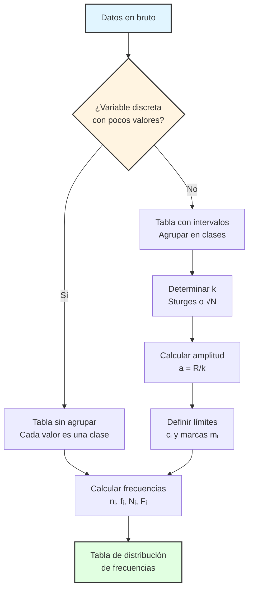

# Estadística Descriptiva: Organización y Distribución de Datos

## 1. Datos sin agrupar y distribuciones de frecuencias

### 1.1 Marco conceptual

Recordemos que la **Estadística Descriptiva** se ocupa del análisis de conjuntos de datos mediante la construcción de resúmenes numéricos y representaciones gráficas. En esta clase, formalizamos los conceptos fundamentales de **organización y tabulación de datos**, que constituyen el primer paso del análisis estadístico.

**Definición 1.1 (Conjunto de datos observados):**
Sea $\Omega$ una **población finita** con $|\Omega|=N$. 
$$\Omega=(\omega_1,\omega_2,...,\omega_N)$$
Sea $X:\Omega \to \mathbb{R}$ una **variable estadística**. El **conjunto de datos observados** (o **datos en bruto**) es una $N$-tupla:
$$\mathbf{x}=(x_1,x_2,...,x_N) \in \mathbb{R}^N$$
donde $x_i=X(\omega_i)$ para cada $\omega_i \in \Omega$. Estos datos representan la **realización** de la variable $X$ sobre toda la población.
![[Poblacion-Variable.png]]
**Observación:** Cuando los datos están listados explícitamente sin ningún procesamiento, decimos que están **en bruto** o **a granel**. Por ejemplo, si registramos la cantidad de panes consumidos diariamente por 14 personas:
$$\mathbf{x}=(2,2,2,5,5,5,5,5,5,5,7,7,7,7)$$

### 1.2 Distribución de frecuencias para datos discretos

**Definición 1.2 (Recorrido de la variable):**
Dado un conjunto de datos $\mathbf{x}=(x_1,...,x_N)$, el **recorrido** o **soporte muestral** de $X$ es el conjunto de valores distintos que aparecen en los datos:
$$\text{Rec}(X)=\{x \in \mathbb{R} : \exists i \in \{1,...,N\}, x_i=x\}$$
Si ordenamos estos valores, obtenemos las *clases* del conjunto:
$$X=\{X_1,X_2,...,X_k\}$$
Que cumplen con:
$$X_1 < X_2 < ... < X_k$$
donde $k=|\text{Rec}(X)|$ es el **número de clases** o valores distintos. A cada $X_i$ se le denomina **clase** o **categoría**.

**Ejemplo 1.1:** Para $\mathbf{x}=(2,2,2,5,5,5,5,5,5,5,7,7,7,7)$:
$$\text{Rec}(X)=X=\{2,5,7\}, \quad k=3$$

### 1.3 Conceptos de frecuencia

**Definición 1.3 (Frecuencia absoluta):**
Sea $X_i \in \text{Rec}(X)$ una clase. La **frecuencia absoluta** de $X_i$, denotada $n_i$, es el cardinal del conjunto:
$$n_i = \#\{j \in \{1,...,N\} : x_j=X_i\} = \sum_{j=1}^{N}\mathbb{I}_{\{X_i\}}(x_j)$$
donde $\mathbb{I}_{\{X_i\}}$ es la función indicadora del conjunto $\{X_i\}$.

**Propiedades:**
1. $n_i \in \mathbb{N} \cup \{0\}$ para todo $i \in \{1,...,k\}$
2. $n_i \geq 1$ si $X_i \in \text{Rec}(X)$
3. $\sum_{i=1}^{k}n_i=N$ (Propiedad de exhaustividad)

**Definición 1.4 (Frecuencia relativa):**
La **frecuencia relativa** $(f_i)$ de la clase $X_i$ es la proporción que representa respecto al total:
$$f_i = \frac{n_i}{N}, \quad i \in \{1,...,k\}$$

**Propiedades:**
1. $0 < f_i \leq 1$ para todo $i \in \{1,...,k\}$
2. $\sum_{i=1}^{k}f_i=1$ (Normalización)
3. $f_i$ puede interpretarse como la probabilidad empírica $\mathbb{P}(X=X_i)$ (esto cobrara sentido mas adelante)

**Definición 1.5 (Frecuencias acumuladas):**
Las **frecuencias acumuladas** proporcionan información sobre la distribución hasta cierto valor. Se definen como:

a) **Frecuencia absoluta acumulada:**
$$N_i = \sum_{j=1}^{i}n_j, \quad i \in \{1,...,k\}$$

b) **Frecuencia relativa acumulada:**
$$F_i = \sum_{j=1}^{i}f_j = \frac{N_i}{N}, \quad i \in \{1,...,k\}$$

**Propiedades:**
1. $(N_i)_{i=1}^{k}$ es una sucesión estrictamente creciente con $N_k=N$
2. $(F_i)_{i=1}^{k}$ es una sucesión estrictamente creciente con $F_k=1$
3. Relación recursiva: $N_i=N_{i-1}+n_i/$ para $i \geq 2$ (con $N_1=n_1$)
4. Relación recursiva: $F_i=F_{i-1}+f_i/$ para $i \geq 2$ (con $F_1=f_1$)
5. $F_i$ aproxima la **función de distribución empírica** $F_N(X_i)=\mathbb{P}(X \leq X_i)$ (esto cobrara sentido mas adelante)
****
*Demostración de la relación recursiva*
* Para el caso de la frecuencia absoluta acumulada:
$N_1=\sum_{j=1}^{1}n_j=n_1$
$N_2=\sum_{j=1}^{2}n_j=n_1+n_2=N_1+n_2$
$N_3=\sum_{j=1}^{3}n_j=n_1+n_2+n_3=N_2+n_3$
⋮
$N_i=\sum_{j=1}^{i}n_j=n_1+...+n_{i-1}+n_i=N_{i-1}+n_i$
* Para el caso de la frecuencia relativa acumulada:
$F_1=\sum_{j=1}^{1}f_j=f_1$
$F_2=\sum_{j=1}^{2}f_j=f_1+f_2=F_1+f_2$
$F_3=\sum_{j=1}^{3}f_j=f_1+f_2+f_3=F_2+f_3$
⋮
$F_i=\sum_{j=1}^{i}f_j=f_1+...+f_{i-1}+f_i=F_{i-1}+f_i$
****
**Ejemplo 1.2:** Para el conjunto $\mathbf{x}=(2,2,2,5,5,5,5,5,5,5,7,7,7,7)$ con $N=14$:
- $X_1=2$: $n_1=3$, $f_1=3/14 \approx 0.2143=21.43\%$
- $X_2=5$: $n_2=7$, $f_2=7/14=0.5=50\%$
- $X_3=7$: $n_3=4$, $f_3=4/14 \approx 0.2857=28.57\%$

Verificación: $\sum n_i = 3+7+4=14=N$ ✓
Verificación: $\sum f_i = 21.43\%+50\%+28.57\%=100\%$ ✓
### 1.4 Tabla de distribución de frecuencias

**Definición 1.6 (Tabla de frecuencias):**
Una **tabla de distribución de frecuencias** es una representación tabular que organiza sistemáticamente los valores observados de una variable junto con sus frecuencias asociadas. Para datos discretos no agrupados, su estructura general es:

| Clase (Xᵢ) | Frecuencia absoluta (nᵢ) | Frecuencia absoluta acumulada (Nᵢ) | Frecuencia relativa (fᵢ) | Frecuencia relativa acumulada (Fᵢ) |
| :--------: | :----------------------: | :--------------------------------: | :----------------------: | :--------------------------------: |
|   $X_1$    |          $n_1$           |             $N_1=n_1$              |          $f_1$           |             $F_1=f_1$              |
|   $X_2$    |          $n_2$           |           $N_2=N_1+n_2$            |          $f_2$           |           $F_1=F_1+f_2$            |
|     ⋮      |            ⋮             |                 ⋮                  |            ⋮             |                 ⋮                  |
| $X_{k-1}$  |        $n_{k-1}$         |     $N_{k-1}=N_{k-2}+n_{k-1}$      |        $f_{k-1}$         |     $F_{k-1}=F_{k-2}+f_{k-1}$      |
|   $X_k$    |          $n_k$           |              $N_k=N$               |          $f_k$           |            $F_k=100\%$             |
| **Total**  |          **N**           |                                    |         **100%**         |                                    |

| Clase ($X_i$) |   $n_i$   |   $N_i$   |   $f_i$   | $F_i$ (%) |
| :-----------: | :-------: | :-------: | :-------: | :-------: |
|     $X_1$     |   $n_1$   |   $N_1$   |   $f_1$   |   $F_1$   |
|     $X_2$     |   $n_2$   |   $N_2$   |   $f_2$   |   $F_2$   |
|       ⋮       |     ⋮     |     ⋮     |     ⋮     |     ⋮     |
|   $X_{k-1}$   | $n_{k-1}$ | $N_{k-1}$ | $f_{k-1}$ | $F_{k-1}$ |
|     $X_k$     |   $n_k$   |    $N$    |   $f_k$   |  $100\%$  |
|   **Total**   |   **N**   |     —     | **100%**  |     —     |

**Ejemplo 1.3:** Para $\mathbf{x}=(2,2,2,5,5,5,5,5,5,5,7,7,7,7)$:

| Clase ($X_i$) | $n_i$  | $N_i$ |  $f_i$   | $F_i$ (%) |
| :-----------: | :----: | :---: | :------: | :-------: |
|       2       |   3    |   3   |  21.43%  |  21.43%   |
|       5       |   7    |  10   |   50%    |  71.43%   |
|       7       |   4    |  14   |  28.57%  |   100%    |
|   **Total**   | **14** |   —   | **100%** |     —     |

**Interpretación:**
- El valor $X=5$ es el más frecuente (moda empírica), apareciendo en el 50% de las observaciones.
- El 71.43% de los datos son menores o iguales a 5.
- La distribución muestra concentración en el valor central.

---

## 2. Datos agrupados en intervalos de clase

### 2.1 Motivación y justificación

Cuando trabajamos con **variables continuas** o **variables discretas con muchos valores distintos**, la tabulación valor por valor resulta impráctica y poco informativa. En estos casos, es preferible **agrupar los datos en intervalos** (también llamados **clases** o **bins**), perdiendo detalle individual pero ganando en **síntesis** y **claridad en patrones de distribución**.

**Definición 2.1 (Partición en intervalos de clase):**
Sea $\mathbf{x}=(x_1,...,x_N)$ un conjunto de datos con valores en $[x_{\min},x_{\max}]$. Una **partición en $k$ intervalos de clase** es una colección ordenada de intervalos:
$$\mathcal{I}=\{I_1,I_2,...,I_k\}$$
donde cada $I_i=[c_i, c_{i+1})$ para $i=1,...,k-1$ y $I_k=[c_k,c_{k+1}]$, tales que:
1. $c_1 \leq x_{\min}$ y $c_{k+1} \geq x_{\max}$ (cobertura)
2. $c_1 < c_2 < ... < c_{k+1}$ (orden estricto)
3. $I_i \cap I_j = \emptyset$ para $i \neq j$ (disjunción)
4. $\bigcup_{i=1}^{k}I_i \supseteq \{x_1,...,x_N\}$ (exhaustividad)

A los valores $c_1,c_2,...,c_{k+1}$ se les denomina **límites de clase** o **fronteras de clase** y a cada $[c_i,c_{i+1})$ se le llama **intervalo de clase**.
### 2.2 Elementos de un intervalo de clase

**Definición 2.2 (Límites de clase):**
Para el intervalo $I_i=[c_i,c_{i+1})$ (o $I_k=[c_k,c_{k+1}]$ si es el último):
- $c_i$ es el **límite inferior** ($L_i$)
- $c_{i+1}$ es el **límite superior** ($L_s^{(i)}$)

**Convención:** Usualmente se adopta el criterio de **intervalos semiabiertos por la derecha** $[c_i,c_{i+1})$, excepto en el último intervalo que se cierra: $[c_k,c_{k+1}]$. Esto evita ambigüedad en la asignación de valores que caen exactamente en un límite.

**Definición 2.3 (Amplitud de clase):**
La **amplitud** o **longitud** del intervalo $I_i$ es:
$$a_i = c_{i+1}-c_i$$

En la práctica, se prefiere usar **amplitud constante** $a_i=a$ para todos los intervalos, lo que simplifica cálculos e interpretación. Sin embargo, esto no es obligatorio (se pueden usar intervalos de amplitud variable en casos específicos).

**Definición 2.4 (Marca de clase):**
La **marca de clase** o **punto medio** del intervalo $I_i=[c_i,c_{i+1})$ es:
$$m_i = \frac{c_i+c_{i+1}}{2}$$

La marca de clase se utiliza como **valor representativo** de todos los datos que caen en ese intervalo. Esta es una **aproximación**: asumimos que los datos en $I_i$ se concentran cerca de $m_i$.

### 2.3 Frecuencias para datos agrupados

Las definiciones de frecuencia se extienden naturalmente a datos agrupados:

**Definición 2.5 (Frecuencias para intervalos):**
Sea $I_i=[c_i,c_{i+1})$ un intervalo de clase. Definimos:

a) **Frecuencia absoluta del intervalo $I_i$:**
$$n_i = \#\{j \in \{1,...,N\} : x_j \in I_i\}$$

b) **Frecuencia relativa del intervalo $I_i$:**
$$f_i = \frac{n_i}{N}$$

c) **Frecuencia absoluta acumulada:**
$$N_i = \sum_{j=1}^{i}n_j$$

d) **Frecuencia relativa acumulada:**
$$F_i = \sum_{j=1}^{i}f_j = \frac{N_i}{N}$$

Las propiedades de normalización y exhaustividad se mantienen: $\sum_{i=1}^{k}n_i=N$ y $\sum_{i=1}^{k}f_i=1$.

### 2.4 Tabla de distribución de frecuencias para datos agrupados

**Estructura general:**

| Intervalo de clase | Marca de clase (mᵢ) | Frecuencia absoluta (nᵢ) | Frecuencia absoluta acumulada (Nᵢ) | Frecuencia relativa (fᵢ) | Frecuencia relativa acumulada (Fᵢ) |
| :----------------: | :-----------------: | :----------------------: | :--------------------------------: | :----------------------: | :--------------------------------: |
|    $[c_1;c_2)$     |        $m_1$        |          $n_1$           |             $N_1=n_1$              |          $f_1$           |               $F_1$                |
|    $[c_2;c_3)$     |        $m_2$        |          $n_2$           |               $N_2$                |          $f_2$           |               $F_1$                |
|         ⋮          |          ⋮          |            ⋮             |                 ⋮                  |            ⋮             |                 ⋮                  |
| $[c_{k};c_{k+1}]$  |       $m_{k}$       |         $n_{k}$          |              $N_{k}$               |         $f_{k}$          |              $F_{k}$               |
|     **Total**      |                     |          **n**           |                                    |         **100%**         |                                    |

| Intervalo $I_i$ | Marca $m_i$ | $n_i$ | $N_i$ |  $f_i$   | $F_i$ (%) |
| :-------------: | :---------: | :---: | :---: | :------: | :-------: |
|   $[c_1,c_2)$   |    $m_1$    | $n_1$ | $N_1$ |  $f_1$   |   $F_1$   |
|   $[c_2,c_3)$   |    $m_2$    | $n_2$ | $N_2$ |  $f_2$   |   $F_2$   |
|        ⋮        |      ⋮      |   ⋮   |   ⋮   |    ⋮     |     ⋮     |
| $[c_k,c_{k+1}]$ |    $m_k$    | $n_k$ |  $N$  |  $f_k$   |   100%    |
|    **Total**    |      —      | **N** |   —   | **100%** |     —     |

**Ejemplo 2.1:** Consideremos datos agrupados en 5 intervalos:

| Intervalo $I_i$ | Marca $m_i$ | $n_i$  | $N_i$ |  $f_i$   | $F_i$ (%) |
| :-------------: | :---------: | :----: | :---: | :------: | :-------: |
|     $[0,4)$     |      2      |   3    |   3   |  14.29%  |  14.29%   |
|     $[4,8)$     |      6      |   5    |   8   |  23.81%  |  38.10%   |
|    $[8,12)$     |     10      |   6    |  14   |  28.57%  |  66.67%   |
|    $[12,16)$    |     14      |   4    |  18   |  19.05%  |  85.72%   |
|    $[16,20]$    |     18      |   3    |  21   |  14.28%  |   100%    |
|    **Total**    |      —      | **21** |   —   | **100%** |     —     |

**Interpretación:**
- La mayor concentración de datos está en el intervalo $[8,12)$ con 28.57% de las observaciones.
- Aproximadamente dos tercios (66.67%) de los datos son menores que 12.
- Los datos representativos de cada intervalo son sus marcas de clase: 2, 6, 10, 14, 18.

---

## 3. Métodos de agrupación de datos

### 3.1 Problema de la construcción de intervalos

Al agrupar datos continuos, enfrentamos el problema de **elegir el número óptimo de intervalos** $k$. No existe una regla universal, pero hay criterios heurísticos ampliamente aceptados:

**Trade-off fundamental:**
- **Pocos intervalos** ($k$ pequeño): Mayor simplicidad, pero pérdida excesiva de información.
- **Muchos intervalos** ($k$ grande): Más detalle, pero tabla poco manejable y posible ruido.
### 3.2 Parámetros clave

**Definición 3.1 (Rango o recorrido):**
El **rango** (o **amplitud total**) de los datos es:
$$R = x_{\max} - x_{\min}$$
donde $x_{\max}=\max\{x_1,...,x_N\}$ y $x_{\min}=\min\{x_1,...,x_N\}$.

**Definición 3.2 (Amplitud de clase uniforme):**
Si se decide usar **amplitud constante** $a$ para todos los intervalos, entonces:
$$a = \frac{R}{k}$$
donde $k$ es el número de intervalos elegido.

**Observación:** En la práctica, se suele redondear $a$ a un valor "conveniente" (múltiplo de 5, 10, 0.1, etc.) para facilitar interpretación.
### 3.3 Reglas heurísticas para determinar $k$

#### 3.3.1 Regla de la raíz cuadrada

**Regla de la raíz cuadrada:**
$$k \approx \lceil \sqrt{N} \rceil$$
donde $\lceil \cdot \rceil$ denota la función techo (redondeo hacia arriba).

**Ventajas:** Simple y directa.  
**Limitaciones:** Puede ser inadecuada para muestras muy grandes o muy pequeñas.

#### 3.3.2 Regla de Sturges (1926)

**Regla de Sturges:**
$$k \approx \lceil 1 + \log_2(N) \rceil = \lceil 1 + 3.322 \log(N) \rceil$$

**Fundamentación teórica:** Sturges derivó esta regla asumiendo que los datos provienen de una **distribución normal** y aplicando consideraciones de la **distribución binomial**. Específicamente, si los datos se distribuyen simétricamente, el número de clases óptimo crece logarítmicamente con $N$.
****
*Nota: cambio de base de un logaritmo*
$$\frac{\log_{c}(a)}{\log_{c}(b)}=\log_{b}(a)$$
$$\frac{\ln(10)}{\ln(2)}=\log_{2}(10)\approx 3.321928$$
$$\log_{2}(N) \cdot \frac{\log_{2}(10)}{\log_{2}(10)} \approx 3.322 \cdot \frac{\log_{2}(N)}{\log_{2}(10)}=3.322\log(N)$$
****
**Ventajas:** 
- Fundamentación probabilística.
- Funciona bien para distribuciones simétricas y unimodales.

**Limitaciones:** 
- Puede subestimar $k$ para muestras grandes ($N>200$).
- No es óptima para distribuciones asimétricas o multimodales.
#### 3.3.3 Otras reglas

Existen reglas más sofisticadas como:
- **Regla de Freedman-Diaconis**: $k \approx \frac{R}{2 \cdot \text{IQR} \cdot N^{-1/3}}$ (basada en el rango intercuartílico IQR)
- **Regla de Scott**: $k\approx 3.49 \cdot S \cdot N^{-1/3}$ Basada en la desviación estándar muestral $(S)$

Estas reglas son más robustas para distribuciones no normales, pero requieren cálculo previo de estadísticos.
### 3.4 Procedimiento general para agrupar datos

**Algoritmo de agrupación:**

1. **Calcular el rango**: $R = x_{\max} - x_{\min}$
2. **Determinar el número de intervalos**: Elegir $k$ mediante alguna regla heurística
3. **Calcular la amplitud**: $a \approx R/k$ (redondear convenientemente si es necesario)
4. **Definir los límites de clase**: 
   - $c_1 = x_{\min}$ (o un valor ligeramente menor para inclusión)
   - $c_{i+1} = c_i + a$ para $i=1,...,k$
5. **Construir la tabla**: Contar cuántos datos caen en cada intervalo

**Nota:** Si $c_{k+1} < x_{\max}$, ajustar el último límite o incrementar $k$ en 1.

                    Clase 1     Clase 2   Clase 3   Clase 4   Clase 5
◄──────●────────┼───────┼───────┼──────┼────────●──────►
           |                                            |                    |                                         |
        valor                                        LI                  LS                                    valor
        mínimo                                   clase 3         clase 3                           máximo
         $x_{min}$                                                                                                    $x_{max}$

### 3.5 Representación visual del proceso

```
                        Datos en bruto
                              ↓
                    ┌─────────────────┐
                    │  Calcular R     │
                    │  R = max - min  │
                    └─────────────────┘
                              ↓
                    ┌─────────────────┐
                    │  Elegir k       │
                    │  (Regla Sturges)│
                    └─────────────────┘
                              ↓
                    ┌─────────────────┐
                    │  Calcular a     │
                    │  a = R / k      │
                    └─────────────────┘
                              ↓
                    ┌─────────────────┐
                    │  Definir clases │
                    │  [c₁,c₂),...    │
                    └─────────────────┘
                              ↓
                    ┌─────────────────┐
                    │  Contar datos   │
                    │  en cada clase  │
                    └─────────────────┘
                              ↓
                       Tabla completa
```

---

## 4. Ejemplo completo de agrupación

**Problema:** Construir la tabla de datos agrupados para las siguientes 50 mediciones:

```
0.03, 0.03, 0.04, 0.05, 0.07, 0.11, 0.12, 0.14, 0.22, 0.22, 0.23, 0.24, 0.29, 0.29, 0.31, 0.33, 0.36, 0.47, 0.51, 0.60, 0.61, 0.73, 0.85, 0.86, 0.86, 0.93, 0.97, 0.99, 1.05, 1.06, 1.11, 1.14, 1.18, 1.21, 1.35, 1.40, 1.44, 1.71, 1.79, 1.88, 1.91, 1.93, 1.96, 2.21, 2.34, 2.63, 2.66, 2.93, 3.20, 3.53
```

**Solución:**

**Paso 1: Parámetros básicos**
- Tamaño muestral: $N=50$
- Valor mínimo: $x_{\min}=0.03$
- Valor máximo: $x_{\max}=3.53$
- Rango: $R=3.53-0.03=3.50$

**Paso 2: Número de intervalos**

Aplicando la **regla de la raíz cuadrada**:
$$k \approx \lceil \sqrt{50} \rceil = \lceil 7.071 \rceil = 8$$
Aplicando la **regla de Sturges**:
$$k \approx \lceil 1 + 3.322 \log_{10}(50) \rceil = \lceil 1 + 3.322 \times 1.699 \rceil = \lceil 6.641 \rceil = 7$$

**Observación:** Las dos reglas dan resultados ligeramente diferentes ($k=8$ vs. $k=7$). Esto es normal. Elegiremos $k=7$ por simplicidad.

**Paso 3: Amplitud de clase**
$$a = \frac{R}{k} = \frac{3.50}{7} = 0.50$$

Este es un valor conveniente, por lo que no necesitamos ajustar.

**Paso 4: Límites de clase**
Con $c_1=0.03$ y $a=0.50$:
- $I_1=[0.03, 0.53)$
- $I_2=[0.53, 1.03)$
- $I_3=[1.03, 1.53)$
- $I_4=[1.53, 2.03)$
- $I_5=[2.03, 2.53)$
- $I_6=[2.53, 3.03)$
- $I_7=[3.03, 3.53]$

**Paso 5: Conteo de frecuencias**

Contando cuántos datos caen en cada intervalo y calculando las marcas de clase:

| Intervalo $I_i$ | Marca $m_i$ | $n_i$  | $N_i$ |  $f_i$   | $F_i$ (%) |
| :-------------: | :---------: | :----: | :---: | :------: | :-------: |
|  $[0.03,0.53)$  |    0.28     |   19   |  19   |   38%    |    38%    |
|  $[0.53,1.03)$  |    0.78     |   9    |  28   |   18%    |    56%    |
|  $[1.03,1.53)$  |    1.28     |   9    |  37   |   18%    |    74%    |
|  $[1.53,2.03)$  |    1.78     |   6    |  43   |   12%    |    86%    |
|  $[2.03,2.53)$  |    2.28     |   2    |  45   |    4%    |    90%    |
|  $[2.53,3.03)$  |    2.78     |   3    |  48   |    6%    |    96%    |
|  $[3.03,3.53]$  |    3.28     |   2    |  50   |    4%    |   100%    |
|    **Total**    |      —      | **50** |   —   | **100%** |     —     |

**Interpretación de los resultados:**
1. La **mayor concentración** de datos (38%) se encuentra en el primer intervalo $[0.03,0.53)$, indicando **asimetría positiva** (sesgo hacia valores bajos).
2. El **56% de los datos** son menores que 1.03.
3. Los intervalos superiores contienen pocos datos, sugiriendo una **cola derecha larga**.
4. La distribución no es uniforme: hay una clara **decadencia de frecuencias** conforme aumentan los valores.

---

## 5. Conexión con la función de distribución empírica

**Nota teórica avanzada:**

La **frecuencia relativa acumulada** $F_i$ es una aproximación discreta de la **función de distribución empírica** (FDE), definida formalmente como:
$$F_N(x) = \frac{1}{N}\sum_{i=1}^{N}\mathbb{I}_{(-\infty,x]}(x_i)$$

Por el **teorema de Glivenko-Cantelli**, sabemos que:
$$\sup_{x \in \mathbb{R}}|F_N(x) - F(x)| \xrightarrow{N \to \infty} 0 \quad \text{c.s.}$$
donde $F(x)$ es la verdadera función de distribución poblacional. Esto justifica el uso de tablas de frecuencias como **estimadores** de la distribución subyacente.

---

## 6. Consideraciones prácticas y advertencias

### 6.1 Pérdida de información en el agrupamiento

Al agrupar datos, **perdemos información individual**. Por ejemplo, si dos observaciones son 1.10 y 1.45, y ambas caen en $[1.03,1.53)$, solo sabemos que están en ese intervalo, no sus valores exactos. Esta pérdida afecta:
- Cálculo de estadísticos (media, varianza se calculan con marcas de clase)
- Identificación de outliers
- Análisis de distribución detallada

**Regla general:** Agrupa datos solo cuando:
1. La muestra es grande ($N > 30$)
2. La variable es continua o tiene muchos valores distintos
3. El objetivo es visualización o síntesis, no análisis fino
### 6.2 Elección subjetiva de parámetros

La elección de $k$ y los límites de clase tiene cierto **grado de arbitrariedad**. Diferentes analistas pueden obtener tablas distintas para los mismos datos. Por eso:
- Reporta siempre los criterios usados ($k$, regla aplicada, amplitud)
- Si es posible, complementa con visualizaciones (histogramas)
- Para análisis críticos, conserva los datos sin agrupar
### 6.3 Convenciones de notación

En la literatura estadística encontrarás variaciones en la notación:
- Intervalos: $[a,b)$, $[a,b]$, o $(a,b]$ según la convención
- Marca de clase: también llamada **punto medio** o **centro de clase**
- Amplitud: también llamada **ancho de clase** o **longitud de intervalo**

**En este curso usaremos:** intervalos semiabiertos $[c_i,c_{i+1})$ excepto el último que es cerrado.

---

## 7. Resumen de conceptos clave



**Definiciones esenciales para recordar:**

| Concepto | Símbolo | Definición | Propiedad clave |
|:---------|:-------:|:-----------|:----------------|
| Frecuencia absoluta | $n_i$ | Número de datos en la clase $i$ | $\sum n_i = N$ |
| Frecuencia relativa | $f_i$ | $n_i / N$ | $\sum f_i = 1$ |
| Frecuencia acum. absoluta | $N_i$ | $\sum_{j=1}^{i}n_j$ | $N_k = N$ |
| Frecuencia acum. relativa | $F_i$ | $\sum_{j=1}^{i}f_j$ | $F_k = 1$ |
| Rango | $R$ | $x_{\max} - x_{\min}$ | Mide dispersión total |
| Amplitud de clase | $a$ | $c_{i+1} - c_i$ | Generalmente constante |
| Marca de clase | $m_i$ | $(c_i + c_{i+1})/2$ | Representa el intervalo |

---

## 8. Ejercicios propuestos

**Ejercicio 1:** Dado el conjunto de datos:
$$\{12, 15, 15, 18, 20, 20, 20, 22, 25, 30\}$$
Construye una tabla de frecuencias sin agrupar.

**Ejercicio 2:** Para los siguientes 40 datos (tiempos de espera en minutos):
```
2.3, 4.5, 6.7, 3.2, 5.8, 7.1, 4.9, 6.2, 5.5, 4.1, 3.7, 5.2, 6.8, 4.4, 5.9, 7.3, 4.8, 6.1, 5.4, 4.3, 3.9, 5.1, 6.9, 4.6, 6.0, 7.5, 5.0, 6.5, 5.7, 4.7, 3.5, 5.3, 7.0, 4.2, 6.3, 7.2, 5.6, 6.6, 6.4, 3.8
```
a) Calcula el rango $R$  
b) Determina $k$ usando la regla de Sturges  
c) Construye la tabla de frecuencias con intervalos de amplitud constante

**Ejercicio 3:** Demuestra que para cualquier tabla de frecuencias se cumple:
$$\sum_{i=1}^{k}n_i f_i = N \sum_{i=1}^{k}f_i^2$$

**Ejercicio 4 (Conceptual):** Explica por qué la regla de Sturges puede ser inadecuada para distribuciones bimodales y propón una alternativa.

---

**Referencias bibliográficas recomendadas:**
- Freedman, D., Pisani, R., & Purves, R. (2007). *Statistics* (4th ed.). W.W. Norton.
- Walpole, R. E., Myers, R. H., Myers, S. L., & Ye, K. (2016). *Probability & Statistics for Engineers & Scientists* (9th ed.). Pearson.
- Sturges, H. A. (1926). "The choice of a class interval". *Journal of the American Statistical Association*, 21(153), 65-66.
