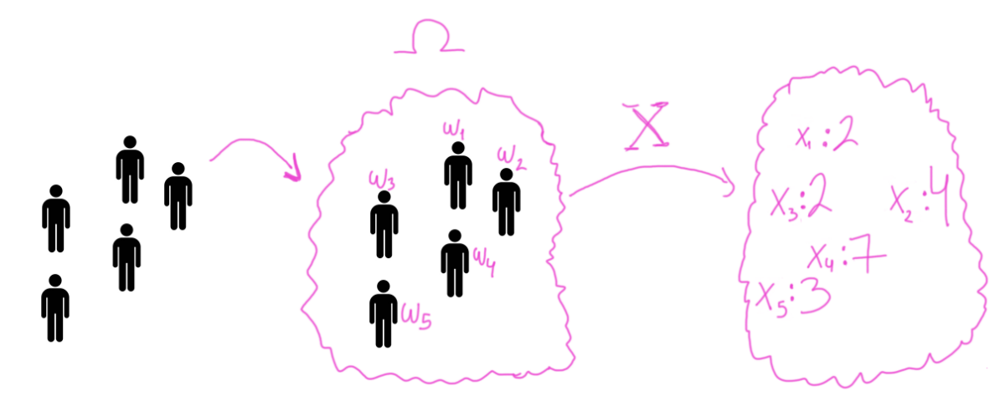
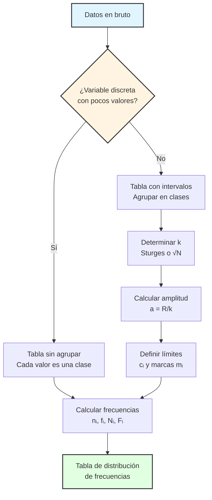

# Estadística Descriptiva: Organización y Distribución de Datos

En esta clase se formaliza el primer paso del análisis estadístico: la organización sistemática de datos mediante distribuciones de frecuencias. Se estudia tanto el caso discreto no agrupado como el caso continuo agrupado en intervalos de clase, junto con los criterios heurísticos para construir esos intervalos y la conexión con la función de distribución empírica.

---

## 1. Datos sin agrupar y distribuciones de frecuencias

Antes de calcular medias, varianzas o construir modelos probabilísticos, es necesario saber **cómo** trabajar y ordenar la información recolectada: **el corazón de la estadística radica en los datos**. La forma más elemental de hacerlo es contar cuántas veces aparece cada valor observado. Este conteo, aparentemente simple, da origen a toda la maquinaria de la estadística descriptiva.

### 1.1 Datos en bruto

Antes de hablar de datos, conviene recordar de dónde provienen. En estadística, una **población** es el conjunto total de unidades sobre las cuales se desea estudiar una característica. La población en sí no es una lista de números: es un conjunto de personas, objetos, eventos o mediciones, ejemplo si nos interesa estudiar las notas de alumnos universitarios nuestra poblacion seran los propios alumnos y deberemos obtener sus notas ya sean consultando a la universiadad o a loa propios alumnos. Para obtener datos, debemos **observar** o **medir** esa característica en cada unidad de análisis mediante censos, encuestas, experimentos, registros automáticos u otros instrumentos de recolección. Solo después de esa observación surge la lista numérica con la que trabaja la estadística descriptiva.

**Definición 1.1 (Población):**
Sea $\Omega$ el conjunto total de unidades de análisis sobre las cuales se desea estudiar una característica. A $\Omega$ se le denomina **población**, y a cada uno de sus elementos $\omega_i \in \Omega$ (con $i \in \{1,..,N\}$) se le denomina **unidad estadística**. El número total de unidades se denota por $N = |\Omega|$.

> **Observación:** una población no es un conjunto de números, sino de objetos, personas, eventos o mediciones. Los datos numéricos se obtienen aplicando una variable estadística $X: \Omega \to \mathbb{R}$ a cada unidad.

Cuando se recolectan observaciones, los datos aparecen inicialmente como una lista sin procesar. A esta lista se le denomina **datos en bruto** o **datos a granel**. Formalizar este objeto es el punto de partida para cualquier resumen posterior.

**Definición 1.2 (Conjunto de datos observados):**
Sea $\Omega$ una población finita con $|\Omega| = N$, cuyos elementos se indexan como:

$$
\Omega = (\omega_1, \omega_2, \ldots, \omega_N)

$$

Sea $X: \Omega \to \mathbb{R}$ una variable estadística. El **conjunto de datos observados** (o **datos en bruto**, o **datos a granel**) es la $N$-tupla:

$$
\mathbf{x} = (x_1, x_2, \ldots, x_N) \in \mathbb{R}^N

$$

donde $x_i = X(\omega_i)$ para cada $\omega_i \in \Omega$. Esta forma de presentar datos se conoce como **datos no agrupados** pues contamos con todos los datos sueltos



**Observación:** La presentación anterior asume una población finita censada. Si los datos provienen de una muestra de tamaño $n$, se reemplaza $N$ por $n$; los conceptos de organización y frecuencia permanecen válidos sin cambio esencial.

Si se ordenan los datos de menor a mayor, se obtiene la $N$-tupla ordenada:

$$
\mathbf{x}_{(\cdot)} = (x_{(1)}, x_{(2)}, \ldots, x_{(N)}) \in \mathbb{R}^N

$$

donde:

$$
x_{(1)} \leq x_{(2)} \leq \cdots \leq x_{(N)}

$$

A los valores $x_{(1)}, x_{(2)}, \ldots, x_{(N)}$ se les denomina **estadísticos de orden**. En particular:

- $x_{(1)} = \min\{x_1, x_2, \ldots, x_N\}$ es el valor mínimo,
- $x_{(N)} = \max\{x_1, x_2, \ldots, x_N\}$ es el valor máximo,
- $x_{(i)}$ es el $i$-ésimo valor más pequeño de entre todos los datos observados.

> **Nota técnica sobre la notación de los estadísticos de orden:**
> No existe una expresión cerrada universalmente aceptada para $x_{(i)}$ cuando $i \in \{2, \ldots, N-1\}$. Los casos extremos $i = 1$ y $i = N$ admiten una escritura directa mediante el mínimo y el máximo, pero los valores intermedios requieren ordenar explícitamente los datos.
>
> Una manera de escribir el segundo menor valor sin usar la notación $(\cdot)$ es:
>
> $$
> x_{(2)} = \min\left( \{x_1, x_2, \ldots, x_N\} \setminus \{x_{(1)}\} \right)
>
> $$
>
> aunque esta expresión debe interpretarse con cuidado cuando hay observaciones repetidas, pues técnicamente los datos forman un multiconjunto: si el valor mínimo aparece varias veces, solo se descarta una de esas apariciones.
>
> Para $x_{(3)}$ la expresión se vuelve aún más engorrosa:
>
> $$
> x_{(3)} = \min\left( \{x_1, x_2, \ldots, x_N\} \setminus \{x_{(1)}, x_{(2)}\} \right)
>
> $$
>
> y, en general, el procedimiento es recursivo: cada estadístico de orden se obtiene eliminando los valores ya seleccionados y tomando el mínimo del conjunto restante.
>
> Por esta razón, en estadística se prefiere la notación $x_{(i)}$ o $X_{(i)}$. En otros campos, especialmente en ciencias de la computación, se encuentran notaciones como $\text{2nd-min}(\mathbf{x})$, $\text{ksmallest}(\mathbf{x}, k)$, o descripciones del tipo "$X_{(2)}$ es el segundo mínimo de $X$". No hay una notación única universal; cada texto elige la convención que mejor se adapta a su contexto.

**Ejemplo 1.1:**
Si registramos la cantidad de panes consumidos diariamente por 14 personas, los datos en bruto son:

$$
\mathbf{x} = (2, 2, 2, 5, 5, 5, 5, 5, 5, 5, 7, 7, 7, 7)

$$

> **Observación:** En la práctica, los datos en bruto suelen provenir de una muestra. Sin embargo, los métodos de organización que se presentan en esta clase aplican tanto a datos muestrales como a datos de toda una población.

### 1.2 Recorrido de la variable

Una vez que se tienen los datos en bruto, el siguiente paso es identificar cuántos valores distintos aparecen y cuáles son. Este conjunto de valores distintos se denomina **recorrido** o **soporte muestral** de la variable.

**Definición 1.3 (Recorrido de la variable):**
Dado un conjunto de datos $\mathbf{x} = (x_1, \ldots, x_N)$, el **recorrido** o **soporte muestral** de $X$ es el conjunto de valores distintos que aparecen en los datos:

$$
\text{Rec}(X) = \{ x \in \mathbb{R} : \exists i \in \{1, \ldots, N\}, \; x_i = x \}

$$

Si se ordenan estos valores, se obtienen las **clases** del conjunto:

$$
V = \{v_1, v_2, \ldots, v_k\}

$$

donde $v_1 < v_2 < \cdots < v_k$ y $k = |\text{Rec}(X)|$ es el número de clases o valores distintos.

**Ejemplo 1.2:**
Para $\mathbf{x} = (2, 2, 2, 5, 5, 5, 5, 5, 5, 5, 7, 7, 7, 7)$:

$$
\text{Rec}(X) = V = \{2, 5, 7\}, \quad k = 3

$$

### 1.3 Conceptos de frecuencia

La **frecuencia** es el número de veces que aparece cada valor en los datos. A partir de ella se definen la frecuencia relativa, la absoluta acumulada y la relativa acumulada. Estos cuatro objetos son la piedra angular de cualquier tabla de distribución de frecuencias.

**Definición 1.4 (Frecuencia absoluta):**
Sea $v_i \in \text{Rec}(X)$ una clase. La **frecuencia absoluta** de $v_i$, denotada $n_i$, es el cardinal del conjunto de observaciones iguales a $v_i$:

$$
n_i = \#\{ j \in \{1, \ldots, N\} : x_j = v_i \} = \sum_{j=1}^{N} \mathbb{I}_{\{v_i\}}(x_j)

$$

donde $\mathbb{I}_{\{v_i\}}$ es la función indicadora del conjunto $\{v_i\}$.

> **Nota:** recordemos que la función indicadora de un conjunto $A$ se define como:
>
> $$
> \mathbb{I}_A(x) = \begin{cases} 1 & \text{si } x \in A, \\ 0 & \text{si } x \notin A. \end{cases}
>
> $$
>
> Por tanto, $\mathbb{I}_{\{v_i\}}(x_j) = 1$ solo cuando $x_j = v_i$, y la suma cuenta exactamente cuántas observaciones coinciden con la clase $v_i$.

**Propiedades:**

1. $n_i \in \mathbb{N} \cup \{0\}$ para todo $i \in \{1, \ldots, k\}$.
2. $n_i \geq 1$ si $v_i \in \text{Rec}(X)$.
3. $\displaystyle \sum_{i=1}^{k} n_i = N$ (propiedad de exhaustividad).

**Demostración:**
Por definición:

$$
n_i = \sum_{j=1}^{N} \mathbb{I}_{\{v_i\}}(x_j)

$$

1. Cada término $\mathbb{I}_{\{v_i\}}(x_j)$ vale $0$ o $1$. Por tanto, $n_i$ es una suma finita de ceros y unos, lo que implica que $n_i$ es un entero no negativo. Es decir, $n_i \in \mathbb{N} \cup \{0\}$.
2. Si $v_i \in \text{Rec}(X)$, entonces existe al menos un índice $j \in \{1, \ldots, N\}$ tal que $x_j = v_i$. Por definición de la función indicadora, $\mathbb{I}_{\{v_i\}}(x_j) = 1$. Como todos los demás términos de la suma son no negativos, se cumple que $n_i \geq 1$.
3. Para la propiedad de exhaustividad, intercambiamos el orden de las sumas:

$$
\sum_{i=1}^{k} n_i = \sum_{i=1}^{k} \sum_{j=1}^{N} \mathbb{I}_{\{v_i\}}(x_j) = \sum_{j=1}^{N} \sum_{i=1}^{k} \mathbb{I}_{\{v_i\}}(x_j)

$$

Para cada $j$ fijo, el valor $x_j$ coincide con exactamente uno de los valores $v_1, v_2, \ldots, v_k$, pues estos son todos los valores distintos que aparecen en los datos. Por tanto:

$$
\sum_{i=1}^{k} \mathbb{I}_{\{v_i\}}(x_j) = 1

$$

Sustituyendo en la expresión anterior:

$$
\sum_{i=1}^{k} n_i = \sum_{j=1}^{N} 1 = N

$$

$\blacksquare$

**Definición 1.5 (Frecuencia relativa):**
La **frecuencia relativa** $f_i$ de la clase $v_i$ es la proporción que representa respecto al total:

$$
f_i = \dfrac{n_i}{N}, \quad i \in \{1, \ldots, k\}

$$

**Propiedades:**

1. $0 < f_i \leq 1$ para todo $i \in \{1, \ldots, k\}$.
2. $\displaystyle \sum_{i=1}^{k} f_i = 1$ (normalización).
3. $f_i$ puede interpretarse como la probabilidad empírica $\mathbb{P}(X = v_i)$. Esta interpretación cobrará sentido riguroso cuando se desarrolle la teoría de la probabilidad.

**Demostración:**
Recordemos que $f_i = \dfrac{n_i}{N}$, donde $N$ es el número total de observaciones.

1. Como $n_i$ cuenta el número de observaciones iguales a $v_i$, se cumple $0 \leq n_i \leq N$. Si $v_i \in \text{Rec}(X)$, entonces $n_i \geq 1$ por la propiedad correspondiente de la frecuencia absoluta. Dividiendo entre $N > 0$:

$$
0 < \dfrac{n_i}{N} \leq 1 \quad \Longrightarrow \quad 0 < f_i \leq 1

$$

2. Para la normalización, usamos la propiedad de exhaustividad de las frecuencias absolutas:

$$
\sum_{i=1}^{k} f_i = \sum_{i=1}^{k} \dfrac{n_i}{N} = \dfrac{1}{N} \sum_{i=1}^{k} n_i = \dfrac{1}{N} \cdot N = 1

$$

$\blacksquare$

**Definición 1.6 (Frecuencias acumuladas):**
Las **frecuencias acumuladas** proporcionan información sobre la distribución hasta cierto valor:

a) **Frecuencia absoluta acumulada:**

$$
N_i = \sum_{j=1}^{i} n_j, \quad i \in \{1, \ldots, k\}

$$

b) **Frecuencia relativa acumulada:**

$$
F_i = \sum_{j=1}^{i} f_j = \dfrac{N_i}{N}, \quad i \in \{1, \ldots, k\}

$$

**Propiedades:**

1. $(N_i)_{i=1}^{k}$ es una sucesión creciente con $N_k = N$.
2. $(F_i)_{i=1}^{k}$ es una sucesión creciente con $F_k = 1$.
3. Relación recursiva: $N_i = N_{i-1} + n_i$ para $i \geq 2$, con $N_1 = n_1$.
4. Relación recursiva: $F_i = F_{i-1} + f_i$ para $i \geq 2$, con $F_1 = f_1$.
5. $F_i$ aproxima la función de distribución empírica $F_N(v_i) = \mathbb{P}(X \leq v_i)$. Esta conexión se desarrollará formalmente en la Sección 4.

**Teorema 1.1 (Relación recursiva de las frecuencias acumuladas):**
Para toda distribución de frecuencias sin agrupar se cumple:

$$
N_i = N_{i-1} + n_i \quad \text{y} \quad F_i = F_{i-1} + f_i

$$

para todo $i \in \{2, \ldots, k\}$, con $N_1 = n_1$ y $F_1 = f_1$.

**Demostración:**
Para la frecuencia absoluta acumulada, se tiene por definición que:

$$
\begin{align}
N_1 &= \sum_{j=1}^{1} n_j = n_1 \\
N_2 &= \sum_{j=1}^{2} n_j = n_1 + n_2 = N_1 + n_2 \\
N_3 &= \sum_{j=1}^{3} n_j = n_1 + n_2 + n_3 = N_2 + n_3
\end{align}

$$

y, en general, para $i \geq 2$:

$$
N_i = \sum_{j=1}^{i} n_j = \sum_{j=1}^{i-1} n_j + n_i = N_{i-1} + n_i

$$

Para la frecuencia relativa acumulada, se procede de manera análoga:

$$
\begin{align}
F_1 &= \sum_{j=1}^{1} f_j = f_1 \\
F_2 &= \sum_{j=1}^{2} f_j = f_1 + f_2 = F_1 + f_2 \\
F_3 &= \sum_{j=1}^{3} f_j = f_1 + f_2 + f_3 = F_2 + f_3
\end{align}

$$

y, en general:

$$
F_i = \sum_{j=1}^{i} f_j = \sum_{j=1}^{i-1} f_j + f_i = F_{i-1} + f_i

$$

Por tanto, ambas relaciones recursivas se verifican para todo $i \in \{2, \ldots, k\}$.
$\blacksquare$

**Ejemplo 1.3:**
Para el conjunto $\mathbf{x} = (2, 2, 2, 5, 5, 5, 5, 5, 5, 5, 7, 7, 7, 7)$ con $N = 14$:

- Las clases son $v_1 = 2$, $v_2 = 5$ y $v_3 = 7$.
- Las frecuencias absolutas son $n_1 = 3$, $n_2 = 7$ y $n_3 = 4$.
- Las frecuencias relativas son $f_1 = 3/14 \approx 0.2143$, $f_2 = 7/14 = 0.5$ y $f_3 = 4/14 \approx 0.2857$.
- Las frecuencias absolutas acumuladas son $N_1 = 3$, $N_2 = 10$ y $N_3 = 14$.
- Las frecuencias relativas acumuladas son $F_1 = 0.2143$, $F_2 = 0.7143$ y $F_3 = 1$.

Verificación: $\sum n_i = 3 + 7 + 4 = 14 = N$ y $\sum f_i = 0.2143 + 0.5 + 0.2857 = 1$.

### 1.4 Tabla de distribución de frecuencias

Una tabla de distribución de frecuencias organiza en una sola estructura los valores observados y todas sus frecuencias. Es la forma estándar de presentar datos discretos no agrupados.

**Definición 1.7 (Tabla de frecuencias):**
Una **tabla de distribución de frecuencias** es una representación tabular que organiza los valores distintos observados de una variable junto con sus frecuencias absolutas, relativas, acumuladas absolutas y acumuladas relativas.

La estructura general de una tabla de frecuencias para datos sin agrupar es:


| Clase ($v_i$) | Frecuencia absoluta ($n_i$) | Frecuencia absoluta acumulada ($N_i$) | Frecuencia relativa ($f_i$) | Frecuencia relativa acumulada ($F_i$) |
| :-------------: | :---------------------------: | :-------------------------------------: | :---------------------------: | :-------------------------------------: |
|     $v_1$     |            $n_1$            |              $N_1 = n_1$              |            $f_1$            |              $F_1 = f_1$              |
|     $v_2$     |            $n_2$            |           $N_2 = N_1 + n_2$           |            $f_2$            |           $F_2 = F_1 + f_2$           |
|   $\vdots$   |          $\vdots$          |               $\vdots$               |          $\vdots$          |               $\vdots$               |
|   $v_{k-1}$   |          $n_{k-1}$          |     $N_{k-1} = N_{k-2} + n_{k-1}$     |          $f_{k-1}$          |     $F_{k-1} = F_{k-2} + f_{k-1}$     |
|     $v_k$     |            $n_k$            |               $N_k = N$               |            $f_k$            |               $F_k = 1$               |
|   **Total**   |           **$N$**           |                  —                  |            **1**            |                  —                  |

Alternativamente, usando la notación compacta:


| Clase ($v_i$) |   $n_i$   |   $N_i$   |   $f_i$   |   $F_i$   |
| :-------------: | :---------: | :---------: | :---------: | :---------: |
|     $v_1$     |   $n_1$   |   $N_1$   |   $f_1$   |   $F_1$   |
|     $v_2$     |   $n_2$   |   $N_2$   |   $f_2$   |   $F_2$   |
|   $\vdots$   | $\vdots$ | $\vdots$ | $\vdots$ | $\vdots$ |
|   $v_{k-1}$   | $n_{k-1}$ | $N_{k-1}$ | $f_{k-1}$ | $F_{k-1}$ |
|     $v_k$     |   $n_k$   |    $N$    |   $f_k$   |    $1$    |
|   **Total**   |  **$N$**  |    —    |   **1**   |    —    |

**Ejemplo 1.4:**
Para el mismo conjunto de datos, la tabla de distribución de frecuencias completa es:


| Clase ($v_i$) | Frecuencia absoluta ($n_i$) | Frecuencia absoluta acumulada ($N_i$) | Frecuencia relativa ($f_i$) | Frecuencia relativa acumulada ($F_i$) |
| :-------------: | :---------------------------: | :-------------------------------------: | :---------------------------: | :-------------------------------------: |
|       2       |              3              |                   3                   |           21.43%           |                21.43%                |
|       5       |              7              |                  10                  |           50.00%           |                71.43%                |
|       7       |              4              |                  14                  |           28.57%           |                100.00%                |
|   **Total**   |           **14**           |                  —                  |          **100%**          |                  —                  |

**Interpretación:**

- El valor $v = 5$ es el más frecuente (moda empírica), apareciendo en el 50% de las observaciones.
- El 71.43% de los datos son menores o iguales a 5.
- La distribución muestra concentración en el valor central.

---

## 2. Datos agrupados en intervalos de clase

Cuando se trabaja con variables continuas o con variables discretas que tienen muchos valores distintos, resulta poco práctico construir una tabla valor por valor. En esos casos se agrupan los datos en intervalos (llamados **intervalos de clases** o **bins**), perdiendo detalle individual pero ganando en **síntesis** y claridad en la forma global de la distribución.

### 2.1 Motivación y justificación

Imaginemos que se han medido los tiempos de respuesta de 200 servidores. Si cada tiempo es distinto, una tabla sin agrupar tendría 200 filas y no mostraría ningún patrón. Agrupar los tiempos en intervalos permite ver dónde se concentran los valores y si la distribución es simétrica o sesgada.

**Definición 2.1 (Partición en intervalos de clase):**
Sea $\mathbf{x} = (x_1, \ldots, x_N)$ un conjunto de datos con valores en $[x_{\min}, x_{\max}]$. Una **partición en $k$ intervalos de clase** es una colección ordenada de intervalos:

$$
\mathcal{I} = \{I_1, I_2, \ldots, I_k\}

$$

donde cada $I_i = [c_i, c_{i+1})$ para $i = 1, \ldots, k-1$ y $I_k = [c_k, c_{k+1}]$, tales que:

1. $c_1 \leq x_{\min}$ y $c_{k+1} \geq x_{\max}$ (cobertura).
2. $c_1 < c_2 < \cdots < c_{k+1}$ (orden estricto).
3. $I_i \cap I_j = \emptyset$ para $i \neq j$ (disjunción).
4. $\displaystyle \bigcup_{i=1}^{k} I_i \supseteq \{x_1, \ldots, x_N\}$ (exhaustividad).

A los valores $c_1, c_2, \ldots, c_{k+1}$ se les denomina **límites de clase** y a cada $[c_i, c_{i+1})$ se le llama **intervalo de clase**.

> **Observación:** La elección de intervalos semiabiertos por la derecha evita la ambigüedad en la asignación de valores que caen exactamente en un límite. El último intervalo se cierra para garantizar que el valor máximo quede incluido.

### 2.2 Elementos de un intervalo de clase

Cada intervalo de clase tiene tres elementos fundamentales: los límites inferior y superior, la amplitud y la marca de clase. Estos elementos permiten operar con los datos agrupados de manera sistemática.

**Definición 2.2 (Límites de clase):**
Para el intervalo $I_i = [c_i, c_{i+1})$ (o $I_k = [c_k, c_{k+1}]$ si es el último):

- $c_i$ es el **límite inferior**.
- $c_{i+1}$ es el **límite superior**.

**Convención:** Usualmente se adopta el criterio de **intervalos semiabiertos por la derecha** $[c_i, c_{i+1})$, excepto en el último intervalo que se cierra: $[c_k, c_{k+1}]$.

**Definición 2.3 (Amplitud de clase):**
La **amplitud** o **longitud** del intervalo $I_i$ es:

$$
a_i = c_{i+1} - c_i

$$

En la práctica, se prefiere usar **amplitud constante** $a_i = a$ para todos los intervalos, lo que simplifica cálculos e interpretación. Sin embargo, esto no es obligatorio.

**Definición 2.4 (Marca de clase):**
La **marca de clase** o **punto medio** del intervalo $I_i = [c_i, c_{i+1})$ es:

$$
m_i = \dfrac{c_i + c_{i+1}}{2}

$$

La marca de clase se utiliza como **valor representativo** de todos los datos que caen en ese intervalo. Esta es una aproximación: se asume que los datos en $I_i$ se concentran cerca de $m_i$.

**Ejemplo 2.1:**
Consideremos los intervalos $[0, 4)$, $[4, 8)$, $[8, 12)$, $[12, 16)$ y $[16, 20]$.

- El intervalo $[4, 8)$ tiene límite inferior $c_i = 4$, límite superior $c_{i+1} = 8$, amplitud $a_i = 8 - 4 = 4$ y marca de clase $m_i = \dfrac{4 + 8}{2} = 6$.
- El intervalo $[16, 20]$ tiene límite inferior $16$, límite superior $20$, amplitud $a_i = 20 - 16 = 4$ y marca de clase $m_i = \dfrac{16 + 20}{2} = 18$.

### 2.3 Frecuencias para datos agrupados

Las definiciones de frecuencia se extienden naturalmente a datos agrupados, sustituyendo la condición $x_j = v_i$ por la condición $x_j \in I_i$.

**Definición 2.5 (Frecuencias para intervalos):**
Sea $I_i = [c_i, c_{i+1})$ un intervalo de clase. Se definen:

a) **Frecuencia absoluta del intervalo $I_i$:**

$$
n_i = \#\{ j \in \{1, \ldots, N\} : x_j \in I_i \}

$$

b) **Frecuencia relativa del intervalo $I_i$:**

$$
f_i = \dfrac{n_i}{N}

$$

c) **Frecuencia absoluta acumulada:**

$$
N_i = \sum_{j=1}^{i} n_j

$$

d) **Frecuencia relativa acumulada:**

$$
F_i = \sum_{j=1}^{i} f_j = \dfrac{N_i}{N}

$$

Las propiedades de normalización y exhaustividad se mantienen: $\sum_{i=1}^{k} n_i = N$ y $\sum_{i=1}^{k} f_i = 1$.

> **Observación:** Al agrupar datos en intervalos se pierde información individual. Por ejemplo, si dos observaciones 1.10 y 1.45 caen en $[1.03, 1.53)$, solo se sabe que están en ese intervalo, no sus valores exactos. Esta pérdida afecta el cálculo posterior de estadísticos como la media o la varianza, que se aproximan usando las marcas de clase.

### 2.4 Tabla de distribución de frecuencias para datos agrupados

**Definición 2.6 (Tabla de frecuencias agrupadas):**
Una **tabla de distribución de frecuencias agrupadas** es una representación tabular que organiza los intervalos de clase junto con sus marcas de clase y sus frecuencias absolutas, relativas, acumuladas absolutas y acumuladas relativas.

La estructura general es:


| Intervalo de clase | Marca de clase ($m_i$) | Frecuencia absoluta ($n_i$) | Frecuencia absoluta acumulada ($N_i$) | Frecuencia relativa ($f_i$) | Frecuencia relativa acumulada ($F_i$) |
| :------------------: | :----------------------: | :---------------------------: | :-------------------------------------: | :---------------------------: | :-------------------------------------: |
|    $[c_1, c_2)$    |         $m_1$         |            $n_1$            |              $N_1 = n_1$              |            $f_1$            |              $F_1 = f_1$              |
|    $[c_2, c_3)$    |         $m_2$         |            $n_2$            |           $N_2 = N_1 + n_2$           |            $f_2$            |           $F_2 = F_1 + f_2$           |
|      $\vdots$      |        $\vdots$        |          $\vdots$          |               $\vdots$               |          $\vdots$          |               $\vdots$               |
|  $[c_k, c_{k+1}]$  |         $m_k$         |            $n_k$            |               $N_k = N$               |            $f_k$            |               $F_k = 1$               |
|     **Total**     |           —           |           **$N$**           |                  —                  |            **1**            |                  —                  |

O, en forma compacta:


|  Intervalo$I_i$  | Marca$m_i$ |  $n_i$  |  $N_i$  |  $f_i$  |  $F_i$  |
| :----------------: | :----------: | :--------: | :--------: | :--------: | :--------: |
|   $[c_1, c_2)$   |   $m_1$   |  $n_1$  |  $N_1$  |  $f_1$  |  $F_1$  |
|   $[c_2, c_3)$   |   $m_2$   |  $n_2$  |  $N_2$  |  $f_2$  |  $F_2$  |
|     $\vdots$     |  $\vdots$  | $\vdots$ | $\vdots$ | $\vdots$ | $\vdots$ |
| $[c_k, c_{k+1}]$ |   $m_k$   |  $n_k$  |   $N$   |  $f_k$  |   $1$   |
|    **Total**    |     —     | **$N$** |    —    |  **1**  |    —    |

**Ejemplo 2.2:**
Consideremos datos agrupados en 5 intervalos con $N = 21$:


| Intervalo$I_i$ | Marca$m_i$ | $n_i$ | $N_i$ |  $f_i$  | $F_i$ (%) |
| :--------------: | :----------: | :------: | :-----: | :--------: | :---------: |
|    $[0, 4)$    |     2     |   3   |   3   |  14.29%  |  14.29%  |
|    $[4, 8)$    |     6     |   5   |   8   |  23.81%  |  38.10%  |
|   $[8, 12)$   |     10     |   6   |  14  |  28.57%  |  66.67%  |
|   $[12, 16)$   |     14     |   4   |  18  |  19.05%  |  85.72%  |
|   $[16, 20]$   |     18     |   3   |  21  |  14.28%  |  100.00%  |
|   **Total**   |     —     | **21** |  —  | **100%** |    —    |

**Interpretación:**

- La mayor concentración de datos está en el intervalo $[8, 12)$ con 28.57% de las observaciones.
- Aproximadamente dos tercios (66.67%) de los datos son menores que 12.
- Los valores representativos de cada intervalo son sus marcas de clase: 2, 6, 10, 14, 18.

---

## 3. Métodos de agrupación de datos

Al agrupar datos continuos surge inmediatamente una pregunta: ¿cuántos intervalos usar? No existe una regla universal, pero existen criterios heurísticos que orientan la elección. La selección de $k$ implica un equilibrio entre simplicidad y detalle.

### 3.1 El problema de elegir el número de intervalos

La elección del número de intervalos $k$ implica un equilibrio:

- **Pocos intervalos** ($k$ pequeño): mayor simplicidad, pero pérdida excesiva de información.
- **Muchos intervalos** ($k$ grande): más detalle, pero tabla poco manejable y posible ruido.

> **Observación — ¿qué se entiende por ruido aquí?**
> En este contexto, **ruido** se refiere a la variabilidad aparente que proviene de contar muy pocas observaciones en cada intervalo, en lugar de reflejar un patrón real de la distribución. Si se elige un número excesivo de intervalos para un tamaño de conjunto $N$ modesto, algunos intervalos pueden quedar vacíos o contener una sola observación, produciendo saltos irregulares en la tabla o en el histograma que no representan una característica genuina de la población, sino fluctuaciones del azar muestral. Por eso, aumentar $k$ indefinidamente no siempre mejora la descripción de los datos.

**Definición 3.1 (Rango o recorrido):**
El **rango** (o **amplitud total**) de los datos es:

$$
R = x_{\max} - x_{\min}

$$

donde $x_{\max} = \max\{x_1, \ldots, x_N\}$ y $x_{\min} = \min\{x_1, \ldots, x_N\}$.

Usando la notación de estadísticos de orden introducida en la Definición 1.2, el rango también puede escribirse como:

$$
R = x_{(N)} - x_{(1)}

$$

**Definición 3.2 (Amplitud de clase uniforme):**
Si se decide usar amplitud constante $a$ para todos los intervalos, entonces:

$$
a = \dfrac{R}{k}

$$

donde $k$ es el número de intervalos elegido.

> **Observación:** En la práctica, se suele redondear $a$ a un valor conveniente para facilitar la interpretación.

### 3.2 Regla de la raíz cuadrada

La regla de la raíz cuadrada es la heurística más simple para determinar el número de intervalos. Aunque no tiene una fundamentación teórica profunda, resulta útil como punto de partida rápido.

**Definición 3.3 (Regla de la raíz cuadrada):**
El número de intervalos se aproxima mediante:

$$
k \approx \lceil \sqrt{N} \rceil

$$

donde $\lceil \cdot \rceil$ denota la función techo.

**Ejemplo 3.1:**
Para $N = 50$ observaciones:

$$
k \approx \lceil \sqrt{50} \rceil = \lceil 7.071 \rceil = 8

$$

> **Observación:** La regla es simple, pero puede ser inadecuada para muestras muy grandes o muy pequeñas.

### 3.3 Regla de Sturges

> **Nota histórica:** Herbert A. Sturges publicó en 1926 el artículo "The choice of a class interval" en el *Journal of the American Statistical Association*. Allí propuso una regla basada en consideraciones de la distribución binomial para datos simétricos, que se convirtió en una de las heurísticas más usadas para determinar el número de intervalos.

**Definición 3.4 (Regla de Sturges):**
El número de intervalos se aproxima mediante:

$$
k \approx \lceil 1 + \log_2(N) \rceil = \lceil 1 + 3.322 \log_{10}(N) \rceil

$$

**Fundamentación teórica:** Sturges derivó esta regla asumiendo que los datos provienen de una distribución aproximadamente simétrica y aplicando consideraciones de la distribución binomial. Específicamente, si los datos se distribuyen de forma simétrica alrededor de un centro, el número de clases óptimo crece logarítmicamente con $N$.

**Demostración del cambio de base del logaritmo:**
El cambio de base se justifica porque:

$$
\begin{align}
\log_2(N) &= \dfrac{\ln(N)}{\ln(2)} \\
&\approx \dfrac{\ln(N)}{0.6931} \\
&\approx 3.322 \log_{10}(N)
\end{align}

$$

En efecto, usando la identidad general:

$$
\dfrac{\log_c(a)}{\log_c(b)} = \log_b(a)

$$

se tiene:

$$
\dfrac{\ln(10)}{\ln(2)} = \log_2(10) \approx 3.321928

$$

Por tanto:

$$
\log_2(N) = \log_2(10) \cdot \log_{10}(N) \approx 3.322 \log_{10}(N)

$$

$\blacksquare$

**Ejemplo 3.2:**
Para $N = 50$ observaciones:

$$
k \approx \lceil 1 + 3.322 \log_{10}(50) \rceil = \lceil 1 + 3.322 \times 1.699 \rceil = \lceil 6.641 \rceil = 7

$$

> **Observación:** Sturges funciona bien para distribuciones simétricas y unimodales, pero puede subestimar $k$ para muestras grandes ($N > 200$) y no es adecuada para distribuciones asimétricas o multimodales.

### 3.4 Otras reglas y procedimiento general

Existen reglas más sofisticadas para determinar $k$, especialmente cuando los datos no provienen de una distribución normal:

- **Regla de Freedman-Diaconis:** la amplitud se calcula como $\dfrac{2 \cdot \text{IQR}}{N^{1/3}}$, donde $\text{IQR} = Q_3 - Q_1$ es el **rango intercuartílico** (diferencia entre el tercer cuartil $Q_3$ y el primer cuartil $Q_1$).
- **Regla de Scott:** la amplitud se calcula como $\dfrac{3.49 \cdot S}{N^{1/3}}$, donde $S$ es la desviación estándar muestral.

Estas reglas son más robustas para distribuciones no normales, pero requieren calcular estadísticos previos.

**Procedimiento general para agrupar datos:**

1. Calcular el rango: $R = x_{\max} - x_{\min}$.
2. Determinar el número de intervalos $k$ mediante una regla heurística.
3. Calcular la amplitud: $a \approx R/k$ (redondear convenientemente).
4. Definir los límites de clase:
   - $c_1 = x_{\min}$ (o un valor ligeramente menor).
   - $c_{i+1} = c_i + a$ para $i = 1, \ldots, k$.
5. Construir la tabla contando cuántos datos caen en cada intervalo.

> **Advertencia:** Si $c_{k+1} < x_{\max}$, se debe ajustar el último límite o incrementar $k$ en 1.

La siguiente representación ilustra la colocación de los intervalos sobre la recta real:

```
                    Clase 1     Clase 2   Clase 3   Clase 4   Clase 5
◄──────●────────┼───────┼───────┼──────┼────────●──────►
            |                                            |                    |                                         |
         valor                                        LI                  LS                                    valor
         mínimo                                   clase 3         clase 3                           máximo
          $x_{\min}$                                                                                                    $x_{\max}$
```

El proceso completo puede resumirse en el siguiente diagrama de flujo:

```
                         Datos en bruto
                               ↓
                     ┌─────────────────┐
                     │  Calcular R     │
                     │  R = max - min  │
                     └─────────────────┘
                               ↓
                     ┌─────────────────┐
                     │  Elegir k       │
                     │  (Sturges o √N) │
                     └─────────────────┘
                               ↓
                     ┌─────────────────┐
                     │  Calcular a     │
                     │  a = R / k      │
                     └─────────────────┘
                               ↓
                     ┌─────────────────┐
                     │  Definir clases │
                     │  [c₁,c₂),...    │
                     └─────────────────┘
                               ↓
                     ┌─────────────────┐
                     │  Contar datos   │
                     │  en cada clase  │
                     └─────────────────┘
                               ↓
                        Tabla completa
```

### 3.5 Ejemplo completo de agrupación

**Problema:** Construir la tabla de datos agrupados para las siguientes 50 mediciones:

```
0.03, 0.03, 0.04, 0.05, 0.07, 0.11, 0.12, 0.14, 0.22, 0.22, 0.23, 0.24, 0.29, 0.29, 0.31, 0.33, 0.36, 0.47, 0.51, 0.60, 0.61, 0.73, 0.85, 0.86, 0.86, 0.93, 0.97, 0.99, 1.05, 1.06, 1.11, 1.14, 1.18, 1.21, 1.35, 1.40, 1.44, 1.71, 1.79, 1.88, 1.91, 1.93, 1.96, 2.21, 2.34, 2.63, 2.66, 2.93, 3.20, 3.53
```

**Solución:**

**Paso 1: Parámetros básicos**

- Tamaño muestral: $N = 50$.
- Valor mínimo: $x_{\min} = 0.03$.
- Valor máximo: $x_{\max} = 3.53$.
- Rango: $R = 3.53 - 0.03 = 3.50$.

**Paso 2: Número de intervalos**

Aplicando la **regla de la raíz cuadrada**:

$$
k \approx \lceil \sqrt{50} \rceil = \lceil 7.071 \rceil = 8

$$

Aplicando la **regla de Sturges**:

$$
k \approx \lceil 1 + 3.322 \log_{10}(50) \rceil = \lceil 6.641 \rceil = 7

$$

Ambas reglas dan resultados ligeramente diferentes ($k = 8$ vs. $k = 7$). Esto es normal y refleja el carácter heurístico de la elección. Elegiremos $k = 7$ por simplicidad.

**Paso 3: Amplitud de clase**

$$
a = \dfrac{R}{k} = \dfrac{3.50}{7} = 0.50

$$

Este es un valor conveniente, por lo que no necesitamos ajustar.

**Paso 4: Límites de clase**
Con $c_1 = 0.03$ y $a = 0.50$:

- $I_1 = [0.03, 0.53)$
- $I_2 = [0.53, 1.03)$
- $I_3 = [1.03, 1.53)$
- $I_4 = [1.53, 2.03)$
- $I_5 = [2.03, 2.53)$
- $I_6 = [2.53, 3.03)$
- $I_7 = [3.03, 3.53]$

**Paso 5: Conteo de frecuencias**


| Intervalo$I_i$ | Marca$m_i$ | $n_i$ | $N_i$ |  $f_i$  | $F_i$ (%) |
| :--------------: | :----------: | :------: | :-----: | :--------: | :---------: |
| $[0.03, 0.53)$ |    0.28    |   19   |  19  |   38%   |    38%    |
| $[0.53, 1.03)$ |    0.78    |   9   |  28  |   18%   |    56%    |
| $[1.03, 1.53)$ |    1.28    |   9   |  37  |   18%   |    74%    |
| $[1.53, 2.03)$ |    1.78    |   6   |  43  |   12%   |    86%    |
| $[2.03, 2.53)$ |    2.28    |   2   |  45  |    4%    |    90%    |
| $[2.53, 3.03)$ |    2.78    |   3   |  48  |    6%    |    96%    |
| $[3.03, 3.53]$ |    3.28    |   2   |  50  |    4%    |   100%   |
|   **Total**   |     —     | **50** |  —  | **100%** |    —    |

**Interpretación de los resultados:**

1. La mayor concentración de datos (38%) se encuentra en el primer intervalo $[0.03, 0.53)$, indicando asimetría positiva.
2. El 56% de los datos son menores que 1.03.
3. Los intervalos superiores contienen pocos datos, sugiriendo una cola derecha larga.
4. La distribución no es uniforme: hay una clara decadencia de frecuencias conforme aumentan los valores.

---

## 4. Conexión con la función de distribución empírica (Opcional)

La frecuencia relativa acumulada $F_i$ es una aproximación discreta de la **función de distribución empírica** (FDE), definida formalmente como:

$$
F_N(x) = \dfrac{1}{N} \sum_{i=1}^{N} \mathbb{I}_{(-\infty, x]}(x_i)

$$

**Teorema 4.1 (Glivenko-Cantelli):**
Sea $F(x)$ la verdadera función de distribución poblacional. Entonces:

$$
\sup_{x \in \mathbb{R}} |F_N(x) - F(x)| \xrightarrow{N \to \infty} 0 \quad \text{c.s.}

$$

**Demostración:** La demostración requiere herramientas de convergencia casi segura y teoría de la medida, por lo que se omite en este curso introductorio y se demostrará en cursos avanzados de probabilidad.

> **Observación:** El teorema de Glivenko-Cantelli garantiza que, con muestras grandes, la distribución empírica se aproxima a la distribución poblacional. Este resultado justifica el uso de tablas de frecuencias como estimadores de la distribución subyacente.

---

## 5. Consideraciones prácticas y advertencias

### 5.1 Pérdida de información en el agrupamiento

Al agrupar datos se pierde información individual. Esta pérdida afecta:

- El cálculo de estadísticos como la media y la varianza, que se aproximan con las marcas de clase.
- La identificación de valores atípicos.
- El análisis detallado de la distribución.

**Regla general:** se agrupan datos solo cuando:

1. La muestra es grande ($N > 30$).
2. La variable es continua o tiene muchos valores distintos.
3. El objetivo es visualización o síntesis, no análisis fino.

### 5.2 Elección subjetiva de parámetros

La elección de $k$ y los límites de clase tiene cierto grado de arbitrariedad. Diferentes analistas pueden obtener tablas distintas para los mismos datos. Por eso:

- Se deben reportar siempre los criterios usados ($k$, regla aplicada, amplitud).
- Es conveniente complementar con visualizaciones como histogramas.
- Para análisis críticos, se deben conservar los datos sin agrupar.

### 5.3 Convenciones de notación

En la literatura estadística se encuentran variaciones en la notación:

- Intervalos: $[a, b)$, $[a, b]$ o $(a, b]$ según la convención.
- Marca de clase: también llamada punto medio o centro de clase.
- Amplitud: también llamada ancho de clase o longitud de intervalo.

En este curso se usarán intervalos semiabiertos $[c_i, c_{i+1})$, excepto el último que será cerrado.

---

## 6. Resumen de conceptos clave

Las tablas de frecuencias permiten organizar datos discretos o continuos agrupados. El proceso general es:

1. Identificar si la variable es discreta con pocos valores (tabla sin agrupar) o continua/con muchos valores (tabla agrupada).
2. Calcular el rango $R$.
3. Elegir el número de intervalos $k$ mediante una regla heurística.
4. Calcular la amplitud $a = R/k$.
5. Definir los intervalos, sus marcas de clase y contar las frecuencias.


```mermaid
graph TD
    A[Datos en bruto] --> B{¿Variable discreta<br/>con pocos valores?}
    B -->|Sí| C[Tabla sin agrupar<br/>Cada valor es una clase]
    B -->|No| D[Tabla con intervalos<br/>Agrupar en clases]
  
    C --> E[Calcular frecuencias<br/>nᵢ, fᵢ, Nᵢ, Fᵢ]
    D --> F[Determinar k<br/>Sturges o √N]
    F --> G[Calcular amplitud<br/>a = R/k]
    G --> H[Definir límites<br/>cᵢ y marcas mᵢ]
    H --> E
  
    E --> I[Tabla de distribución<br/>de frecuencias]
  
    style A fill:#e1f5ff,stroke:#333,stroke-width:2px
    style I fill:#e1ffe1,stroke:#333,stroke-width:2px
    style B fill:#fff4e1,stroke:#333,stroke-width:2px
```

**Definiciones esenciales:**


| Concepto                  | Símbolo | Definición                     | Propiedad clave         |
| :-------------------------- | :--------: | :-------------------------------- | :------------------------ |
| Frecuencia absoluta       |  $n_i$  | Número de datos en la clase$i$ | $\sum n_i = N$          |
| Frecuencia relativa       |  $f_i$  | $n_i / N$                       | $\sum f_i = 1$          |
| Frecuencia acum. absoluta |  $N_i$  | $\sum_{j=1}^{i} n_j$            | $N_k = N$               |
| Frecuencia acum. relativa |  $F_i$  | $\sum_{j=1}^{i} f_j$            | $F_k = 1$               |
| Rango                     |   $R$   | $x_{\max} - x_{\min}$           | Mide dispersión total  |
| Amplitud de clase         |   $a$   | $c_{i+1} - c_i$                 | Generalmente constante  |
| Marca de clase            |  $m_i$  | $(c_i + c_{i+1})/2$             | Representa el intervalo |

---

## 7. Ejercicios propuestos

### Ejercicio 7.1

Dado el conjunto de datos $\{12, 15, 15, 18, 20, 20, 20, 22, 25, 30\}$, construye una tabla de frecuencias sin agrupar.

### Ejercicio 7.2

Para los siguientes 40 datos (tiempos de espera en minutos):

```
2.3, 4.5, 6.7, 3.2, 5.8, 7.1, 4.9, 6.2, 5.5, 4.1, 3.7, 5.2, 6.8, 4.4, 5.9, 7.3, 4.8, 6.1, 5.4, 4.3, 3.9, 5.1, 6.9, 4.6, 6.0, 7.5, 5.0, 6.5, 5.7, 4.7, 3.5, 5.3, 7.0, 4.2, 6.3, 7.2, 5.6, 6.6, 6.4, 3.8
```

a) Calcula el rango $R$.
b) Determina $k$ usando la regla de Sturges.
c) Construye la tabla de frecuencias con intervalos de amplitud constante.

### Ejercicio 7.3

Demuestra que para cualquier tabla de frecuencias se cumple:

$$
\sum_{i=1}^{k} n_i f_i = N \sum_{i=1}^{k} f_i^2

$$

### Ejercicio 7.4 (Conceptual)

Explica por qué la regla de Sturges puede ser inadecuada para distribuciones bimodales y propón una alternativa.

---

**Fin de la Clase 3: Estadística Descriptiva**
