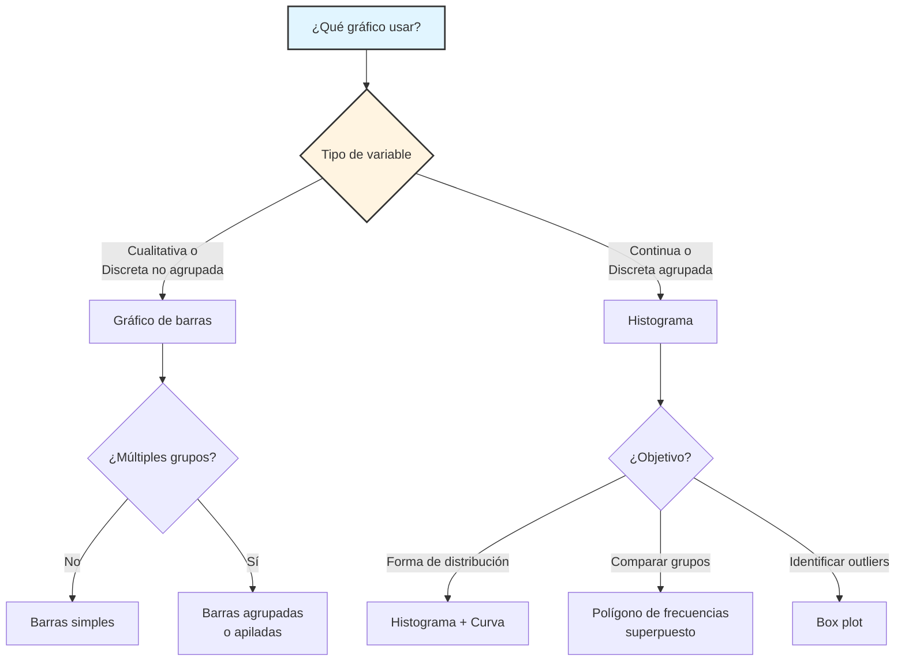

# Representaciones Gráficas en Estadística Descriptiva

## 1. Introducción y fundamentos de la visualización estadística

### 1.1 Motivación

La **visualización estadística** constituye una herramienta fundamental en el análisis exploratorio de datos (EDA). Mientras que las tablas de frecuencias proporcionan un resumen numérico, los **gráficos estadísticos** permiten:

1. **Identificación rápida de patrones**: Tendencias, agrupaciones, outliers
2. **Comunicación efectiva**: Transmitir información compleja de forma intuitiva
3. **Análisis de la forma de distribución**: Simetría, sesgo, multimodalidad
4. **Comparación entre grupos**: Visualizar diferencias y similitudes

**Principio fundamental de Tukey (1977):**
> "El análisis de datos gráfico es superior al numérico en la revelación de la estructura de los datos, particularmente de características inesperadas."

### 1.2 Marco conceptual

**Definición 1.1 (Representación gráfica estadística):**
Una **representación gráfica** de una variable estadística $X$ es una función biyectiva:
$$\varphi: (\text{Datos}, \text{Frecuencias}) \to \mathbb{R}^2$$
que mapea información estadística (clases y sus frecuencias) a coordenadas en el plano cartesiano, satisfaciendo criterios de **proporcionalidad visual** y **legibilidad**.

**Propiedades deseables:**
1. **Proporcionalidad**: El área o altura debe ser proporcional a la frecuencia representada
2. **Claridad**: La interpretación debe ser inmediata y no ambigua
3. **Completitud**: Debe representar toda la información relevante
4. **Honestidad**: No debe distorsionar ni exagerar patrones

---

## 2. Gráfico de barras

### 2.1 Definición y características

**Definición 2.1 (Gráfico de barras):**
Sea $X$ una **variable discreta** (cualitativa o cuantitativa no agrupada) con $k$ clases: $X_1, X_2, ..., X_k$ y frecuencias asociadas $n_1, n_2, ..., n_k$ (o $f_1, f_2, ..., f_k$). Un **gráfico de barras** es una representación gráfica donde:
- Cada clase $X_i$ se representa por una **barra rectangular** de base uniforme $b$
- La **altura** $h_i$ de la barra es proporcional a su frecuencia: $h_i \propto n_i$ (o $h_i \propto f_i$)
- Las barras están **espacialmente separadas** para enfatizar la naturaleza discreta de la variable
![[grafico-barras.png]]
**Especificaciones técnicas:**

| Característica | Requisito | Justificación |
|:---------------|:----------|:--------------|
| **Orientación** | Horizontal o vertical | Ambas son válidas; vertical es más común |
| **Separación** | Las barras **deben** estar separadas | Indica naturaleza discreta de $X$ |
| **Base** | Todas las barras con base uniforme $b$ | Asegura comparabilidad |
| **Altura** | $h_i = c \cdot n_i$ (o $h_i = c \cdot f_i$), con $c>0$ constante | Proporcionalidad visual |
| **Número de barras** | Igual a $k$ (número de clases) | Exhaustividad |
| **Escala del eje** | Debe iniciar en cero | Honestidad en la representación |
### 2.2 Construcción formal

**Algoritmo de construcción:**

1. **Eje horizontal (abscisas)**: Representar las $k$ clases $X_1, ..., X_k$
2. **Eje vertical (ordenadas)**: Escala para frecuencias (absoluta $n_i$ o relativa $f_i$)
3. **Dibujar barras**: Para cada $i \in \{1,...,k\}$:
   - Centrar barra sobre $X_i$
   - Altura $h_i = n_i$ (o $h_i = f_i$)
   - Ancho uniforme $b$ (arbitrario pero constante)
4. **Etiquetado**: Título, etiquetas de ejes, leyenda si aplica
### 2.3 Aplicabilidad

**Criterio de uso:**
El gráfico de barras es apropiado para:
- Variables **cualitativas** (nominales u ordinales)
- Variables **cuantitativas discretas** sin agrupar (cuando $k$ es razonablemente pequeño, típicamente $k \leq 20$)

**Ejemplos de uso adecuado:**
- Frecuencia de tipos de sangre: $\{A^+, A^-, B^+, B^-, AB^+, AB^-, O^+, O^-\}$
- Número de hijos por familia: $\{0, 1, 2, 3, 4, 5+\}$
- Categoría de producto más vendido
- Nivel educativo: $\{\text{Primaria}, \text{Secundaria}, \text{Universitaria}, \text{Posgrado}\}$

### 2.4 Variantes

**a) Gráfico de barras agrupadas:**
Para comparar múltiples variables categóricas simultáneamente.
![[barras-agrupadas.png]]
**b) Gráfico de barras apiladas:**
Muestra composición relativa de subcategorías dentro de cada clase.
![[barras-apiladas.png]]
Es muy útil para desglosar una variable en el porcentaje en sus contribuciones, o en su defecto cuando todos los grupos tienen el mismo total.
![[barras-apiladas-100.png]]

**c) Gráfico de barras horizontales:**
Preferible cuando las etiquetas de clase son largas o cuando se desea enfatizar comparaciones de magnitud.
![[barras-horizontal.png]]

---
## 3. Histograma

### 3.1 Definición y fundamentación

**Definición 3.1 (Histograma):**
Sea $X$ una **variable continua** o discreta con muchos valores agrupada en $k$ intervalos de clase $I_i = [c_i, c_{i+1})$ para $i=1,...,k$, con frecuencias $n_1, ..., n_k$ (o $f_1, ..., f_k$). Un **histograma** es una representación gráfica donde:
- Cada intervalo $I_i$ se representa por un **rectángulo**
- La base del rectángulo es el intervalo $[c_i, c_{i+1}]$ sobre el eje horizontal
- El **área** del rectángulo es proporcional a la frecuencia $n_i$ (o $f_i$)
- Los rectángulos son **adyacentes** (sin separación) para enfatizar la naturaleza continua de $X$

**Altura de las barras:**

Si los intervalos tienen **amplitud constante** $a = c_{i+1} - c_i$, entonces:
$$h_i = \frac{n_i}{a} \quad \text{o} \quad h_i = \frac{f_i}{a}$$

Si los intervalos tienen **amplitud variable** $a_i = c_{i+1} - c_i$, entonces:
$$h_i = \frac{n_i}{a_i} \quad \text{o} \quad h_i = \frac{f_i}{a_i}$$

**Justificación:** El área del rectángulo es $\text{base} \times \text{altura} = a_i \times h_i = a_i \times \frac{n_i}{a_i} = n_i$ (o $f_i$), cumpliendo el principio de proporcionalidad.
![[histograma.png]]
### 3.2 Propiedades matemáticas

**Propiedad 3.1 (Conservación de frecuencias):**
El área total del histograma con frecuencias relativas es:
$$\sum_{i=1}^{k} \text{Área}_i = \sum_{i=1}^{k} a_i \cdot h_i = \sum_{i=1}^{k} a_i \cdot \frac{f_i}{a_i} = \sum_{i=1}^{k} f_i = 1$$
con frecuencias absoluta:
$$\sum_{i=1}^{k} \text{Área}_i = \sum_{i=1}^{k} a_i \cdot h_i = \sum_{i=1}^{k} a_i \cdot \frac{n_i}{a_i} = \sum_{i=1}^{k} n_i = N$$

Esto significa que el histograma de frecuencias relativas puede interpretarse como una **aproximación discreta de una función de densidad de probabilidad**.

**Propiedad 3.2 (Convergencia asintótica):**
Bajo ciertas condiciones de regularidad, cuando $N \to \infty$ y $a \to 0$ (pero $Na \to \infty$), el histograma converge a la **función de densidad verdadera** $f(x)$ de la población:
$$h(x) \xrightarrow{N \to \infty} f(x)$$
Este resultado justifica el uso del histograma como **estimador no paramétrico de la densidad**.
### 3.3 Diferencias clave con el gráfico de barras

| Característica | Gráfico de Barras | Histograma |
|:---------------|:------------------|:-----------|
| **Tipo de variable** | Discreta (cualitativa o cuantitativa) | Continua (o discreta agrupada) |
| **Separación** | Barras separadas | Rectángulos adyacentes |
| **Base de barras** | Uniforme (arbitraria) | Amplitud del intervalo $a_i$ |
| **Interpretación de altura** | Directamente la frecuencia | Densidad de frecuencia $f_i/a_i$ |
| **Interpretación de área** | No relevante | Proporcional a la frecuencia |
| **Objetivo** | Comparar categorías | Mostrar forma de distribución |
### 3.4 Construcción paso a paso

1. **Agrupar datos**: Usar regla de Sturges o $\sqrt{N}$ para determinar $k$
2. **Calcular límites**: Definir $c_1, c_2, ..., c_{k+1}$
3. **Eje horizontal**: Marcar los límites de clase $c_i$
4. **Eje vertical**: 
   - Si $a$ constante: frecuencia $n_i$ o $f_i$
   - Si $a_i$ variable: densidad $n_i/a_i$ o $f_i/a_i$
5. **Dibujar rectángulos**: Sin espacios, altura según paso 4
6. **Etiquetado**: Título, ejes, interpretación

---
## 4. Polígono de frecuencias

### 4.1 Definición

**Definición 4.1 (Polígono de frecuencias):**
Sea un histograma con marcas de clase $m_1, ..., m_k$ y frecuencias $n_1, ..., n_k$ (o densidades $h_1, ..., h_k$). El **polígono de frecuencias** es una representación gráfica que:
1. Conecta los puntos $(m_i, h_i)$ mediante segmentos de recta para $i=1,...,k$
2. Extiende el polígono hasta el eje horizontal en los extremos: añade puntos $(m_0, 0)$ y $(m_{k+1}, 0)$ donde $m_0 = c_1 - a/2$ y $m_{k+1} = c_{k+1} + a/2$

**Representación matemática:**
El polígono de frecuencias es una **función lineal a trozos** $g: [c_1 - a/2, c_{k+1} + a/2] \to \mathbb{R}_{\geq 0}$ definida por interpolación lineal entre los puntos $(m_i, h_i)$.
![[poligono-frecuencia.png]]
### 4.2 Propiedades

**Propiedad 4.1 (Equivalencia de área):**
Si el histograma tiene intervalos de amplitud constante $a$, el área bajo el polígono de frecuencias es **igual** al área del histograma:
$$\int_{c_1-a/2}^{c_{k+1}+a/2} g(x) dx = \sum_{i=1}^{k} a_i \cdot h_i = \sum_{i=1}^{k} n_i = N \quad \text{(o 1 si son frecuencias relativas)}$$
### 4.3 Ventajas

1. **Suavizado visual**: Proporciona una representación más continua que el histograma
2. **Comparación múltiple**: Permite superponer polígonos de diferentes grupos para comparación
3. **Tendencia central**: Facilita identificar la forma general de la distribución
4. **Transición conceptual**: Sirve como puente visual entre el histograma discreto y la **curva de densidad continua**

---
## 5. Curva de densidad y aproximación de la distribución (Opcional)

### 5.1 Concepto de curva de densidad

**Definición 5.1 (Curva de densidad empírica):**
Una **curva de densidad** es una función suave $f: \mathbb{R} \to \mathbb{R}_{\geq 0}$ que aproxima la distribución de los datos, obtenida mediante técnicas de **suavizado** del histograma o polígono de frecuencias.
![[dist-aprox.png]]
**Métodos de construcción:**
1. **Estimación por kernel (KDE)**: 
   $$\hat{f}(x) = \frac{1}{Nh} \sum_{i=1}^{N} K\left(\frac{x-x_i}{h}\right)$$
   donde $K$ es una función kernel (ej: gaussiano) y $h$ es el ancho de banda
   
2. **Ajuste paramétrico**: Ajustar una distribución teórica (normal, exponencial, etc.)
3. **Suavizado de splines**: Interpolación mediante funciones polinómicas a trozos
### 5.2 Interpretación visual

La curva de densidad permite visualizar:
- **Forma general** de la distribución
- **Tendencias** y patrones que podrían ser ocultados por el ruido del histograma
- **Aproximación a la distribución poblacional** subyacente

**Conexión con la teoría:**
En el límite cuando $N \to \infty$, bajo condiciones de regularidad:
$$\hat{f}(x) \xrightarrow{P} f(x)$$
donde $f(x)$ es la verdadera función de densidad de probabilidad de la población.

---
## 6. Forma de las distribuciones

### 6.1 Simetría y asimetría

**Definición 6.1 (Distribución simétrica):**
Una distribución es **simétrica** respecto a un valor central $c$ si su función de densidad satisface:
$$f(c-x) = f(c+x) \quad \forall x \in \mathbb{R}$$

Visualmente, el histograma o curva se puede "doblar" por la mitad en $x=c$ y ambas partes coinciden.

**Característica estadística:** Para distribuciones simétricas unimodales:
$$\text{Media} = \text{Mediana} = \text{Moda} = c$$

**Ejemplos:** Distribución normal (gaussiana), distribución uniforme, distribución $t$ de Student.
![[dist-simetrica.png]]
**Definición 6.2 (Distribución asimétrica o sesgada):**
Una distribución es **asimétrica** si no cumple la propiedad de simetría. El **sesgo** cuantifica la dirección y magnitud de la asimetría.
#### 6.1.1 Sesgo positivo (sesgado a la derecha)

**Características:**
- La **cola derecha** es más larga que la izquierda
- La mayoría de los datos se concentran en valores **bajos**
- Media > Mediana > Moda (típicamente)

**Interpretación:** Hay algunos valores **extremadamente grandes** que "arrastran" la distribución hacia la derecha.

**Ejemplos:** Ingresos salariales, tiempos de espera, precios de viviendas, concentraciones químicas con límite inferior.

**Medida formal:** Coeficiente de asimetría de Fisher $g_1 > 0$

![[sesgada-der.png]]
#### 6.1.2 Sesgo negativo (sesgado a la izquierda)

**Características:**
- La **cola izquierda** es más larga que la derecha
- La mayoría de los datos se concentran en valores **altos**
- Media < Mediana < Moda (típicamente)

**Interpretación:** Hay algunos valores **extremadamente pequeños** que "arrastran" la distribución hacia la izquierda.

**Ejemplos:** Edad de fallecimiento en países desarrollados, calificaciones en exámenes fáciles, vida útil de productos con límite superior natural.

**Medida formal:** Coeficiente de asimetría de Fisher $g_1 < 0$

![[sesgada-izq.png]]
### 6.2 Modalidad

**Definición 6.3 (Moda de una distribución):**
Una **moda** es un valor (o intervalo) donde la distribución alcanza un **máximo local** de frecuencia. Formalmente, $x_0$ es una moda si:
$$f(x_0) \geq f(x) \quad \forall x \in (x_0-\epsilon, x_0+\epsilon)$$
para algún $\epsilon > 0$.

**Clasificación por modalidad:**
#### 6.2.1 Distribución unimodal
- **Una sola moda** (un único pico)
- La más común en fenómenos naturales
- Ejemplos: Distribución normal, exponencial, chi-cuadrado
#### 6.2.2 Distribución bimodal
- **Dos modas** distintas (dos picos)
- Sugiere la presencia de **dos subpoblaciones** o **dos procesos generadores** mezclados
- Ejemplo: Alturas en una población mixta (hombres y mujeres), tiempos de reacción en dos grupos experimentales

**Interpretación crítica:** Una distribución bimodal puede indicar que el análisis debe hacerse **por separado** para cada grupo.

![[bimodal.png]]
#### 6.2.3 Distribución multimodal
- **Tres o más modas**
- Menos común, indica estructura compleja
- Puede sugerir necesidad de estratificación del análisis
#### 6.2.4 Distribución uniforme
- **Sin moda** (todas las frecuencias son aproximadamente iguales)
- Rara en datos naturales, común en datos generados artificialmente
![[uniforme_histograma.png]]

*Esta solo son algunas de las formas que pueden tomar la distribución aproximada*

---
## Ejercicio
Hacer el histograma con su respectivo polígono de frecuencia y un bosquejo de la curva de distribución usando la tabla de frecuencias que completamos en la clase anterior

| Intervalo $I_i$ | Marca $m_i$ | $n_i$  | $N_i$ |  $f_i$   | $F_i$ (%) |
| :-------------: | :---------: | :----: | :---: | :------: | :-------: |
|  $[0.03,0.53)$  |    0.28     |   19   |  19   |   38%    |    38%    |
|  $[0.53,1.03)$  |    0.78     |   9    |  28   |   18%    |    56%    |
|  $[1.03,1.53)$  |    1.28     |   9    |  37   |   18%    |    74%    |
|  $[1.53,2.03)$  |    1.78     |   6    |  43   |   12%    |    86%    |
|  $[2.03,2.53)$  |    2.28     |   2    |  45   |    4%    |    90%    |
|  $[2.53,3.03)$  |    2.78     |   3    |  48   |    6%    |    96%    |
|  $[3.03,3.53]$  |    3.28     |   2    |  50   |    4%    |   100%    |
|    **Total**    |      —      | **50** |   —   | **100%** |     —     |
![[clase4-ejercicio1.png]]
![[clase-ejercicio1.2.png]]

---
## 7. Histograma de frecuencias absolutas vs. relativas

### 7.1 Comparación formal

| Aspecto | Frecuencias Absolutas $(n_i)$ | Frecuencias Relativas $(f_i)$ |
|:--------|:-----------------------------|:-----------------------------|
| **Rango del eje Y** | $[0, n_{\max}]$ donde $n_{\max} = \max_i n_i$ | $[0, f_{\max}]$ donde $f_{\max} = \max_i f_i \leq 1$ |
| **Interpretación de área** | Número total de observaciones: $\sum n_i = N$ | Proporción total: $\sum f_i = 1$ |
| **Comparabilidad** | Solo para muestras del mismo tamaño | Para muestras de **cualquier tamaño** |
| **Uso típico** | Análisis exploratorio único | Comparación entre grupos |
### 7.2 Ventaja fundamental del histograma de frecuencias relativas

**Teorema 7.1 (Invarianza por tamaño muestral):**
Sean $\mathbf{x}^{(1)} = (x_1^{(1)}, ..., x_{N_1}^{(1)})$ y $\mathbf{x}^{(2)} = (x_1^{(2)}, ..., x_{N_2}^{(2)})$ dos muestras de tamaños $N_1 \neq N_2$ provenientes de la misma población con distribución $F$. Si ambas muestras son suficientemente grandes y representativas, sus histogramas de **frecuencias relativas** convergirán a la misma forma, independientemente de $N_1$ y $N_2$:
$$\hat{f}_1(x) \approx \hat{f}_2(x) \approx f(x)$$
donde $f(x)$ es la verdadera densidad poblacional.

**Implicación práctica:** El histograma de frecuencias relativas permite:
1. **Comparar** distribuciones de grupos con diferentes tamaños muestrales
2. **Estandarizar** visualizaciones para presentaciones
3. **Interpretar** el histograma como aproximación de la **distribución de probabilidad**

**Ejemplo:** Comparar ingresos de dos ciudades con poblaciones muy diferentes ($N_1=500$ vs. $N_2=5000$). Con frecuencias absolutas, la comparación visual es engañosa; con frecuencias relativas, las formas se pueden comparar directamente.

---
## 8. Otros gráficos estadísticos importantes

### 8.1 Diagrama de caja (Box Plot)

**Características:**
- Resume la distribución mediante **cinco estadísticos**: mínimo, Q₁, mediana, Q₃, máximo
- Identifica **valores atípicos** (outliers)
- Permite comparar múltiples grupos fácilmente

### 8.2 Gráfico de sectores (Pie Chart)

**Uso:** Variables cualitativas, especialmente cuando se desea mostrar **proporciones** de un total.

**Limitación:** Difícil comparar ángulos; el gráfico de barras suele ser superior.

### 8.3 Gráfico de dispersión (Scatter Plot)

**Uso:** Visualizar relación entre **dos variables cuantitativas**

**Objetivo:** Identificar correlación, tendencias, patrones bivariados

### 8.4 Ojiva o polígono de frecuencias acumuladas

**Construcción:** Graficar $(c_{i+1}, F_i)$ para $i=1,...,k$ y conectar con segmentos

**Interpretación:** Aproximación gráfica de la **función de distribución empírica** $F_N(x)$

---

## 9. Principios de buena práctica en visualización

### 9.1 Los principios de Tufte (1983)

Edward Tufte estableció principios fundamentales para gráficos estadísticos efectivos:

1. **Integridad gráfica**: Evitar distorsiones. El tamaño visual debe ser proporcional a las cantidades representadas.
2. **Maximizar la razón datos-tinta**: Eliminar elementos decorativos innecesarios (chartjunk).
3. **Claridad**: Cada elemento debe tener un propósito comunicativo claro.
4. **Densidad de datos**: Mostrar la mayor cantidad de información en el menor espacio posible sin sacrificar claridad.

### 9.2 Errores comunes a evitar

| Error | Problema | Solución |
|:------|:---------|:---------|
| **Eje Y truncado** | Exagera diferencias pequeñas | Iniciar eje en cero |
| **3D innecesario** | Distorsiona proporciones | Usar 2D siempre que sea posible |
| **Demasiados colores** | Confunde, no aporta información | Usar color con propósito específico |
| **Escalas inconsistentes** | Impide comparación | Estandarizar escalas al comparar |
| **Falta de etiquetas** | Información incompleta | Título, ejes, leyenda, unidades |

---

## 10. Resumen conceptual

### 10.1 Tabla de decisión para elegir gráfico



### 10.2 Conceptos clave

| Concepto | Definición sintética | Aplicación |
|:---------|:---------------------|:-----------|
| **Gráfico de barras** | Rectángulos separados, altura = frecuencia | Variables discretas |
| **Histograma** | Rectángulos adyacentes, área = frecuencia | Variables continuas agrupadas |
| **Polígono de frecuencias** | Línea que conecta marcas de clase | Suavizado del histograma |
| **Curva de densidad** | Función suave que aproxima distribución | Estimación no paramétrica |
| **Simetría** | $f(c-x) = f(c+x)$ | Media = Mediana = Moda |
| **Sesgo positivo** | Cola larga derecha | Media > Mediana |
| **Sesgo negativo** | Cola larga izquierda | Media < Mediana |
| **Bimodal** | Dos picos | Posible mezcla de poblaciones |

---

## 11. Ejemplo integrador

**Problema:** Analizar la distribución de alturas (en cm) de 100 estudiantes universitarios.

**Datos resumidos:**

| Intervalo | $n_i$ | $f_i$ | $N_i$ | $F_i$ |
|:---------:|:-----:|:-----:|:-----:|:-----:|
| [150,155) | 5 | 0.05 | 5 | 0.05 |
| [155,160) | 12 | 0.12 | 17 | 0.17 |
| [160,165) | 23 | 0.23 | 40 | 0.40 |
| [165,170) | 28 | 0.28 | 68 | 0.68 |
| [170,175) | 18 | 0.18 | 86 | 0.86 |
| [175,180) | 10 | 0.10 | 96 | 0.96 |
| [180,185] | 4 | 0.04 | 100 | 1.00 |

**Análisis gráfico:**

1. **Histograma**: Muestra distribución **unimodal** con moda en $[165,170)$
2. **Forma**: Aproximadamente **simétrica**, aunque con ligero **sesgo positivo** (cola derecha ligeramente más larga)
3. **Interpretación**: La mayoría de estudiantes mide entre 160-175 cm (69% de los datos)
4. **Comparación**: Si queremos comparar con otra universidad, usamos histograma de **frecuencias relativas**

---

## 12. Ejercicios propuestos

**Ejercicio 1:** Explica por qué un histograma con intervalos de amplitud variable requiere graficar la **densidad** $f_i/a_i$ en lugar de la frecuencia $f_i$ directamente.

**Ejercicio 2:** Dada la siguiente distribución de calificaciones (0-10):
```
5.5, 6.0, 6.5, 7.0, 7.0, 7.5, 7.5, 7.5, 8.0, 8.0,
8.5, 8.5, 8.5, 8.5, 9.0, 9.0, 9.5, 10.0
```
a) Construye un histograma con 5 intervalos  
b) Clasifica la distribución (simétrica/asimétrica, unimodal/bimodal)  
c) ¿Qué sugiere la forma sobre el nivel de dificultad del examen?

**Ejercicio 3:** Si una distribución es **bimodal**, ¿qué acciones deberías considerar antes de calcular la media como medida de tendencia central?

**Ejercicio 4 (Avanzado):** Demuestra que el área bajo un polígono de frecuencias relativas con intervalos de amplitud constante $a$ es igual a 1.

---

## 13. Conexión con temas futuros

Los gráficos estudiados en esta clase son fundamentales para:
- **Estadística Inferencial**: Visualizar supuestos de normalidad antes de pruebas paramétricas
- **Análisis de Regresión**: Gráficos de dispersión para identificar relaciones
- **Control de Calidad**: Histogramas para monitorear procesos
- **Machine Learning**: Análisis exploratorio de datos (EDA) antes de modelado

---

**Referencias bibliográficas:**
- Tufte, E. R. (1983). *The Visual Display of Quantitative Information*. Graphics Press.
- Cleveland, W. S. (1993). *Visualizing Data*. Hobart Press.
- Tukey, J. W. (1977). *Exploratory Data Analysis*. Addison-Wesley.
- Wilkinson, L. (2005). *The Grammar of Graphics* (2nd ed.). Springer.