# Representaciones Gráficas en Estadística Descriptiva

En esta clase se estudian los gráficos fundamentales de la estadística descriptiva: barras, histogramas, polígonos de frecuencias, curvas de densidad, gráficos de sectores, ojivas, diagramas de Pareto, tallo y hoja, y diagramas de caja. Se enfatiza el rigor geométrico de cada construcción, sus propiedades matemáticas y los criterios para elegir el gráfico adecuado según el tipo de variable y el objetivo del análisis.

---

## 1. Introducción y fundamentos de la visualización estadística

Una tabla de frecuencias resume la información de manera precisa, pero el cerebro humano procesa con mayor eficiencia patrones visuales. Los **gráficos estadísticos** permiten identificar tendencias, agrupaciones, valores atípicos y la forma general de una distribución en una sola mirada. Son, junto con las tablas, la herramienta central del análisis exploratorio de datos (EDA).

La visualización estadística permite:

1. **Identificación rápida de patrones:** tendencias, agrupaciones, valores atípicos.
2. **Comunicación efectiva:** transmitir información compleja de forma intuitiva.
3. **Análisis de la forma de la distribución:** simetría, sesgo, multimodalidad.
4. **Comparación entre grupos:** visualizar diferencias y similitudes.

> **Nota histórica:** John Tukey, pionero del análisis exploratorio de datos, defendió que los gráficos son superiores a los resúmenes numéricos para revelar la estructura de los datos, especialmente características inesperadas. Esta idea quedó plasmada en su influyente obra *Exploratory Data Analysis* (1977).

### 1.1 Definición formal

**Definición 1.1 (Representación gráfica estadística):**
Una **representación gráfica** de una variable estadística $X$ es una función:
$$\varphi: (\text{Datos}, \text{Frecuencias}) \to \mathbb{R}^2$$
que mapea información estadística (clases y sus frecuencias) a coordenadas en el plano cartesiano, satisfaciendo criterios de **proporcionalidad visual** y **legibilidad**.

**Propiedades deseables:**
1. **Proporcionalidad:** el área o la altura debe ser proporcional a la frecuencia representada.
2. **Claridad:** la interpretación debe ser inmediata y no ambigua.
3. **Completitud:** debe representar toda la información relevante.
4. **Honestidad:** no debe distorsionar ni exagerar patrones.

---

## 2. Gráfico de barras

Cuando se desea comparar cantidades asociadas a categorías distintas —por ejemplo, el número de personas por nivel educativo o la frecuencia de cada tipo sanguíneo— una tabla de frecuencias es precisa pero poco inmediata. El **gráfico de barras** traduce esos números en alturas visuales, permitiendo comparar magnitudes de un solo vistazo. Es la representación más directa para variables cualitativas o discretas con pocas clases.

> **Nota histórica:** El gráfico de barras fue introducido por el economista e ingeniero escocés **William Playfair** a finales del siglo XVIII, especialmente en su obra *The Commercial and Political Atlas* (1786). Playfair también inventó el gráfico de líneas y popularizó el gráfico de sectores, sentando las bases de la visualización estadística moderna.

### 2.1 Definición formal

**Definición 2.1 (Gráfico de barras):**
Sea $X$ una variable discreta (cualitativa o cuantitativa no agrupada) con $k$ clases $v_1, v_2, \ldots, v_k$ y frecuencias asociadas $n_1, n_2, \ldots, n_k$ (o relativas $f_1, f_2, \ldots, f_k$). Un **gráfico de barras** es una representación donde:

- Cada clase $v_i$ se representa por una barra rectangular de base uniforme $b$.
- La altura $h_i$ de la barra es proporcional a su frecuencia: $h_i = c \cdot n_i$ (o $h_i = c \cdot f_i$), con $c > 0$ constante.
- Las barras están espacialmente separadas para enfatizar la naturaleza discreta de la variable.

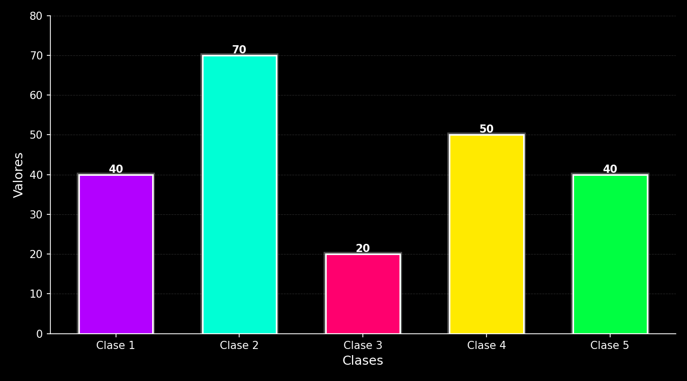

### 2.2 Algoritmo de construcción

**Algoritmo 2.1 (Construcción de un gráfico de barras):**
Dadas $k$ clases $v_1, v_2, \ldots, v_k$ con frecuencias $n_1, n_2, \ldots, n_k$:

1. Sobre el eje horizontal, ubicar las $k$ clases $v_1, v_2, \ldots, v_k$.
2. Sobre el eje vertical, establecer una escala lineal para las frecuencias (absolutas $n_i$ o relativas $f_i$), iniciada siempre en cero.
3. Para cada clase $v_i$:
   - Dibujar una barra rectangular centrada sobre $v_i$.
   - Asignar una base uniforme $b$ a todas las barras.
   - Asignar una altura $h_i = c \cdot n_i$ (o $h_i = c \cdot f_i$), donde $c$ es una constante de proporcionalidad común.
4. Dejar un espacio visible entre barras adyacentes.
5. Etiquetar título, ejes, unidades y leyenda si aplica.

### 2.3 Especificaciones técnicas

| Característica | Requisito | Justificación |
|:---------------|:----------|:--------------|
| Orientación | Horizontal o vertical | Ambas son válidas; la vertical es más común |
| Separación | Las barras deben estar separadas | Indica naturaleza discreta de $X$ |
| Base | Todas las barras con base uniforme $b$ | Asegura comparabilidad |
| Altura | $h_i = c \cdot n_i$ o $h_i = c \cdot f_i$, con $c > 0$ | Proporcionalidad visual |
| Número de barras | Igual a $k$ | Exhaustividad |
| Escala del eje | Debe iniciar en cero | Honestidad en la representación |

### 2.4 Ejemplos

**Ejemplo 2.1 (Nivel educativo):**
En una encuesta sobre nivel educativo se obtiene:

| Nivel educativo | $n_i$ | $f_i$ |
|:----------------|:-----:|:-----:|
| Primaria | 12 | 0.12 |
| Secundaria | 35 | 0.35 |
| Universitaria | 40 | 0.40 |
| Posgrado | 13 | 0.13 |
| **Total** | **100** | **1.00** |

El gráfico de barras asigna una barra a cada nivel educativo, con altura proporcional a $n_i$ o $f_i$, y separación entre barras. La clase "Universitaria" es la más frecuente y "Primaria" la menos frecuente.

**Ejemplo 2.2 (Tipos de sangre):**
En un banco de sangre se registran las donaciones por tipo sanguíneo:

| Tipo sanguíneo | $n_i$ | $f_i$ |
|:---------------|:-----:|:-----:|
| $A^+$ | 45 | 0.30 |
| $A^-$ | 15 | 0.10 |
| $B^+$ | 27 | 0.18 |
| $B^-$ | 9 | 0.06 |
| $AB^+$ | 12 | 0.08 |
| $AB^-$ | 3 | 0.02 |
| $O^+$ | 30 | 0.20 |
| $O^-$ | 9 | 0.06 |
| **Total** | **150** | **1.00** |

Aquí el gráfico de barras permite identificar rápidamente que $A^+$ y $O^+$ son los tipos más frecuentes, mientras que $AB^-$ es el menos frecuente. La variable es cualitativa nominal, por lo que el orden de las barras puede ser alfabético o según frecuencia decreciente.

### 2.5 Variantes

- **Gráfico de barras agrupadas:** compara múltiples subgrupos dentro de cada categoría.

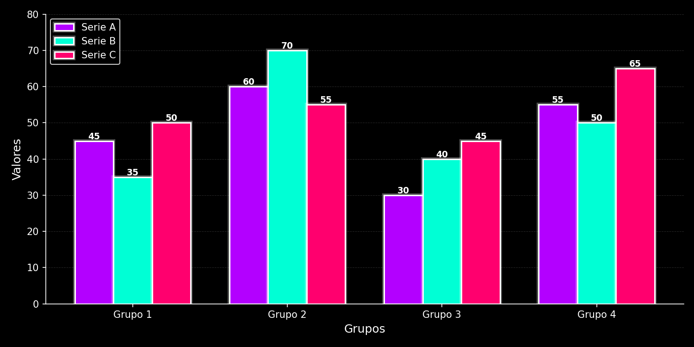

- **Gráfico de barras apiladas:** muestra la composición relativa de subcategorías dentro de cada clase. Es útil cuando todos los grupos tienen el mismo total o cuando se desea mostrar porcentajes.

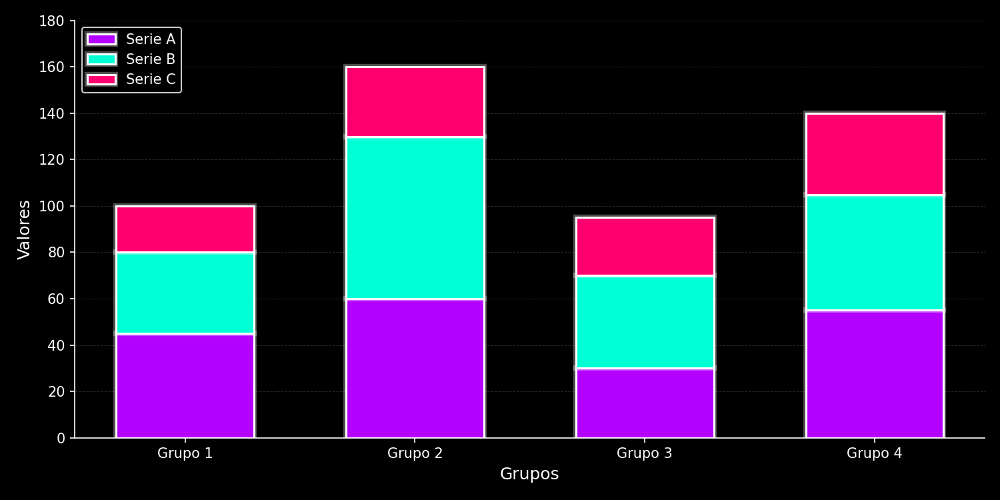

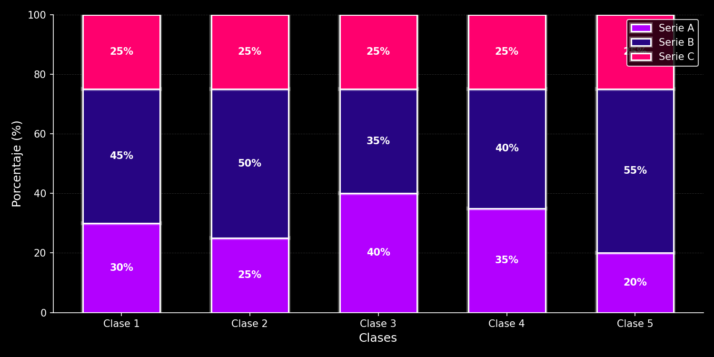

- **Gráfico de barras horizontales:** preferible cuando las etiquetas de clase son largas o cuando se desea enfatizar comparaciones de magnitud.

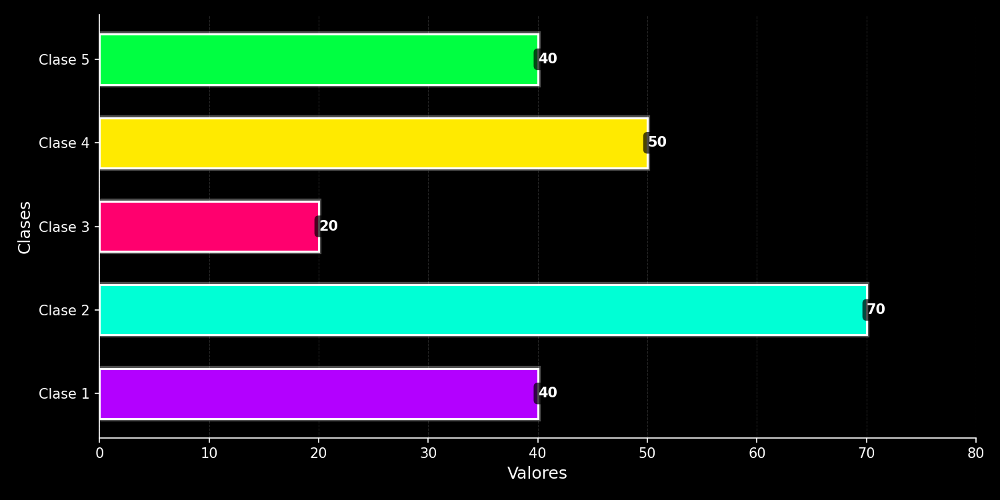

### 2.6 Observaciones y buenas prácticas

- El gráfico de barras es apropiado para variables cualitativas (nominales u ordinales) y para variables cuantitativas discretas sin agrupar, cuando el número de clases es razonablemente pequeño (típicamente $k \leq 20$).
- Si las barras se ordenan por frecuencia decreciente, el gráfico funciona como un diagrama de Pareto sin la ojiva acumulada.
- Iniciar el eje vertical en cero es una regla de honestidad visual: un eje truncado exagera diferencias pequeñas entre categorías.

---

## 3. Histograma

Cuando la variable es continua o discreta con muchos valores distintos, los datos se agrupan en intervalos de clase. El histograma representa cada intervalo mediante un rectángulo cuya área (no solo su altura) es proporcional a la frecuencia. Esta diferencia es esencial y distingue al histograma del gráfico de barras.

> **Nota histórica:** El término **histograma** fue introducido por el estadístico británico **Karl Pearson** en 1895, en el contexto de sus trabajos sobre distribuciones de frecuencias y curvas de frecuencia. Pearson buscaba una representación gráfica que mostrara la forma de una distribución continua a partir de datos agrupados.

### 3.1 Definición formal

**Definición 3.1 (Histograma):**
Sea $X$ una variable continua o discreta agrupada en $k$ intervalos de clase $I_i = [c_i, c_{i+1})$ para $i = 1, \ldots, k$, con frecuencias $n_1, \ldots, n_k$ (o relativas $f_1, \ldots, f_k$). Un **histograma** es una representación gráfica donde:

- Cada intervalo $I_i$ se representa por un rectángulo.
- La base del rectángulo es el intervalo $[c_i, c_{i+1}]$ sobre el eje horizontal.
- El **área** del rectángulo es proporcional a la frecuencia $n_i$ (o $f_i$).
- Los rectángulos son adyacentes (sin separación) para enfatizar la naturaleza continua de $X$.

**Altura de los rectángulos:**

Si los intervalos tienen amplitud constante $a = c_{i+1} - c_i$, entonces:
$$h_i = \dfrac{n_i}{a} \quad \text{o} \quad h_i = \dfrac{f_i}{a}$$

Si los intervalos tienen amplitud variable $a_i = c_{i+1} - c_i$, entonces:
$$h_i = \dfrac{n_i}{a_i} \quad \text{o} \quad h_i = \dfrac{f_i}{a_i}$$

La elección entre frecuencias absolutas o relativas depende del objetivo del análisis.

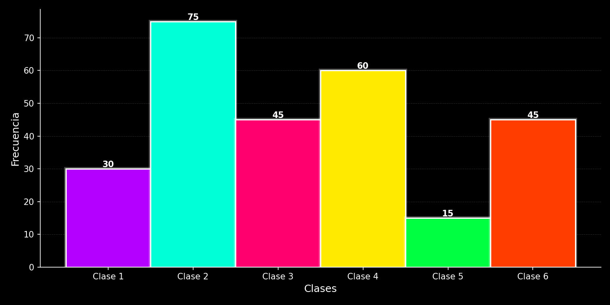

### 3.2 Algoritmo de construcción

**Algoritmo 3.1 (Construcción de un histograma):**
Dado un conjunto de datos $\mathbf{x} = (x_1, \ldots, x_N)$:

1. Agrupar los datos usando una regla heurística (Sturges, raíz cuadrada, Scott, Freedman-Diaconis, etc.) para determinar el número de intervalos $k$.
2. Calcular el rango $R = x_{(N)} - x_{(1)}$ y la amplitud $a \approx R/k$, redondeando a un valor conveniente.
3. Definir los límites de clase $c_1, c_2, \ldots, c_{k+1}$, asegurando que $c_1 \leq x_{(1)}$ y $c_{k+1} \geq x_{(N)}$.
4. Contar cuántos datos caen en cada intervalo $I_i = [c_i, c_{i+1})$ para obtener las frecuencias absolutas $n_i$.
5. Calcular las frecuencias relativas $f_i = n_i/N$ y, si es necesario, las densidades $h_i = n_i/a_i$ o $h_i = f_i/a_i$.
6. Sobre el eje horizontal, marcar los límites de clase.
7. Sobre el eje vertical:
   - Si $a_i$ es constante: usar frecuencia $n_i$ o $f_i$.
   - Si $a_i$ es variable: usar densidad $n_i/a_i$ o $f_i/a_i$.
8. Dibujar rectángulos adyacentes con altura según el paso anterior.
9. Etiquetar título, ejes e interpretación.

> **Observación:** si se usa frecuencia absoluta $n_i$ con amplitud constante, el área total del histograma es $a \cdot N$ y no $N$. Por eso, cuando se compara con una densidad de probabilidad o entre muestras de distintos tamaños, se prefiere usar frecuencias relativas o densidades.

### 3.3 Propiedades matemáticas

**Proposición 3.1 (Conservación de frecuencias):**
El área total del histograma con frecuencias relativas es:
$$\sum_{i=1}^{k} \text{Área}_i = \sum_{i=1}^{k} a_i \cdot h_i = \sum_{i=1}^{k} a_i \cdot \dfrac{f_i}{a_i} = \sum_{i=1}^{k} f_i = 1$$

Con frecuencias absolutas:
$$\sum_{i=1}^{k} \text{Área}_i = \sum_{i=1}^{k} a_i \cdot h_i = \sum_{i=1}^{k} a_i \cdot \dfrac{n_i}{a_i} = \sum_{i=1}^{k} n_i = N$$

Esto significa que el histograma de frecuencias relativas puede interpretarse como una aproximación discreta de una función de densidad de probabilidad.

**Proposición 3.2 (Convergencia asintótica):**
Bajo ciertas condiciones de regularidad, cuando $N \to \infty$ y la amplitud de clase $a \to 0$ (pero $Na \to \infty$), el histograma converge a la función de densidad verdadera $f(x)$ de la población:
$$h(x) \xrightarrow{N \to \infty} f(x)$$

**Demostración:**
La demostración rigurosa requiere teoría de la probabilidad y procesos de convergencia de estimadores de densidad. Se difiere a cursos avanzados de inferencia estadística.
$\blacksquare$

### 3.4 Ejemplos

**Ejemplo 3.1 (Datos de la Clase 3):**
Usando la tabla de frecuencias de la Clase 3:

| Intervalo $I_i$ | Marca $m_i$ | $n_i$ | $f_i$ |
|:---------------:|:-----------:|:-----:|:-----:|
| $[0.03, 0.53)$ | 0.28 | 19 | 0.38 |
| $[0.53, 1.03)$ | 0.78 | 9 | 0.18 |
| $[1.03, 1.53)$ | 1.28 | 9 | 0.18 |
| $[1.53, 2.03)$ | 1.78 | 6 | 0.12 |
| $[2.03, 2.53)$ | 2.28 | 2 | 0.04 |
| $[2.53, 3.03)$ | 2.78 | 3 | 0.06 |
| $[3.03, 3.53]$ | 3.28 | 2 | 0.04 |

Como todos los intervalos tienen amplitud $a = 0.50$, la altura de cada rectángulo puede ser $h_i = n_i$ (o $h_i = f_i$) sin distorsionar las proporciones. El histograma muestra una distribución sesgada positivamente, con mayor concentración en el primer intervalo.

**Ejemplo 3.2 (Histograma con amplitud variable):**
Supongamos los siguientes intervalos y frecuencias:

| Intervalo $I_i$ | $n_i$ | $a_i$ | $h_i = n_i/a_i$ |
|:---------------:|:-----:|:-----:|:---------------:|
| $[0, 10)$ | 20 | 10 | 2 |
| $[10, 20)$ | 30 | 10 | 3 |
| $[20, 40)$ | 20 | 20 | 1 |
| $[40, 60]$ | 10 | 20 | 0.5 |

El segundo y tercer intervalo tienen la misma frecuencia ($n_i = 20$), pero el tercero es el doble de ancho. Por eso su densidad $h_i$ es la mitad, lo que refleja correctamente que los datos están más dispersos en ese rango. Ignorar la amplitud y graficar solo $n_i$ distorsionaría la percepción de la distribución.

### 3.5 Diferencias clave con el gráfico de barras

| Característica | Gráfico de barras | Histograma |
|:---------------|:------------------|:-----------|
| Tipo de variable | Discreta (cualitativa o cuantitativa) | Continua (o discreta agrupada) |
| Separación | Barras separadas | Rectángulos adyacentes |
| Base de barras | Uniforme (arbitraria) | Amplitud del intervalo $a_i$ |
| Interpretación de altura | Directamente la frecuencia | Densidad de frecuencia $f_i/a_i$ |
| Interpretación de área | No relevante | Proporcional a la frecuencia |
| Objetivo | Comparar categorías | Mostrar forma de la distribución |

### 3.6 Observaciones y buenas prácticas

- Cuando todos los intervalos tienen la misma amplitud, la altura del rectángulo es proporcional a la frecuencia y puede usarse directamente en el eje vertical. Si las amplitudes son distintas, es obligatorio usar densidad de frecuencia para preservar la proporcionalidad del área.
- El histograma es sensible a la elección del número de intervalos $k$. Intervalos muy pocos ocultan la forma; intervalos demasiados generan ruido visual.
- No debe usarse un histograma para variables cualitativas ni para variables discretas con pocas clases, pues la adyacencia de los rectángulos sugiere continuidad donde no la hay.

---

## 4. Polígono de frecuencias

El histograma muestra la forma de una distribución, pero sus rectángulos pueden dar una apariencia escalonada. El **polígono de frecuencias** conecta los puntos correspondientes a las marcas de clase de un histograma, generando una figura continua que facilita la visualización de la forma general y la comparación entre varios grupos.

> **Nota histórica:** El polígono de frecuencias fue popularizado por **Karl Pearson** a finales del siglo XIX, como una forma de suavizar la representación de histogramas y aproximar la curva de frecuencia teórica de una población.

### 4.1 Definición formal

**Definición 4.1 (Polígono de frecuencias):**
Sea un histograma con intervalos de amplitud constante $a$, límites de clase $c_1, c_2, \ldots, c_{k+1}$, marcas de clase $m_1, m_2, \ldots, m_k$ y alturas (densidades) $h_1, h_2, \ldots, h_k$. El **polígono de frecuencias** es una función lineal a trozos $g: [c_1 - a/2, c_{k+1} + a/2] \to \mathbb{R}_{\geq 0}$ definida por interpolación lineal entre los puntos:

$$
(m_0, 0), \quad (m_1, h_1), \quad (m_2, h_2), \quad \ldots, \quad (m_k, h_k), \quad (m_{k+1}, 0)
$$

donde $m_0 = c_1 - a/2$ y $m_{k+1} = c_{k+1} + a/2$ son las marcas virtuales que anclan el polígono al eje horizontal.

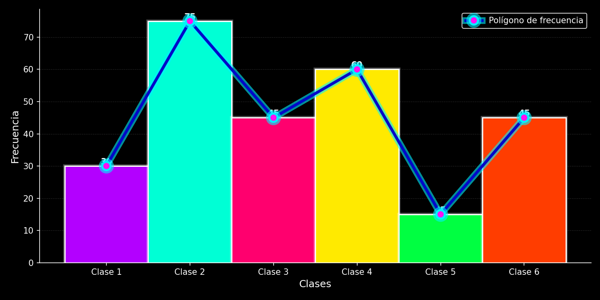

### 4.2 Algoritmo de construcción

**Algoritmo 4.1 (Construcción de un polígono de frecuencias):**
Dado un histograma con intervalos de amplitud constante $a$:

1. Calcular las marcas de clase $m_i = \dfrac{c_i + c_{i+1}}{2}$ para $i = 1, \ldots, k$.
2. Determinar las alturas $h_i$ de los rectángulos del histograma (frecuencias $n_i$, frecuencias relativas $f_i$, o densidades $h_i = n_i/a$, $h_i = f_i/a$, según corresponda).
3. Añadir dos puntos auxiliares sobre el eje horizontal: $(m_0, 0)$ y $(m_{k+1}, 0)$, con $m_0 = c_1 - a/2$ y $m_{k+1} = c_{k+1} + a/2$.
4. Unir con segmentos de recta los puntos $(m_0, 0), (m_1, h_1), \ldots, (m_k, h_k), (m_{k+1}, 0)$ en orden creciente.
5. Etiquetar título, ejes e interpretación.

### 4.3 Propiedades

**Proposición 4.1 (Equivalencia de área):**
Si el histograma tiene intervalos de amplitud constante $a$, el área bajo el polígono de frecuencias es igual al área del histograma:
$$\int_{c_1 - a/2}^{c_{k+1} + a/2} g(x) \, dx = \sum_{i=1}^{k} a \cdot h_i = \sum_{i=1}^{k} n_i = N$$
(o $1$ si se usan frecuencias relativas).

**Demostración:**
En cada intervalo $[m_i, m_{i+1}]$, el polígono forma un trapecio con el eje horizontal. El área de dicho trapecio es:
$$\text{Área}_i = a \cdot \dfrac{h_i + h_{i+1}}{2}$$
Sumando sobre todos los intervalos y usando que los puntos extremos $(m_0, 0)$ y $(m_{k+1}, 0)$ no aportan área, se obtiene:
$$\int_{c_1 - a/2}^{c_{k+1} + a/2} g(x) \, dx = \sum_{i=1}^{k} a \cdot \dfrac{h_i + h_{i+1}}{2}$$
Bajo la condición de que el histograma tiene amplitud constante y el polígono pasa exactamente por las marcas de clase, esta suma coincide con la suma de las áreas de los rectángulos del histograma. La igualdad exacta con $\sum n_i$ (o $\sum f_i$) se obtiene aplicando la Proposición 3.1.
$\blacksquare$

### 4.4 Ejemplos

**Ejemplo 4.1:**
Para el histograma del Ejemplo 3.1 se tienen las marcas y alturas:

| Marca $m_i$ | $h_i = n_i$ |
|:-----------:|:-----------:|
| 0.28 | 19 |
| 0.78 | 9 |
| 1.28 | 9 |
| 1.78 | 6 |
| 2.28 | 2 |
| 2.78 | 3 |
| 3.28 | 2 |

Los puntos auxiliares son $m_0 = 0.03 - 0.25 = -0.22$ y $m_8 = 3.53 + 0.25 = 3.78$. El polígono une los puntos $(-0.22, 0)$, $(0.28, 19)$, $(0.78, 9)$, $(1.28, 9)$, $(1.78, 6)$, $(2.28, 2)$, $(2.78, 3)$, $(3.28, 2)$ y $(3.78, 0)$.

### 4.5 Observaciones y buenas prácticas

- El polígono de frecuencias proporciona una representación más suave que el histograma, lo que facilita identificar la forma general de la distribución.
- Permite superponer varios polígonos para comparar distribuciones de distintos grupos sobre el mismo eje.
- Solo tiene sentido cuando los intervalos del histograma tienen amplitud constante; de lo contrario, la interpolación lineal entre marcas de clase pierde su interpretación de área equivalente.
- Sirve como puente visual entre el histograma discreto y una curva de densidad continua.

---

## 5. Curva de densidad y forma de la distribución

Mientras el histograma y el polígono de frecuencias dependen de la elección de los intervalos de clase, una **curva de densidad empírica** suaviza esa dependencia y ofrece una aproximación más refinada a la distribución subyacente. A partir de ella se pueden diagnosticar propiedades globales de la distribución, como su simetría, sesgo y modalidad.

> **Nota histórica:** La estimación de densidad por kernel (KDE) fue desarrollada formalmente en la década de 1950 por **Murray Rosenblatt** y **Emanuel Parzen**, aunque las ideas de suavizado de histogramas se remontan a los trabajos de Karl Pearson a fines del siglo XIX.

### 5.1 Curva de densidad empírica

**Definición 5.1 (Curva de densidad empírica):**
Una **curva de densidad empírica** es una función suave $\hat{f}: \mathbb{R} \to \mathbb{R}_{\geq 0}$ que aproxima la distribución de los datos, obtenida mediante técnicas de suavizado del histograma o del polígono de frecuencias.

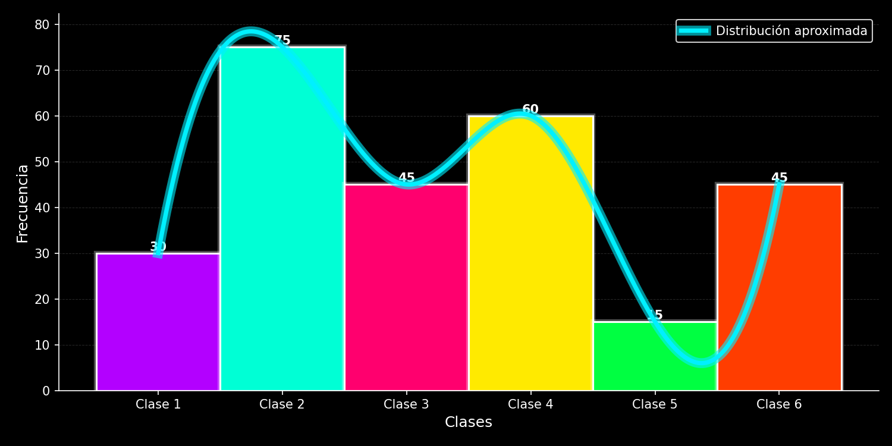

**Métodos de construcción:**

1. **Estimación por kernel (KDE):**
$$\hat{f}(x) = \dfrac{1}{Nh} \sum_{i=1}^{N} K\left( \dfrac{x - x_i}{h} \right)$$
donde $K$ es una función kernel (por ejemplo, gaussiana) y $h > 0$ es el ancho de banda.

2. **Ajuste paramétrico:** ajustar una distribución teórica (normal, exponencial, etc.) a los datos.
3. **Suavizado por splines:** interpolación mediante funciones polinómicas a trozos.

**Proposición 5.1 (Convergencia del estimador por kernel):**
Bajo condiciones de regularidad sobre el kernel $K$ y la densidad verdadera $f$, cuando $N \to \infty$, $h \to 0$ y $Nh \to \infty$, el estimador por kernel converge en probabilidad a la verdadera densidad poblacional:
$$\hat{f}(x) \xrightarrow{P} f(x)$$

**Demostración:**
La demostración rigurosa requiere teoría de procesos estocásticos y convergencia de estimadores no paramétricos. Se difiere a cursos avanzados de inferencia estadística.
$\blacksquare$

**Ejemplo 5.1:**
Para los datos del Ejemplo 3.1, una curva de densidad empírica suavizaría los picos del histograma y mostraría una distribución sesgada positivamente, con mayor concentración cerca de cero y una cola que se extiende hacia valores mayores.

### 5.2 Forma de la distribución

La forma de una distribución se describe en términos de simetría, sesgo y modalidad. Estas características guían la elección de métodos descriptivos e inferenciales posteriores.

#### 5.2.1 Simetría y asimetría

**Definición 5.2 (Distribución simétrica):**
Una distribución es **simétrica** respecto a un valor central $c$ si su función de densidad satisface:
$$f(c - x) = f(c + x) \quad \forall x \in \mathbb{R}$$

Visualmente, el histograma o la curva de densidad puede "doblarse" por la mitad en $x = c$ y ambas partes coinciden.

**Característica estadística:** para distribuciones simétricas unimodales:
$$\text{Media} = \text{Mediana} = \text{Moda} = c$$

**Ejemplos:** distribución normal, distribución uniforme, distribución $t$ de Student.

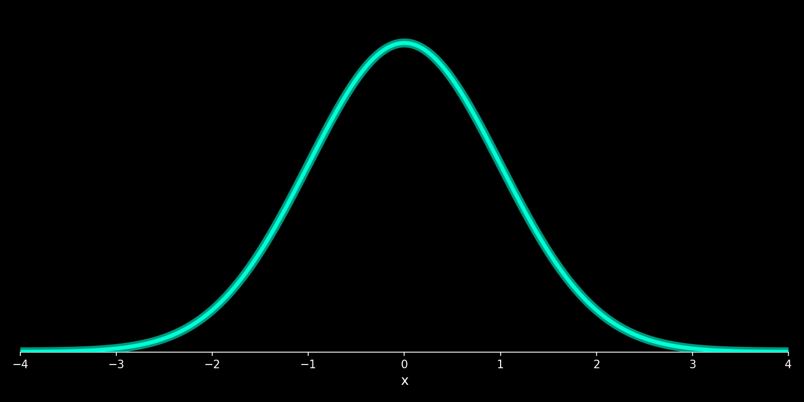

**Definición 5.3 (Distribución asimétrica o sesgada):**
Una distribución es **asimétrica** si no cumple la propiedad de simetría. El **sesgo** cuantifica la dirección y magnitud de la asimetría.

**Sesgo positivo (sesgado a la derecha):**
- La cola derecha es más larga que la izquierda.
- La mayoría de los datos se concentran en valores bajos.
- Típicamente: Media $>$ Mediana $>$ Moda.
- Ejemplos: ingresos salariales, tiempos de espera, precios de viviendas.
- Medida formal: coeficiente de asimetría de Fisher $g_1 > 0$.

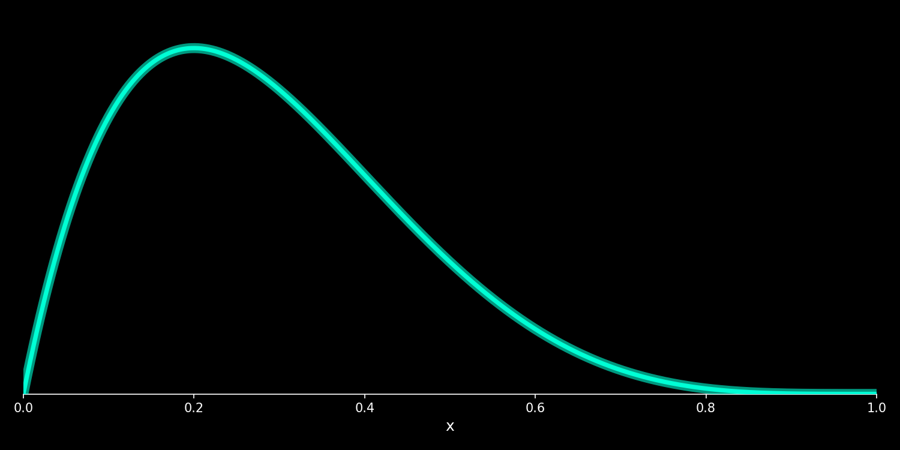

**Sesgo negativo (sesgado a la izquierda):**
- La cola izquierda es más larga que la derecha.
- La mayoría de los datos se concentran en valores altos.
- Típicamente: Media $<$ Mediana $<$ Moda.
- Ejemplos: edad de fallecimiento en países desarrollados, calificaciones en exámenes fáciles.
- Medida formal: coeficiente de asimetría de Fisher $g_1 < 0$.

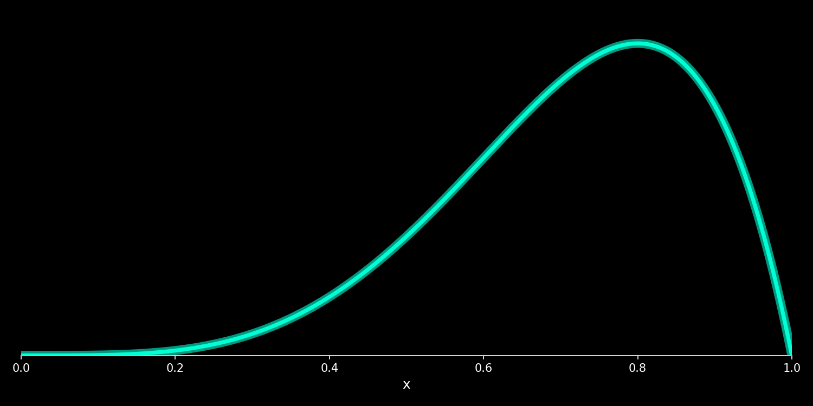

#### 5.2.2 Modalidad

**Definición 5.4 (Moda de una distribución):**
Una **moda** es un valor (o intervalo) donde la distribución alcanza un máximo local de frecuencia. Formalmente, $x_0$ es una moda si existe $\epsilon > 0$ tal que:
$$f(x_0) \geq f(x) \quad \forall x \in (x_0 - \epsilon, x_0 + \epsilon)$$

**Clasificación por modalidad:**

| Tipo | Descripción | Interpretación |
|:-----|:------------|:---------------|
| Unimodal | Una sola moda | Fenómeno homogéneo con un único valor típico. Ejemplos: normal, exponencial. |
| Bimodal | Dos modas distintas | Posible mezcla de dos subpoblaciones o procesos. Ejemplo: alturas en población mixta. |
| Multimodal | Tres o más modas | Estructura compleja; suele requerir estratificación. |
| Uniforme | Sin moda | Todas las frecuencias son aproximadamente iguales; común en datos artificiales. |

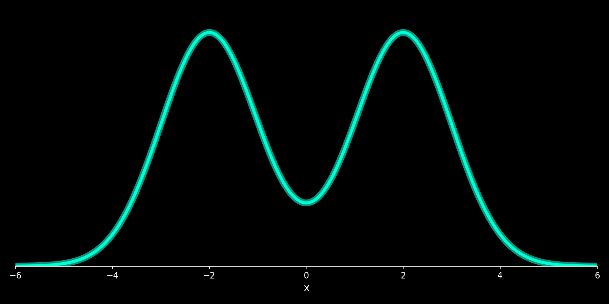

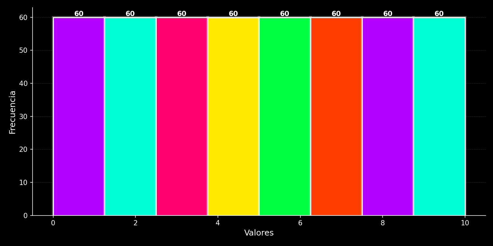

> **Observación importante:** una distribución bimodal puede indicar que el análisis debe realizarse por separado para cada grupo subyacente.

---

## 6. Histograma de frecuencias absolutas vs. relativas

Una misma tabla de frecuencias puede representarse mediante un histograma de frecuencias absolutas ($n_i$) o relativas ($f_i$). La elección entre una u otra escala no es meramente estética: cambia lo que el gráfico permite comparar. Las frecuencias absolutas muestran conteos reales, mientras que las relativas estandarizan cada barra como proporción del total. Cuando se analiza una sola muestra, ambas escalas son válidas; cuando se comparan varias muestras de distintos tamaños, las frecuencias relativas son casi siempre la mejor opción.

### 6.1 Comparación formal

| Aspecto | Frecuencias absolutas ($n_i$) | Frecuencias relativas ($f_i$) |
|:--------|:-----------------------------|:-----------------------------|
| Rango del eje $Y$ | $[0, n_{\max}]$ con $n_{\max} = \max_i n_i$ | $[0, f_{\max}]$ con $f_{\max} = \max_i f_i \leq 1$ |
| Interpretación de área | Número total de observaciones: $\sum n_i = N$ | Proporción total: $\sum f_i = 1$ |
| Comparabilidad | Solo para muestras del mismo tamaño | Para muestras de cualquier tamaño |
| Uso típico | Análisis exploratorio de una sola muestra | Comparación entre grupos |

> **Observación:** si el histograma usa frecuencias absolutas y las amplitudes son constantes, el área total es $a \cdot N$. Si usa frecuencias relativas, el área total es $a$. Solo cuando se grafica la densidad $h_i = n_i/a_i$ o $h_i = f_i/a_i$ el área total es $N$ o $1$, respectivamente, lo que permite la interpretación como función de densidad.

### 6.2 Invarianza por tamaño muestral

**Proposición 6.1 (Invarianza por tamaño muestral):**
Sean $\mathbf{x}^{(1)} = (x_1^{(1)}, \ldots, x_{N_1}^{(1)})$ y $\mathbf{x}^{(2)} = (x_1^{(2)}, \ldots, x_{N_2}^{(2)})$ dos muestras de tamaños $N_1 \neq N_2$ provenientes de la misma población con distribución $F$. Si ambas muestras son suficientemente grandes y representativas, sus histogramas de frecuencias relativas convergerán a la misma forma, independientemente de $N_1$ y $N_2$:
$$\hat{f}_1(x) \approx \hat{f}_2(x) \approx f(x)$$
donde $f(x)$ es la verdadera densidad poblacional.

**Demostración (idea intuitiva):**
Cuando $N$ crece, la frecuencia relativa $f_i = n_i/N$ aproxima la probabilidad poblacional de caer en el intervalo $I_i$. Si ambas muestras provienen de la misma población, ambas aproximan la misma probabilidad. Por tanto, sus histogramas de frecuencias relativas tienden a coincidir en forma. La demostración formal usa la ley de los grandes números y se estudia en cursos de inferencia.
$\square$

### 6.3 Ejemplo comparativo

**Ejemplo 6.1 (Comparación de tiempos de respuesta):**
Dos servidores web registran tiempos de respuesta en milisegundos. El servidor A tiene $N_1 = 100$ observaciones y el servidor B tiene $N_2 = 1000$. Ambos tienen la misma distribución subyacente. En el intervalo $[100, 200)$ ms:

- Servidor A: $n_1 = 30$, por tanto $f_1 = 0.30$.
- Servidor B: $n_1 = 300$, por tanto $f_1 = 0.30$.

Si se grafican histogramas de frecuencias absolutas, la barra del servidor B parecerá diez veces más alta, lo que podría interpretarse erróneamente como un peor desempeño. Si se usan frecuencias relativas, ambas barras tienen la misma altura, revelando que la proporción de respuestas lentas es idéntica.

### 6.4 Cuándo usar cada escala

- **Frecuencias absolutas:** cuando interesa el volumen real de observaciones en cada intervalo, por ejemplo, para planificar recursos o reportar conteos exactos de una sola muestra.
- **Frecuencias relativas:** cuando se comparan muestras de distintos tamaños o cuando se quiere interpretar el histograma como aproximación de una densidad de probabilidad.

---

## 7. Gráfico de sectores

El **gráfico de sectores**, también llamado gráfico circular o de torta, representa las proporciones de un total mediante ángulos de un círculo. Es útil cuando se quiere enfatizar que las categorías forman partes de un todo que suma el 100%, aunque su efectividad visual es limitada cuando hay muchas categorías o proporciones similares.

> **Nota histórica:** El gráfico de sectores fue introducido por el ingeniero y economista escocés **William Playfair** en su obra *Statistical Breviary* (1801). Playfair lo diseñó para mostrar las proporciones del Imperio Turco en Asia, Europa y África. Aunque existe debate sobre su eficiencia visual frente al gráfico de barras, sigue siendo una de las representaciones más reconocidas.

### 7.1 Definición formal

**Definición 7.1 (Gráfico de sectores):**
Sea $X$ una variable cualitativa o cuantitativa discreta con $k$ clases $v_1, v_2, \ldots, v_k$ y frecuencias absolutas $n_1, n_2, \ldots, n_k$ tales que $\sum_{i=1}^{k} n_i = N$. Un **gráfico de sectores** es una partición de un disco en $k$ sectores circulares disjuntos $S_1, S_2, \ldots, S_k$, donde existe una biyección entre cada clase $v_i$ y un sector $S_i$, y el ángulo central $\alpha_i$ del sector es proporcional a la frecuencia relativa $f_i = n_i/N$.


### 7.2 Algoritmo de construcción

**Algoritmo 7.1 (Construcción de un gráfico de sectores):**
Dadas $k$ clases con frecuencias absolutas $n_1, n_2, \ldots, n_k$ y total $N = \sum n_i$:

1. Calcular las frecuencias relativas $f_i = n_i/N$ para cada clase.
2. Calcular el ángulo central de cada sector: $\alpha_i = f_i \cdot 360^\circ$.
3. Verificar que $\sum_{i=1}^{k} \alpha_i = 360^\circ$ (salvo pequeños errores de redondeo).
4. Dibujar un círculo de radio arbitrario $R$ y trazar los sectores adyacentes con los ángulos calculados.
5. Etiquetar cada sector con su categoría y, preferiblemente, con su porcentaje $100 f_i\%$.

### 7.3 Propiedades

**Proposición 7.1 (Condición de proporcionalidad circular):**
Como el círculo completo abarca un ángulo de $360^\circ$ (o $2\pi$ radianes), el ángulo central del sector $S_i$ es:
$$\alpha_i = f_i \cdot 360^\circ = \left( \dfrac{n_i}{N} \right) \cdot 360^\circ$$

**Demostración:**
La proporcionalidad entre ángulo y frecuencia relativa surge de exigir que el ángulo total $360^\circ$ se reparta en partes iguales a las proporciones $f_i$. Como $\sum f_i = 1$, se tiene:
$$\sum_{i=1}^{k} \alpha_i = \sum_{i=1}^{k} f_i \cdot 360^\circ = 360^\circ \sum_{i=1}^{k} f_i = 360^\circ$$
$\blacksquare$

### 7.4 Ejemplos

**Ejemplo 7.1 (Nivel educativo):**
Para la tabla de niveles educativos del Ejemplo 2.1, los ángulos son:
- Primaria: $\alpha_1 = 0.12 \cdot 360^\circ = 43.2^\circ$
- Secundaria: $\alpha_2 = 0.35 \cdot 360^\circ = 126^\circ$
- Universitaria: $\alpha_3 = 0.40 \cdot 360^\circ = 144^\circ$
- Posgrado: $\alpha_4 = 0.13 \cdot 360^\circ = 46.8^\circ$

Verificación: $43.2^\circ + 126^\circ + 144^\circ + 46.8^\circ = 360^\circ$.

### 7.5 Observaciones y limitaciones

**Aplicabilidad:**
- Variables cualitativas (nominales u ordinales).
- Ilustrar la composición de un total cerrado que suma el 100%.
- Escenarios con pocas categorías (convencionalmente $k \leq 5$).

**Limitaciones (Cleveland y McGill, 1984):**
La investigación en percepción visual ha demostrado que el cerebro humano es ineficiente decodificando ángulos y áreas en comparación con longitudes unidimensionales.

- **Dimensionalidad excesiva:** para muchas clases ($k > 5$), el gráfico se satura en rebanadas pequeñas.
- **Dificultad de contraste:** distinguir proporciones cercanas (por ejemplo, $18\%$ vs. $19\%$) sin etiquetas numéricas es difícil.
- **Falacia del 3D:** renderizar un gráfico de sectores en tres dimensiones distorsiona las proporciones aparentes, violando el principio de proporcionalidad visual.

---

## 8. Ojiva o polígono de frecuencias acumuladas

La ojiva representa las frecuencias acumuladas de una variable agrupada. A diferencia del histograma, que muestra cuántos datos caen en cada intervalo, la ojiva responde a la pregunta "¿qué proporción de datos es menor o igual que un valor dado?". Por eso es especialmente útil para estimar percentiles, cuantiles y la función de distribución acumulada empírica.

> **Nota histórica:** El término "ojiva" aplicado a la estadística fue introducido por el estadístico y economista británico **Arthur Lyon Bowley** en 1901. Bowley observó que la forma de una distribución de frecuencias acumuladas se asemejaba al arco apuntado de la arquitectura gótica medieval, conocido como ojiva.

### 8.1 Definición formal

**Definición 8.1 (Ojiva):**
Sea $X$ una variable cuantitativa (continua o discreta) agrupada en $k$ intervalos de clase $I_i = [c_i, c_{i+1})$, y sea $F_i$ la frecuencia relativa acumulada de la clase $i$. La **ojiva** es la representación gráfica formada por la unión lineal de los puntos:
$$P_i = (c_{i+1}, F_i), \quad i = 1, 2, \ldots, k$$
junto con el punto inicial $(c_1, 0)$.

Si se usan frecuencias absolutas acumuladas $N_i$, los puntos son $(c_{i+1}, N_i)$ y el punto inicial es $(c_1, 0)$.


### 8.2 Algoritmo de construcción

**Algoritmo 8.1 (Construcción de una ojiva):**
Dada una tabla de frecuencias agrupadas con intervalos $I_i = [c_i, c_{i+1})$:

1. Calcular las frecuencias absolutas acumuladas $N_i = \sum_{j=1}^{i} n_j$ o las relativas acumuladas $F_i = \sum_{j=1}^{i} f_j$.
2. Sobre el eje horizontal, marcar los límites de clase $c_1, c_2, \ldots, c_{k+1}$.
3. Sobre el eje vertical, marcar las frecuencias acumuladas (absolutas o relativas).
4. Ubicar el punto inicial $(c_1, 0)$.
5. Ubicar los puntos $(c_{i+1}, F_i)$ para $i = 1, \ldots, k$.
6. Unir con segmentos de recta los puntos en orden creciente de $x$.
7. Etiquetar título, ejes e interpretación.

### 8.3 Propiedades

**Proposición 8.1 (Monotonicidad y acotamiento):**
La ojiva es una función no decreciente definida sobre $[c_1, c_{k+1}]$, con valores en $[0, 1]$ si se usan frecuencias relativas (o en $[0, N]$ si se usan frecuencias absolutas). Además:
- $\hat{F}(c_1) = 0$
- $\hat{F}(c_{k+1}) = 1$ (o $N$)

**Demostración:**
Las frecuencias acumuladas $F_i = \sum_{j=1}^{i} f_j$ son no decrecientes porque $f_j \geq 0$. Como los puntos de la ojiva se unen con segmentos de recta en orden creciente, la función resultante es no decreciente. La condición inicial $F_0 = 0$ y la exhaustividad $\sum_{j=1}^{k} f_j = 1$ garantizan los valores extremos.
$\blacksquare$

> **Observación:** la ojiva de frecuencias relativas es un estimador empírico de la función de distribución acumulada $F_X(x) = \mathbb{P}(X \leq x)$. Según el teorema de Glivenko-Cantelli, conforme $N \to \infty$ y la amplitud de clase tiende a cero, la ojiva converge uniformemente a la FDA poblacional. La demostración de este resultado se difiere a cursos avanzados de probabilidad.

### 8.4 Ejemplos

**Ejemplo 8.1 (Alturas de estudiantes):**
Para la tabla de alturas de 100 estudiantes:

| Intervalo | $n_i$ | $F_i$ |
|:---------:|:-----:|:-----:|
| $[150, 155)$ | 5 | 0.05 |
| $[155, 160)$ | 12 | 0.17 |
| $[160, 165)$ | 23 | 0.40 |
| $[165, 170)$ | 28 | 0.68 |
| $[170, 175)$ | 18 | 0.86 |
| $[175, 180)$ | 10 | 0.96 |
| $[180, 185]$ | 4 | 1.00 |

La ojiva conecta los puntos $(150, 0)$, $(155, 0.05)$, $(160, 0.17)$, $(165, 0.40)$, $(170, 0.68)$, $(175, 0.86)$, $(180, 0.96)$ y $(185, 1.00)$.

**Ejemplo 8.2 (Estimación de percentiles):**
A partir de la ojiva del ejemplo anterior, para estimar la mediana ($F = 0.50$) se interpola entre los puntos $(165, 0.40)$ y $(170, 0.68)$:
$$x_{0.50} \approx 165 + \dfrac{0.50 - 0.40}{0.68 - 0.40} \cdot 5 \approx 165 + 1.79 = 166.79\text{ cm}$$

### 8.5 Observaciones y aplicaciones

- La ojiva permite estimar percentiles mediante interpolación inversa: trazando una horizontal desde el valor deseado de frecuencia acumulada hasta la ojiva, y luego bajando verticalmente al eje horizontal, se obtiene el percentil correspondiente.
- La pendiente de la ojiva refleja la densidad de datos en cada región: pendientes pronunciadas indican alta concentración; pendientes suaves indican regiones con pocos datos.
- La curvatura global de la ojiva revela el sesgo de la distribución.
- Es fundamental en control de calidad, ciencias de la salud y ciencias sociales para ubicar umbrales poblacionales.

---

## 9. Diagrama de Pareto

Cuando se busca priorizar problemas o causas, no basta con saber cuántas veces ocurre cada una: se necesita ver cuáles concentran el mayor impacto acumulado. El **diagrama de Pareto** ordena las categorías de mayor a menor frecuencia y superpone una ojiva porcentual, permitiendo identificar visualmente los "pocos vitales" frente a los "muchos triviales".

> **Nota histórica:** El principio subyacente fue observado a finales del siglo XIX por el economista italiano **Vilfredo Pareto**, quien notó que aproximadamente el 80% de la riqueza en Italia estaba en manos del 20% de la población. En la década de 1940, el ingeniero de calidad **Joseph Juran** formalizó esta idea bajo el nombre de "Principio de Pareto" y la aplicó al control de calidad.

### 9.1 Definición formal

**Definición 9.1 (Diagrama de Pareto):**
Sea $X$ una variable cualitativa o nominal con $k$ clases $v_1, v_2, \ldots, v_k$ y frecuencias absolutas $n_1, n_2, \ldots, n_k$. Supongamos que las clases se reordenan de forma monótonamente decreciente:
$$n_1 \geq n_2 \geq \cdots \geq n_k$$
Un **diagrama de Pareto** es un constructo visual compuesto por:

1. Un gráfico de barras vertical donde la altura de cada barra es proporcional a $n_i$.
2. Una ojiva porcentual superpuesta, escalada sobre un eje secundario en el intervalo $[0\%, 100\%]$, que muestra las frecuencias relativas acumuladas $F_i = \sum_{m=1}^{i} f_m$.


### 9.2 Algoritmo de construcción

**Algoritmo 9.1 (Construcción de un diagrama de Pareto):**

1. Recolectar y clasificar los eventos según su tipo o causa.
2. Calcular las frecuencias absolutas $n_i$ de cada categoría.
3. Ordenar las categorías de forma decreciente por frecuencia. La categoría "Otros", si existe, suele colocarse al final aunque rompa el orden decreciente.
4. Calcular las frecuencias relativas $f_i = n_i/N$ y las acumuladas $F_i = \sum_{m=1}^{i} f_m$.
5. Dibujar el gráfico de barras con eje $Y$ izquierdo (frecuencias absolutas).
6. Superponer la ojiva acumulada porcentual con eje $Y$ derecho ($0\%$ a $100\%$).
7. Etiquetar ejes, título y porcentajes acumulados.

### 9.3 Regla empírica 80/20

**Regla empírica 80/20:**
En muchas distribuciones altamente asimétricas, un pequeño número de causas (aproximadamente el 20%) concentra la mayor parte del impacto acumulado (aproximadamente el 80%):
$$\sum_{i=1}^{j} f_i \approx 0.80 \quad \text{para} \quad \dfrac{j}{k} \approx 0.20$$

Esta regla no es un teorema universal, sino una heurística empírica frecuente en fenómenos con colas pesadas.

### 9.4 Ejemplos

**Ejemplo 9.1 (Defectos de manufactura):**
En un proceso de manufactura se registran los siguientes tipos de defectos:

| Defecto | $n_i$ | $f_i$ | $F_i$ (%) |
|:--------|:-----:|:-----:|:---------:|
| Rayadura | 45 | 0.45 | 45% |
| Abolladura | 25 | 0.25 | 70% |
| Descoloramiento | 15 | 0.15 | 85% |
| Fuga | 10 | 0.10 | 95% |
| Otros | 5 | 0.05 | 100% |
| **Total** | **100** | **1.00** | — |

El diagrama de Pareto ordena los defectos de mayor a menor frecuencia y superpone la ojiva. Se observa que las dos primeras causas (rayadura y abolladura) concentran el 70% de los defectos, y las tres primeras alcanzan el 85%.

### 9.5 Observaciones y limitaciones

**Aplicaciones:**
- Control de calidad: priorizar los defectos más frecuentes.
- Gestión de riesgos: identificar las causas principales de fallos.
- Logística y servicio al cliente: enfocar recursos en los problemas que más quejas generan.

**Limitaciones:**
- Mide frecuencia, pero no el costo o impacto severo de cada causa. Un defecto raro puede ser crítico.
- No revela relaciones causales entre categorías.
- La regla 80/20 es una heurística, no una ley matemática: no todas las distribuciones la cumplen.

---

## 10. Diagrama de tallo y hoja

El **diagrama de tallo y hoja** es una representación semi-gráfica que conserva el valor de cada observación mientras muestra la forma de la distribución. Cada dato se divide en una parte principal (tallo) y una parte residual (hoja), de modo que el diagrama funciona como un histograma horizontal construido con los propios números de los datos.

> **Nota histórica:** El diagrama de tallo y hoja fue formalizado en la década de 1960 por el matemático **John W. Tukey**, pionero del análisis exploratorio de datos. Tukey buscaba técnicas visuales rápidas que pudieran construirse a mano, en una época en la que el acceso a computadoras era limitado. Su objetivo no era reemplazar al histograma, sino complementarlo con una herramienta que preservara los valores originales.

### 10.1 Definición formal

**Definición 10.1 (Diagrama de tallo y hoja):**
Sea un conjunto de datos $x_1, x_2, \ldots, x_N$ representados en base 10. Se define un operador de partición $\pi(x_i) = (T_i, H_i)$ donde:

- $T_i$ es el **tallo**, formado por los dígitos de mayor orden (decenas, centenas, etc.).
- $H_i$ es la **hoja**, formada por el dígito de menor orden (unidades).

El diagrama de tallo y hoja agrupa, para cada tallo $T$, todas las hojas $H_i$ asociadas. La cantidad de hojas asociadas a un tallo representa la frecuencia absoluta de ese intervalo, de manera análoga a un histograma.


### 10.2 Algoritmo de construcción

**Algoritmo 10.1 (Construcción de un diagrama de tallo y hoja):**
Dado un conjunto de datos $x_1, x_2, \ldots, x_N$:

1. Elegir la granularidad posicional del tallo (por ejemplo, decenas, unidades o primera cifra decimal).
2. Listar todos los tallos posibles desde $T_{\min}$ hasta $T_{\max}$, incluyendo los tallos con frecuencia cero.
3. Para cada dato $x_i$, separar su tallo $T_i$ y su hoja $H_i$ según la granularidad elegida.
4. Asignar cada hoja $H_i$ a la fila correspondiente a su tallo $T_i$.
5. Ordenar las hojas de cada tallo de menor a mayor.
6. Dibujar una línea vertical separando tallos (izquierda) de hojas (derecha).

> **Advertencia:** omitir un tallo con frecuencia cero distorsiona la forma de la distribución y debe evitarse.

### 10.3 Propiedades

**Proposición 10.1 (Equivalencia frecuencial):**
Para cada tallo $T$, el número de hojas asociadas es igual al número de observaciones cuyo valor pertenece al intervalo correspondiente a $T$. Por tanto, el perfil de frecuencias del diagrama de tallo y hoja coincide con el perfil de un histograma construido con los mismos intervalos posicionales.

**Demostración:**
La construcción del diagrama asigna cada observación $x_i$ a exactamente un tallo $T_i$ y una hoja $H_i$. Dos observaciones distintas comparten tallo si y solo si pertenecen al mismo intervalo posicional. Por tanto, contar hojas por tallo es equivalente a contar observaciones por intervalo.
$\blacksquare$

### 10.4 Ejemplos

**Ejemplo 10.1 (Calificaciones):**
Para los datos de calificaciones:
$$5.5, 6.0, 6.5, 7.0, 7.0, 7.5, 7.5, 7.5, 8.0, 8.0, 8.5, 8.5, 8.5, 8.5, 9.0, 9.0, 9.5, 10.0$$

Tomando el tallo como la parte entera y la hoja como el primer decimal:

```
5 | 5
6 | 0 5
7 | 0 0 5 5 5
8 | 0 0 5 5 5 5
9 | 0 0 5
10 | 0
```

La distribución es aproximadamente simétrica, con mayor concentración en el tallo 8.

### 10.5 Observaciones y limitaciones

**Ventajas:**
- Conserva los valores originales de los datos.
- Permite detectar anomalías como modas localizadas o sesgos de redondeo humano (por ejemplo, preferencia por valores terminados en 0 o 5).
- Puede construirse rápidamente sin software.

**Limitaciones:**
- Se vuelve ilegible para muestras grandes ($N > 100$).
- Poco práctico para datos con muchos decimales o alta precisión, donde el tallo natural resulta difícil de definir.
- La elección del tallo es arbitraria y afecta la granularidad del gráfico.

---

## 11. Diagrama de caja y bigotes

El **diagrama de caja y bigotes** o *boxplot* resume una distribución numérica mediante cinco estadísticos de posición y proporciona una regla objetiva para identificar valores atípicos. A diferencia del histograma, que modela toda la curva de densidad, el *boxplot* comprime la información esencial en una representación robusta frente a valores extremos.

> **Nota histórica:** El diagrama de caja fue introducido por **John W. Tukey** en 1970 y difundido ampliamente en su libro *Exploratory Data Analysis* (1977). Tukey buscaba una representación resistente a valores extremos que permitiera comparar distribuciones de forma rápida.

### 11.1 Definición formal

**Definición 11.1 (Diagrama de caja y bigotes):**
Sea una muestra ordenada $x_{(1)} \leq x_{(2)} \leq \cdots \leq x_{(N)}$. El **diagrama de caja y bigotes** de Tukey está fundamentado en el resumen de cinco números:

1. Mínimo muestral: $x_{(1)}$.
2. Primer cuartil: $Q_1$ (percentil 25).
3. Mediana: $Q_2$ (percentil 50).
4. Tercer cuartil: $Q_3$ (percentil 75).
5. Máximo muestral: $x_{(N)}$.

El gráfico consta de:
- **La caja:** un rectángulo delimitado por $Q_1$ y $Q_3$. Por construcción, el 50% central de los datos se encuentra dentro de la caja.
- **La mediana:** una línea transversal dentro de la caja en $Q_2$.
- **El rango intercuartílico:** $\text{RIC} = Q_3 - Q_1$, que mide la dispersión central y es resistente a valores extremos.
- **Los bigotes:** se extienden desde la caja hasta el dato más extremo que no sea atípico, es decir, el menor y mayor dato dentro del intervalo $[Q_1 - 1.5 \cdot \text{RIC}, \; Q_3 + 1.5 \cdot \text{RIC}]$.
- **Valores atípicos:** todo dato fuera del intervalo anterior se grafica individualmente.


### 11.2 Algoritmo de construcción

**Algoritmo 11.1 (Construcción de un diagrama de caja y bigotes):**
Dada una muestra $x_1, x_2, \ldots, x_N$:

1. Ordenar la muestra: $x_{(1)} \leq x_{(2)} \leq \cdots \leq x_{(N)}$.
2. Calcular $Q_1$, $Q_2$ (mediana) y $Q_3$.
3. Calcular $\text{RIC} = Q_3 - Q_1$.
4. Calcular las barreras inferior $L_I = Q_1 - 1.5 \cdot \text{RIC}$ y superior $L_S = Q_3 + 1.5 \cdot \text{RIC}$.
5. Identificar el menor dato $x_{\min}^*$ mayor o igual que $L_I$ y el mayor dato $x_{\max}^*$ menor o igual que $L_S$.
6. Trazar la caja entre $Q_1$ y $Q_3$, y la línea de la mediana en $Q_2$.
7. Extender los bigotes desde $Q_1$ hasta $x_{\min}^*$ y desde $Q_3$ hasta $x_{\max}^*$.
8. Graficar individualmente los datos fuera de $[L_I, L_S]$ como valores atípicos.
9. Etiquetar título, ejes y unidades.

### 11.3 Propiedades

**Proposición 11.1 (Cobertura central de la caja):**
En cualquier distribución, la caja delimitada por $Q_1$ y $Q_3$ contiene aproximadamente el 50% central de los datos.

**Demostración:**
Por definición de cuartiles, $Q_1$ es el percentil 25 y $Q_3$ es el percentil 75. Por tanto, el 50% de los datos se encuentra entre ambos valores. La caja se dibuja exactamente en ese intervalo.
$\blacksquare$

**Proposición 11.2 (Identificación de atípicos de Tukey):**
Bajo el criterio de Tukey, cualquier observación $x$ tal que:
$$x < Q_1 - 1.5 \cdot \text{RIC} \quad \text{o} \quad x > Q_3 + 1.5 \cdot \text{RIC}$$
se clasifica como valor atípico.

> **Observación:** el factor 1.5 es una convención empírica. Para datos normales, aproximadamente el 0.7% de las observaciones caen fuera de las barreras, lo que hace del criterio una regla de detección conservadora.

### 11.4 Ejemplos

**Ejemplo 11.1 (Calificaciones):**
Para los datos de calificaciones ($N = 18$):
$$5.5, 6.0, 6.5, 7.0, 7.0, 7.5, 7.5, 7.5, 8.0, 8.0, 8.5, 8.5, 8.5, 8.5, 9.0, 9.0, 9.5, 10.0$$

Se tiene:
- $Q_1 = 7.0$ (percentil 25).
- $Q_2 = 8.0$ (mediana).
- $Q_3 = 8.5$ (percentil 75).
- $\text{RIC} = 8.5 - 7.0 = 1.5$.
- Barreras: $L_I = 7.0 - 1.5 \cdot 1.5 = 4.75$ y $L_S = 8.5 + 1.5 \cdot 1.5 = 10.75$.
- Bigotes: desde el mínimo $5.5$ hasta el máximo $10.0$.
- No hay valores atípicos, pues todos los datos están dentro de $[4.75, 10.75]$.

**Ejemplo 11.2 (Con valores atípicos):**
Si a la muestra anterior se añade la calificación $x = 2.0$, entonces:
- $Q_1$, $Q_2$ y $Q_3$ cambian levemente.
- La barrera inferior sigue siendo $4.75$ aproximadamente.
- El valor $2.0$ cae por debajo de $L_I$, por lo que se grafica como un punto atípico individual.
- El bigote inferior se extiende solo hasta el dato más pequeño dentro de las barreras.

### 11.5 Observaciones y limitaciones

**Interpretación:**
- La posición de la mediana dentro de la caja indica el sesgo: si la mediana está más cerca de $Q_1$, hay sesgo positivo; si está más cerca de $Q_3$, sesgo negativo.
- La longitud de la caja indica la dispersión central.
- Los bigotes y los puntos atípicos revelan la presencia de valores extremos.
- Es especialmente útil para comparar múltiples grupos mediante *boxplots* paralelos.

**Limitaciones:**
- Diferentes distribuciones (por ejemplo, una uniforme y una bimodal) pueden producir el mismo diagrama de caja. Por ello, es conveniente complementarlo con un histograma o un gráfico de violín.
- Asume implícitamente que la distribución es aproximadamente unimodal.
- La definición de cuartiles puede variar ligeramente entre software, lo que produce pequeñas diferencias en la posición de los bigotes.

---

## 12. Principios de buena práctica en visualización

Más allá de elegir el gráfico correcto, es necesario construirlo de manera que no distorsione la información. Los principios de Edward Tufte y la investigación en percepción visual ofrecen pautas concretas para producir gráficos honestos, claros y efectivos.

> **Nota histórica:** Edward Tufte, estadístico y politólogo estadounidense, sistematizó los principios de la visualización de datos cuantitativos en su obra *The Visual Display of Quantitative Information* (1983). Su trabajo influyó decisivamente en el diseño de gráficos científicos y periodísticos.

### 12.1 Los principios de Tufte

Edward Tufte estableció principios fundamentales para gráficos estadísticos efectivos:

1. **Integridad gráfica:** evitar distorsiones. El tamaño visual debe ser proporcional a las cantidades representadas.
2. **Maximizar la razón datos-tinta:** eliminar elementos decorativos innecesarios (*chartjunk*).
3. **Claridad:** cada elemento debe tener un propósito comunicativo claro.
4. **Densidad de datos:** mostrar la mayor cantidad de información en el menor espacio posible sin sacrificar claridad.

### 12.2 Errores comunes a evitar

| Error | Problema | Solución |
|:------|:---------|:---------|
| Eje $Y$ truncado | Exagera diferencias pequeñas | Iniciar eje en cero |
| 3D innecesario | Distorsiona proporciones | Usar 2D siempre que sea posible |
| Demasiados colores | Confunde, no aporta información | Usar color con propósito específico |
| Escalas inconsistentes | Impide comparación | Estandarizar escalas al comparar |
| Falta de etiquetas | Información incompleta | Incluir título, ejes, leyenda y unidades |

> **Observación:** un eje $Y$ truncado puede transformar una diferencia del 1% en una apariencia de diferencia del 50%. Por eso, en gráficos de barras el eje vertical debe iniciar en cero. En gráficos de líneas, donde interesa la tendencia más que la magnitud absoluta, se acepta un truncado explícito, siempre que se indique claramente.

---

## 13. Resumen conceptual

### 13.1 Tabla de decisión para elegir gráfico

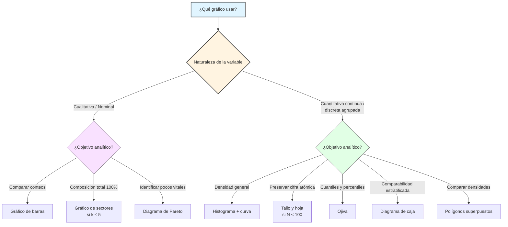
```mermaid
graph TD
    A[¿Qué gráfico usar?] --> B{Naturaleza de la variable}
    
    B -->|Cualitativa / Nominal| C{¿Objetivo analítico?}
    C -->|Comparar conteos| C1[Gráfico de barras]
    C -->|Composición total 100%| C2[Gráfico de sectores<br/>si k ≤ 5]
    C -->|Identificar pocos vitales| C3[Diagrama de Pareto]
    
    B -->|Cuantitativa continua /<br/>discreta agrupada| D{¿Objetivo analítico?}
    D -->|Densidad general| D1[Histograma + curva]
    D -->|Preservar cifra atómica| D2[Tallo y hoja<br/>si N < 100]
    D -->|Cuantiles y percentiles| D3[Ojiva]
    D -->|Comparabilidad estratificada| D4[Diagrama de caja]
    D -->|Comparar densidades| D5[Polígonos superpuestos]
    
    style A fill:#e1f5ff,stroke:#333,stroke-width:2px
    style B fill:#fff4e1,stroke:#333,stroke-width:2px
    style C fill:#f9e1ff,stroke:#333,stroke-width:1px
    style D fill:#e1ffe5,stroke:#333,stroke-width:1px
```

### 13.2 Conceptos clave

| Concepto | Definición sintética | Aplicación estadística |
|:---------|:---------------------|:-----------------------|
| Gráfico de barras | Rectángulos separados, altura proporcional | Nominales / discretas simples |
| Histograma | Rectángulos adyacentes, área total conservada | Variables continuas / agrupadas |
| Polígono de frecuencias | Función lineal a trozos sobre marcas de clase | Comparación de distribuciones |
| Curva de densidad | Función suave que aproxima la densidad | Estimación no paramétrica |
| Sectores (torta) | Ángulo proporcional a la frecuencia relativa | Composición de totales ($k \leq 5$) |
| Ojiva | Puntos $(c_{i+1}, F_i)$ unidos por segmentos | Extracción de percentiles |
| Diagrama de Pareto | Barras decrecientes + ojiva acumulada acoplada | Regla 80/20, control de calidad |
| Tallo y hoja | Partición posicional $\pi(x) = (T, H)$ | Auditoría de datos, $N < 100$ |
| Boxplot | Abstracción basada en $Q_1, Q_2, Q_3$ | Detección de atípicos, comparación de grupos |
| Simetría / sesgo | Relación de colas y orden de media-mediana-moda | Diagnóstico direccional |

---

## 14. Conexión con temas futuros

Los gráficos estudiados en esta clase son fundamentales para el resto de la estadística:

- **Estadística inferencial:** los histogramas, curvas de densidad y *boxplots* permiten visualizar supuestos de normalidad antes de aplicar pruebas paramétricas.
- **Análisis de regresión:** los gráficos de dispersión (extensión natural de los gráficos cartesianos) se usan para identificar relaciones entre variables.
- **Control de calidad:** los histogramas y diagramas de Pareto monitorean procesos productivos y priorizan causas de defectos.
- **Aprendizaje automático:** el análisis exploratorio de datos (EDA) con visualizaciones es el paso previo casi obligatorio antes de construir modelos predictivos.

---

## 15. Ejemplo integrador

**Problema:** analizar la distribución de alturas (en cm) de 100 estudiantes universitarios.

**Datos resumidos:**

| Intervalo | $n_i$ | $f_i$ | $N_i$ | $F_i$ |
|:---------:|:-----:|:-----:|:-----:|:-----:|
| $[150, 155)$ | 5 | 0.05 | 5 | 0.05 |
| $[155, 160)$ | 12 | 0.12 | 17 | 0.17 |
| $[160, 165)$ | 23 | 0.23 | 40 | 0.40 |
| $[165, 170)$ | 28 | 0.28 | 68 | 0.68 |
| $[170, 175)$ | 18 | 0.18 | 86 | 0.86 |
| $[175, 180)$ | 10 | 0.10 | 96 | 0.96 |
| $[180, 185]$ | 4 | 0.04 | 100 | 1.00 |

**Análisis gráfico:**
1. **Histograma:** muestra una distribución aproximadamente simétrica y unimodal, con moda en $[165, 170)$.
2. **Ojiva:** $F_i = 0.40$ en el límite $165$, lo que indica que el percentil 40 se ubica justo debajo de $165\text{ cm}$.
3. **Forma:** aproximadamente simétrica, con ligero sesgo positivo (cola derecha ligeramente más larga).
4. **Comparación estratificada:** si se desea comparar con otra universidad, se recomienda usar *boxplots* paralelos con el mismo eje métrico.

---

## 16. Ejercicios propuestos

### Ejercicio 16.1
Explica, desde el paradigma del análisis exploratorio de datos de John Tukey, qué ventajas tiene el diagrama de tallo y hoja sobre el histograma clásico cuando el tamaño muestral es $N = 42$.

### Ejercicio 16.2
Dada la siguiente distribución de calificaciones en escala $0$-$10$:

```
5.5, 6.0, 6.5, 7.0, 7.0, 7.5, 7.5, 7.5, 8.0, 8.0,
8.5, 8.5, 8.5, 8.5, 9.0, 9.0, 9.5, 10.0
```

a) Construye un diagrama de caja calculando a mano sus cinco estadísticos.  
b) Proyecta una ojiva y estima dónde cruza la línea del decil 8 ($80\%$).  
c) Clasifica la asimetría de la distribución.

### Ejercicio 16.3
¿Bajo qué escenario el diagrama de Pareto perdería su utilidad analítica en gestión de calidad? (Pista: analiza una distribución estrictamente uniforme de errores.)

### Ejercicio 16.4
Demuestra formalmente que si en una muestra el dato mínimo coincide con $Q_1$, entonces el boxplot correspondiente no tendrá bigote inferior visible.

---

**Fin de la Clase 4: Representaciones Gráficas en Estadística Descriptiva**
